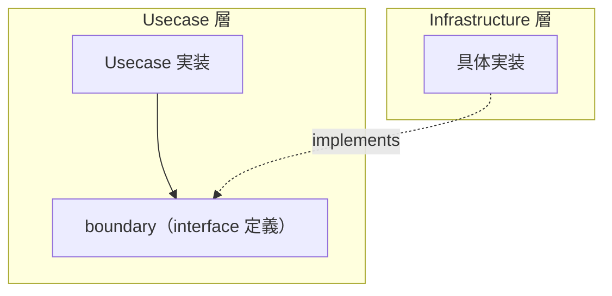

# boundary

[English](README.md) | 日本語

`internal/usecase/boundary` は、**Usecase 層が外部（Infrastructure 層）に要求するインターフェース群**を定義するディレクトリです。

## オニオンアーキテクチャにおける位置づけ



boundary は **依存性逆転の原則（DIP）** を実現するための境界です。

- Usecase は boundary の interface にのみ依存する
- Infrastructure が具体実装を提供する
- Usecase は Infrastructure の実装詳細を知らない

### Domain の Repository interface との違い

|観点|Domain Repository|Usecase Boundary|
|---|---|---|
|定義場所|Domain 層|Usecase 層|
|目的|Aggregate の永続化抽象|Usecase が必要とする外部機能の抽象|
|対象|永続化（CRUD）|認証 / 暗号化 / 時刻 / トランザクション / ジョブ等|

Domain Repository は「Aggregate をどう保存するか」を抽象化するのに対し、Usecase Boundary は「Usecase がビジネスフローを実行するために必要な外部機能」を抽象化します。

## パッケージ一覧

|パッケージ|interface|説明|実装場所|
|---|---|---|---|
|`auth`|`Authenticator`|トークンから認証情報（`Authn`）を取得|`internal/infrastructure/auth/`|
|`clock`|`Clock`|現在時刻の取得|`internal/infrastructure/system/`|
|`job`|`Job`, `Runner`, `State`|ジョブの定義・実行・状態管理|`internal/controller/job/`|
|`security`|`Encrypter`|パスワードのハッシュ化・比較|`internal/infrastructure/security/`|
|`tx`|`Manager`|トランザクション境界の管理|`internal/infrastructure/rdb/driver/`|

## 各パッケージの詳細

### auth

認証に関するインターフェースと値オブジェクトを提供します。

|型 / 関数|説明|
|---|---|
|`Authenticator`|`Credential` から `Authn` を生成するインターフェース|
|`Authn`|認証結果（subject / id / provider / scopes / claims）|
|`New(subject, provider, scopes, claims)`|`Authn` を生成（subject 空は `ErrUnauthorizedSubjectMissing`）|
|`Credential`|アクセストークンを保持する値オブジェクト|
|`NewCredential(accessToken)`|`Credential` を生成（空トークンは `ErrArgumentTokenMissing`）|

エラー：

|エラー|説明|
|---|---|
|`ErrUnauthorizedSubjectMissing`|subject が空|
|`ErrInvalidIDMissing`|subject が UUID として解釈できない|
|`ErrArgumentTokenMissing`|アクセストークンが空|

### clock

```go
type Clock interface {
    Now() time.Time
}
```

Domain / Usecase が `time.Now()` に直接依存しないための抽象。テスト時にモック差し替え可能。

### job

|interface|説明|
|---|---|
|`Job`|`Name()` + `Execute(ctx, args)` を持つジョブ定義|
|`Runner`|`Run(ctx, jobName, args)` + `Names()` でジョブを実行・一覧|
|`State`|`Set(name, args, done)` + `Snapshot()` でジョブ実行状態を管理|

### security

```go
type Encrypter interface {
    Hash(password string) (string, error)
    Compare(hash, password string) (bool, error)
}
```

パスワードのハッシュ化と比較。bcrypt 等の実装詳細を Usecase から隠蔽。

### tx

|型 / 関数|説明|
|---|---|
|`Manager`|`Do(ctx, fn)` でトランザクション境界を管理|
|`DoWithResult[T](ctx, m, fn)`|トランザクション内で値を返すジェネリクスヘルパー|

## 設計方針

- boundary にはビジネスロジックを含めない（interface と値オブジェクトのみ）
- Infrastructure の import は禁止（依存方向の違反）
- すべての interface に `mockgen` による mock 自動生成を設定
