# ユースケース層（`internal/usecase`）ガイド

[English](README.md) | 日本語

## オニオンアーキテクチャでの役割

- アプリケーションサービスとして、ユースケースの **手続き（ワークフロー）** を調整する層。
- 入力（DTO/VO）を受けて、**Domain（エンティティ/ドメインサービス）とRepository（ドメインの抽象）** を組み合わせ、結果（DTO）を返す。
- トランザクション境界と整合性の担保の単一起源（Tx開始/終了、リトライ方針など）。
- 外界（HTTP/DB/メッセージング）の詳細は知らない。純粋なアプリ語彙で完結する。

## ユースケース層の処理フロー

ユースケースは **アプリケーションのワークフローを調整するレイヤー**です。  
Domain と Repository を組み合わせて **処理の順序を定義**します。

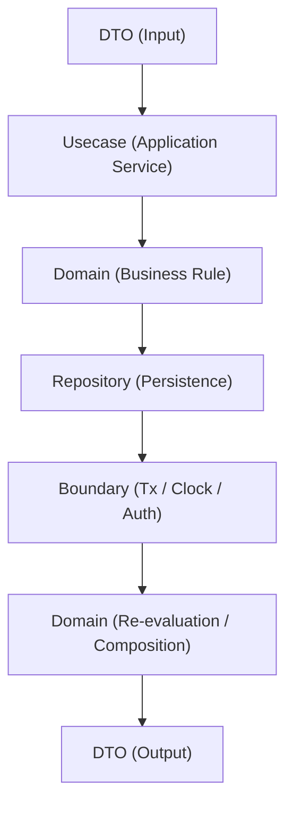

基本的な処理フローは以下です。

1. DTOを受け取る
2. 入力の整形 / ポリシー適用
3. Domain呼び出し
4. Repositoryによる永続化
5. DTOへ変換
6. 結果返却

Usecase は **ビジネスルールを実装する場所ではありません**。  
ビジネスルールの実装は **Domain層** に配置します。

ただし Usecase から **Domain のビジネスルールを呼び出すこと自体は許可されます**。  
Usecase の責務は、Domain の振る舞いを **組み合わせてユースケースのワークフローを構築すること**です。

つまり、【Domain のビジネスルールを **呼び出す**が、**新しいビジネスルールは定義しない**】という役割に留めます。

Usecaseは以下のみを担当します。

- ワークフロー制御
- トランザクション管理
- Domain / Repository の協調
- DTO変換

オーケストレーションには、Controller のために **複数の読み取りを1操作へ合成する**ことも含みます。例: ページング一覧のエンドポイントは `{ Items, Total }` を返す単一メソッドを公開し、handler に一覧と件数を別々に呼ばせて束ねさせません。

## アプリケーションサービス層の設計方針

プロジェクトの Usecase は **Application Service Pattern** を採用しています。

Application Service は **ユースケース単位のアプリケーションロジック**を表現します。

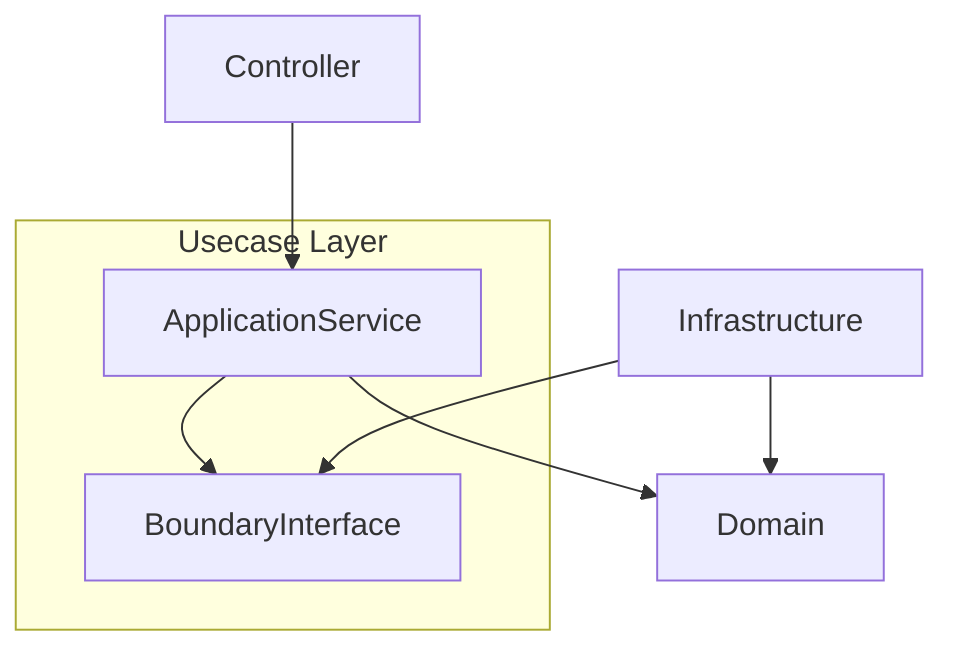

Application Service の責務

- ユースケース単位の処理
- トランザクション境界
- ドメイン操作の順序制御
- DTO ↔ Domain変換

Application Service が **やってはいけないこと**

- ビジネスルールの実装
- インフラの直接利用
- フレームワーク依存

Application Service は **Domainの振る舞いを組み合わせるだけ**に留めます。

## Application Policy

Usecase 層では **Application Policy（アプリケーションポリシー）** を扱います。

Application Policy とは、**ドメインロジックではなくアプリケーションの振る舞いを決定するルール**です。

Domain と Usecase の責務は次のように分離されます。

|種類|内容|配置|
|-----|-----|-----|
|Domain Logic|ビジネスルール|Domain|
|Application Policy|ユースケースの処理手順|Usecase|

### Domain Logic の例

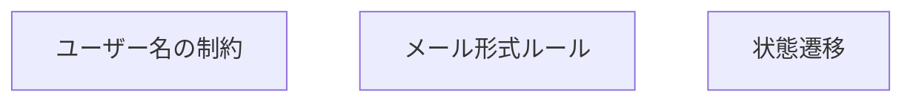

これらは **Domain 層に実装します。**

### Application Policy の例

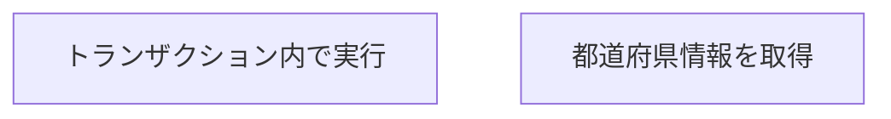

これらは **Usecase 層に実装します。**

Usecase の役割は次の通りです。

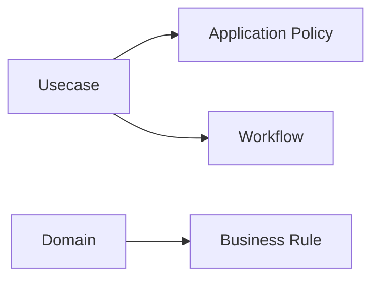

## Boundaryのコンセプト

プロジェクトでは **Usecase が Infrastructure に直接依存しないようにするため Boundary を導入しています。**

Boundary とは **外部システムとの境界を表すインターフェース**です。

Usecase はこれらの **interface のみ参照**し、実装は Infrastructure 側で提供されます。

### 代表的な Boundary

- `Transaction Manager`
- `Clock`
- `Auth Context`
- `Messaging / EventPublisher`
- `Observability`

### 時刻の扱い

プロジェクトでは **時刻の取得は Usecase 層で一元管理**します。

そのため **`time.Now()` を直接呼び出すことは禁止**します。

代わりに Boundary として提供される **`clock.Clock`** を利用します。

理由：

- テストを deterministic（再現可能）にするため
- タイムゾーンや時刻ソースの差異を吸収するため
- AI や開発者が `time.Now()` を直接使うことを防ぐため

Usecase では必ず次のように時刻を取得します。

```go
now := u.clock.Now()
```

例：

```go
now := u.clock.Now()
userEntity, err := user.New(..., now, now, nil)
```

### ルール

Usecase 層では以下を守ります。

- 禁止: `time.Now()`
- 許可: `clock.Clock.Now()`

時刻の取得は **Usecase → Domain へ渡す**形で扱い、
Domain 側では新たに時刻を取得しない設計を推奨します。

これにより **時刻依存ロジックを完全にテスト可能に保つ**ことができます。

### 依存関係

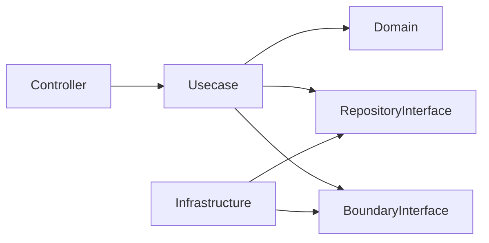

重要なルール

- Usecase は **Infrastructure に依存しない**
- Usecase は **interface のみ参照する**
- Infrastructure が **interface を実装する**

これにより **Dependency Inversion** を維持します。

## CQRSポリシー

プロジェクトでは **完全な CQRS 分離は採用していません。**

理由

- 小〜中規模サービスでは過剰設計になりやすい
- Query / Command を完全分離すると再利用性が下がる
- Repository が複雑になりやすい

そのため **軽量 CQRS ポリシー** を採用しています。

### Command

状態変更を伴う処理。

例

- `CreateUser`
- `UpdateUser`
- `DeleteUser`

特徴

- Domain Entity を使用
- Transaction が必要
- Domain 不変条件を検証

### Query

読み取り専用の処理。

例

- `GetUser`
- `ListUsers`
- `SearchUsers`

特徴

- DTO を直接返すことを許容
- Domain Entity に変換しない場合がある
- Transaction 不要

### Repository に許可する Query

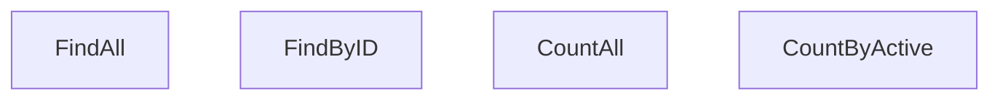

検索や複雑な条件検索（キーワード検索など）は **QueryService** に分離します。

例：

- `FindByKeyword`
- `SearchUsers`
- `ListUsersByCondition`

QueryService は **読み取り最適化レイヤー**として扱い、DTO または Domain Entity を返すことを許容します。

JOIN は **ドメイン境界を壊さない範囲で許可**します。

### Repository に含めないもの

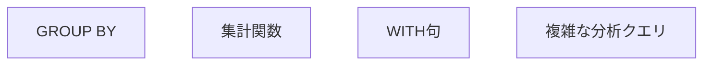

これらは

- Analytics
- Reporting
- Data Pipeline

など別レイヤーで扱います。

## このプロジェクトでの役割

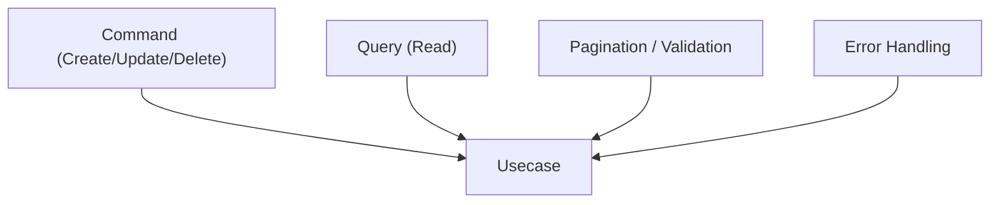

## サードパーティを最小限に抑える

- Usecaseは原則 標準ライブラリのみ（context, time, errors, fmt など）。
- ORM・SQL実行・HTTPクライアント・EchoなどI/O系は一切持ち込まない。
- 横断的例外: `internal/logging.Logger` は `internal/apperror` と同様、専用 boundary を介さずコンストラクタ DI で直接注入してよい。純粋な mock 可能インターフェースであり、失敗ログが必要なバックグラウンドワーカー（例: outbox relay の dead-message 警告）に限って使用する。それ以外は `metrics`/boundary を優先する。
- 型定義やDTOもプロジェクト内型で閉じる。sqlc生成型/driver型やOpenAPI生成型は上位/下位の層に隔離。
- テストも`testify`/`mock`程度に留め、モックはinterfaceベースで注入。
- どうしても必要な場合は、[pkg/](../../pkg/)で薄いラッパーを作成する。

## DI（Dependency Injection）の仕組み（Usecase）

Usecase は **Uber Fx による DI** で生成されます。  
Usecase は **Repository / QueryService / Boundary を interface 経由で受け取る**ことが原則です。

### 全体構成

Usecase は `fx.Provide` により登録され、Controller / Job に注入されます。

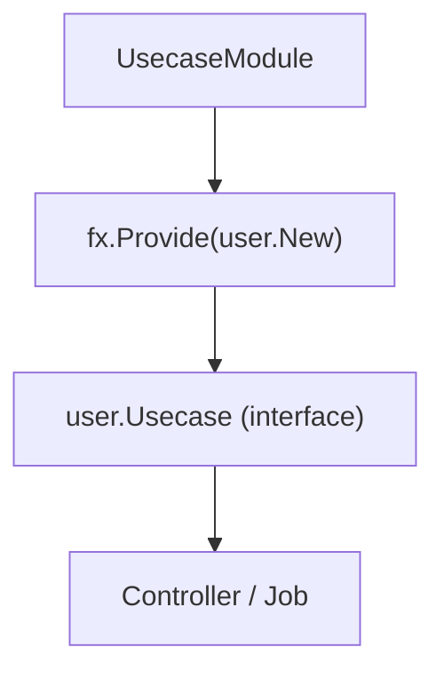

### internal/di/module/usecase.go の役割

```go
func UsecaseModule() fx.Option {
    return fx.Module("usecase",
        fx.Provide(
            healthcheck.New,
            user.New,
        ),
    )
}
```

- `fx.Provide`
  - Usecase のコンストラクタを登録
- 戻り値は **Usecase interface**
  - 例: `user.Usecase`

### Usecase のコンストラクタ設計

```go
func New(
    tf observability.TracerFactory,
    txm tx.Manager,
    clock clock.Clock,
    userRepo user.Repository,
    userQS query.UserQueryService,
) Usecase {
    return &usecase{
        tracer:    tf.Usecase(),
        txm:       txm,
        clock:     clock,
        userRepo:  userRepo,
        userQS:    userQS,
    }
}
```

ポイント：

- 戻り値は **interface（Usecase定義）**
- 依存はすべて引数で受け取る（new禁止）
- Repository / QueryService は interface 経由で受け取る
- Boundary（tx / clock 等）も interface で受け取る

### DI の流れ

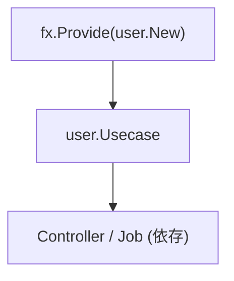

### なぜ interface を返すのか

- Controller / Job は Usecase の抽象にのみ依存する
- 実装の差し替えが可能（mock / feature切替）
- Onion Architecture の依存逆転を維持する

### Repository / QueryService との関係

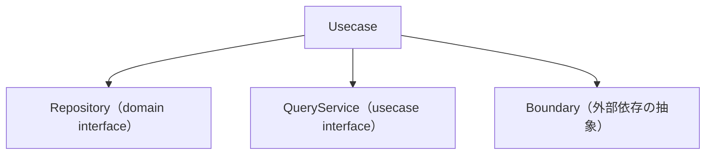

- Repository は **永続化**
- QueryService は **検索**
- Usecase はそれらを **組み合わせる**

### AI / 開発者向けルール

- Usecase の constructor は必ず `New` で定義すること
- 戻り値は Usecase interface にすること
- Usecase 内で依存を new しないこと
- DI登録は `internal/di/module/usecase.go` に追加すること

## 実装上の注意点

### 命名/構造

- インターフェイスは`Usecase`（例：`user.Usecase`）で統一。
- インスタンスの生成関数名は `New` で統一し、[di/module/usecase.go](../di/module/usecase.go) で登録する。

### ビジネスロジックを実装しない？ → 誤解を避けて明確化

- “ドメインロジック”は Domain 層に置く（エンティティ/VO/ドメインサービスのメソッド）。
- Usecase は“手続きロジック”（順序・Tx・外部境界の協調・入力検証と方針適用）を担当。

### HTTP/DBの要素は持ち込まない

- `http.*`, `echo.Context`, `sqlc` 型、`sql.Null*`、DB列名、OpenAPI生成型…を引数/戻り値に使わない。
- 代わりに DTO/VO（Page/Filters/Actor） で表現。

### エラー方針

- 入力の意味的な不正:
  - `apperror.ErrValidation` → 422
  - `apperror.ErrInvalidArgument` → 400
- 存在しない:
  - `apperror.ErrNotFound` → 404
- 競合:
  - `apperror.ErrConflict` → 409
- 一時的不可:
  - `apperror.ErrUnavailable` → 503
- 想定外:
  - そのまま or `apperror.ErrInternal` に包む → 500

`apperror.ErrXXX` センチネルでラップする場合は、標準の `fmt.Errorf("%w", ...)` ではなく
`pkg/xerrors.Wrap(apperror.ErrXXX, "context")` を使う。スタックトレースを保持しつつ
`xerrors.Is` でセンチネル判定が可能になる。

### ページング

- NewPageFrom1Based(page, perPage) で既定値/上限/1→0変換を統一。
- ページ番号が許容最大を超えたら `apperror.ErrInvalidArgument` を返す（offset は int32 変換時にクランプ）。

## 呼び出せる層 / 呼び出せない層

### 呼び出せる層

- Domain（エンティティ/ドメインサービス/Repositoryインタフェース）
- Boundary（tx / clock / auth 等）
- QueryService（必要な場合）

### 呼び出せない層

- 他のUsecaseからの呼び出しは基本禁止（循環・肥大化を避ける。必要なら“アプリサービス（`Orchestrator`）”を別モジュールとして明示）。
- UsecaseからInfra/Controller/HTTP/OpenAPI/SQL"実装"は呼ばない。

Usecaseは **Infrastructureに依存してはいけません。**

Infrastructureへのアクセスは **Repository interface または Boundary interface** を経由します。

## Test戦略

Usecase 層は **純粋な Unit Test** としてテストします。

Infrastructure や外部システムを使用せず、  
**Domain と interface のみを利用してテストします。**

### テストの依存関係

Usecase のテストでは次の依存関係を採用します。

|依存|テスト方法|
|---|---|
|Domain|実装を使用|
|Repository|mock|
|QueryService|mock|
|Boundary|mock|
|Infrastructure|使用しない|

### テストの基本方針

Usecase テストでは、**Usecase のワークフローとアプリケーションポリシー** を検証します。

具体的には次を確認します。

- Usecase が正しい順序で Domain / Repository / Boundary を呼び出すこと
- トランザクション境界が正しく適用されること
- Domain エラー / Repository エラー / Boundary エラーが期待通り返ること
- DTO の組み立てが正しいこと

### Domain は mock しない

Domain は **ビジネスルールの実体**であるため、Usecase テストでは **実装をそのまま使用します。**

```go
userDomain, err := user.New(...)
require.NoError(t, err)
```

これにより、Usecase が **本物の Domain ルール** を前提に正しく動作するかを確認できます。

### Repository / Boundary は mock する

Repository や Boundary は **interface** を通して注入されるため、Usecase テストでは mock を利用します。

```go
ctrl := gomock.NewController(t)

userRepo := mock_user.NewMockRepository(ctrl)
clock := mock_clock.NewMockClock(ctrl)
```

### テスト対象

Usecase テストでは主に次の観点を扱います。

#### 正常系

- 想定通りの DTO が返る
- Repository が正しく呼ばれる
- Boundary が正しく呼ばれる
- Transaction が正しく使われる

#### 異常系

- Boundary のエラーが返る
- Repository のエラーが返る
- Domain 生成失敗時にエラーが返る
- 結果が空 / zero value になることを確認する

### テスト構成

テストは **正常系 / 異常系** に分けて構成することを推奨します。

```text
TestCreateUser
  ├ 正常系
  └ 異常系

TestListUsers
  ├ 正常系
  └ 異常系
```

異常系では、失敗ポイントごとにケースを分けます。

例：

- Repository error
- Domain validation error
- Prefecture lookup error

### Deterministic

Usecase テストでは **固定時刻** を利用し、`time.Now()` に依存しません。

```go
now := time.Date(2025, time.January, 1, 0, 0, 0, 0, time.Local)
clock.EXPECT().Now().Return(now)
```

これにより、再現性のあるテストを保証します。

### Fail Fast

アサーションは `require` を基本とします。

```go
require.NoError(t, err)
require.Equal(t, expected, actual)
```

前提条件が崩れた時点で即座に失敗させ、  
テストの意図を明確に保ちます。

### テストでやらないこと

Usecase テストでは以下を扱いません。

- DB 接続
- SQL 実行
- HTTP リクエスト
- OpenAPI 型の検証
- Infrastructure 実装の詳細確認

これらは **Infrastructure / Controller の責務**です。

## やっていいこと / いけないこと(まとめ)

### Do

- **DTO/VO（Page, Filters, Actor）**で受け渡し
- Tx 境界をここで定義（TxManager 経由で Do(ctx, func(txCtx){ ... })）
- Usecase層で初出の`apperror`でエラー分類を付与（errors.Is で Controller が判定しやすく）
- QSはRow→DTOに最短でマップ、CommandはDomainを介す。
- 表駆動テストでユースケースの分岐とTxの挙動を確認（testify）
- 読み取り最適化が必要な場合は QueryService を利用する

### Don’t

- DomainのEntityを直接返す
- `http.Status` や `echo.Context` を引数に取る/返す
- `sqlc`生成型や`sql.Null*`を引数/戻り値に使う
- `openapi/gen`の型を直接返す（DTOに詰め替えるのはControllerの責務）
- Listで0件をエラー化（`apperror.ErrNotFound`(404)は単体取得のみ）
- 別のUsecaseを直接呼んで複雑化（必要なら`Orchestrator`を定義）

## Observability（Tracing）の使い方

この Usecase層で直接OpenTelemetrySDKを扱わず、
observability.LayerTracerを経由してspanの開始・終了を行います。

### 1. Usecase層での span の開始と終了

各ハンドラーの先頭で必ず次の 2 行を記述してください。

```go
ctx, endSpan := s.tracer.Start(ctx)
defer endSpan()
```

- Start(ctx)でspanが開始され、trace_id/span_idがcontextに紐づきます。
- endSpan()は、spanの終了（span.End）を行います。
- defer endSpan()により例外や早期returnがあっても必ず終了されます。

ポイント：Usecase は span の開始・終了だけを知り、
OpenTelemetry SDK の詳細には一切触れません。

### 2. TracerのDI（observability.LayerTracer）

Usecaseは以下のようにobservability.LayerTracerを依存として受け取ります。

```go
type server struct {
    tracer   observability.LayerTracer
    txm      tx.Manager
    userRepo user.Repository // それぞれのプロジェクト
    pftRepo  prefecture.Repository
}
```

New関数内では、`observability.NewUsecaseTracer`でUsecase専用のトレーサーを生成します。

```go
func New(
    tf observability.TracerFactory,
    txm tx.Manager,
    userRepo user.Repository,
    prefectureRepo prefecture.Repository,
) Usecase {
    return &usecase{
        tracer:   tf.Usecase(),
        txm:      txm,
        userRepo: userRepo,
        pftRepo:  prefectureRepo,
    }
}
```

ここではSDKの生インスタンスを直接使わず、
observability層がtracerの生成ルール（レイヤー名やパッケージ名・関数名の抽出）を内部で隠蔽します。

## 実装例

> 以下の例は、恒久的なパターン（tracer による span の開始/終了、`clock.Now()` による時刻取得、
> `txm.Do` によるトランザクション境界、Domain → DTO 変換）**を示すためだけに**、サンプルの
> `<aggregate>`（`user` と関連する `prefecture`）を用いています。これらのサンプル集約は
> `make setup-remove-sample-api` で削除されるため、`user` / `prefecture` は各自の集約の
> 代替として読み替えてください。要点は具体名ではなくパターンです。

```go
//go:generate mockgen -source=$GOFILE -destination=mock/mock_$GOFILE.gen.go -package=mock_$GOPACKAGE
// 唯一性のある名称
package user

import (
    "context"

    "go-boilerplate/internal/observability"
    // それぞれ実装で使うパッケージをimport
)


// 下位の層とやり取りするためのDTO
type UserMutableFields struct {
    FirstName      string
    LastName       string
    Email          string
    Phone          string
    PostalCode     string
    PrefectureName string
    City           string
    Street         string
    Building       *string
}

type CreateUserParamsDTO struct {
    UserID uuid.UUID

    UserMutableFields
}


// usecaseという名称は固定
type usecase struct {
    tracer    observability.LayerTracer
    txm       tx.Manager
    clock     clock.Clock
    userRepo  user.Repository
    pftRepo   prefecture.Repository
    userQS    query.UserQueryService
}

// Usecase は、ユーザーに関するユースケースを定義します。
type Usecase interface {
    // ListUsersByKeyword は、ユーザー一覧を取得します。
    ListUsersByKeyword(ctx context.Context, params *GetParamsDTO, page *paging.Page) ([]MutableFields, error)
    // CreateUser は、ユーザーを作成します。
    CreateUser(ctx context.Context, dto *CreateParamsDTO) (MutableFields, error)
    // CountUsers は、ユーザーの総件数を返します。
    CountUsers(ctx context.Context, active *bool) (int64, error)
}

// Newという名称は固定
func New(
    tf observability.TracerFactory,
    txm tx.Manager,
    clock clock.Clock,
    userRepo user.Repository,
    prefectureRepo prefecture.Repository,
    userQueryService query.UserQueryService,
) Usecase {
    return &usecase{
        tracer:    tf.Usecase(),
        txm:       txm,
        clock:     clock,
        userRepo:  userRepo,
        pftRepo:   prefectureRepo,
        userQS:    userQueryService,
    }
}

func (u *usecase) ListUsersByKeyword(ctx context.Context, params *ListUsersByKeywordParams, page paging.Page) ([]DTO, error) {
    // Spanの開始・終了呼び出して設定
    ctx, endSpan := u.tracer.Start(ctx)
    defer endSpan()

    var (
        us  user.Users
        err error
    )

    // ユーザー一覧取得（Domainエンティティのスライス）
    if params != nil {
        keywords := search.ParseSearchTokens(params.Keyword, search.DefaultMaxTokens)
        us, err = u.userQS.FindByKeyword(ctx, keywords, params.Active, page.Limit32(), page.Offset32())
    } else {
        us, err = u.userRepo.FindAll(ctx, page.Limit32(), page.Offset32())
    }

    if err != nil {
        return nil, err
    }


    // オプション: observability.RunWithSpanで処理単位のspanを作成
    // 可観測性を高めるために、Domain層の処理もspanとして切り出すことができます。
    // オプションなのでなくても構いません。
    // 第一引数のctxは、後続で使う場合は返り値を受け取って上書きしてください。
    ctx, prefectureMap, err := observability.RunWithSpan(
        ctx, u.tracer, "usecase", "user", "prefectureMap", func(ctx context.Context) (map[uuid.UUID]*prefecture.Entity, error) {
            // ユーザーの都道府県IDを集めて、一括で都道府県エンティティを取得
            pids := make([]uuid.UUID, len(us))
            for i, u := range us {
                pids[i] = u.PrefectureID()
            }

            // 都道府県エンティティの取得
            // IDsメソッドは複数IDで一括取得するプロジェクトメソッドの例
            ps, pftErr := u.pftRepo.FindByIDs(ctx, pids)
            if pftErr != nil {
              return nil, pftErr
            }

            // 取得した都道府県エンティティをマップに詰め替え
            // Mapにすることで、後続のループで高速に参照できるようにする
            prefectureMap := make(map[uuid.UUID]*prefecture.Entity, len(ps))
            for _, p := range ps {
                prefectureMap[p.ID()] = p
            }

            return prefectureMap, nil
      })
    if err != nil {
      return nil, err
    }

    // ctxは、後続でobservability.RunWithSpanを使わない場合は不要
    _, dtos, err := observability.RunWithSpan(
        ctx, u.tracer, "usecase", "user", "buildDTOs", func(ctx context.Context) ([]UserMutableFields, error) {
            // 結果をDTOに詰め替え
            dtos := make([]UserMutableFields, len(us))
            for i, u := range us {
                dtos[i] = UserMutableFields{
                    FirstName:  u.FirstName(),
                    LastName:   u.LastName(),
                    Email:      u.Email(),
                    Phone:      u.Phone(),
                    PostalCode: u.PostalCode(),
                    City:       u.City(),
                    Street:     u.Street(),
                    Building:   u.Building(),
                }
                // 都道府県名をマップから取得してセット
                if p, ok := prefectureMap[us[i].PrefectureID()]; ok {
                    dtos[i].PrefectureName = p.Name()
                }
            }
            return dtos, nil
        })

    return dtos, err
}

// CreateUser は、ユーザーを作成するユースケースです。
func (u *usecase) CreateUser(ctx context.Context, dto *CreateParamsDTO) (MutableFields, error) {
    ctx, endSpan := u.tracer.Start(ctx)
    defer endSpan()

    // 時刻の取得はUsecase層で一元管理するルールに従う
    now := u.clock.Now()

    var (
        userEntity *user.User
        pftDomain  *prefecture.Entity
    )
    // トランザクションの開始と終了をTxManagerに任せる
    err := u.txm.Do(ctx, func(ctx context.Context) error {
        var err error
        pftDomain, err = u.pftRepo.FindByName(ctx, dto.PrefectureName)
        if err != nil {
            return err
        }

        userEntity, err = user.New(
            dto.UserID,
            dto.FirstName,
            dto.LastName,
            dto.Email,
            dto.Phone,
            pftDomain.ID(),
            dto.City,
            dto.Street,
            dto.Building,
            dto.PostalCode,
            now,
            now,
            nil,
        )
        if err != nil {
          return err
        }

        err = u.userRepo.Create(ctx, userEntity)
        if err != nil {
          return err
        }
        return nil
    })
    if err != nil {
      return MutableFields{}, err
    }

    return MutableFields{
      FirstName:      userEntity.FirstName(),
      LastName:       userEntity.LastName(),
      Email:          userEntity.Email(),
      Phone:          userEntity.Phone(),
      PostalCode:     userEntity.PostalCode(),
      PrefectureName: pftDomain.Name(),
      City:           userEntity.City(),
      Street:         userEntity.Street(),
      Building:       userEntity.Building(),
    }, nil
}


```
