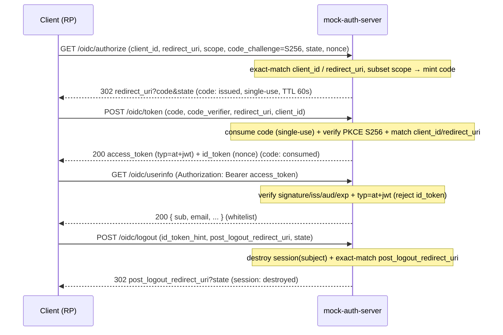

# mock-auth-server (JWT Test Provider)

English | [日本語](README.ja.md)

A **mock OIDC auth server** for local development. It lets the Go API (Resource Server) exercise **JWT signature/claim verification and the Authorization Code Flow (+ PKCE S256)** end-to-end without a real IdP. Login UI / consent / refresh token / Roles are out of scope.

It is intentionally implemented in **TypeScript on Node.js (a different runtime than the Go API)** so that the token issuer and the verifier do not share bugs originating from a single library. The `.ts` sources run directly via Node's native type stripping (Node 24) — no `tsc` build step; the HTTP layer is [Hono](https://hono.dev/). `typescript` is a dev-only dependency for `pnpm run typecheck` and for the 1:1 test-mapping gate; `vitest` runs
the unit suite and `node --test` the integration one.

## Endpoints

| Method | Path | Description |
| --- | --- | --- |
| GET | `/health` | Liveness — `{"status":"ok"}` |
| GET | `/.well-known/openid-configuration` | OIDC Discovery document |
| GET | `/.well-known/jwks.json` | JWKS (public keys only: `kty=RSA` `alg=RS256` `use=sig`; the published set changes with key rotation) |
| GET | `/oidc/authorize` | Authorization endpoint (Code Flow + PKCE S256) — `302` with `code`, or error `redirect` / `400` |
| POST | `/oidc/token` | Token endpoint (`authorization_code` + PKCE) — issues `access_token` + `id_token` |
| GET | `/oidc/userinfo` | UserInfo (Bearer access token; whitelist claims). Rejects ID Tokens with `401` |
| POST | `/oidc/logout` | RP-Initiated Logout — validates `post_logout_redirect_uri`, echoes `state` |
| POST | `/bypass/token` | Issue a token by fixed profile — `{subject, profile}` → `{access_token, ...}` |
| POST | `/bypass/session` | Create a login session directly — `{subject}` → `{session_id, subject}` |
| GET | `/admin/users` | List the fixed user fixtures |
| POST | `/admin/reset` | Reset the volatile stores (code / session) and the key store (back to Phase 1) |
| POST | `/admin/keys/rotate` | Key rotation — declarative `{action, kid}` → the resulting key state |

`/bypass/*` and `/admin/*` are **dev-only endpoints**: set `MOCK_AUTH_DEV_ENDPOINTS=disabled` to make them return `404`. The server also **refuses to start when `NODE_ENV=production`** (this mock must never run in production). Registered clients (`fixtures/clients.json`) are public + PKCE-required; `redirect_uri` / `post_logout_redirect_uri` are matched exactly.

## Flows

### Authorization Code Flow + PKCE (the standard login use case)



### Test / bypass use cases (dev-gate only)

- **Issue a token without the flow**: `POST /bypass/token {subject, profile}` → an access token (or an anomaly token for negative testing). Feed it straight to the Go API or `/oidc/userinfo`.
- **Create a session without a UI**: `POST /bypass/session {subject}` → `{session_id}` (session: created). Destroyed later by `/oidc/logout` (matching `id_token_hint` subject) or `/admin/reset`.

### State lifecycle

| State | Created by | Consumed / destroyed by | TTL |
| --- | --- | --- | --- |
| Authorization code | `/oidc/authorize` | `/oidc/token` (single-use) or expiry | 60s |
| Session | `/oidc/authorize` (login) · `/bypass/session` | `/oidc/logout` (by subject) · `/admin/reset` | 1h |
| Access / ID token | `/oidc/token` · `/bypass/token` | expiry (stateless; not stored) | 3600s |

`/admin/reset` clears the volatile stores (code / session) and returns the key store to Phase 1 (see [Key Rotation](#key-rotation)); the key material and fixtures themselves (fixed PEMs) are reset only by a process restart.

## Token Profiles (`/bypass/token`)

Anomalies are provided as **fixed profiles** (not an arbitrary-claim-injection API) for reproducibility. The Go API is expected to accept `valid` and reject every anomaly with `401`.

| Profile | Content | Go API |
| --- | --- | --- |
| `valid` | Standard access token (`typ=at+jwt`, correct `iss`/`aud`/`exp`/`nbf`/`sub`) | accept |
| `expired` | `exp` in the past | 401 |
| `not-yet-valid` | `nbf` in the future | 401 |
| `wrong-issuer` | `iss` mismatch | 401 |
| `wrong-audience` | `aud` mismatch | 401 |
| `missing-subject` | no `sub` | 401 |
| `invalid-signature` | signed with a key absent from the JWKS (same `kid`) | 401 |
| `unsupported-algorithm` | `HS256` (symmetric, outside the RS256 allowlist) | 401 |
| `unknown-kid` | validly signed but with a `kid` absent from the JWKS | 401 |
| `old-key` | signed with a retired key (`kid` never published in the JWKS) | 401 |
| `id-token` | `token_use=id`, `aud=<client_id>`, `typ` not `at+jwt` | 401 |

The valid access-token claims follow the de-facto standard profile: `iss` / `sub` / `aud` / `exp` / `iat` / `nbf` / `jti` / `client_id` / `token_use=access` / `scope`. Access tokens carry a `typ=at+jwt` header (RFC 9068), which the Go verifier uses to reject ID Token misuse.

## Keys & Fixtures

- `keys/*.pem` — **fixed RSA private keys** (unchanged across restarts, so issued tokens are reproducible). `mock-key-1` (initial signing key) and `mock-key-2` form the rotation pool; `mock-key-retired` backs the `old-key` profile and is never published in the JWKS. The key store loads these at startup and only its state (which keys are published / signing) is volatile.
- `fixtures/jwks/phase{1,2,3}.json` — the **golden JWKS** the key store publishes at each rotation phase. Shared with the Go side's rotation integration test so both parse the exact same bytes; regenerated by `pnpm run gen:jwks` and drift-checked in `gen:check`.
- `fixtures/users.json` — the example users (Subject / Email / name; `status` is not yet consumed). The mock runs even if the file is absent (`/bypass/token` accepts any `subject`). See `fixtures/README.md`.
- `fixtures/clients.json` — the registered OAuth clients (public client, PKCE required, allowed `redirect_uris` / `post_logout_redirect_uris`).

## Key Rotation

The key store separates the **published set** (keys served in the JWKS) from the **single signing key**, so the Go API can be exercised against a rotating IdP. `POST /admin/keys/rotate` takes a declarative `{action, kid}` and returns the resulting `{signing_kid, published_kids}`:

| `action` | Effect |
| --- | --- |
| `add-key` | Add `kid` to the published set (signing key unchanged). Only pool keys are rotatable |
| `promote` | Make `kid` the signing key (must already be published) |
| `retire` | Remove `kid` from the published set (the current signing key cannot be retired) |

Chaining these reproduces the three phases (`POST /admin/reset` returns to Phase 1):

```text
Phase 1  JWKS: [mock-key-1]              Signing: mock-key-1   (initial)
Phase 2  JWKS: [mock-key-1, mock-key-2]  Signing: mock-key-2   (add-key + promote mock-key-2)
Phase 3  JWKS: [mock-key-2]              Signing: mock-key-2   (retire mock-key-1)
```

This is a **reversible state-control surface over a fixed key pool**, not a real IdP's one-way key lifecycle: a retired pool key may be re-added, so the two keys can be cycled indefinitely (any many-rotation scenario is drivable from the fixed PEMs). Every reachable state is a valid JWKS (the published set is never empty and always contains the signing key), and the Go side only observes the resulting `(published set, signing key)`, not the path taken. The "retired key is rejected" case does **not** rely on rotation being one-way — it is covered independently by the `old-key` profile, which signs with the dedicated `mock-key-retired` that is never published.

## Usage

```sh
docker compose --profile development up mock_auth_server
curl -s http://localhost:4000/.well-known/openid-configuration
curl -s -X POST http://localhost:4000/bypass/token \
  -H 'Content-Type: application/json' \
  -d '{"subject":"user-john-doe","profile":"valid"}'
```

The Go API points `AUTH_ISSUER` at the host URL (`http://localhost:4000`) and `AUTH_JWKS_URL` at the internal service URL (`http://mock_auth_server:4000/.well-known/jwks.json`) — the **issuer is separated from the JWKS fetch URL** so `iss` stays browser/host-resolvable while key fetching uses the container hostname. See `env/README.md` (Auth section).

## Tests

| Command | Scope |
| --- | --- |
| `pnpm test` | Unit suite (`src/**/*.test.ts`), in-process against `app.fetch`. **Gated at 100 % line / branch / function coverage** |
| `pnpm run test:integration` | Integration suite (`integration/**/*.test.ts`) over real HTTP, plus the entry point started as a child process |

The coverage gate is `vitest`'s own thresholds (`vitest.config.ts`); the integration suite still runs on
`node --test`, because it starts a real process rather than importing one. Two paths are excluded from
coverage: `src/generated/**` (orval output, not hand-written) and `src/server.ts` (the entry point, which
binds a port on import and therefore cannot be loaded in-process). Excluding the entry is not a hole —
`integration/server-entry.integration.test.ts` starts it as a real process and asserts both that it refuses to
run under `NODE_ENV=production` and that it serves `/health` on a normal start.

### 1:1 test mapping

`scripts/one-to-one.gate.test.ts` enforces the same 1:1 rule the Go side gets from
`internal/architest`: every callable export owns one `describe("<export name>")`, and directly inside it sit
the `正常系` / `異常系` groups that hold the cases. It checks both directions — an export with no `describe`
and a `describe` matching no export — so neither renaming a test nor adding an untested export passes
silently. The check itself lives in `scripts/lib/one-to-one.ts` and is shared verbatim with `scripts/` and
`docs-viewer`; this file only walks the tree and resolves types, and it applies the same two exclusions as
the coverage gate.

A `describe` naming a non-callable export (a constant, a route object) is allowed but not required, so a
contract test with no production symbol behind it is not a violation.

## Environment Variables

| Variable | Default | Description |
| --- | --- | --- |
| `OIDC_PORT` | `4000` | Listen port |
| `OIDC_ISSUER` | `http://localhost:4000` | `iss` claim / OIDC issuer (host-resolvable URL) |
| `OIDC_AUDIENCE` | `go-boilerplate-api` | `aud` claim for access tokens |
| `OIDC_CLIENT_ID` | `go-boilerplate-client` | `client_id` claim / ID Token audience |
| `MOCK_AUTH_DEV_ENDPOINTS` | `enabled` | `disabled` turns `/bypass/*` · `/admin/*` into `404` |
| `NODE_ENV` | (unset) | `production` makes the server exit immediately (must not run in production) |

## OpenAPI & Codegen

The HTTP surface is defined OpenAPI-first under `openapi/` (bundled to `openapi/openapi.gen.yaml`); `src/generated/schemas.ts` holds the zod schemas generated by [orval](https://orval.dev/). Regenerate both with `make gen-mock-auth-oapi`; they are committed and CI checks for drift.

The golden JWKS (`fixtures/jwks/phase{1,2,3}.json` and their copies under `internal/integration/testdata/jwks/`) are regenerated separately with `pnpm run gen:jwks` (it imports the key store, so it needs `node_modules`; it is kept out of the container-run `gen` step). They rarely change because the PEMs are fixed; their correctness is guarded by tests rather than a drift check — the provider's `keys.test.ts` asserts each phase equals `keyStore.jwks()`, and the Go rotation integration test signature-verifies the embedded copies against the shared PEMs.

## Not Yet Implemented

Roles / `user_identities` / deleted・unknown-user handling.
