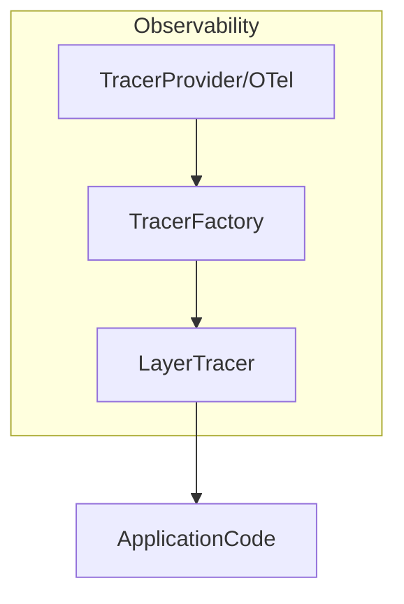

# internal/observability

English | [日本語](README.ja.md)

`internal/observability` provides **tracing and observability logging integration** for this project.

This package offers a **tracing mechanism based on OpenTelemetry** and  
**layer-based observability logging** integrated with the `internal/logging` package.

Primary goals:

- Initialize and manage OpenTelemetry
- Generate spans per application layer
- Output trace/span information to logs
- Provide unified observability across Domain / Usecase / Controller
- Provide lightweight tracers for testing

## Architecture

The observability package is designed with the following structure.



Roles of each component:

|Component|Role|
|---|---|
|`TracerProvider`|OpenTelemetry tracer provider|
|`TracerFactory`|Creates tracers per layer|
|`LayerTracer`|Span creation + observability logging|
|`helper.go`|Span / trace helper functions|
|`caller.go`|Retrieve caller function name|
|`test_kit.go`|Tracer utilities for testing|

## Features

### 1. TracerProvider

Initializes the OpenTelemetry tracer provider.

```go
func TracerProvider(reg lifecycle.Registrar) trace.TracerProvider
```

Characteristics:

- Creates the OpenTelemetry `TracerProvider`
- Registers it with `otel.SetTracerProvider`
- Calls `Shutdown()` when the application exits

This function is typically used during **DI initialization**.

### 2. TracerFactory

Factory that creates `LayerTracer` instances for each layer.

```go
type TracerFactory interface {
    Controller() LayerTracer
    Usecase() LayerTracer
    Infra() LayerTracer
}
```

This design enables separation of **span namespaces** for:

- Controller
- Usecase
- Infrastructure

Example:

```go
tf := observability.NewTracerFactory(tp, logger, logFieldBuilder)

controllerTracer := tf.Controller()
usecaseTracer := tf.Usecase()
infraTracer := tf.Infra()
```

### 3. LayerTracer

`LayerTracer` manages **span lifecycle at the application layer level**.

Primary capabilities:

- Span creation
- Span start/end logging
- traceID / spanID logging
- Automatic span name generation

#### Span Creation

```go
ctx, end := tracer.Start(ctx)
defer end()
```

Span names follow this format:

```txt
layer.package.function
```

Examples:

```txt
usecase.user.CreateUser
controller.user.GetUsers
infrastructure.user.FindByID
```

### 4. Domain Span Helper

Domain logic can be traced using `RunDomainWithSpan`.

```go
ctx, result, err := observability.RunDomainWithSpan(
    ctx,
    tracer,
    "user",
    "FullName",
    func(ctx context.Context) (string, error) {
        return user.FullName(), nil
    },
)
```

This helper automatically handles:

- span start
- span end
- observability logging

## Span Logging

Structured logs are emitted when spans start and end.

Start event:

```txt
event_type=start
span_name=usecase.user.CreateUser
trace_id=...
span_id=...
```

End event:

```txt
event_type=end
latency=12ms
trace_id=...
span_id=...
```

Logging uses the `LogFieldBuilder` from `internal/logging`.

## TraceContext

`TraceContext` stores span identification information.

```go
type TraceContext struct {
    traceID
    spanID
    parentSpanID
}
```

Extracting context:

```go
tc := observability.ExtractTraceContext(ctx)
```

Usage example:

```go
tc.TraceID()
tc.SpanID()
tc.ParentSpanID()
```

## Span Helper

### StartSpanWithParent

Creates a child span that inherits the parent span.

```go
tc, ctx, end := observability.StartSpanWithParent(
    ctx,
    tracer,
    "usecase.user.CreateUser",
)
defer end()
```

Return values:

|Value|Description|
|---|---|
|TraceContext|trace/span information|
|context|child context|
|func()|function to end the span|

## Caller Helper

`caller.go` retrieves the **caller function name**.

```go
getCallerFullName()
```

This information is used for:

- span name generation
- observability logging

## Test Support

Tests use a **Noop tracer**.

### TracerFactory

```go
tf := observability.NewNoopTracerFactory(t)
```

### LayerTracer

```go
lt := observability.NewMockUsecaseLayerTracer(t)
```

Available test tracers:

|Function|Description|
|---|---|
|`NewMockControllerLayerTracer`|Controller layer|
|`NewMockUsecaseLayerTracer`|Usecase layer|
|`NewMockInfraLayerTracer`|Infrastructure layer|
|`NewNoopLayerTracer`|Generic|

## Design Policy

This package follows the design policies below.

### 1 Layer-Based Tracing

Span names always follow:

```txt
layer.package.function
```

Reasons:

- Improved trace readability
- Easier service map analysis

### 2 Integration with Logging

Span events are emitted through the logging package.

```txt
trace_id
span_id
parent_span_id
layer
pkg
function
```

### 3 Application Code Must Not Depend on OTel

Application code uses only:

```txt
LayerTracer
```

The OpenTelemetry SDK is **fully encapsulated within the observability package**.

### 4 Fail-Safe Behavior

Even if observability features fail:

- Application execution
- Business logic

must not be affected.

## Security Considerations

Trace data must not include:

- passwords
- authentication tokens
- personal information
- private keys

If necessary, **mask sensitive data before logging**.
