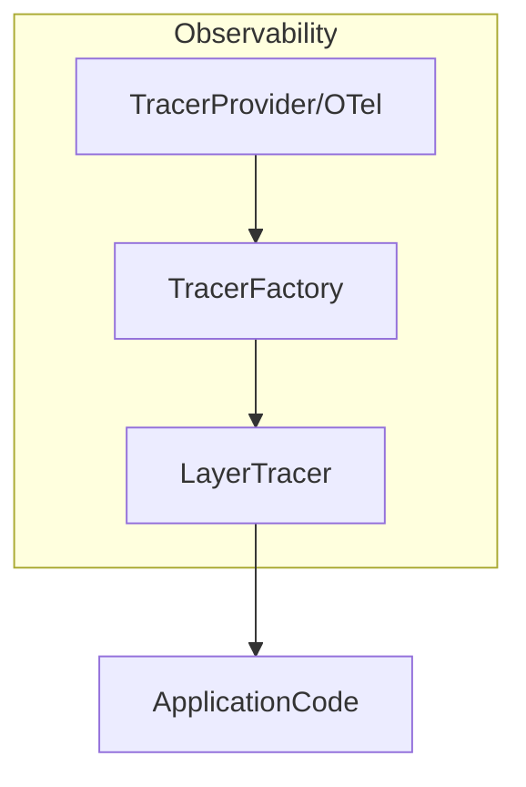

# internal/observability

English | [日本語](README.ja.md)

`internal/observability` is a package that provides **tracing and observability logging integration** for this project.

This package provides a **tracing mechanism based on OpenTelemetry**, and  
**layer-based observability logs** integrated with the `internal/logging` package.

Primary purposes:

- Initialization and management of OpenTelemetry
- Span generation per layer
- Logging of trace / span information
- Unified observability across Domain / Usecase / Controller
- Lightweight tracer for testing

## Architecture

The observability package is designed with the following structure.



Roles of each component:

|Component|Role|
|---|---|
|`TracerProvider`|OpenTelemetry tracer provider|
|`TracerFactory`|Generate tracers per layer|
|`LayerTracer`|Span generation + observability logging|
|`helper.go`|Span / trace helper|
|`caller.go`|Retrieve caller function name|
|`test_kit.go`|Tracer for testing|

## Provided Features

### 1. TracerProvider

Initializes the OpenTelemetry tracer provider.

```go
func TracerProvider(reg lifecycle.Registrar) trace.TracerProvider
```

Characteristics

- Creates OpenTelemetry TracerProvider
- Registers it with `otel.SetTracerProvider`
- Executes `Shutdown()` when the application exits

Used during application DI initialization.

### 2. TracerFactory

A factory that generates `LayerTracer` for each layer.

```go
type TracerFactory interface {
    Controller() LayerTracer
    Usecase() LayerTracer
    Infra() LayerTracer
}
```

With this design:

- Controller
- Usecase
- Infrastructure

can have **separated span namespaces**.

Example

```go
tf := observability.NewTracerFactory(tp, logger, logFieldBuilder)

controllerTracer := tf.Controller()
usecaseTracer := tf.Usecase()
infraTracer := tf.Infra()
```

### 3. LayerTracer

`LayerTracer` is a component that manages **span at the layer level**.

Main features

- Span generation
- Span start / end logging
- traceID / spanID logging output
- Automatic span name generation

#### Span Generation

```go
ctx, end := tracer.Start(ctx)
defer end()
```

Span names are generated by the rule `layer.package.function`.

Example

- `usecase.user.CreateUser`
- `controller.user.GetUsers`
- `infrastructure.user.FindByID`

### 4. Span Helper (RunWithSpan)

You can easily measure spans for arbitrary processing using `RunWithSpan`.

This function is a utility that executes arbitrary processing along with span + observability logging, without depending on any specific layer.

```go
ctx, result, err := observability.RunWithSpan(
    ctx,
    tracer,
    observability.Usecase,
    "user",
    "FullName",
    func(ctx context.Context) (string, error) {
        return user.FullName(), nil
    },
)
```

By using this function, the following are handled automatically:

- span start
- span end
- observability logging output

## Span Logging

At span start / end, **structured logging** is output.

Start

- `event_type=start`
- `span_name=usecase.user.CreateUser`
- `trace_id=...`
- `span_id=...`

End

- `event_type=end`
- `latency=12ms`
- `trace_id=...`
- `span_id=...`

Log output uses `LogFieldBuilder` from `internal/logging`.

## TraceContext

TraceContext holds span identification information.

```go
type TraceContext struct {
    traceID
    spanID
    parentSpanID
}
```

Retrieval

```go
tc := observability.ExtractTraceContext(ctx)
```

Usage example

```go
tc.TraceID()
tc.SpanID()
tc.ParentSpanID()
```

## Span Helper

### StartSpanWithParent

Generates a child span inheriting the parent span.

```go
tc, ctx, end := observability.StartSpanWithParent(
    ctx,
    tracer,
    "usecase.user.CreateUser",
)
defer end()
```

Return values

|Value|Description|
|---|---|
|TraceContext|trace/span information|
|context|child context|
|func()|span end|

## Caller Helper

`caller.go` retrieves the **caller function name**.

```go
getCallerFullName()
```

This information is used for:

- span name generation
- observability logging

## Test Support

In tests, a **Noop tracer** is used.

### TracerFactory

```go
tf := observability.NewNoopTracerFactory(t)
```

### LayerTracer

```go
lt := observability.NewMockUsecaseLayerTracer(t)
```

Available test tracers

|Function|Description|
|---|---|
|`NewMockControllerLayerTracer`|For Controller|
|`NewMockUsecaseLayerTracer`|For Usecase|
|`NewMockInfraLayerTracer`|For Infrastructure|
|`NewNoopLayerTracer`|Generic|

## Design Policy

This package is based on the following design policies.

### 1 Layer-based Tracing

Span names always follow `layer.package.function`.

Reason

- Improved trace readability
- Easier service map analysis

### 2 Integration with logging

Span events are output through the logging package.

- `trace_id`
- `span_id`
- `parent_span_id`
- `layer`
- `pkg`
- `function`

### 3 Application code does not depend on OTel

Application code uses only `LayerTracer`.

OpenTelemetry SDK is **encapsulated within the observability package**.

### 4 Fail-safe

Even if observability fails:

- application processing
- business logic

are not affected.

## Security Considerations

Do not include the following in trace information.

- passwords
- tokens
- personal information
- private keys

If necessary, apply **masking processing**.
