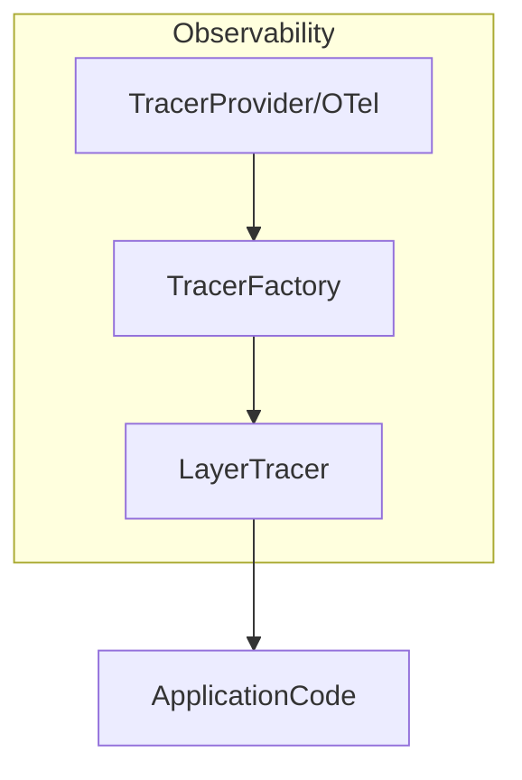

# internal/observability

English | [日本語](README.ja.md)

`internal/observability` is a package that provides **tracing and observability logging integration** for this project.

This package provides a **tracing mechanism based on OpenTelemetry**, and  
**layer-based observability logs** integrated with the `internal/logging` package.

Primary purposes:

- Initialization and management of OpenTelemetry (tracing / metrics / logs)
- Span generation per layer
- Logging of trace / span information
- OTLP log export by bridging `zap` logs (otelzap)
- Unified observability across Domain / Usecase / Controller
- Lightweight tracer for testing

## Configuration boundary (typed config, vendor-neutral OTLP)

This package wires only the **vendor-neutral OTLP plumbing**. The signal toggles and the
export destination are modeled in the typed `config.ObservabilityConfig`, populated from
`OBS_`-prefixed environment variables:

| Env | Purpose |
| --- | --- |
| `OBS_TRACES_EXPORTER` | Enable trace export (`otlp` to enable; empty / `none` to disable) |
| `OBS_METRICS_EXPORTER` | Enable metric export (same convention) |
| `OBS_LOGS_EXPORTER` | Enable log export via the otelzap bridge (same convention) |
| `OBS_OTLP_ENDPOINT` | OTLP endpoint URL (Collector / Agent sidecar); used only when a signal is enabled |
| `OBS_OTLP_PROTOCOL` | `http/protobuf` (default) or `grpc` |

Each signal is gated **independently**: `TracesEnabled()` / `MetricsEnabled()` /
`LogsEnabled()` return true only when the matching exporter value is non-empty and not
`none` (`isActiveExporter`). When a signal is disabled, a **no-op fallback** is used —
nothing is sent, no connection is attempted, and no background goroutine (batch processor /
periodic reader / runtime-metrics collector) runs — so local development needs no
configuration and no DI swapping.

> **Important:** the export transport is **OTLP only** (there is no console exporter). The
> single `OBS_OTLP_ENDPOINT` is reused for all three signals; for HTTP the per-signal path
> (`/v1/traces` / `/v1/metrics` / `/v1/logs`) is appended automatically when the URL has no
> path. Setting the endpoint **alone does not enable export** — staging / prod must also set
> the matching `OBS_*_EXPORTER=otlp`.

Vendor specifics (Grafana / Datadog / New Relic) live in that Collector, not here.

Service identity (`service.name` / `deployment.environment` / `service.version` /
`service.revision` / `service.build_date`) comes from the existing app config and the
build-time `internal/system` build info (ldflags) via `NewResource`, so no OTLP-specific
keys leak into the typed config.

## Architecture

The observability package is designed with the following structure.



Roles of each component:

|Component|Role|
|---|---|
|`NewResource`|Build the OTel resource (service identity) from app config + build info|
|`NewTracerProvider`|OpenTelemetry tracer provider + context propagator|
|`NewMeterProvider`|OpenTelemetry meter provider + Go runtime metrics|
|`NewLoggerProvider` / `NewLogCore`|OTLP log provider + otelzap core bridging `zap` logs (in `log_provider.go`)|
|`shutdown.go`|`ProviderShutdowner` (otel-agnostic shutdown handle) + `NewProviderShutdowner`, consumed by the DI shutdown hook|
|`ProvideTracerProvider` / `ProvideMeterProvider`|Adapters exposing the concrete providers as the `trace.TracerProvider` / `metric.MeterProvider` interfaces (in `provider.go`)|
|`NewPgxTracer`|`otelpgx` tracer for DB spans + metrics, with connection details suppressed (in `pgx_tracer.go`)|
|`NewHTTPClientTransport` / `NewHTTPClientMetrics`|SSRF-guarded, instrumented outbound HTTP transport + its RED metrics (in `http_client_transport.go` / `http_client_metrics.go`)|
|`propagation.go`|Cross-service / cross-carrier trace propagation (`ExtractFromCarrier` / `InjectTraceContextToCarrier`) + `NewTextMapPropagator`|
|`TracerFactory`|Generate tracers per layer|
|`LayerTracer`|Per-layer span emission (spans only — it does not write log lines itself)|
|`helper.go`|Span / trace helper, ShouldLogWithSpan, BuildSpanName|
|`caller.go`|Retrieve caller function name|
|`test_kit.go`|Tracer for testing|

## Provided Features

### 1. NewTracerProvider

Initializes the OpenTelemetry tracer provider.

```go
func NewTracerProvider(obsCfg *config.ObservabilityConfig, res *resource.Resource) (*sdktrace.TracerProvider, error)
```

Characteristics

- Creates OpenTelemetry TracerProvider with the given resource
- Registers it with `otel.SetTracerProvider`
- Registers the W3C `TraceContext` + `Baggage` propagator via `otel.SetTextMapPropagator`
  (required for cross-service trace continuity)
- Builds the OTLP `SpanExporter` (batch processor) only when `TracesEnabled()`; otherwise falls back to no-op and skips the batch processor (no goroutine)
- Uses the SDK default sampler (`ParentBased(AlwaysSample)`); sampling is not currently env-configurable
- Lifecycle-agnostic: returns the concrete `*sdktrace.TracerProvider` (which exposes `Shutdown`)
  so the DI layer (`hook.RegisterObservabilityShutdownHooks`) owns the shutdown registration.
  This keeps the `observability` package free of any `di/lifecycle` dependency.

Used during application DI initialization.

### 1.1 NewResource / NewMeterProvider

```go
func NewResource(appCfg *config.ApplicationConfig, bi system.BuildInfo) (*resource.Resource, error)
func NewMeterProvider(obsCfg *config.ObservabilityConfig, res *resource.Resource) (*sdkmetric.MeterProvider, error)
```

- `NewResource` builds the shared OTel resource carrying `service.name` /
  `deployment.environment` / `service.version` / `service.revision` / `service.build_date`
  from app config + build info.
- `NewMeterProvider` mirrors `NewTracerProvider`: it registers the meter provider via
  `otel.SetMeterProvider` and builds its periodic `MetricReader` only when `MetricsEnabled()`.
  Go **runtime metrics** instrumentation starts only in that case (the no-op fallback skips
  it). It is likewise lifecycle-agnostic — it returns the concrete `*sdkmetric.MeterProvider`
  and the DI hook registers its `Shutdown`. Because the shutdown hook depends on the concrete
  provider, the DI module no longer needs a separate force-start invoke; constructing the
  hook forces the providers to be built.

### 1.2 NewLoggerProvider / NewLogCore (OTLP logs)

```go
func NewLoggerProvider(obsCfg *config.ObservabilityConfig, res *resource.Resource) (*sdklog.LoggerProvider, error)
func NewLogCore(obsCfg *config.ObservabilityConfig, appCfg *config.ApplicationConfig, lp *sdklog.LoggerProvider) logging.LogCore
```

- `NewLoggerProvider` builds an OTLP log exporter (batch processor) only when `LogsEnabled()`;
  otherwise it returns a resource-only provider with no processor (no goroutine).
- `NewLogCore` returns an `otelzap` core that bridges the application's `zap` logs to the
  LoggerProvider so they are exported over OTLP. When `LogsEnabled()` is false it returns
  `nil`, and `zap` keeps writing to stdout only. This is the third signal alongside traces
  and metrics — application code does not change; only the exporter toggle does.

### 2. TracerFactory

A factory that generates `LayerTracer` for each layer.

```go
type TracerFactory interface {
    Controller() LayerTracer
    Usecase() LayerTracer
    Infra() LayerTracer
}
```

With this design:

- Controller
- Usecase
- Infrastructure

can have **separated span namespaces**.

Example

```go
tf := observability.NewTracerFactory(tp)

controllerTracer := tf.Controller()
usecaseTracer := tf.Usecase()
infraTracer := tf.Infra()
```

### 3. LayerTracer

`LayerTracer` is a component that manages **span at the layer level**.

Main features

- Span generation
- traceID / spanID exposed via the span context (see `TraceContext`)
- Automatic span name generation

#### Start

```go
ctx, end := tracer.Start(ctx)
defer end()
```

Span names are automatically generated by the rule `layer.package.function`.

Example

- `usecase.user.CreateUser`
- `controller.user.GetUsers`
- `infrastructure.user.FindByID`

#### StartWithSuffix

Starts a span with an additional suffix appended to the span name.

```go
ctx, end := tracer.StartWithSuffix(ctx, "detail")
defer end()
```

Generated span name: `usecase.user.CreateUser.detail`

Use this when you need to distinguish multiple spans within the same function.

### 4. Span Helper (RunWithSpan)

You can easily measure spans for arbitrary processing using `RunWithSpan`.

This function is a utility that executes arbitrary processing along with span + observability logging, without depending on any specific layer.

```go
ctx, result, err := observability.RunWithSpan(
    ctx,
    tracer,
    observability.Usecase,
    "user",
    "FullName",
    func(ctx context.Context) (string, error) {
        return user.FullName(), nil
    },
)
```

By using this function, the following are handled automatically:

- span start
- span end (via `defer`)

### 5. ShouldLogWithSpan

Determines whether the observability mode is enabled and a valid Span exists in the current Context.

```go
if observability.ShouldLogWithSpan(ctx, obsCfg) {
    // log output assuming span is present
}
```

Combines `config.ObservabilityConfig`'s `Enabled()` with the validity of the Span in the Context.

### 6. BuildSpanName

A helper that constructs a span name from layer name, package name, and function name.

```go
name := observability.BuildSpanName("usecase", "user", "CreateUser")
// => "usecase.user.CreateUser"
```

## Span / Log Correlation

`LayerTracer` emits **spans only** — it does not write log lines itself. Each span carries
its `trace_id` / `span_id` / `parent_span_id` (retrievable via `TraceContext`), and the span
name encodes `layer.package.function`.

Log ↔ trace correlation is provided by the `otelzap` `LogCore` (§1.2): when `LogsEnabled()`,
the application's `zap` logs are exported over OTLP with the active trace context attached, so
logs and spans line up in the backend under the same `trace_id`.

## TraceContext

TraceContext holds span identification information.

```go
type TraceContext struct {
    traceID
    spanID
    parentSpanID
}
```

Retrieval

```go
tc := observability.ExtractTraceContext(ctx)
```

Usage example

```go
tc.TraceID()
tc.SpanID()
tc.ParentSpanID()
```

## Span Helper

### StartSpanWithParent

Generates a child span inheriting the parent span.

```go
tc, ctx, end := observability.StartSpanWithParent(
    ctx,
    tracer,
    "usecase.user.CreateUser",
)
defer end()
```

Return values

|Value|Description|
|---|---|
|TraceContext|trace/span information|
|context|child context|
|func()|span end|

## Caller Helper

`caller.go` retrieves the **caller function name**.

```go
getCallerFullName()
```

This information is used for:

- span name generation
- observability logging

## Test Support

In tests, a **Noop tracer** is used.

### TracerFactory

```go
tf := observability.NewNoopTracerFactory(t)
```

### LayerTracer

```go
lt := observability.NewMockUsecaseLayerTracer(t)
```

Available test tracers

|Function|Description|
|---|---|
|`NewMockControllerLayerTracer`|For Controller|
|`NewMockUsecaseLayerTracer`|For Usecase|
|`NewMockInfraLayerTracer`|For Infrastructure|
|`NewNoopLayerTracer`|Generic|
|`NewStubSpanContext`|Generate Context with a valid Span|

### StubSpanContext

Use this when a Context containing a valid `trace.Span` is needed in tests.

```go
ctx, cleanup := observability.NewStubSpanContext(t)
defer cleanup()
```

Uses an actual `sdktrace.TracerProvider` to generate a valid span, making it suitable for testing `ShouldLogWithSpan` and similar functions.

### Metrics / transport test helpers

For code that depends on the metrics sets or the HTTP transport, no-op constructions built on
a no-op `MeterProvider` / `TracerProvider` are provided.

|Function|Description|
|---|---|
|`NewNoopWorkerMetrics`|`WorkerMetrics` on a no-op meter|
|`NewNoopHTTPClientMetrics`|`HTTPClientMetrics` on a no-op meter|
|`NewNoopOutboxMetrics`|`OutboxMetrics` on a no-op meter|
|`NewNoopHTTPClientTransport`|`HTTPClientTransport` with the SSRF guard disabled (allows loopback / httptest targets)|

## Design Policy

This package is based on the following design policies.

### 1 Layer-based Tracing

Span names always follow `layer.package.function`.

Reason

- Improved trace readability
- Easier service map analysis

### 2 Integration with logging

Log ↔ trace correlation is provided by the `otelzap` `LogCore` (§1.2): application logs are
exported over OTLP with the active trace context, so logs and spans share the same identifiers
in the backend. The span context exposes:

- `trace_id`
- `span_id`
- `parent_span_id`

### 3 Application code does not depend on OTel

Application code uses only `LayerTracer`.

OpenTelemetry SDK is **encapsulated within the observability package**.

### 4 Fail-safe

Even if observability fails:

- application processing
- business logic

are not affected.

### 5 Span value by layer (why controller spans are the most redundant)

Layer spans are emitted in all three layers (controller / usecase / infra) via
`LayerTracer.Start`, but their **diagnostic value differs**, which matters when
deciding where to trim instrumentation.

- **Controller layer span — most redundant.** The `echootel` middleware already
  creates a **per-request root span**, so a span added in the controller (handler)
  layer covers **almost the same boundary and roughly the same interval** as that
  request span. It largely duplicates the root span.
- **Usecase / infra layer spans — worth keeping.** These represent the
  **breakdown within a request** — *which usecase flow* ran, and *which repository /
  SQL* was executed. That detail is **not visible from the root span alone** and has
  real diagnostic value.

Design judgment: if instrumentation must be reduced, the **controller-layer span is
the first candidate** to drop, while the **usecase / infra spans are worth retaining**.

> **Note:** The current code intentionally **keeps the controller-layer span as well**
> (every layer calls `LayerTracer.Start`) for layer consistency. The point above is
> about **relative value / the rationale behind the design judgment**, not a statement
> that the controller span has been removed.

## Trace Context Propagation

`propagation.go` carries the W3C trace context across service and carrier boundaries so a
producer → relay → consumer chain forms a single trace.

- `NewTextMapPropagator` — the composite W3C `TraceContext` + `Baggage` propagator that
  `NewTracerProvider` registers globally via `otel.SetTextMapPropagator`.
- `ExtractFromCarrier(ctx, attrs)` — continues a trace from a `map[string]string` carrier
  (e.g. message attributes / headers) using the **global** propagator. Returns `ctx`
  unchanged when the carrier is empty.
- `InjectTraceContextToCarrier(ctx, attrs)` — writes only the current context's
  **`traceparent` / `tracestate`** into the carrier (a `TraceContext`-only propagator, **not**
  the global one). Used when emitting outbox rows so the relay → receiver stays on the origin
  trace, while deliberately **not** forwarding arbitrary inbound baggage to external
  endpoints.

## Outbound HTTP Client Transport

`http_client_transport.go` provides the instrumented, SSRF-guarded transport used by the
outbound HTTP client substrate.

- `NewHTTPClientTransport(tp, propagator)` — wraps a base `http.Transport` with an `otelhttp`
  layer (automatic client spans) plus a dial-time SSRF guard. `RoundTripper()` exposes the
  underlying `http.RoundTripper`.
- **SSRF guard** — validates the *resolved* destination IP at dial time (so DNS-rebinding is
  also caught): link-local / metadata, unspecified, and reserved / bogon ranges are **always**
  blocked; loopback / private / CGNAT (`100.64.0.0/10`) are blocked **unless** explicitly
  allowed.
- `ContextWithTracePropagation(ctx, enabled)` — per-call toggle for whether
  `traceparent` / `baggage` are injected into the outgoing request (suppress propagation to
  untrusted downstreams with `false`).
- `ContextWithAllowPrivateNetwork(ctx, allowed)` — per-call toggle allowing private / loopback
  destinations (default is deny).

## Metrics

In addition to tracing, this package exposes both **OTel meter instruments** (exported over
OTLP when `MetricsEnabled()`) and **Prometheus collectors** (scraped from the process).

### OTel meter instruments

Each subsystem owns its meter and instruments, constructed from the injected
`MeterProvider`. Labels are kept low-cardinality and free of secrets / PII.

|Meter (`go-boilerplate/...`)|Instruments|Owner|
|---|---|---|
|`/outbox`|`outbox.lag_seconds` (gauge), `outbox.dead` (counter)|outbox relay|
|`/worker`|`received` / `processed` / `failed` / `retried` / `dlq` / poll & extend errors (counters), latency (histogram), in-flight (up-down)|worker engine (broker-agnostic)|
|`/idempotency`|`requests` / `failures` / `expiredCleanup` (counters); labels limited to `operation_id` / `result` / `phase` / `job`|idempotency subsystem|
|`/httpclient`|RED (`requests` / `errors`, latency histogram) + `retries`, in-flight, `breakerState` gauge|outbound HTTP client substrate|

DB spans and metrics are additionally emitted by `NewPgxTracer` (`otelpgx`), and Go
**runtime metrics** are collected when `MetricsEnabled()`.

### Prometheus collectors

|Collector|Metric|Source|
|---|---|---|
|`metrics/buildinfo`|`app_build_info` info gauge (value always `1`)|`system.BuildInfo` (same source as `/version`); labels resolved once at DI wiring time|
|`metrics/queue`|`worker_queue_depth` gauge (by state, incl. DLQ) + `worker_queue_stats_collection_failures_total`|pulled per-scrape from the broker adapter's `worker.QueueStatsProvider` (approximate on SQS)|

See `internal/observability/metrics/buildinfo/README.md` for details.

## Test coverage exception (extraordinary measure)

This package is **write-once infrastructure**: once implemented it is rarely touched. As an
**extraordinary measure** (超法規的措置), the following defensive / structurally-unreachable
branches are exempt from the near-100% unit-coverage expectation. Per the rule below, **no
extra production code is added and no contrived test is written** solely to reach them —
only branches reachable as-is would be tested, and none of these are.

|File|Function|Uncovered branch|Why exempt|
|---|---|---|---|
|`caller.go`|`getCallerFullName`|`runtime.Caller` `!ok` / `runtime.FuncForPC` `nil` guards|Cannot be triggered deterministically without manipulating the runtime stack|
|`provider.go`|`NewResource`|`resource.Merge` error|Inputs are fixed (default + schemaless) → no schema conflict is possible|
|`provider.go`|`NewMeterProvider`|`runtime.Start` error|Only fails on instrument-registration failure; not reachable without a faulty provider|
|`test_kit.go`|`NewNoop{Worker,HTTPClient,Outbox}Metrics`|`t.Fatalf` guards|Test-support helpers; the no-op provider never errors, and `*testing.T` cannot be faked without a signature change|

> **Governance:** coverage exceptions are **not added at will**. A new entry may be recorded
> in this section **only with an appropriate approver's (e.g. architect) sign-off**. The
> "no contrived tests / no extra implementation just to color lines" rule still holds; this
> section is the sanctioned, auditable list of the few branches where that trade-off was
> explicitly approved.

## Security Considerations

Do not include the following in trace information.

- passwords
- tokens
- personal information
- private keys

If necessary, apply **masking processing**.

## Test Strategy

Telemetry has no user-visible behavior, so "it did not crash" is not a result. Tests assert the emitted signal itself, using the OTel SDK's in-memory plumbing rather than an exporter or a collector.

- **Metrics through a manual reader** — build an `sdkmetric.NewMeterProvider` with `sdkmetric.NewManualReader`, exercise the subject, then collect and assert over `metricdata`: the instrument name, the data point value, and the attribute set. Asserting only that recording did not error leaves a wrong metric name or a wrong label undetected, and those are the failures that break a dashboard.
- **Spans through a syncing tracer provider** — build an `sdktrace.NewTracerProvider` with `sdktrace.WithSyncer` over an in-memory recorder and assert the span name, attributes, and parent linkage on the resulting `sdktrace.ReadOnlySpan`.
- **Attribute cardinality is part of the contract** — where the design bounds a label set, assert that an unbounded input (a raw path, an ID) does not reach the attribute. A cardinality regression is invisible locally and expensive in production.
- **Redaction vs propagation** — the outbound HTTP transport redacts secrets from the span while leaving the actual request untouched. Assert **both** halves in the same test; asserting only the redaction cannot distinguish it from having mangled the request.
- **Conditional propagator** — the two directions are not symmetric, and the asymmetry is the contract: `Inject` branches on the flag (suppressed only when it is explicitly false) and needs both sides asserted, because the suppressed branch is the one that silently drops trace continuity; `Extract` delegates unconditionally, so assert the delegation rather than inventing a second branch for it.

Two neighbouring sections govern the rest and must not be duplicated here: the helpers this package offers other layers are in [Test Support](#test-support), and the approved uncovered branches — plus the sign-off rule for adding one — are in [Test coverage exception (extraordinary measure)](#test-coverage-exception-extraordinary-measure).
