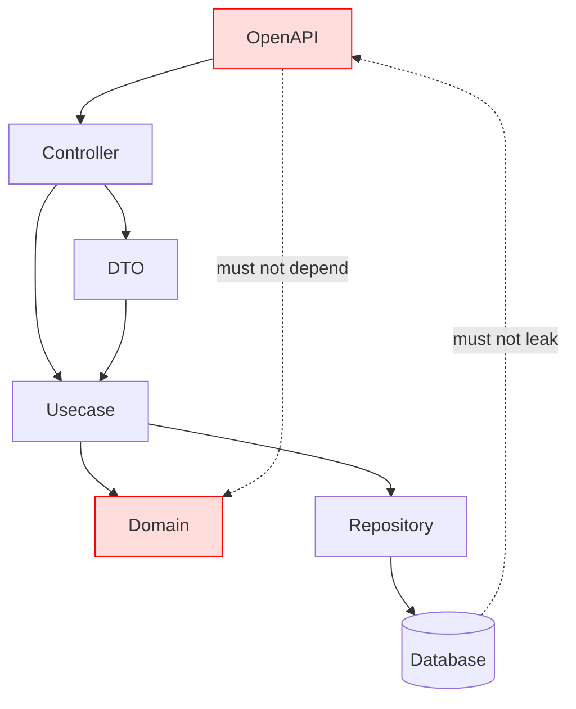

# OpenAPI Guide (`openapi/`)

This directory contains the **OpenAPI specifications** used in this project.

This project assumes:

- Modular structure using Redocly
- Go code generation via oapi-codegen
- Boundary design aligned with Onion Architecture

## Purpose

The purpose of this setup is:

- Single Source of Truth for API specifications
- Type-safe code generation
- Enforced layer separation (fixed Controller boundary)
- Minimizing impact scope in team development

## Directory Structure

```txt
openapi/
├── openapi.yaml          # Entry point (references split files)
├── openapi.gen.yaml      # Bundled file (for code generation)
├── paths/                # Endpoint definitions
├── components/
│   ├── schemas/          # Data structures
│   ├── requests/         # Request semantics
│   ├── responses/        # Response semantics
│   └── parameters/       # Parameters
└── README.md
```

## File Responsibilities

### openapi.yaml

- Entry point for split OpenAPI definitions
- Uses `$ref` to reference other files

### openapi.gen.yaml

- Bundled single file generated by Redocly or similar
- **Used as input for oapi-codegen**

## Design Principles

### 1. Modular Structure (Redocly-first)

- Endpoints → `paths/`
- Data structures → `components/schemas/`
- Requests / responses are separated

### 2. Separation of Structure and Meaning

|Type|Responsibility|
|----|-------------|
|schemas|Data structure|
|requests|Input semantics|
|responses|Output semantics|

Example:

```txt
UserBaseInput → structure
UsersPostRequest → "create" meaning
```

### 3. Use Relative `$ref` Paths

❌ Not allowed:

```txt
# /components/...
```

✅ Recommended:

```txt
../../components/schemas/User.yaml
```

Reasons:

- Compatibility with Redocly / swagger-cli
- Consistency with modular structure

### 4. One File = One Responsibility

- schema → one struct per file
- parameter → one definition per file
- path → one endpoint per file

## API Design Policy

### REST Design (Google API Design Guide)

- Use plural resource names

```txt
/users
```

- Use HTTP methods for CRUD

```txt
GET    /users
POST   /users
PATCH  /users/{id}
```

- Use action suffix for non-CRUD

```txt
POST /users/{id}:deactivate
```

### Versioning

- Managed via URL

```txt
/v1/users
```

- For breaking changes

```txt
/v2/... (create new version)
```

## Security Policy

### Authentication

- JWT (BearerAuth)
- Required for write APIs

### Authorization

- Determine resource ownership using `sub`
- Verified in Usecase or Middleware

### ID Design

- Use UUID
- IDOR protection is mandatory

## Code Generation

Generate Go code:

```txt
make go-gen
```

Generated contents:

- Handler interfaces
- Request/Response types
- Router bindings

## Architecture Position

```txt
OpenAPI
   ↓
Controller (oapi-codegen)
   ↓
Usecase
   ↓
Domain
```

OpenAPI defines the **contract of the Controller boundary**.

## Relationship with Controller

OpenAPI defines:

- Request format
- Response format
- HTTP behavior (status / headers)

Controller responsibility:

```txt
HTTP Request
   ↓
DTO
   ↓
Usecase
   ↓
DTO
   ↓
OpenAPI Response
```

## Prohibited Practices

- Do not embed business logic in OpenAPI
- Do not define schemas inline
- Do not duplicate structures
- Do not expose DB schema directly

## Consistency Rules with Implementation

### Relationship with Usecase

- Do not pass OpenAPI types directly
- Convert to DTO

### Relationship with Domain

- Domain must not depend on OpenAPI
- Convert to VO / Entity

## PATCH Design

- Allow optional fields
- Reuse base schema

Example:

```txt
UserBaseInput
   ↓
UserPatchRequest
```

## Debug APIs

The following are for development only:

```txt
/debug/cookie
/debug/cookie/*
```

These must be removed in production.

## Do / Don't

### Do

- Use modular structure (Redocly)
- Use relative `$ref`
- Separate schema and semantics
- Treat OpenAPI as a contract
- Keep Controller boundary strict

### Don't

- Mix business logic into API spec
- Use inline schemas
- Leak DB schema
- Pass OpenAPI types into Domain
- Break layer boundaries

## Dependency Diagram (Mermaid)


