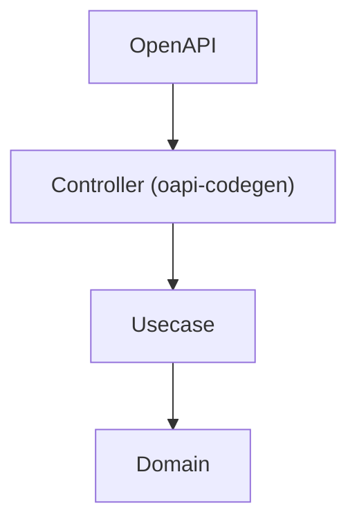
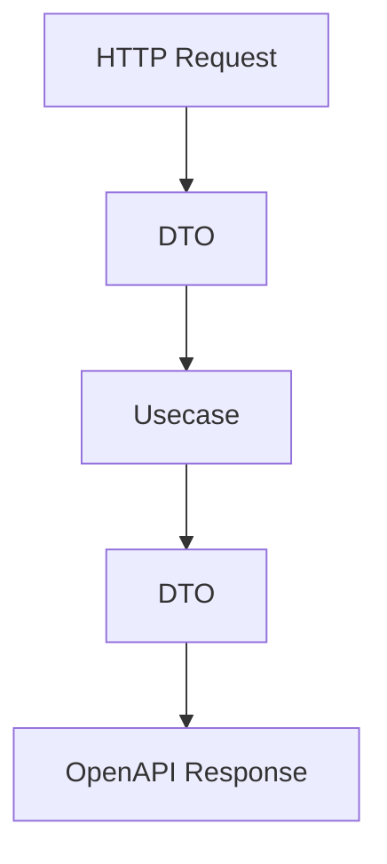
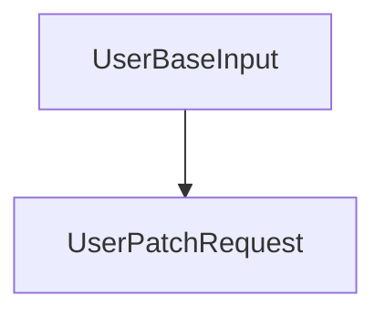

# OpenAPI Guide (`openapi/`)

This directory contains the **OpenAPI definitions** used in this project.

This project assumes:

- A modular structure using Redocly
- Go code generation using oapi-codegen
- Boundary design aligned with Onion Architecture

## Purpose

The goals of this structure are:

- Clear API specification (Single Source of Truth)
- Type-safe code generation
- Enforced layer separation (Controller boundary)
- Minimizing impact scope in team development

## Directory Structure

```txt
openapi/
├── openapi.yaml          # Entry point (references split files)
├── openapi.gen.yaml      # Bundled file (used for code generation)
├── paths/                # Endpoint definitions
├── components/
│   ├── schemas/          # Data structures
│   ├── requests/         # Request semantics
│   ├── responses/        # Response semantics
│   └── parameters/       # Parameters
└── README.md
```

## File Responsibilities

### openapi.yaml

- Entry point for split OpenAPI definitions
- References other files via `$ref`

### openapi.gen.yaml

- Bundled single file generated by Redocly, etc.
- Used as input for **oapi-codegen**

## Design Principles

### 1. Modular Structure (Redocly-based)

- Endpoints → `paths/`
- Data structures → `components/schemas/`
- Requests and responses are separated

### 2. Separation of Structure and Meaning

|Type|Role|
|---|---|
|schemas|Data structure|
|requests|Input semantics|
|responses|Output semantics|

Example:

- `UserBaseInput` → structure
- `UsersPostRequest` → meaning of "create"

### 3. Use Relative Paths for `$ref`

Forbidden: `#/components/...`  
Recommended: `../../components/schemas/User.yaml`

Reason:

- Compatibility with Redocly / swagger-cli
- Consistency with modular structure

### 4. One File, One Responsibility

- schema → one structure per file
- parameter → one definition per file
- path → one endpoint per file

## API Design Policy

### REST Design (Based on Google API Design Guide)

- Resources must be plural

Example: `/users`

- CRUD is expressed via HTTP methods

- `GET /users`
- `POST /users`
- `PATCH /users/{id}`

- Non-CRUD operations use action suffix

Example: `POST /users/{id}:deactivate`

### Versioning

- Managed via URL

Example: `/v1/users`

- For breaking changes

Create a new version such as `/v2/...`

## Security Policy

### Authentication

- Use JWT (BearerAuth)
- Required for write operations

### Authorization

- Determine resource ownership using `sub`
- Validated in Usecase or Middleware

### ID Design

- Use UUID
- IDOR protection is required

## Code Generation

Generate Go code:

```txt
make go-gen
```

Generated components:

- Handler interfaces
- Request/Response types
- Router bindings

## Position in Architecture



OpenAPI defines the **contract at the Controller boundary**.

## Relationship with Controller

OpenAPI defines:

- Input format (Request)
- Output format (Response)
- HTTP specifications (status / headers)

Controller responsibilities:



## Prohibited Practices

- Do not include business logic in OpenAPI
- Do not write schemas inline
- Do not duplicate structures
- Do not expose DB structures

## Consistency Rules with Implementation

### Relationship with Usecase

- Do not pass OpenAPI types to Usecase
- Convert to DTOs

### Relationship with Domain

- Domain must not know OpenAPI types
- Convert to Value Objects / Entities

## PATCH Design

- Allow optional fields
- Use shared schemas

Example:



## Debug API

The following endpoints are for development only:

- `/debug/cookie`
- `/debug/cookie/*`

They must be removed in production.
