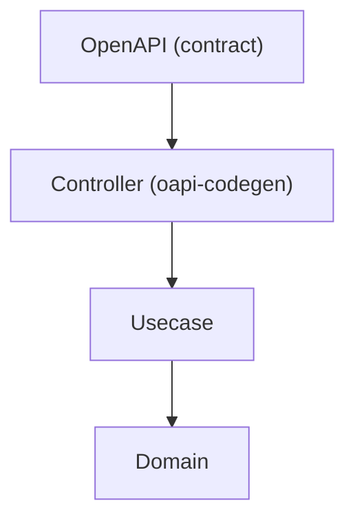

# OpenAPI Guide (`openapi/`)

English | [日本語](README.ja.md)

This directory contains the **OpenAPI definitions** used in this project.

- Modular structure using Redocly
- Go code generation using oapi-codegen
- Boundary design aligned with Onion Architecture

## Directory Structure

```text
openapi/
├── openapi.yaml              # Entry point (split file references)
├── openapi.gen.yaml          # Bundled file (generated, used for code generation)
├── paths/                    # Endpoint definitions
├── components/
│   ├── schemas/              # Data structures (request / response / security)
│   ├── parameters/           # Query and path parameters
│   ├── requests/             # Request semantics (content / required)
│   └── responses/            # Response semantics (status / description)
├── parameter-guide.md        # Parameter definition reference
├── secure-uuid.md            # UUID exposure security evaluation
└── boundary-ownership.md     # Who owns min/max/length constraints (wire contract vs domain rule)
```

## File Responsibilities

|File|Role|
|---|---|
|`openapi.yaml`|Entry point — references split files via `$ref`|
|`openapi.gen.yaml`|Bundled single file by Redocly — **input for oapi-codegen** (do not edit)|

## Code Generation

```bash
make gen-api    # Bundle OpenAPI + generate Go code
```

Generated components:

- Handler interfaces (`gen/server.gen.go`)
- Request/Response types (`gen/type.gen.go`)
- Validation spec (`gen/validate.gen.go`)

## Position in Architecture



OpenAPI defines the **contract at the Controller boundary**. It specifies input/output formats and HTTP semantics, while Controller converts between OpenAPI types and application DTOs.

## Design Principles

### 1. Modular Structure (Redocly)

- Endpoints → `paths/`
- Data structures → `components/schemas/`
- Parameters → `components/parameters/`

### 2. `$ref` Uses Relative Paths

```yaml
# Recommended
$ref: '../components/schemas/UserResponse.yaml'

# Forbidden
$ref: '#/components/schemas/UserResponse'
```

Reason: compatibility with Redocly bundling.

### 3. One File = One Responsibility

- schema → one structure per file
- parameter → one definition per file
- path → one endpoint per file

### 4. Separation from Implementation

|Layer|Knows OpenAPI?|
|---|---|
|Controller|Yes — converts OpenAPI types ↔ DTO|
|Usecase|No — receives/returns DTO only|
|Domain|No — uses Entities and Value Objects|

## API Design Policy

### REST Design (Google API Design Guide)

- Resources are plural: `/users`
- CRUD via HTTP methods: `GET`, `POST`, `PATCH`, `DELETE`
- Non-CRUD actions: `POST /users/{id}:deactivate`

### Naming / Casing

A deliberate, per-location convention (enforced by `redocly lint`):

|Location|Casing|Example|
|---|---|---|
|Request / response **body fields**|`camelCase`|`firstName`, `postalCode`, `nextCursor`, `hasNext`, `requestId`|
|**Query / path parameters**|`camelCase`|`perPage`, `userId`|
|`operationId`|`PascalCase`, verb-first|`GetUsers`, `PostUsers`|

HTTP headers are out of scope for this table — they follow the conventional `Train-Case` (e.g. `Idempotency-Key`).

Body fields and parameters use the same `camelCase` casing on purpose: aligning parameters with body fields keeps the wire contract consistent with JS / TS frontends and generated SDKs. Keep each location internally consistent.

### Versioning

URL path versioning: `/v1/users`

Breaking changes → create `/v2/` alongside `/v1/`

### Security

- JWT (BearerAuth) for authenticated endpoints
- Resource ownership validated via `sub` claim in Usecase/Middleware
- UUID as public identifiers — see `secure-uuid.md` for security evaluation
- IDOR protection required
- For OpenAPI-routed endpoints the `security:` declaration **is** the enforcement source of truth: the `oapi` middleware's `AuthenticationFunc` only fires for operations that declare it. **Exception:** `/metrics` is an ops path skipped from the OpenAPI validation pipeline, so its declared `BasicAuth` is documentation-only — the actual auth is a separate Echo `BasicAuth` middleware on that route.

## Prohibited Practices

- Do not include business logic in OpenAPI definitions
- Do not write schemas inline in path definitions
- Do not duplicate structures across files
- Do not expose DB column structures in API schemas
- Do not pass OpenAPI generated types to Usecase — convert to DTO

## Guides

- [parameter-guide.md](parameter-guide.md) — Parameter definition quick reference
- [secure-uuid.md](secure-uuid.md) — UUID exposure security evaluation
- [boundary-ownership.md](boundary-ownership.md) — Ownership of `min` / `max` / length constraints: an OpenAPI constraint is the **wire contract**, not the domain's business rule (the two may legitimately differ)

## Subdirectory Documentation

- [paths/README.md](paths/README.md) — Endpoint definitions and versioning
- [components/schemas/README.md](components/schemas/README.md) — Schema design policy
- [components/parameters/README.md](components/parameters/README.md) — Parameter conventions
- [components/requests/README.md](components/requests/README.md) — Request body semantics (content / required)
- [components/responses/README.md](components/responses/README.md) — Response semantics (status / description)
