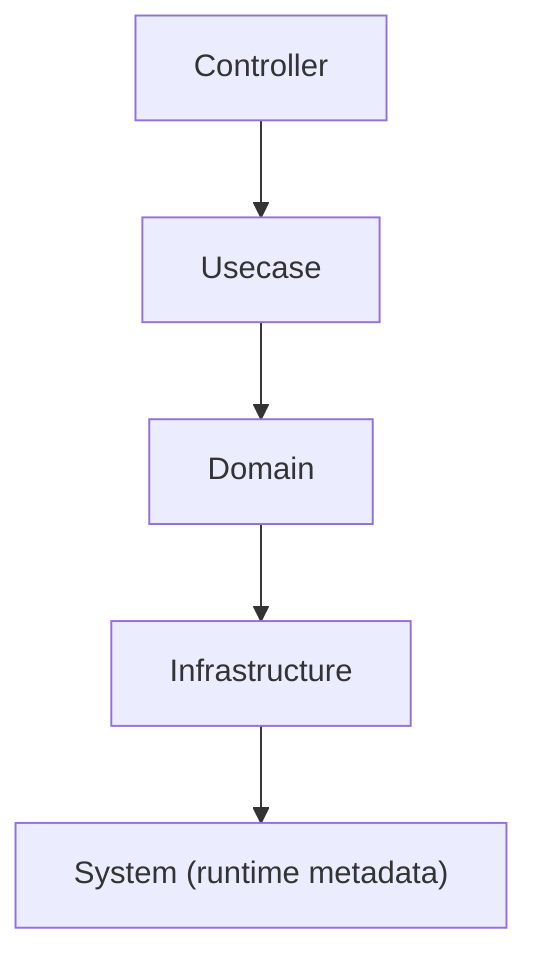

# internal/system

English | [日本語](README.ja.md)

`internal/system` is a package that provides **runtime metadata (build information)** for the application.

This package handles **process metadata** that is independent of business logic and infrastructure.  
It enables the application to retrieve **version information, Git revision, and build timestamp**.

These values are typically **injected at build time using Go `ldflags`**.

## Responsibility

The responsibilities of this package are as follows.

- Store **application build metadata**
- Enable retrieval of **Version / Revision / BuildDate** at runtime
- Provide APIs usable by version display (`--version`) and diagnostic endpoints
- Allow **BuildInfo to be mocked in tests**

This package **does not contain business logic.**

## Package Structure

```txt
internal/system
├── buildinfo.go
├── version.go
└── mock/
```

|File|Role|
|---|---|
|`buildinfo.go`|BuildInfo interface and implementation|
|`version.go`|Metadata embedded at build time|
|`mock/`|Mocks for testing|

## BuildInfo Interface

Application code retrieves build information through the **BuildInfo interface**.

```go
type BuildInfo interface {
 Version() string
 Revision() string
 BuildDate() string
}
```

Implementation

```go
func NewBuildInfo() BuildInfo
```

Usage example

```go
bi := system.NewBuildInfo()

version := bi.Version()
revision := bi.Revision()
buildDate := bi.BuildDate()
```

This design enables:

- Injection of mocks during testing
- Abstraction of version retrieval logic
- Dependency injection via DI

## version.go

`version.go` defines variables that are **overwritten at build time**.

```go
var (
 Version   = "dev"
 Revision  = "none"
 BuildDate = "2024-12-31T21:00:00Z"
)
```

The default values are **fallback values for development environments**.

Actual values are overwritten during `go build`.

## Build-Time Value Injection

In CI / Docker / Makefile, values are typically injected as follows.

Example:

```bash
go build \
  -ldflags "-X 'go-boilerplate/internal/system.Version=1.2.3' \
            -X 'go-boilerplate/internal/system.Revision=abcdef1' \
            -X 'go-boilerplate/internal/system.BuildDate=2025-01-01T00:00:00Z'"
```

In Dockerfile, it is used as follows.

```bash
ARG VERSION
ARG REVISION
ARG BUILD_DATE

RUN go build \
  -ldflags "-X 'go-boilerplate/internal/system.Version=$VERSION' \
            -X 'go-boilerplate/internal/system.Revision=$REVISION' \
            -X 'go-boilerplate/internal/system.BuildDate=$BUILD_DATE'"
```

## Usage

BuildInfo is used for the following purposes.

- `--version` command (via cobra `Version` in `cmd/main.go`)
- `/version` API (`internal/controller/handler/version`)
- `app_build_info` Prometheus metric (see `internal/observability/metrics/buildinfo`)
- diagnostic information

The `BuildInfo` provider is wired via DI in `internal/di/module` (`SystemModule`).

Example: `service version=1.2.3 revision=abc123 build=2025-01-01`

## Layer Position

`internal/system` is the **runtime metadata layer of the application**.



Characteristics

- Does not contain business logic
- Does not depend on Infrastructure
- Accessible from the entire application

## Testing

Since `BuildInfo` is an interface, mocks can be used in tests.

`go:generate mockgen`

Example

```go
mockBuildInfo := mock_system.NewMockBuildInfo(ctrl)
mockBuildInfo.EXPECT().Version().Return("1.0.0")
```

## Security Considerations

The following information must **not be included** in build metadata.

- authentication tokens
- environment variables
- private keys
- personal information

Information that should be included:

- Version
- Git Revision
- Build Date
