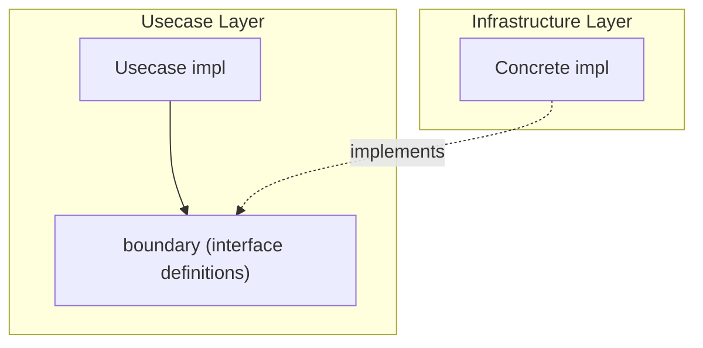

# boundary

English | [日本語](README.ja.md)

`internal/usecase/boundary` defines the **interfaces that the Usecase layer requires from external layers (Infrastructure)**.

## Position in Onion Architecture



boundary is the mechanism for achieving the **Dependency Inversion Principle (DIP)**.

- Usecase depends only on boundary interfaces
- Infrastructure provides concrete implementations
- Usecase has no knowledge of Infrastructure implementation details

### Difference from Domain Repository Interface

|Aspect|Domain Repository|Usecase Boundary|
|---|---|---|
|Definition location|Domain layer|Usecase layer|
|Purpose|Aggregate persistence abstraction|Abstraction of external capabilities needed by Usecase|
|Scope|Persistence (CRUD)|Auth / encryption / time / transaction / job, etc.|

Domain Repository abstracts "how to persist Aggregates", while Usecase Boundary abstracts "external capabilities Usecase needs to execute business flows".

## Package List

|Package|Interface|Description|Implementation|
|---|---|---|---|
|`auth`|`Authenticator`|Obtain auth info (`Authn`) from token|`internal/infrastructure/auth/`|
|`clock`|`Clock`|Retrieve current time|`internal/infrastructure/system/`|
|`job`|`Job`, `Runner`, `State`|Job definition, execution, state management|`internal/controller/job/`|
|`security`|`Encrypter`|Password hashing and comparison|`internal/infrastructure/security/`|
|`tx`|`Manager`|Transaction boundary management|`internal/infrastructure/rdb/driver/`|

## Package Details

### auth

Provides interfaces and value objects for authentication.

|Type / Function|Description|
|---|---|
|`Authenticator`|Interface to generate `Authn` from `Credential`|
|`Authn`|Authentication result (subject / id / provider / scopes / claims)|
|`New(subject, provider, scopes, claims)`|Create `Authn` (empty subject returns `ErrUnauthorizedSubjectMissing`)|
|`Credential`|Value object holding access token|
|`NewCredential(accessToken)`|Create `Credential` (empty token returns `ErrArgumentTokenMissing`)|

Errors:

|Error|Description|
|---|---|
|`ErrUnauthorizedSubjectMissing`|Subject is empty|
|`ErrInvalidIDMissing`|Subject cannot be parsed as UUID|
|`ErrArgumentTokenMissing`|Access token is empty|

### clock

```go
type Clock interface {
    Now() time.Time
}
```

Abstraction to prevent Domain / Usecase from depending directly on `time.Now()`. Allows mock substitution in tests.

### job

|Interface|Description|
|---|---|
|`Job`|Job definition with `Name()` + `Execute(ctx, args)`|
|`Runner`|Execute and list jobs via `Run(ctx, jobName, args)` + `Names()`|
|`State`|Manage job execution state via `Set(name, args, done)` + `Snapshot()`|

### security

```go
type Encrypter interface {
    Hash(password string) (string, error)
    Compare(hash, password string) (bool, error)
}
```

Password hashing and comparison. Hides implementation details (e.g., bcrypt) from Usecase.

### tx

|Type / Function|Description|
|---|---|
|`Manager`|Manage transaction boundaries via `Do(ctx, fn)`|
|`DoWithResult[T](ctx, m, fn)`|Generic helper to return a value from within a transaction|

## Design Policy

- boundary contains no business logic (only interfaces and value objects)
- Importing Infrastructure is prohibited (dependency direction violation)
- All interfaces have `mockgen` auto-generation configured
