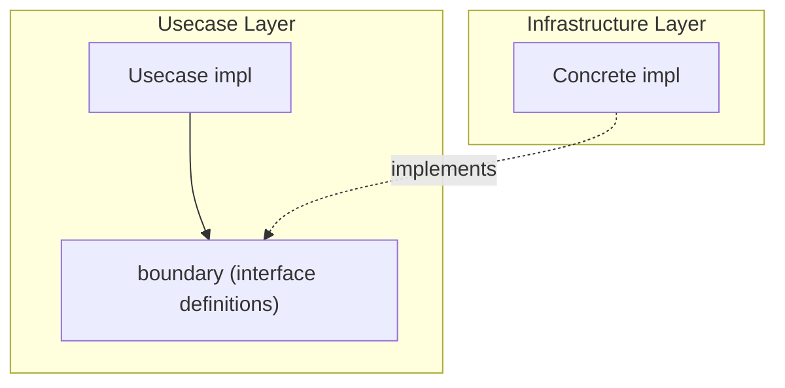

# boundary

English | [日本語](README.ja.md)

`internal/usecase/boundary` defines the **interfaces that the Usecase layer requires from external layers (Infrastructure)**.

## Position in Onion Architecture



boundary is the mechanism for achieving the **Dependency Inversion Principle (DIP)**.

- Usecase depends only on boundary interfaces
- Infrastructure provides concrete implementations
- Usecase has no knowledge of Infrastructure implementation details

### Difference from Domain Repository Interface

|Aspect|Domain Repository|Usecase Boundary|
|---|---|---|
|Definition location|Domain layer|Usecase layer|
|Purpose|Aggregate persistence abstraction|Abstraction of external capabilities needed by Usecase|
|Scope|Persistence (CRUD)|Auth / encryption / time / transaction / job, etc.|

Domain Repository abstracts "how to persist Aggregates", while Usecase Boundary abstracts "external capabilities Usecase needs to execute business flows".

## Package List

|Package|Interface|Description|Implementation|
|---|---|---|---|
|`auth`|`Authenticator`|Obtain auth info (`Authn`) from token|`internal/infrastructure/auth/`|
|`authz`|`Authorizer`|Decide whether a subject may perform an action on a resource|`internal/infrastructure/authz/`|
|`clock`|`Clock`|Retrieve current time|`internal/infrastructure/system/`|
|`job`|`Job`, `Runner`, `State`|Job definition, execution, state management|`internal/controller/job/`|
|`outbox`|`Store`|Transactional outbox table persistence boundary|`internal/infrastructure/rdb/system_query/outbox/`|
|`publisher`|`Publisher`|Substrate-agnostic outbound message publish boundary|`internal/infrastructure/publisher/`|
|`security`|`Hasher`|Password hashing and comparison|`internal/infrastructure/security/`|
|`tx`|`Manager`|Transaction boundary management|`internal/infrastructure/rdb/driver/`|

## Package Details

### auth

Provides interfaces and value objects for authentication.

|Type / Function|Description|
|---|---|
|`Authenticator`|Interface to generate `Authn` from `Credential`|
|`Authn`|Authentication result (subject / id / provider / scopes / claims)|
|`New(subject, provider, scopes, claims)`|Create `Authn` (empty subject returns `ErrUnauthenticatedSubjectMissing`)|
|`Credential`|Value object holding access token|
|`NewCredential(accessToken)`|Create `Credential` (empty token returns `ErrTokenMissing`)|

Errors:

|Error|Description|
|---|---|
|`ErrUnauthenticatedSubjectMissing`|Subject is empty|
|`ErrSubjectNotUUID`|Subject cannot be parsed as UUID|
|`ErrTokenMissing`|Access token is empty|

### authz

Provides the interface and value objects for authorization — the counterpart to `auth`. The Usecase layer is the enforcement point (PEP): it calls `Authorize(...)` and maps a deny to `apperror.ErrPermissionDenied` (403).

|Type / Function|Description|
|---|---|
|`Authorizer`|Interface deciding whether `authn` may perform `action` on `resource` (`Authorize(ctx, *auth.Authn, Action, *Resource) error`)|
|`Action`|Operation being authorized (e.g. `ActionUserDelete` = `"user:delete"`)|
|`Resource`|Target resource carrying `Kind()` and optional `OwnerID()`, so ownership-based (object-level) decisions are expressible|
|`NewResource(kind, ownerID)`|Create a `Resource`|

Errors:

|Error|Description|
|---|---|
|`ErrForbidden`|Authorization denied (wraps `apperror.ErrPermissionDenied`, HTTP 403)|

Passing the full `auth.Authn` (subject / scopes / claims) plus the target `Resource` lets both RBAC (roles from claims) and ownership (subject == OwnerID) models be expressed. The default implementation is allow-all and restricted to non-production environments.

### clock

```go
type Clock interface {
    Now() time.Time
}
```

Abstraction to prevent Domain / Usecase from depending directly on `time.Now()`. Allows mock substitution in tests.

### job

|Interface|Description|
|---|---|
|`Job`|Job definition with `Name()` + `Execute(ctx, args)`|
|`Runner`|Execute and list jobs via `Run(ctx, jobName, args)` + `Names()`|
|`State`|Manage job execution state via `Set(name, args, done)` + `Snapshot()`|

### outbox

Persistence boundary for the transactional outbox table. The emit usecase and the relay engine (controller layer) both depend on it.

|Type / Function|Description|
|---|---|
|`Store`|Outbox table persistence boundary interface|
|`Insert(ctx, p)`|INSERT one outbox row within the business tx, returning the assigned `message_id`|
|`ClaimPending(ctx, limit)`|Claim up to `limit` pending rows (`FOR UPDATE SKIP LOCKED`)|
|`MarkPublished(ctx, id)`|Transition a published row to `published` (no-op unless still pending)|
|`MarkFailed(ctx, id, lastErr)`|Increment `attempts`, record `last_error`, return the new attempt count|
|`MarkDead(ctx, id)`|Transition a row to `dead` (no-op unless still pending)|
|`ReplayDead(ctx, messageID)`|Return `dead` rows to `pending` (all dead rows when `messageID` is nil), returning the count|
|`DeletePublished(ctx, cutoff, limit)`|Delete published rows older than `cutoff` up to `limit` (GC), returning the count|
|`OldestPendingCreatedAt(ctx)`|Return the oldest pending row's `created_at` for the outbox-lag SLI (`ok=false` when none)|

Input / output value objects: `EmitParams` (INSERT input) and `PendingMessage` (claimed unpublished row).

### publisher

Outbound publish boundary for domain events plus a substrate-agnostic message envelope. Both the relay engine (controller layer) and the publish adapter (infrastructure layer) depend on it.

|Type / Function|Description|
|---|---|
|`Publisher`|Boundary that sends a message to its destination|
|`Publish(ctx, m)`|Send `m` to the destination; on failure returns an error and the relay re-sends on its next poll (at-least-once)|
|`Message`|Substrate-agnostic message envelope built from an outbox row (exposes no `net/http` types)|

### security

```go
type Hasher interface {
    Hash(password string) (string, error)
    Compare(hash, password string) (bool, error)
}
```

Password hashing and comparison. Hides implementation details (e.g., bcrypt) from Usecase.

### tx

|Type / Function|Description|
|---|---|
|`Manager`|Manage transaction boundaries via `Do(ctx, fn)`|
|`DoWithResult[T](ctx, m, fn)`|Generic helper to return a value from within a transaction|

## Design Policy

- boundary contains no business logic (only interfaces and value objects)
- Importing Infrastructure is prohibited (dependency direction violation)
- All interfaces have `mockgen` auto-generation configured
