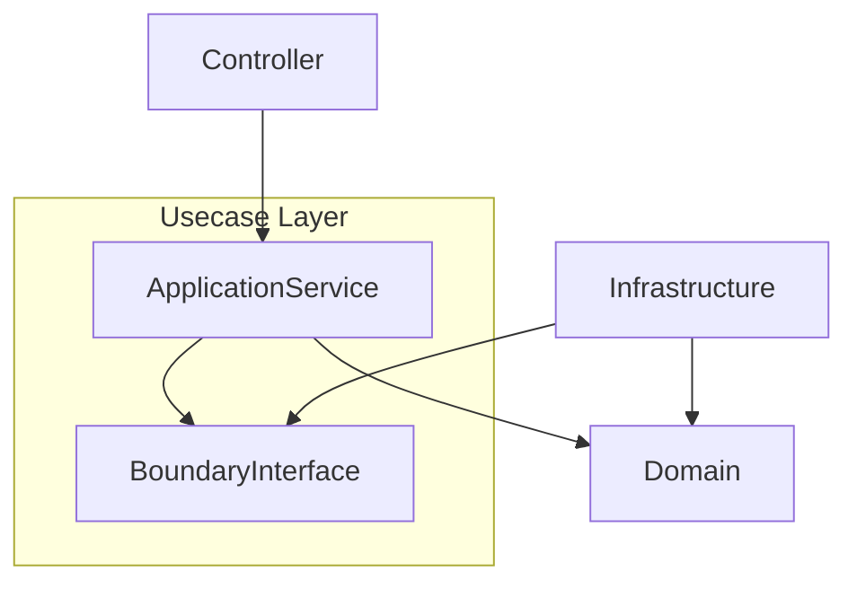
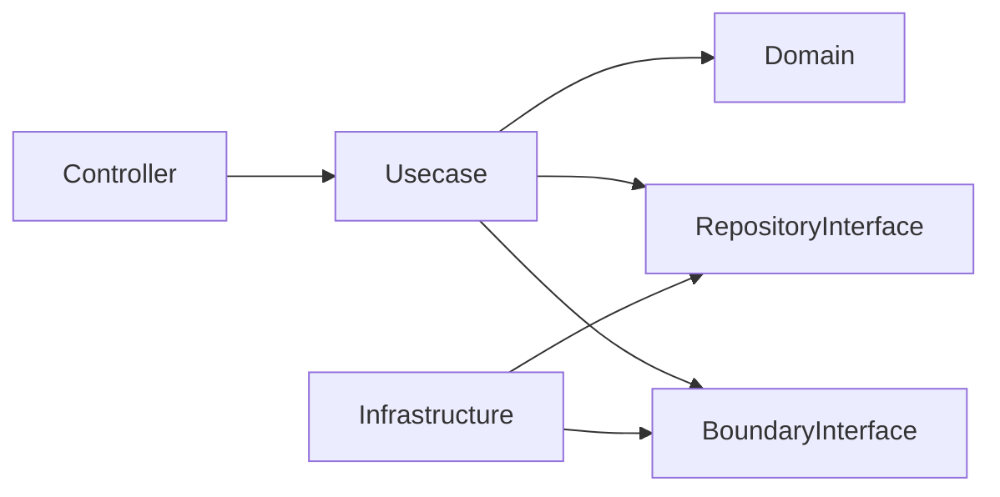

# Usecase Layer (`internal/usecase`) Guide

English | [日本語](README_ja.md)

## Role in Onion Architecture

- Acts as an **application service layer** that orchestrates **procedures (workflows)** of use cases.
- Receives inputs (DTO/VO), combines **Domain (entities / domain services) and Repository (domain abstractions)**, and returns results (DTO).
- Serves as the **single source of truth for transaction boundaries and consistency control** (Tx start/end, retry policies, etc.).
- Does not know details of the outside world (HTTP / DB / messaging). It operates purely within **application vocabulary**.

## Usecase Layer Processing Flow

The Usecase layer is a **layer that orchestrates the application workflow**.  
It defines **the order of execution** by combining Domain and Repository.

```txt
DTO
    ↓
Usecase
    ↓
Domain call
    ↓
Repository
    ↓
(Optional) Boundary call (Tx / Clock / Security / Auth etc.)
    ↓
Domain call
    ↓
DTO
```

The basic workflow is:

1. Receive DTO
2. Apply input normalization / policies
3. Call Domain
4. Persist through Repository
5. Convert to DTO
6. Return result

Usecase is **not the place to implement business rules**.  
Business rules must be implemented in the **Domain layer**.

However, calling **Domain business rules from Usecase is allowed**.  
The responsibility of Usecase is to **compose Domain behaviors to construct the use case workflow**.

In other words:

**Usecase may call Domain business rules, but must not define new business rules.**

Usecase only handles:

- Workflow orchestration
- Transaction management
- Domain / Repository coordination
- DTO transformation

## Application Service Design Policy

This repository adopts the **Application Service Pattern** for Usecases.

Application Service represents **application logic per use case**.



Responsibilities of Application Service:

- Processing per use case
- Transaction boundary
- Ordering of domain operations
- DTO ↔ Domain conversion

Things Application Service **must not do**:

- Implement business rules
- Directly access infrastructure
- Depend on frameworks

Application Service should **only compose Domain behaviors**.

## Application Policy

The Usecase layer handles **Application Policy**.

Application Policy is a **rule that determines application behavior rather than domain logic**.

Domain and Usecase responsibilities are separated as follows:

|Type|Content|Layer|
|-----|-----|-----|
|Domain Logic|Business rules|Domain|
|Application Policy|Workflow of the use case|Usecase|

### Examples of Domain Logic

```txt
Username constraints
Password format rules
State transitions
```

These belong to the **Domain layer**.

### Examples of Application Policy

```txt
Hash password when creating a user
Execute user creation inside a transaction
Fetch prefecture information when retrieving user list
```

These belong to the **Usecase layer**.

Usecase responsibility:

```txt
Usecase = Application Policy + Workflow
Domain  = Business Rule
```

## Boundary Concept

In this repository, **Boundary interfaces are introduced so that Usecase does not directly depend on Infrastructure**.

Boundary represents an **interface describing interaction with external systems**.

Usecase references **only interfaces**, and implementations are provided by Infrastructure.

### Typical Boundaries

```txt
Transaction Manager
Clock
Security (PasswordHasher etc.)
Auth Context
Messaging / EventPublisher
Observability
```

### Dependency structure



Important rules:

- Usecase **must not depend on Infrastructure**
- Usecase **must only reference interfaces**
- Infrastructure **implements interfaces**

This preserves **Dependency Inversion**.

## CQRS Policy

This repository **does not adopt full CQRS separation**.

Reasons:

- Overengineering for small to medium services
- Full separation reduces reuse
- Repository complexity increases

Instead, a **lightweight CQRS policy** is adopted.

### Command

Operations that change state.

Examples:

```txt
CreateUser
UpdateUser
DeleteUser
ChangePassword
```

Characteristics:

- Uses Domain Entities
- Requires transactions
- Validates Domain invariants

### Query

Read-only operations.

Examples:

```txt
GetUser
ListUsers
SearchUsers
```

Characteristics:

- Returning DTO directly is allowed
- Domain conversion may be skipped
- Transactions are not required

### Queries allowed in Repository

```txt
FindAll
FindByID
FindByKeyword
CountAll
CountByActive
```

JOIN is allowed **as long as domain boundaries are not violated**.

### Queries not allowed in Repository

```txt
GROUP BY
Aggregation functions
WITH clauses
Complex analytical queries
```

These belong to:

- Analytics
- Reporting
- Data pipelines

## Role in this repository

- Place Command / Query services under `internal/usecase/<feature>/` (e.g., `user/`).
  - Command: create/update/delete (start Tx and ensure Domain invariants).
  - Query (QS): read optimization. Returning DTO directly is allowed.
  - Centralize protocol-independent policies such as Pagination / Validation.
    - Example: `NewPageFrom1Based`, `MaxPerPage`, `MaxOffsetAllowed`
- Wrap errors using `apperror.ErrXXX` so Controller can map them to HTTP responses.
- DI (fx) injects dependencies such as Repository interfaces, TxManager, and Config.

## Minimize third-party dependencies

- Usecase should rely mostly on **standard library** (`context`, `time`, `errors`, `fmt` etc.).
- ORM / SQL execution / HTTP clients / Echo / I/O frameworks must not be used.
- DTOs and types should remain inside the project. sqlc types, driver types, and OpenAPI generated types should be isolated to other layers.
- Tests should use minimal tools (`testify`, `mock`). Mocks are injected via interfaces.
- If absolutely necessary, create a thin wrapper under `[pkg/](../../pkg/)`.

## Implementation Notes

### Naming / Structure

- Interface name should be unified as `Usecase` (e.g., `user.Usecase`).
- Constructor should be named `New`, registered in `di/module/usecase.go`.

### Clarification about “not implementing business logic”

- **Domain logic** belongs to the Domain layer.
- Usecase handles **procedural logic** (ordering, transaction control, boundary coordination, input policy).

### Do not introduce HTTP/DB concepts

Forbidden types in parameters or return values:

- `http.*`
- `echo.Context`
- `sqlc` generated types
- `sql.Null*`
- DB column names
- OpenAPI generated types

Use DTO / VO instead (Page / Filters / Actor).

### Error Policy

Semantic input errors:

- `apperror.ErrValidation` → 422
- `apperror.ErrInvalidArgument` → 400

Not found:

- `apperror.ErrNotFound` → 404

Conflict:

- `apperror.ErrConflict` → 409

Temporary unavailable:

- `apperror.ErrUnavailable` → 503

Unexpected errors:

- return as-is or wrap with `apperror.ErrInternal` → 500

### Pagination

- Use `NewPageFrom1Based(page, perPage)` to unify defaults, limits, and conversions.
- If offset exceeds allowed limit, return `apperror.ErrInvalidArgument`.

## Callable / Non-callable Layers

### Allowed dependencies

- Domain (entities / domain services / repository interfaces)
- Boundary (tx / clock / security / auth etc.)
- QueryService (if needed)

### Forbidden dependencies

- Calling another Usecase directly (avoid cycles and bloating).
- Accessing Infra / Controller / HTTP / OpenAPI / SQL implementations.

Usecase **must not depend on Infrastructure**.

Infrastructure access must go through:

- Repository interfaces
- Boundary interfaces

## Testing Strategy

Usecase tests must be **pure unit tests**.

External systems and Infrastructure must not be used.

### Test dependencies

|Dependency|Strategy|
|---|---|
|Domain|real implementation|
|Repository|mock|
|Boundary|mock|
|Infrastructure|not used|

### Testing goals

Verify:

- Correct order of Domain / Repository / Boundary calls
- Transaction boundary behavior
- Error propagation
- DTO composition

### Domain should not be mocked

Domain contains **actual business rules**, so real implementation should be used.

```go
userDomain, err := user.New(...)
require.NoError(t, err)
```

### Repository / Boundary should be mocked

Repositories and Boundaries are injected as interfaces.

```go
ctrl := gomock.NewController(t)

userRepo := mock_user.NewMockRepository(ctrl)
clock := mock_clock.NewMockClock(ctrl)
byencrypter := mock_security.NewMockBcrypter(ctrl)
```

### Test targets

Normal cases:

- Correct DTO returned
- Repository called correctly
- Boundary invoked correctly
- Transaction used correctly

Error cases:

- Boundary errors propagate
- Repository errors propagate
- Domain creation failure propagates
- Empty / zero result handling

### Test structure

Tests should be divided into **success / failure cases**.

```txt
TestCreateUser
  ├ success
  └ failure

TestListUsers
  ├ success
  └ failure
```

### Deterministic

Use fixed time values.

```go
now := time.Date(2025, time.January, 1, 0, 0, 0, 0, time.Local)
clock.EXPECT().Now().Return(now)
```

### Fail Fast

Prefer `require`.

```go
require.NoError(t, err)
require.Equal(t, expected, actual)
```

### What not to test

Do not test:

- DB connections
- SQL execution
- HTTP requests
- OpenAPI types
- Infrastructure implementation details

These belong to **Infrastructure / Controller**.

### Summary

```txt
Usecase
 ├ Domain         -> real
 ├ Repository     -> mock
 ├ Boundary       -> mock
 └ Infrastructure -> not used
```

This allows fast and stable validation of:

- Workflow
- Application policy
- Transaction boundaries
- Error propagation
- DTO conversion

## Do / Don’t

### Do

- Pass DTO / VO (Page, Filters, Actor)
- Define Tx boundary here
- Attach `apperror` classification
- Query returns DTO quickly
- Use table-driven tests

### Don’t

- Return Domain entities directly
- Accept / return `http.Status` or `echo.Context`
- Use `sqlc` generated types
- Return OpenAPI generated types
- Treat empty list as error
- Call other Usecases directly

## Observability (Tracing)

The Usecase layer does not use OpenTelemetry SDK directly.

Instead, it uses **observability.LayerTracer**.

### Start / End span

```go
ctx, endSpan := s.tracer.Start(ctx)
defer endSpan()
```

- `Start(ctx)` starts a span
- `endSpan()` ends it
- `defer` guarantees closing

### Tracer injection

```go
type server struct {
    tracer   observability.LayerTracer
    txm      tx.Manager
    userRepo user.Repository
    pftRepo  prefecture.Repository
}
```

Constructor:

```go
func New(
    tf observability.TracerFactory,
    txm tx.Manager,
    userRepo user.Repository,
    prefectureRepo prefecture.Repository,
) Usecase {
    return &usecase{
        tracer:   tf.Usecase(),
        txm:      txm,
        userRepo: userRepo,
        pftRepo:  prefectureRepo,
    }
}
```

Observability layer hides SDK details.

## Minimal Example

```go
//go:generate mockgen -source=$GOFILE -destination=mock/mock_$GOFILE -package=mock_$GOPACKAGE
// unique package name
package user

import (
    "context"

    "boilerplate-go/internal/observability"
    // import packages needed for implementation
)


// DTO used to communicate with lower layers
type UserMutableFields struct {
    FirstName      string
    LastName       string
    Email          string
    Phone          string
    PostalCode     string
    PrefectureName string
    City           string
    Street         string
    Building       *string
}

type CreateUserParamsDTO struct {
    UserID   uuid.UUID
    Password string

    UserMutableFields
}


// usecase struct name is fixed
type usecase struct {
    tracer   observability.LayerTracer
    txm      tx.Manager
    userRepo user.Repository
    pftRepo  prefecture.Repository
}

// Usecase interface name is fixed
type Usecase interface {
    GetAllUsers(ctx context.Context, page paging.Paging) ([]UserMutableFields, error)
    CreateUser(ctx context.Context, dto CreateUserParamsDTO) (UserMutableFields, error)

}

// constructor name is fixed
func New(
    tf observability.TracerFactory,
    txm tx.Manager,
    userRepo user.Repository,
    prefectureRepo prefecture.Repository,
) Usecase {
    return &usecase{
        tracer:   tf.Usecase(),
        txm:      txm,
        userRepo: userRepo,
        pftRepo:  prefectureRepo,
    }
}

func (u *usecase) GetAllUsers(ctx context.Context, page paging.Paging) ([]DTO, error) {
    // Start and end span
    ctx, endSpan := u.tracer.Start(ctx)
    defer endSpan()

    // Fetch user list (slice of Domain entities)
    us, err := u.userRepo.FindAll(ctx, page.Limit(), page.Offset())
    if err != nil {
       return nil, err
    }

    // Optional: create span for Domain processing
    ctx, prefectureMap, err := observability.RunDomainWithSpan(
        ctx, u.tracer, "user", "prefectureMap", func(ctx context.Context) (map[uuid.UUID]*prefecture.Entity, error) {

            // collect prefecture IDs from users
            pids := make([]uuid.UUID, len(us))
            for i, u := range us {
                pids[i] = u.PrefectureID()
            }

            // fetch prefecture entities
            ps, pftErr := u.pftRepo.FindByIDs(ctx, pids)
            if pftErr != nil {
              return nil, pftErr
            }

            // convert to map for fast lookup
            prefectureMap := make(map[uuid.UUID]*prefecture.Entity, len(ps))
            for _, p := range ps {
                prefectureMap[p.ID()] = p
            }

            return prefectureMap, nil
      })
    if err != nil {
      return nil, err
    }

    _, dtos, err := observability.RunDomainWithSpan(
        ctx, u.tracer, "user", "buildDTOs", func(ctx context.Context) ([]UserMutableFields, error) {

            dtos := make([]UserMutableFields, len(us))
            for i, u := range us {
                dtos[i] = UserMutableFields{
                    FirstName:  u.FirstName(),
                    LastName:   u.LastName(),
                    Email:      u.Email(),
                    Phone:      u.Phone(),
                    PostalCode: u.PostalCode(),
                    City:       u.City(),
                    Street:     u.Street(),
                    Building:   u.Building(),
                }

                // attach prefecture name
                if p, ok := prefectureMap[us[i].PrefectureID()]; ok {
                    dtos[i].PrefectureName = p.Name()
                }
            }
            return dtos, nil
        })

    return dtos, err
}
```
