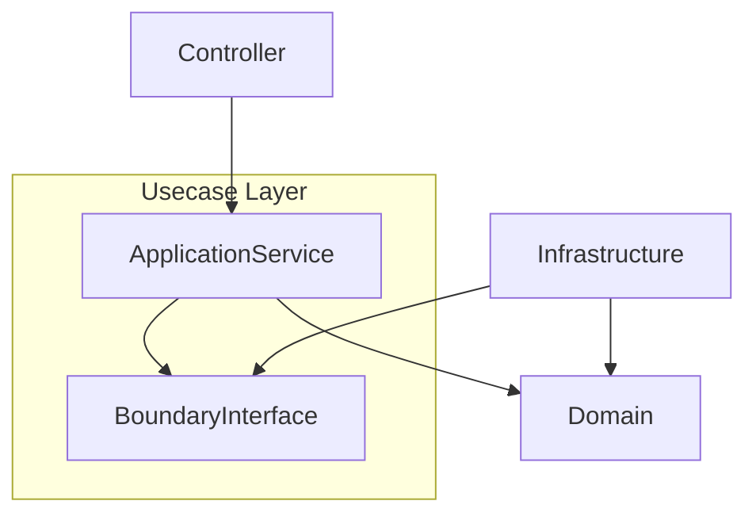
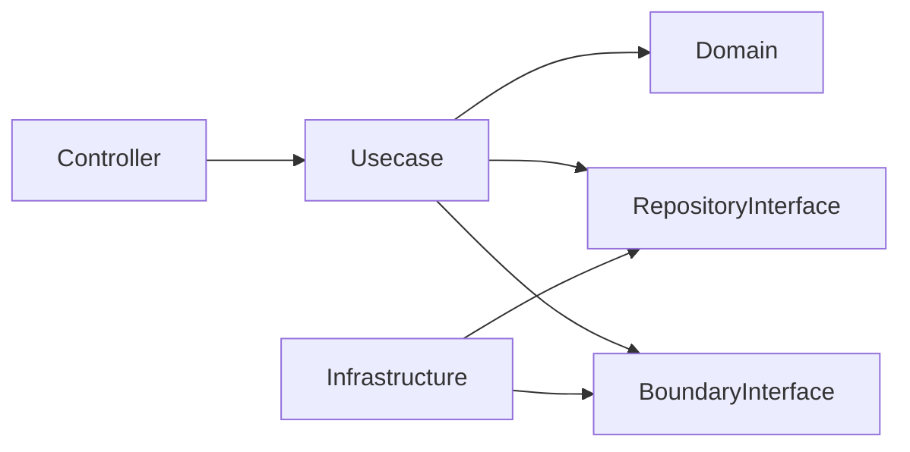

# Usecase Layer (`internal/usecase`) Guide

English | [日本語](README.ja.md)

## Role in Onion Architecture

- Acts as an **application service layer** that orchestrates **procedures (workflows)** of use cases.
- Receives inputs (DTO/VO), combines **Domain (entities / domain services) and Repository (domain abstractions)**, and returns results (DTO).
- Serves as the **single source of truth for transaction boundaries and consistency control** (Tx start/end, retry policies, etc.).
- Does not know details of the outside world (HTTP / DB / messaging). It operates purely within **application vocabulary**.

## Usecase Layer Processing Flow

The Usecase layer is a **layer that orchestrates the application workflow**.  
It defines **the order of execution** by combining Domain and Repository.

```txt
DTO
    ↓
Usecase
    ↓
Domain call
    ↓
Repository
    ↓
(Optional) Boundary call (Tx / Clock / Auth etc.)
    ↓
Domain call
    ↓
DTO
```

The basic workflow is:

1. Receive DTO
2. Apply input normalization / policies
3. Call Domain
4. Persist through Repository
5. Convert to DTO
6. Return result

Usecase is **not the place to implement business rules**.  
Business rules must be implemented in the **Domain layer**.

However, calling **Domain business rules from Usecase is allowed**.  
The responsibility of Usecase is to **compose Domain behaviors to construct the use case workflow**.

In other words:

**Usecase may call Domain business rules, but must not define new business rules.**

Usecase only handles:

- Workflow orchestration
- Transaction management
- Domain / Repository coordination
- DTO transformation

Orchestration includes **composing multiple reads into one operation** for the Controller: e.g. a paginated list endpoint exposes a single method returning `{ Items, Total }`, rather than letting the handler call list and count separately and combine them.

## Application Service Design Policy

This repository adopts the **Application Service Pattern** for Usecases.

Application Service represents **application logic per use case**.



Responsibilities of Application Service:

- Processing per use case
- Transaction boundary
- Ordering of domain operations
- DTO ↔ Domain conversion

Things Application Service **must not do**:

- Implement business rules
- Directly access infrastructure
- Depend on frameworks

Application Service should **only compose Domain behaviors**.

## Application Policy

The Usecase layer handles **Application Policy**.

Application Policy is a **rule that determines application behavior rather than domain logic**.

Domain and Usecase responsibilities are separated as follows:

|Type|Content|Layer|
|-----|-----|-----|
|Domain Logic|Business rules|Domain|
|Application Policy|Workflow of the use case|Usecase|

### Examples of Domain Logic

```txt
Username constraints
Email format rules
State transitions
```

These belong to the **Domain layer**.

### Examples of Application Policy

```txt
Execute user creation inside a transaction
Fetch prefecture information when retrieving user list
```

These belong to the **Usecase layer**.

Usecase responsibility:

```txt
Usecase = Application Policy + Workflow
Domain  = Business Rule
```

## Boundary Concept

In this repository, **Boundary interfaces are introduced so that Usecase does not directly depend on Infrastructure**.

Boundary represents an **interface describing interaction with external systems**.

Usecase references **only interfaces**, and implementations are provided by Infrastructure.

### Typical Boundaries

```txt
Transaction Manager
Clock
Auth Context
Messaging / EventPublisher
Observability
```

### Time Handling Policy

In this repository, **time acquisition is centrally managed in the Usecase layer**.

Therefore **direct calls to `time.Now()` are prohibited**.

Instead, use the Boundary provided **`clock.Clock`**.

Reasons:

- To make tests deterministic
- To isolate timezone and time‑source differences
- To prevent AI tools or developers from introducing `time.Now()` directly

Usecase must obtain time as follows:

```go
now := u.clock.Now()
```

Example:

```go
now := u.clock.Now()
userEntity, err := user.New(..., now, now, nil)
```

### Rule

Usecase layer must follow this rule:

```txt
Forbidden: time.Now()
Allowed:   clock.Clock.Now()
```

Time should be obtained in **Usecase → then passed into Domain**.

Domain should not acquire time by itself.

This guarantees that **time‑dependent logic remains fully testable**.

### Dependency structure



Important rules:

- Usecase **must not depend on Infrastructure**
- Usecase **must only reference interfaces**
- Infrastructure **implements interfaces**

This preserves **Dependency Inversion**.

## CQRS Policy

This repository **does not adopt full CQRS separation**.

Reasons:

- Overengineering for small to medium services
- Full separation reduces reuse
- Repository complexity increases

Instead, a **lightweight CQRS policy** is adopted.

### Command

Operations that change state.

Examples:

```txt
CreateUser
UpdateUser
DeleteUser
```

Characteristics:

- Uses Domain Entities
- Requires transactions
- Validates Domain invariants

### Query

Read-only operations.

Examples:

```txt
GetUser
ListUsers
SearchUsers
```

Characteristics:

- Returning DTO directly is allowed
- Domain conversion may be skipped
- Transactions are not required

### What a Repository may be asked for

The Repository interface is declared in the domain layer, so its shape is that layer's contract
rather than this one's. **The permitted methods and the SQL shapes behind them are listed in
[`../domain/README.md`](../domain/README.md)** (§ Methods allowed in Repository / § What must not be
in Repository). This section keeps no copy: two lists drift, and the copy nobody re-reads is the one
that goes stale.

Which construct a given operation belongs to — Repository, QueryService, or CommandService — is
decided by [`docs/design/data-access-pattern.md`](../../docs/design/data-access-pattern.md).

What this layer owns is the consequence. A Usecase orders those calls and owns the transaction; when
an operation does not fit the Repository, it reaches for the construct that does rather than widening
the Repository until it fits.

### Verifying infrastructure against the domain

**Infrastructure executes; the domain defines. The usecase is where the two are checked against each
other.** This holds in both directions and is the same rule stated twice.

- **Write** — infrastructure performs the write, then the usecase re-reads the affected aggregate
  through its Repository so the aggregate re-validates the result
  ([ADR-0032 (lightweight-cqrs)](../../docs/adr/0032-lightweight-cqrs.md)).
- **Read** — infrastructure applies the filter, then the usecase checks the returned entities
  against the domain predicate that defines the criterion. Infrastructure *executes* a criterion; it
  does not *author* one (see [`internal/domain/README.md`](../domain/README.md) § Query and
  Aggregate). A row that fails the predicate means the two have drifted.

Surface a drift as an error rather than filtering it away. Dropping the row silently hides the defect
at the exact moment it becomes observable, and the read then reports a result that no longer matches
the definition it claims to apply.

**What limits this check is not the shape of the result but the shape of the criterion.** A criterion
that says something about the rows that come back can be verified: run the domain predicate over the
result and the drift shows up. A criterion that removes rows cannot, because the rows it removed are
not in the result — absence is not observable, and establishing it would mean running the query again
without the filter, which is the work the read was optimised to avoid.

So a projection is not automatically exempt. When a QueryService returns rows the criterion is about,
carry the fields the predicate needs and check them, even though no aggregate is reconstructed; the
definition then still lives in the domain, and infrastructure only executes it. Give the domain a
predicate over the value, alongside the one on the entity, so both paths share one definition rather
than growing a second copy in the query layer. Reserve "held by review alone" for criteria that
subtract — exclusions and the aggregates computed over them — and say so where the query is written,
since that is the only place a reader can see what was left out.

## Role in this repository

- Place Command / Query services under `internal/usecase/<feature>/` (e.g., `user/`).
  - Command: create/update/delete (start Tx and ensure Domain invariants).
  - Query (QS): read optimization. Returning DTO directly is allowed.
  - Centralize protocol-independent policies such as Pagination / Validation.
    - Example: `paging.NewPageFrom1Based(page, perPage)`
- Wrap errors using `apperror.ErrXXX` so Controller can map them to HTTP responses.
- DI (fx) injects dependencies such as Repository interfaces, TxManager, and Config.

## Minimize third-party dependencies

- Usecase should rely mostly on **standard library** (`context`, `time`, `errors`, `fmt` etc.).
- ORM / SQL execution / HTTP clients / Echo / I/O frameworks must not be used.
- Cross-cutting exception: `internal/logging.Logger` may be injected directly (constructor DI) without a dedicated boundary, like `internal/apperror`. It is a pure, mockable interface, and only background workers that need failure logging (e.g. the outbox relay's dead-message warning) use it. Prefer `metrics` / boundaries for everything else.
- DTOs and types should remain inside the project. sqlc types, driver types, and OpenAPI generated types should be isolated to other layers.
- Tests should use minimal tools (`testify`, `mock`). Mocks are injected via interfaces.
- If absolutely necessary, create a thin wrapper under `[pkg/](../../pkg/)`.

## Implementation Notes

### Naming / Structure

- Interface name should be unified as `Usecase` (e.g., `user.Usecase`).
- Constructor should be named `New`, registered in `di/module/usecase.go`.

### Doc comments: interface vs implementation

An interface and its implementation live in the same package here (`Usecase` and the unexported
`usecase`), so both carry a doc comment. They serve **different readers** and must not be copies of
each other.

- **Interface doc = the caller-facing contract**, per `docs/rules.md` § Comment Rules. It must stay
  within **application vocabulary**: naming a Repository / QueryService / Boundary is fine (those are
  inward-facing abstractions Usecase legitimately owns), but **infrastructure vocabulary leaks the
  layer** and is forbidden — SQL fragments (`SELECT … FOR UPDATE`), table names, column names, keyset
  mechanics. Those belong to the Infrastructure doc comment that already states them.
- **Implementation doc = for the next implementer.** It may go **one step more concrete** than the
  contract, still in application vocabulary: which collaborator carries a guarantee, why the
  transaction boundary sits where it does, what degrades instead of failing, why a conflict is not
  retryable. `UpdateProduct` in `product/product_update_usecase.go` is the reference example.
- **Never restate the interface doc verbatim.** A duplicate adds nothing and rots in two places. When
  there is no concrete detail worth adding, **omit the implementation doc entirely** — the
  implementation type is unexported, so `revive`'s `exported` rule does not require one.

This interface-vs-implementation split is **not specific to this layer**. It applies wherever an
interface and its unexported implementation live in the same package — `internal/logging`'s `Logger`
and `internal/observability`'s provider factories are held to the same rule. The layer-vocabulary part
below is what differs per layer; the no-verbatim-duplicate part is repository-wide.

The same application-vocabulary rule governs the **port interfaces this layer owns** — Boundary,
CommandService, QueryService. A port is the seam to the outside, which is exactly why it must be
stated in technology-neutral terms: contract the *guarantee*, not the mechanism that currently
delivers it. `LockPurchase` says it takes a pessimistic lock and what that lock serializes — the
caller depends on both — but not that the lock is a `SELECT … FOR UPDATE`. A `QueryService` says
ownership is enforced by its own filtering, not by a SQL `WHERE` predicate. The mechanism belongs to
the Infrastructure implementation's doc comment, which is free to name it (see
[`internal/infrastructure/README.md`](../infrastructure/README.md) § Doc comments may name technical
detail).

The content standard itself (contract + non-obvious Why; no How narration, no development history, no
restatement) is `docs/rules.md` § Comment Rules. This section only settles **which doc comment
carries what**.

### Clarification about “not implementing business logic”

- **Domain logic** belongs to the Domain layer.
- Usecase handles **procedural logic** (ordering, transaction control, boundary coordination, input policy).

### Do not introduce HTTP/DB concepts

Forbidden types in parameters or return values:

- `http.*`
- `*echo.Context`
- `sqlc` generated types
- `sql.Null*`
- DB column names
- OpenAPI generated types

Use DTO / VO instead (Page / Filters / Actor).

### Error Policy

Wrap sentinel errors from `internal/apperror` per operation outcome; see
[`internal/apperror/README.md`](../apperror/README.md) § Mapping Table for the full
`ErrXXX` → HTTP status table. Unexpected errors are returned as-is or wrapped with
`apperror.ErrInternal`.

When wrapping an `apperror.ErrXXX` sentinel, use `pkg/xerrors.Wrap(apperror.ErrXXX, "context")`
(not the standard `fmt.Errorf("%w", ...)`) so the stack trace is preserved while `xerrors.Is`
still matches the sentinel.

### GC / batch sweeps

A Usecase that sweeps rows or objects in batches follows a fixed shape.

- Expose the default batch size as an exported constant (`Default<Feature>BatchSize`) so the caller
  can see and override it, and treat a non-positive argument as "use the default" rather than an
  error — a job invoked with no flag is the normal case, not a mistake.
- Loop one batch at a time and stop when a batch comes back smaller than the requested size.
- **Return the counts even when returning an error.** The batches that completed are already
  committed and cannot be rolled back, so a `Result` that reports zero on failure is a lie. The
  caller logs what got through; see the `Result` half of Output DTO naming above.

### Output DTO naming

A Usecase's return DTO takes one of two suffixes, chosen by what the method returns.

- **`<Concept>View`** — a projection of state built for the caller, not the aggregate itself. Keep the
  suffix even when the projection carries a single field, so a reader can tell an outbound projection
  from a domain type at a glance.
- **`<Concept>Result`** — the outcome of an operation that changed something: counts processed, counts
  skipped, what a batch got through before it stopped. It reports what happened, not what is.

The distinction is worth keeping because the two have different failure semantics. A `View` is either
returned or not. A `Result` is meaningful **even when the method also returns an error** — a batch
that failed partway still has to report the work it committed before it stopped.

`healthcheck.CheckHealth` is the one exception: it returns a bare `DTO`. Health is neither a
projection of an aggregate nor the outcome of a change — it is the probe's own reading, and the type
has no concept to prefix. Adding a suffix there would name something the package does not have. Do
not treat it as licence to skip the suffix elsewhere.

### Pagination

- Use `NewPageFrom1Based(page, perPage)` to unify defaults, limits, and conversions.
- If the page number exceeds the allowed maximum, return `apperror.ErrInvalidArgument` (the offset is clamped on int32 conversion).
- For keyset (cursor) pagination, build on `tools/paging.Cursor` and give each feature a paired
  `encode<Feature>Cursor` / `decode<Feature>Cursor` codec. The cursor is opaque to the caller: it
  encodes the ordering-key tuple, and a malformed value or a wrong key count is returned as
  `apperror.ErrInvalidArgument`.

## Callable / Non-callable Layers

### Allowed dependencies

- Domain (entities / domain services / repository interfaces)
- Boundary (tx / clock / auth etc.)
- QueryService (if needed)

### Forbidden dependencies

- Calling another **business** Usecase directly (see below).
- Accessing Infra / Controller / HTTP / OpenAPI / SQL implementations.

#### Why business Usecases are not wired to each other

What is forbidden is not being called — it is the **chain**. Under a rule where A may call B, C
eventually calls A and D calls C. Nobody can then say where one business operation begins and ends,
and the transaction boundary stops being traceable.

So when A's business has to be combined with B's, do not call B from A. Introduce a Usecase D that
**composes** the two. D sits above both and joins their business operations, which keeps the shape a
composition instead of a chain.

**A technical Usecase is outside this rule.** An operation that is not a business operation itself
but is needed in the same form by any of them — emitting to the outbox, for instance — cannot form
the chain this rule exists to prevent, so it may be called directly.

Usecase **must not depend on Infrastructure**.

Infrastructure access must go through:

- Repository interfaces
- Boundary interfaces

## Testing Strategy

Usecase tests must be **pure unit tests**.

External systems and Infrastructure must not be used.

### Test dependencies

|Dependency|Strategy|
|---|---|
|Domain|real implementation|
|Repository|mock|
|Boundary|mock|
|Infrastructure|not used|

### Testing goals

Verify:

- Correct order of Domain / Repository / Boundary calls
- Transaction boundary behavior
- Error propagation
- DTO composition

### Domain should not be mocked

Domain contains **actual business rules**, so real implementation should be used.

```go
userDomain, err := user.New(...)
require.NoError(t, err)
```

### Repository / Boundary should be mocked

Repositories and Boundaries are injected as interfaces.

```go
ctrl := gomock.NewController(t)

userRepo := mock_user.NewMockRepository(ctrl)
clock := mock_clock.NewMockClock(ctrl)
```

### Test targets

Normal cases:

- Correct DTO returned
- Repository called correctly
- Boundary invoked correctly
- Transaction used correctly

Error cases:

- Boundary errors propagate
- Repository errors propagate
- Domain creation failure propagates
- Empty / zero result handling

### Test structure

Tests should be divided into **success / failure cases**.

```txt
TestCreateUser
  ├ success
  └ failure

TestListUsers
  ├ success
  └ failure
```

### Deterministic

Use fixed time values.

```go
now := time.Date(2025, time.January, 1, 0, 0, 0, 0, time.Local)
clock.EXPECT().Now().Return(now)
```

### Fail Fast

Prefer `require`.

```go
require.NoError(t, err)
require.Equal(t, expected, actual)
```

### What not to test

Do not test:

- DB connections
- SQL execution
- HTTP requests
- OpenAPI types
- Infrastructure implementation details

These belong to **Infrastructure / Controller**.

### Summary

```txt
Usecase
 ├ Domain         -> real
 ├ Repository     -> mock
 ├ Boundary       -> mock
 └ Infrastructure -> not used
```

This allows fast and stable validation of:

- Workflow
- Application policy
- Transaction boundaries
- Error propagation
- DTO conversion

## Do / Don’t

### Do

- Pass DTO / VO (Page, Filters, Actor)
- Define Tx boundary here
- Attach `apperror` classification
- Query returns DTO quickly
- Use table-driven tests

### Don’t

- Return Domain entities directly
- Accept / return `http.Status` or `*echo.Context`
- Use `sqlc` generated types
- Return OpenAPI generated types
- Treat empty list as error
- Call other Usecases directly

## Observability (Tracing)

The Usecase layer does not use OpenTelemetry SDK directly.

Instead, it uses **observability.LayerTracer**.

### Start / End span

```go
ctx, endSpan := s.tracer.Start(ctx)
defer endSpan()
```

- `Start(ctx)` starts a span
- `endSpan()` ends it
- `defer` guarantees closing

### Tracer injection

```go
type server struct {
    tracer   observability.LayerTracer
    txm      tx.Manager
    userRepo user.Repository
    pftRepo  prefecture.Repository
}
```

Constructor:

```go
func New(
    tf observability.TracerFactory,
    txm tx.Manager,
    userRepo user.Repository,
    prefectureRepo prefecture.Repository,
) Usecase {
    return &usecase{
        tracer:   tf.Usecase(),
        txm:      txm,
        userRepo: userRepo,
        pftRepo:  prefectureRepo,
    }
}
```

Observability layer hides SDK details.

## Implementation Example

> The example below uses a sample `<aggregate>` (`user`, with a related `prefecture`)
> **only to illustrate the permanent patterns** — span start/end via the tracer,
> `clock.Now()` for time, `txm.Do` for the transaction boundary, and Domain → DTO
> conversion. These sample aggregates are removed by `make setup-remove-sample-api`,
> so read `user` / `prefecture` as stand-ins for your own aggregate; the load-bearing
> content is the patterns, not the concrete names.

```go
//go:generate mockgen -source=$GOFILE -destination=mock/mock_$GOFILE.gen.go -package=mock_$GOPACKAGE
// Unique package name
package user

import (
    "context"

    "go-boilerplate/internal/observability"
    // Import packages required for the implementation
)

// The mutable attribute set shared by the input and the output below.
type UserMutableFields struct {
    FirstName      string
    LastName       string
    Email          string
    Phone          string
    PostalCode     string
    PrefectureName string
    City           string
    Street         string
    Building       *string
}

// Input DTO.
type CreateUserParamsDTO struct {
    UserID uuid.UUID

    UserMutableFields
}

// Output DTO. The `View` suffix marks it as the projection returned to the caller.
type UserView struct {
    UserID uuid.UUID

    UserMutableFields
}

// The struct name "usecase" is fixed
type usecase struct {
    tracer    observability.LayerTracer
    txm       tx.Manager
    clock     clock.Clock
    userRepo  user.Repository
    pftRepo   prefecture.Repository
    userQS    query.UserQueryService
}

// Usecase defines the use cases related to users.
type Usecase interface {
    // ListUsersByKeyword retrieves a list of users.
    ListUsersByKeyword(ctx context.Context, params *ListUsersByKeywordParams, page *paging.Page) ([]UserView, error)

    // CreateUser creates a user.
    CreateUser(ctx context.Context, dto *CreateUserParamsDTO) (UserView, error)

    // CountUsers returns the total number of users.
    CountUsers(ctx context.Context, active *bool) (int64, error)
}

// Constructor name "New" is fixed
func New(
    tf observability.TracerFactory,
    txm tx.Manager,
    clock clock.Clock,
    userRepo user.Repository,
    prefectureRepo prefecture.Repository,
    userQueryService query.UserQueryService,
) Usecase {
    return &usecase{
        tracer:    tf.Usecase(),
        txm:       txm,
        clock:     clock,
        userRepo:  userRepo,
        pftRepo:   prefectureRepo,
        userQS:    userQueryService,
    }
}

func (u *usecase) ListUsersByKeyword(ctx context.Context, params *ListUsersByKeywordParams, page paging.Page) ([]UserView, error) {
    // Start and end the span
    ctx, endSpan := u.tracer.Start(ctx)
    defer endSpan()

    var (
        us  user.Users
        err error
    )

    // Fetch user list (slice of Domain entities)
    if params != nil {
        keywords := search.ParseSearchTokens(params.Keyword, search.DefaultMaxTokens)
        us, err = u.userQS.FindByKeyword(ctx, keywords, params.Active, page.Limit32(), page.Offset32())
    } else {
        us, err = u.userRepo.FindAll(ctx, page.Limit32(), page.Offset32())
    }

    if err != nil {
        return nil, err
    }

    // Optional: create a span for Domain processing
    // To improve observability, Domain processing can be separated into its own span.
    ctx, prefectureMap, err := observability.RunWithSpan(
        ctx, u.tracer, "usecase", "user", "prefectureMap", func(ctx context.Context) (map[uuid.UUID]*prefecture.Entity, error) {

            // Collect prefecture IDs from users
            pids := make([]uuid.UUID, len(us))
            for i, u := range us {
                pids[i] = u.PrefectureID()
            }

            // Retrieve prefecture entities
            ps, pftErr := u.pftRepo.FindByIDs(ctx, pids)
            if pftErr != nil {
                return nil, pftErr
            }

            // Convert prefecture entities to a map
            // Using a map allows fast lookup during later loops
            prefectureMap := make(map[uuid.UUID]*prefecture.Entity, len(ps))
            for _, p := range ps {
                prefectureMap[p.ID()] = p
            }

            return prefectureMap, nil
        })

    if err != nil {
        return nil, err
    }

    _, views, err := observability.RunWithSpan(
        ctx, u.tracer, "usecase", "user", "buildViews", func(ctx context.Context) ([]UserView, error) {

            // Convert results into output DTOs
            views := make([]UserView, len(us))
            for i, u := range us {
                views[i] = UserView{
                    FirstName:  u.FirstName(),
                    LastName:   u.LastName(),
                    Email:      u.Email(),
                    Phone:      u.Phone(),
                    PostalCode: u.PostalCode(),
                    City:       u.City(),
                    Street:     u.Street(),
                    Building:   u.Building(),
                }

                // Attach prefecture name retrieved from the map
                if p, ok := prefectureMap[us[i].PrefectureID()]; ok {
                    views[i].PrefectureName = p.Name()
                }
            }

            return views, nil
        })

    return views, err
}

// CreateUser is the use case that creates a user.
func (u *usecase) CreateUser(ctx context.Context, dto *CreateUserParamsDTO) (UserView, error) {

    ctx, endSpan := u.tracer.Start(ctx)
    defer endSpan()

    // Time acquisition follows the rule that time is centrally managed in the Usecase layer
    now := u.clock.Now()

    var (
        userEntity *user.User
        pftDomain  *prefecture.Entity
    )

    // Transaction start and end are delegated to TxManager
    err := u.txm.Do(ctx, func(ctx context.Context) error {

        var err error

        pftDomain, err = u.pftRepo.FindByName(ctx, dto.PrefectureName)
        if err != nil {
            return err
        }

        userEntity, err = user.New(
            dto.UserID,
            dto.FirstName,
            dto.LastName,
            dto.Email,
            dto.Phone,
            pftDomain.ID(),
            dto.City,
            dto.Street,
            dto.Building,
            dto.PostalCode,
            now,
            now,
            nil,
        )

        if err != nil {
            return err
        }

        err = u.userRepo.Create(ctx, userEntity)
        if err != nil {
            return err
        }

        return nil
    })

    if err != nil {
        return UserView{}, err
    }

    return UserView{
        FirstName:      userEntity.FirstName(),
        LastName:       userEntity.LastName(),
        Email:          userEntity.Email(),
        Phone:          userEntity.Phone(),
        PostalCode:     userEntity.PostalCode(),
        PrefectureName: pftDomain.Name(),
        City:           userEntity.City(),
        Street:         userEntity.Street(),
        Building:       userEntity.Building(),
    }, nil
}
```
