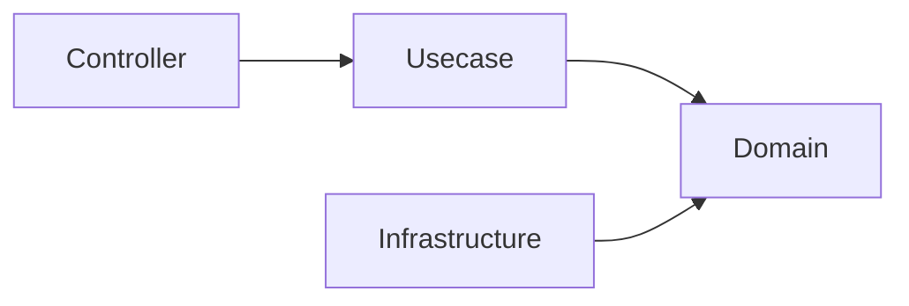
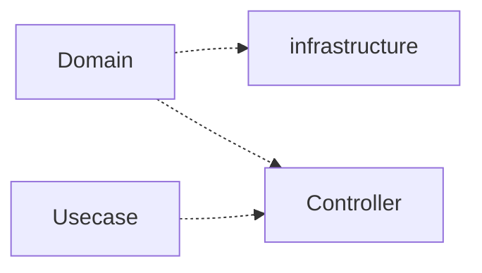
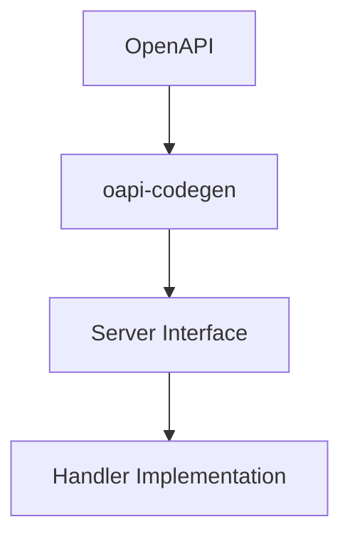
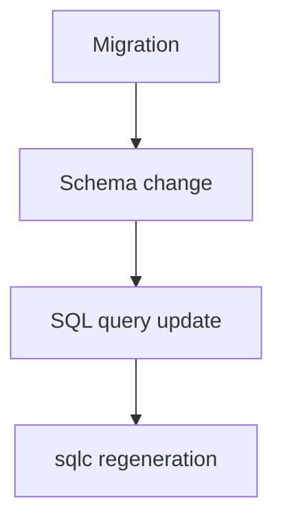

# Architecture Rules

This document defines the **architectural rules that must not be violated** in this project.

These rules must be strictly followed by both **human developers** and **AI agents**.

Violating these rules may compromise the architectural integrity of the system.

## Layer Dependency Rules

> Rationale: [ADR-0002](adr/0002-onion-architecture.md), [ADR-0003](adr/0003-interface-based-decoupling.md); enforced via [ADR-0006](adr/0006-structural-safety-via-tooling.md).

Dependencies must always point **toward the inner layers**.

### Allowed Dependencies



### Forbidden Dependencies



**The domain layer must always be the most independent layer.**

### Rationale

This rule prevents the domain model from depending on frameworks or infrastructure.

These boundaries are **enforced in CI by `golangci-lint` depguard**, not by documentation alone — a forbidden cross-layer import (e.g. `domain` importing `infrastructure`, or `pkg/` importing `internal/`) fails the build.

## Usecase Dependency Rules

> Rationale: [ADR-0002](adr/0002-onion-architecture.md).

Usecase must not directly depend on Infrastructure.

- Dependencies must always go through Boundary (interface)
- Infrastructure implementations are injected via DI

```txt
Usecase → Boundary(interface) → Infrastructure
```

## Generated Code Rules

> Rationale: [ADR-0011](adr/0011-oapi-codegen-strict-server.md), [ADR-0022](adr/0022-sqlc-type-safe-sql.md), [ADR-0023](adr/0023-merged-dml-schema-as-sqlc-input.md); drift gated by [ADR-0077](adr/0077-generated-artifact-drift-gate.md).

Some files are **automatically generated code**.

These files must **never be edited manually**.

### Examples of Generated Code

Examples:

- Server code generated from OpenAPI
- Query bindings generated by sqlc
- Mock generated files

### Rules

Generated code must always be in a state that is **fully reproducible from source definitions**.

If it is necessary to modify generated code,  
**modify the source definitions instead.**

Examples:

|Generated Code|Source|
|---|---|
|OpenAPI server code|OpenAPI specification|
|SQL bindings|SQL query files|
|Mocks|Interface definitions|

## OpenAPI-first

> Rationale: [ADR-0009](adr/0009-openapi-first.md).

Changes to APIs must always start from the **OpenAPI definition**.



### OpenAPI-first Rules

- Do not implement handler before defining the API contract
- Do not manually edit generated API interfaces

OpenAPI definition is the **single source of truth of API**.

## Database Migration

> Rationale: [ADR-0024](adr/0024-append-only-immutable-migrations.md), [ADR-0025](adr/0025-sequential-migration-ids.md).

Changes to the database schema must follow strict migration rules.

### Migration Rules

- Existing migration files must **not be modified**
- Migration is **append-only**
- Schema changes must always start from **migration**

### Typical Flow



This ensures that database history is always reproducible.

## Domain Layer Constraints

> Rationale: [ADR-0002](adr/0002-onion-architecture.md).

The Domain layer must maintain a **pure and independent state**.

The following processing must **not be performed** in the Domain layer.

### Forbidden in Domain

- External I/O
- Database access
- Retrieval of environment variables
- Framework dependencies
- Logging
- HTTP logic

### Allowed in Domain

- Entity
- Value Object
- Domain Service
- Business rules
- Repository interface

## Context Propagation Rules

- `context.Context` must always be propagated to lower layers
- New context must not be created (e.g., `context.Background`)

## Infrastructure Implementation Rules

Infrastructure components have the role of  
**implementing Domain interfaces**.

Rules:

- Do not write domain logic in Infrastructure
- Infrastructure depends on domain interfaces
- Infrastructure can access external systems

Examples:

- database adapter
- external API client
- repository implementation

## Repository / QueryService Rules

> Rationale: [ADR-0027](adr/0027-lightweight-cqrs.md), [ADR-0028](adr/0028-system-cqrs-dml-category.md).

- Repository handles Aggregate persistence and simple reads of a single Aggregate
  (fetch by ID, and simple filter / list / count by the Aggregate's own attributes).
- QueryService handles reads that cross Aggregates or require high query complexity
  (multi-table joins, aggregation, keyword/full-text search, dedicated read models) -- CQRS read side.

Forbidden:

- Writing cross-Aggregate or aggregation/join queries in Repository
- Writing domain logic in QueryService

## DTO / Type Boundary Rules

- Do not pass OpenAPI types to Usecase
- Convert to DTO in Controller
- Domain must not know OpenAPI types

### Boundary Type Conversion

- Convert framework / generated types (e.g. OpenAPI `openapi_types.UUID`) to domain types **only in the layer that owns those types**. For HTTP this is the Controller, via the dedicated helper `internal/controller/conv`. Because other layers must not import generated / framework types, this confines the conversion to the boundary by dependency direction.
- Do **not** add public, validation-bypassing constructors to shared packages (`pkg/`) just to make a boundary conversion convenient. Such bypass entry points erode the intended-use policy over time and get misused across the codebase — reuse the existing validated constructors (`New` / `Parse`).

## Infrastructure Type Leakage Prohibition

- Do not pass sqlc generated types to Usecase / Domain
- Always convert to Domain Entity or DTO

## Layer Responsibility Rules

Each layer has a clear responsibility.

### Controller

Responsibilities:

- HTTP transport
- Request validation
- Error transformation

**Do not write business logic in Controller.**

### Usecase

Responsibilities:

- Application workflow
- Transaction boundary
- Coordination of domain logic

Usecase should **avoid direct dependency on Infrastructure**.

### Transaction Rules

> Rationale: [ADR-0029](adr/0029-transaction-retry-idempotent-callers.md).

- Transactions must be started only in the Usecase layer
- Infrastructure / Repository must not start transactions

## Error Handling Rules

> Rationale: [ADR-0038](adr/0038-apperror-protocol-agnostic-errors.md).

- Never silently swallow an error. Each error must be either handled, wrapped (`apperror` / `xerrors`) and propagated, or — when it represents a **logically unreachable** failure whose occurrence means a broken precondition — surfaced loudly via `panic`.
- Prefer making impossible failures impossible by construction. When a value is already guaranteed valid at a boundary (e.g. an echo-validated path parameter), convert it through a helper that `panic`s on the unreachable error instead of threading a defensive `error` return up the stack. Name such helpers with a `Must`-style / clearly assertive intent, and unit-test the panic path.
- Rationale: a defensive `if err != nil { return err }` on an unreachable path is dead code — untestable, it drags coverage down and hides intent. A `panic` documents the invariant and fails loudly if the precondition is ever violated.
- When attaching an `apperror` sentinel to an underlying error, use `pkg/xerrors`: prefer `Join(sentinel, err)` so the original error's type / stack stay in the chain for `Is` / `As`, over `Wrap(sentinel, err.Error())` which flattens the original to a string. Two caveats bound this: a **redact** rule for errors that may carry secrets (a URL with query / userinfo etc.), and a **load-bearing-flatten** rule — a `Wrap`-flatten can be intentional (it deliberately removes the underlying type from the chain), so before converting an existing normalizer to `Join` check every downstream `Is` / `As` predicate that relies on *not* matching that type (e.g. a tx retry predicate keyed on `*pgconn.PgError` SQLSTATE). See [`pkg/xerrors/README.md`](../pkg/xerrors/README.md) for the full policy.
- To return a dynamic error `code` / `details` in the response, attach `apperror.Meta` at the raising site (`apperror.WithMeta` / `WithDetails`). `Meta` never carries an HTTP status — the status is resolved solely from the sentinel classification — and `Details` must contain public-safe identifiers only (e.g., invalid field names), never reason texts or raw input values; reasons stay in the wrapped error message, which is log-only. Rationale: [ADR-0039](adr/0039-error-metadata-code-message-details.md).

## Comment Rules

- Comments describe **What** and **Why**, never **How**:
  - **What — the contract**: what a declaration does and the meaning of its inputs / outputs / errors. This is what callers rely on.
  - **Why — non-obvious rationale**: the reason behind a decision that the code itself cannot convey (a constraint, an intent, a non-obvious trade-off). Encouraged when genuinely non-obvious.
  - **How is left to the code**: do NOT narrate the step-by-step "how" or the implementation means. If What is stated, the implementation reads from the code.
- A **What must be high quality**, not merely present (`revive` checks only presence / format):
  - **Correct** — it matches the actual behavior. A What that lies about or has drifted from the code is worse than no comment — the highest-priority finding.
  - **Sufficient** — it covers the non-obvious contract: error semantics, nil / zero-value behavior, units, boundaries, side effects. Do not omit what a caller cannot infer.
  - **Substantive** — it adds information beyond the identifier; a pure restatement of the name is low-value. (For a genuinely trivial exported declaration a concise minimal What is acceptable — `revive` mandates the doc comment — so flag only when non-obvious information could and should have been stated.)
- A **Why must be the good kind**:
  - OK (non-obvious rationale / load-bearing constraint): `// upstream がバースト時にレート制限するため 3 回までリトライする`; a magic `runtime.Caller` skip-depth warning ("do not extract this helper — it shifts the skip count").
  - NG (development 経緯 / meta): migration history, incident backstory, "なぜ移行したか", `// テスト容易性のため`, `// 〜の登録は di 層が担う`, and other meta-organizational notes — these rot and belong in the PR / commit log, not the code.
- OK (What): `// ReadFile は name のファイル内容全体を読み込んで返す`
- NG (How / restatement / tautology):
  - `// ReadFile は os.ReadFile を呼び出して…`（implementation means / How）
  - restating the implementation steps; internal-representation notes (`// 内部表現は [16]byte`); tautologies (`// User は User です`)
  - a resolved-but-left-behind `// TODO:` / `// FIXME:` whose condition the code below already satisfies (rot; an unresolved, legitimate TODO is not flagged)
- Enforcement split: `revive`'s `exported` rule guarantees only the **presence** and **`Name`-prefixed format** of comments on exported declarations. This **content** rule (What quality + good Why + no How) is semantic and cannot be linted — it is enforced by review: `local-review` fans out the dedicated `comment-reviewer` agent, which both **validates** good comments (What correct / sufficient / substantive; Why non-obvious) and **flags** bad ones (How / 経緯 / restatement / tautology), then auto-fixes the confirmed findings.
- **Language scope**: this content rule is **language-agnostic** — it applies to Go and non-Go alike (shell, `.mjs` / `.jsx`, Dockerfile, Makefile, SQL, YAML). The Go examples above are illustrative, not a scope limit. Non-Go files are **higher-risk**, not exempt: `revive` covers only Go, so for non-Go the `comment-reviewer` review is the *only* check. Hold non-Go comments to the same standard — How narration, development 経緯, and redundant restatements are NG even in a build script or workflow file; the good Why (non-obvious rationale) and the load-bearing-constraint note stay.

## Documentation Rules

Applies to standalone **documentation prose** — `README*` / `docs/**` / guides — as opposed to source-code comments (see *Comment Rules*). It is a **content** standard, enforced by review (the `doc-reviewer` agent), not by a linter. The transferable principles from *Comment Rules* (accuracy / substance / no rot) apply; the difference is that docs **welcome** What, Why, and How.

- **Accurate** — the prose must match reality: the code, files, commands, flags, and APIs it describes. A doc that has **drifted** from the code (a removed symbol, a renamed file, a changed flag) is the **highest-priority** finding — a confidently wrong doc misleads more than a missing one. Verify claims against the actual code / files, do not trust the prose.
- **Substantive** — inform beyond the obvious; no filler that merely restates a heading or a directory name.
- **No rot** — do not narrate development 経緯 in evergreen docs: migration history, incident backstory, "why we switched from X" belong in release notes (`.github/release/`) / PR / commit log, not a README that must stay true over time.
- **No redundant restatement** — do not duplicate, verbatim, what an adjacent canonical doc or the code already states; **link** instead.
- **What / Why / How are all welcome** — unlike code comments, docs *should* explain **Why** (design intent / rationale — that is what `docs/adr/` and design sections are for) and **How** (usage, tutorials, runnable steps). These are NOT findings.
- Out of scope for this content rule (handled elsewhere): structural drift vs the files on disk (`sync-readme`), and portal manual-worthiness curation (`readme-review`).

## Testing & Definition of Done

> The concrete *how* of writing tests (structure, `正常系` / `異常系` naming, `t.Parallel()`, `require` vs `assert`, no table-driven `for` loops, mock policy, coverage-exception governance) lives in [`testing-conventions.md`](testing-conventions.md). This section defines only the non-negotiable *definition of done*.

- Co-locate tests with each layer's implementation and verify them **per layer** — write that layer's tests and run `make test` (with coverage) before moving on. Do not batch all testing into a final step; deferred tests hide coverage gaps until late.
- A change is "done" only when it is **tested and meets the coverage bar** (new / modified packages > 90%, handlers ~100%), not when it merely compiles. `go build` success is **not** a completion signal.
- "Compiles ≠ done" also applies to wiring: verify the DI graph at **runtime** (the app boots and reaches `[Fx] RUNNING`), not by build / unit tests alone.
- Intentionally unreachable defensive branches (an impossible `switch` default, a `panic` guarding a precondition that cannot fail, a hard-to-force infrastructure error path) are acceptable as uncovered lines — keep them as assertions instead of contorting tests to reach them.
- The test environment assumes `make db-init` has been run: it migrates **and seeds** both the local and test DBs. After `make serve`, run `make db-init` first — a bare `db-*-migrate-up` (no seed) makes DB-backed tests fail.
- Beyond mocked unit / integration tests, smoke-test new endpoints against the live app (`make serve`) with `curl`: mocks do not exercise the real DI graph, DB, or end-to-end wiring. Treat the structured observability logs (`docker compose logs api_server` — per-layer spans + the actual SQL emitted by the logging DB driver) as the durable verification evidence; read them to re-confirm instead of re-running the request.
- Destructive runtime verification (`POST` / `PUT` / `PATCH` / `DELETE` against the dev DB) must be confirmed with the user beforehand when there is no non-destructive alternative; restore afterward with `make db-init`.

## AI Agent Rules

Code generated by AI must also follow all architectural rules.

AI agents must follow:

- Respect layer boundaries
- Follow OpenAPI-first development
- Treat SQL files as contracts
- Do not edit generated code

Before generating code, AI agents must refer to the following documents.

- `architecture.md`
- `development-flow.md`

## Toolchain Execution Rules

> Rationale: [ADR-0068](adr/0068-containerized-pinned-toolchain.md), [ADR-0069](adr/0069-mise-ssot-drift-gate.md).

Tool versions are pinned in `mise.toml` (the single source of truth) and executed in the
containerized tool-runners so they stay reproducible across machines.

- Tool execution — lint / format / codegen / doc generation / commit-message lint / etc. — runs
  through the `make` targets that execute inside the tool-runners (`go_tool_runner` /
  `node_tool_runner` / `python_tool_runner`).
- Automation — git hooks (lefthook), CI steps, and skills — MUST invoke these tools via the
  `make` targets, never by running a tool directly on the host (e.g. `mise exec <tool> -- …` or a
  bare tool binary). Bypassing the container breaks reproducibility and depends on host-local
  tool state.
- The `-ci` targets are the intended bare-metal path (they run the tool directly, for CI runners
  or inside the containers). Host `mise` is only for provisioning versions (`make install-tools`,
  Quick Start). One-off human diagnostics (e.g. checking a version) are not tool execution and
  are exempt.

## Summary

These rules exist to achieve the following.

- Maintain architectural integrity
- Maintainable code structure
- Reproducible builds
- Safe collaboration between humans and AI
