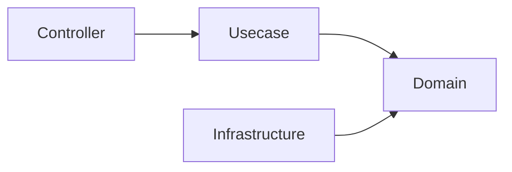
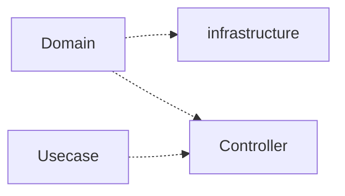
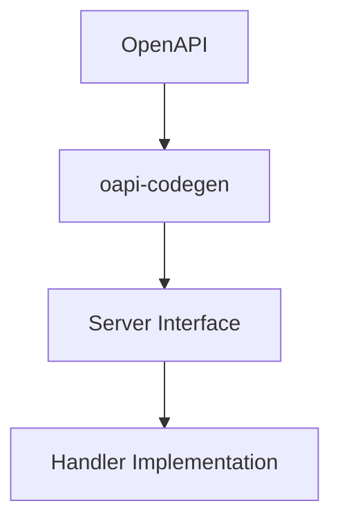
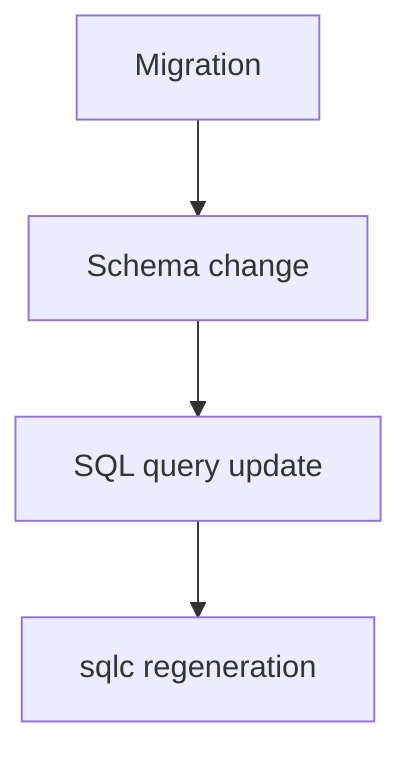

# Architecture Rules

This document defines the **architectural rules that must not be violated** in this project.

These rules must be strictly followed by both **human developers** and **AI agents**.

Violating these rules may compromise the architectural integrity of the system.

## Layer Dependency Rules

Dependencies must always point **toward the inner layers**.

### Allowed Dependencies



### Forbidden Dependencies



**The domain layer must always be the most independent layer.**

### Rationale

This rule prevents the domain model from depending on frameworks or infrastructure.

## Usecase Dependency Rules

Usecase must not directly depend on Infrastructure.

- Dependencies must always go through Boundary (interface)
- Infrastructure implementations are injected via DI

```txt
Usecase → Boundary(interface) → Infrastructure
```

## Generated Code Rules

Some files are **automatically generated code**.

These files must **never be edited manually**.

### Examples of Generated Code

Examples:

- Server code generated from OpenAPI
- Query bindings generated by sqlc
- Mock generated files

### Rules

Generated code must always be in a state that is **fully reproducible from source definitions**.

If it is necessary to modify generated code,  
**modify the source definitions instead.**

Examples:

|Generated Code|Source|
|---|---|
|OpenAPI server code|OpenAPI specification|
|SQL bindings|SQL query files|
|Mocks|Interface definitions|

## OpenAPI-first

Changes to APIs must always start from the **OpenAPI definition**.



### OpenAPI-first Rules

- Do not implement handler before defining the API contract
- Do not manually edit generated API interfaces

OpenAPI definition is the **single source of truth of API**.

## Database Migration

Changes to the database schema must follow strict migration rules.

### Migration Rules

- Existing migration files must **not be modified**
- Migration is **append-only**
- Schema changes must always start from **migration**

### Typical Flow



This ensures that database history is always reproducible.

## Domain Layer Constraints

The Domain layer must maintain a **pure and independent state**.

The following processing must **not be performed** in the Domain layer.

### Forbidden in Domain

- External I/O
- Database access
- Retrieval of environment variables
- Framework dependencies
- Logging
- HTTP logic

### Allowed in Domain

- Entity
- Value Object
- Domain Service
- Business rules
- Repository interface

## Context Propagation Rules

- `context.Context` must always be propagated to lower layers
- New context must not be created (e.g., `context.Background`)

## Infrastructure Implementation Rules

Infrastructure components have the role of  
**implementing Domain interfaces**.

Rules:

- Do not write domain logic in Infrastructure
- Infrastructure depends on domain interfaces
- Infrastructure can access external systems

Examples:

- database adapter
- external API client
- repository implementation

## Repository / QueryService Rules

- Repository handles Aggregate persistence and simple reads of a single Aggregate
  (fetch by ID, and simple filter / list / count by the Aggregate's own attributes).
- QueryService handles reads that cross Aggregates or require high query complexity
  (multi-table joins, aggregation, keyword/full-text search, dedicated read models) -- CQRS read side.

Forbidden:

- Writing cross-Aggregate or aggregation/join queries in Repository
- Writing domain logic in QueryService

## DTO / Type Boundary Rules

- Do not pass OpenAPI types to Usecase
- Convert to DTO in Controller
- Domain must not know OpenAPI types

### Boundary Type Conversion

- Convert framework / generated types (e.g. OpenAPI `openapi_types.UUID`) to domain types **only in the layer that owns those types**. For HTTP this is the Controller, via the dedicated helper `internal/controller/conv`. Because other layers must not import generated / framework types, this confines the conversion to the boundary by dependency direction.
- Do **not** add public, validation-bypassing constructors to shared packages (`pkg/`) just to make a boundary conversion convenient. Such bypass entry points erode the intended-use policy over time and get misused across the codebase — reuse the existing validated constructors (`New` / `Parse`).

## Infrastructure Type Leakage Prohibition

- Do not pass sqlc generated types to Usecase / Domain
- Always convert to Domain Entity or DTO

## Layer Responsibility Rules

Each layer has a clear responsibility.

### Controller

Responsibilities:

- HTTP transport
- Request validation
- Error transformation

**Do not write business logic in Controller.**

### Usecase

Responsibilities:

- Application workflow
- Transaction boundary
- Coordination of domain logic

Usecase should **avoid direct dependency on Infrastructure**.

### Transaction Rules

- Transactions must be started only in the Usecase layer
- Infrastructure / Repository must not start transactions

## Error Handling Rules

- Never silently swallow an error. Each error must be either handled, wrapped (`apperror` / `xerrors`) and propagated, or — when it represents a **logically unreachable** failure whose occurrence means a broken precondition — surfaced loudly via `panic`.
- Prefer making impossible failures impossible by construction. When a value is already guaranteed valid at a boundary (e.g. an echo-validated path parameter), convert it through a helper that `panic`s on the unreachable error instead of threading a defensive `error` return up the stack. Name such helpers with a `Must`-style / clearly assertive intent, and unit-test the panic path.
- Rationale: a defensive `if err != nil { return err }` on an unreachable path is dead code — untestable, it drags coverage down and hides intent. A `panic` documents the invariant and fails loudly if the precondition is ever violated.

## Comment Rules

- Comments describe **behavior — the contract**: what a declaration does, and the meaning of its inputs / outputs. They must NOT narrate **internal processing**: the step-by-step "how", the implementation means, or the design rationale. If the behavior is stated, the implementation can be read from the code.
- OK (behavior): `// ReadFile は name のファイル内容全体を読み込んで返す`
- NG (internal processing / rationale):
  - `// ReadFile は os.ReadFile を呼び出して…`（implementation means）
  - `// 〜の登録は di 層が担う` / `// テスト容易性のため…`（design rationale）
  - restating the implementation steps; tautologies (`// User は User です`)
- **Exception**: a *load-bearing* constraint warning that the code itself cannot convey (e.g. a magic `runtime.Caller` skip depth, or "do not extract this helper — it shifts the skip count") may remain even though it is not strictly "behavior". It prevents a real bug.
- Enforcement split: `revive`'s `exported` rule guarantees only the **presence** and **`Name`-prefixed format** of comments on exported declarations. This **behavior-only content** rule is semantic and cannot be linted — it is enforced by review (`local-review`'s `comment-style` lens).
- **Language scope**: this content rule is **language-agnostic** — it applies to Go and non-Go alike (shell, `.mjs` / `.jsx`, Dockerfile, Makefile, SQL, YAML). The Go examples above are illustrative, not a scope limit. Non-Go files are **higher-risk**, not exempt: `revive` covers only Go, so for non-Go the `comment-style` review is the *only* check. Hold non-Go comments to the same standard — design rationale / 経緯 narration and redundant restatements are NG even in a build script or workflow file, with the same load-bearing-constraint exception.

## Testing & Definition of Done

- Co-locate tests with each layer's implementation and verify them **per layer** — write that layer's tests and run `make test` (with coverage) before moving on. Do not batch all testing into a final step; deferred tests hide coverage gaps until late.
- A change is "done" only when it is **tested and meets the coverage bar** (new / modified packages > 90%, handlers ~100%), not when it merely compiles. `go build` success is **not** a completion signal.
- "Compiles ≠ done" also applies to wiring: verify the DI graph at **runtime** (the app boots and reaches `[Fx] RUNNING`), not by build / unit tests alone.
- Intentionally unreachable defensive branches (an impossible `switch` default, a `panic` guarding a precondition that cannot fail, a hard-to-force infrastructure error path) are acceptable as uncovered lines — keep them as assertions instead of contorting tests to reach them.
- The test environment assumes `make db-init` has been run: it migrates **and seeds** both the local and test DBs. After `make serve`, run `make db-init` first — a bare `db-*-migrate-up` (no seed) makes DB-backed tests fail.
- Beyond mocked unit / integration tests, smoke-test new endpoints against the live app (`make serve`) with `curl`: mocks do not exercise the real DI graph, DB, or end-to-end wiring. Treat the structured observability logs (`docker compose logs api_server` — per-layer spans + the actual SQL emitted by the logging DB driver) as the durable verification evidence; read them to re-confirm instead of re-running the request.
- Destructive runtime verification (`POST` / `PUT` / `PATCH` / `DELETE` against the dev DB) must be confirmed with the user beforehand when there is no non-destructive alternative; restore afterward with `make db-init`.

## AI Agent Rules

Code generated by AI must also follow all architectural rules.

AI agents must follow:

- Respect layer boundaries
- Follow OpenAPI-first development
- Treat SQL files as contracts
- Do not edit generated code

Before generating code, AI agents must refer to the following documents.

- `architecture.md`
- `development-flow.md`

## Summary

These rules exist to achieve the following.

- Maintain architectural integrity
- Maintainable code structure
- Reproducible builds
- Safe collaboration between humans and AI
