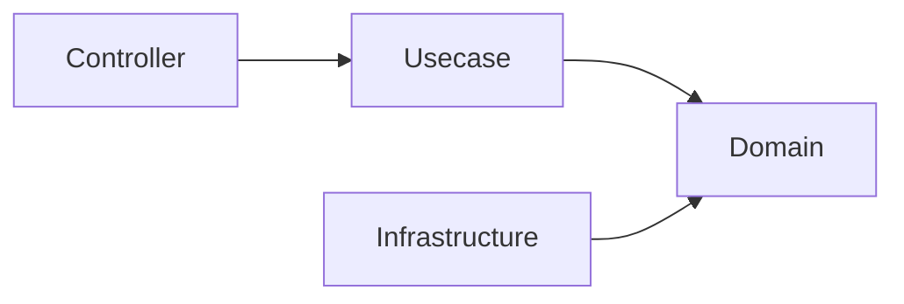
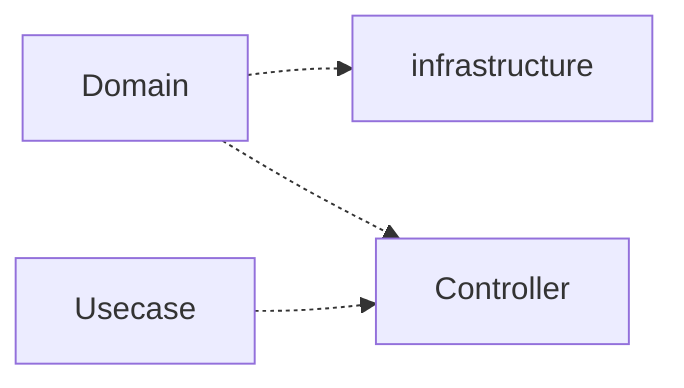
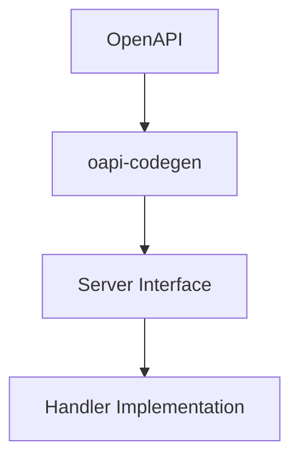
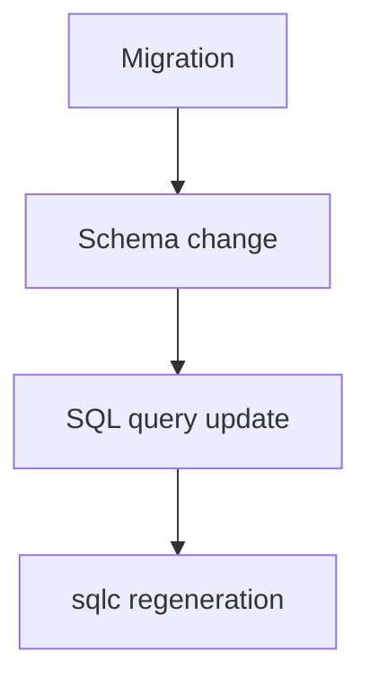

# Architecture Rules

This document defines the **architectural rules that must not be violated** in this project.

These rules must be strictly followed by both **human developers** and **AI agents**.

Violating these rules may compromise the architectural integrity of the system.

## Layer Dependency Rules

> Rationale: [ADR-0002 (onion-architecture)](adr/0002-onion-architecture.md), [ADR-0003 (interface-based-decoupling)](adr/0003-interface-based-decoupling.md); enforced via [ADR-0006 (structural-safety-via-tooling)](adr/0006-structural-safety-via-tooling.md).

Dependencies must always point **toward the inner layers**.

### Allowed Dependencies



### Forbidden Dependencies



**The domain layer must always be the most independent layer.**

### Domain lexicon

A domain package must **not** import another aggregate (`internal/domain/` is denied by depguard).
Business-semantic value objects used by more than one aggregate, which cannot live in `pkg/` because
`pkg/` forbids business logic, live in the **domain lexicon**
[`internal/domain/lexicon`](../internal/domain/lexicon/README.md), which every domain package may
import (depguard allows `internal/domain/lexicon`).

Placement is resolved **`pkg/` first** — its bar is machine-enforced, the lexicon's is prose, and a
prose bar cannot push a type across a boundary a linter draws. Failing `pkg/` is not an argument for
the lexicon; a type that clears neither stays in its aggregate. Admission is deliberately narrow
(value object, used by ≥2 aggregates, business-semantic, jointly owned — see its README), and the
name states the question asked at the door: is this a word of the business?
Rationale: [ADR-0036 (domain-lexicon)](adr/0036-domain-lexicon.md).

### Domain services

The lexicon is not the only path allowed to cross inside the domain. A rule that is the responsibility
of no entity and no value object lives under **`internal/domain/service/<name>/`**, and that path has
a depguard rule of its own which permits importing aggregates. The permission is one edge wide: every
other domain deny (framework, infrastructure, usecase, controller, file system, process, environment)
is repeated verbatim in that rule, and a service there holds no I/O — no Repository, no
`context.Context`. It receives state the Usecase has already loaded, and returns a derived value or a
domain error.

**Admission turns on responsibility, never on how many aggregates the rule reaches.** Spanning
aggregates is one way an operation comes to belong to no entity, not what makes it one: a question
asked about a *set* of entities drawn from a single aggregate has no entity to be a method on either.
Both kinds live at the same path, so the placement question is asked once and answered once.

The two exceptions answer different questions and are not interchangeable. The lexicon admits a
**value object** that several aggregates speak in; a domain service holds a **rule** that no entity
can own. A rule that fits on one entity goes on that entity, and reading two aggregates merely to
place them side by side is mapping, which stays in Usecase. The admission bar and the current
occupants are in [`internal/domain/README.md`](../internal/domain/README.md) § Where a Domain Service
lives.

### Rationale

This rule prevents the domain model from depending on frameworks or infrastructure.

These boundaries are **enforced in CI by `golangci-lint` depguard**, not by documentation alone — a forbidden cross-layer import (e.g. `domain` importing `infrastructure`, or `pkg/` importing `internal/`) fails the build.

## Usecase Dependency Rules

> Rationale: [ADR-0002 (onion-architecture)](adr/0002-onion-architecture.md).

Usecase must not directly depend on Infrastructure.

- Dependencies must always go through Boundary (interface)
- Infrastructure implementations are injected via DI

```txt
Usecase → Boundary(interface) → Infrastructure
```

## Generated Code Rules

> Rationale: [ADR-0013 (oapi-codegen-strict-server)](adr/0013-oapi-codegen-strict-server.md), [ADR-0024 (sqlc-type-safe-sql)](adr/0024-sqlc-type-safe-sql.md), [ADR-0025 (merged-dml-schema-as-sqlc-input)](adr/0025-merged-dml-schema-as-sqlc-input.md); drift gated by [ADR-0085 (generated-artifact-drift-gate)](adr/0085-generated-artifact-drift-gate.md).

Some files are **automatically generated code**.

These files must **never be edited manually**.

### Examples of Generated Code

Examples:

- Server code generated from OpenAPI
- Query bindings generated by sqlc
- Mock generated files

### Rules

Generated code must always be in a state that is **fully reproducible from source definitions**.

If it is necessary to modify generated code,  
**modify the source definitions instead.**

Examples:

|Generated Code|Source|
|---|---|
|OpenAPI server code|OpenAPI specification|
|SQL bindings|SQL query files|
|Mocks|Interface definitions|

## OpenAPI-first

> Rationale: [ADR-0011 (openapi-first)](adr/0011-openapi-first.md).

Changes to APIs must always start from the **OpenAPI definition**.



### OpenAPI-first Rules

- Do not implement handler before defining the API contract
- Do not manually edit generated API interfaces
- Every route registered on Echo must correspond 1:1 to an operation in the spec, with no allowlist for exceptions — machine-verified by `TestRouteSpecParity` in `internal/architest`. Parts of the HTTP stack resolve behavior from the spec, so a route the spec does not declare changes behavior at runtime while the tests stay green. See [the handler guide](../internal/controller/handler/README.md#every-route-must-exist-in-openapi) for what this means when writing a handler.
- Every handler package that declares a `BindHandler` must be listed in the `fx.Invoke` of `ControllerModule()`, and every package with generated `RegisterHandlers` must have a `BindHandler` implementing it — machine-verified by `TestBindHandlerDIParity` in `internal/architest`. `TestRouteSpecParity` reads the generated route registrations, which `make gen-api` produces from the spec whether or not the handler is wired into DI, so without this check a missing wiring answers 404 at runtime while the tests stay green.

OpenAPI definition is the **single source of truth of API**.

## Database Migration

> Rationale: [ADR-0026 (append-only-immutable-migrations)](adr/0026-append-only-immutable-migrations.md), [ADR-0027 (sequential-migration-ids)](adr/0027-sequential-migration-ids.md).

Changes to the database schema must follow strict migration rules.

### Migration Rules

- Existing migration files must **not be modified**
- Migration is **append-only**
- Schema changes must always start from **migration**

### Typical Flow



This ensures that database history is always reproducible.

## Domain Layer Constraints

> Rationale: [ADR-0002 (onion-architecture)](adr/0002-onion-architecture.md).

The Domain layer must maintain a **pure and independent state**.

The following processing must **not be performed** in the Domain layer.

### Forbidden in Domain

- External I/O
- Database access
- Retrieval of environment variables
- Framework dependencies
- Logging
- HTTP logic

### Allowed in Domain

- Entity
- Value Object
- Domain Service
- Business rules
- Repository interface

The two lists above govern what the domain may *contain*. The domain must equally not be *missing*
what it owns: **a condition that carries a name in the business vocabulary must exist in the domain
as a predicate.** SQL, handlers and jobs may *execute* such a condition; none of them may *author*
it. A condition qualifies when someone who knows the business would recognise it as a statement
about the business — not merely because it appears in a filter. Identity lookup, pagination,
ordering, and foreign-key joins are mechanism and are out of scope. See
[`internal/domain/README.md`](../internal/domain/README.md) § Query and Aggregate for the
discriminator and the reasoning.

## Context Propagation Rules

- `context.Context` must always be propagated to lower layers
- New context must not be created (e.g., `context.Background`)

## Infrastructure Implementation Rules

Infrastructure components have the role of  
**implementing Domain interfaces**.

Rules:

- Do not write domain logic in Infrastructure
- Infrastructure depends on domain interfaces
- Infrastructure can access external systems

Examples:

- database adapter
- external API client
- repository implementation

## Repository / QueryService Rules

> Criterion: [`docs/design/data-access-pattern.md`](design/data-access-pattern.md) — which construct a
> given operation belongs to, and why. Decisions:
> [ADR-0029 (lightweight-cqrs)](adr/0029-lightweight-cqrs.md),
> [ADR-0030 (system-cqrs-dml-category)](adr/0030-system-cqrs-dml-category.md),
> [ADR-0031 (commandservice-atomicity-criterion)](adr/0031-commandservice-atomicity-criterion.md).

Repository is the default for both reads and writes. QueryService and CommandService are the residue
that remains where a non-functional requirement forbids decomposing an operation into per-aggregate
work; `system_cqrs` sits outside the split entirely. **Do not restate the criterion here, in an ADR, or
in a package README** — every copy drifts, and the copy nobody re-reads is the one that goes stale.
Link to the criterion document instead.

Forbidden:

- Writing join / aggregation queries across *independent* Aggregates in Repository — **exempt**: a
  uniquely-determined JOIN to a context-nested reference master
- Writing domain logic in QueryService
- Placing a write on CommandService that can be expressed as loading an Aggregate, mutating it, and
  saving it
- Enforcing a condition in CommandService that is not derived from a domain invariant
- Placing an infrastructure-operational query (health verification, idempotency, outbox delivery) in
  `repository/`, which keeps a 1:1 correspondence with domain Aggregates
- Authoring a named business condition in a query — the `WHERE` clause is that condition's
  *execution*, not its definition (see [Domain Layer Constraints](#domain-layer-constraints))

## DTO / Type Boundary Rules

- Do not pass OpenAPI types to Usecase
- Convert to DTO in Controller
- Domain must not know OpenAPI types

### Boundary Type Conversion

- Convert framework / generated types (e.g. OpenAPI `openapi_types.UUID`) to domain types **only in the layer that owns those types**. For HTTP this is the Controller, via the dedicated helper `internal/controller/conv`. Because other layers must not import generated / framework types, this confines the conversion to the boundary by dependency direction.
- Do **not** add public, validation-bypassing constructors to shared packages (`pkg/`) just to make a boundary conversion convenient. Such bypass entry points erode the intended-use policy over time and get misused across the codebase — reuse the existing validated constructors (`New` / `Parse`).

## Infrastructure Type Leakage Prohibition

- Do not pass sqlc generated types to Usecase / Domain
- Always convert to Domain Entity or DTO

## Function Signature Rules

Layer-independent: this applies to constructors, behavior methods, usecase functions, and helpers alike.

A function taking **two or more parameters of the same type** lets a call site swap them with no compile
or lint error. Bundle those parameters into a value struct so every call site states which one each value
is. This does not hand the check to the compiler — a same-typed field filled with the wrong value still
compiles — but it removes the position-dependent binding that let adjacent same-typed arguments
transpose, so what remains is a named mistake visible in review rather than an invisible ordering one.
Keep call sites keyed: an unkeyed composite literal reintroduces the ordering dependency this removes.

**When it applies.** The trigger is two or more parameters of one type in a single signature; compare the
resolved types, since two distinct named types are distinct even when both wrap a string. Beyond the
trigger, weigh how likely a swap is to survive undetected:

- **Optional / pointer parameters** — `nil` is valid for either, so nothing at runtime rejects the swap.
- **Free-form values** — no validation would reject the other parameter's value.
- **A caller that maps positionally** — a Repository rebuilding an entity from a DB row, a seed, or any
  code that fills arguments in column order rather than by meaning.
- **Adjacent parameters** — neighbours are easier to transpose than distant ones.

**When it does not apply.**

- **Every parameter has a distinct type.** The compiler already rejects a swap, so keep the positional
  form. This is the common case, and bundling by reflex is not the rule.
- **A swap cannot survive construction.** The invariants reject the transposed values, so the mistake
  fails fast instead of propagating.
- **The signature is merely long.** Parameter count alone is not the criterion.

**Choosing the remedy.** Give the parameters distinct types (a VO each) when the value deserves an
invariant of its own — that removes the swap risk as a side effect. Bundle into a struct when a VO would
add no invariant and the value really is a plain primitive. Either way, lock the mapping with a test that
passes **distinct** values for the same-typed parameters and asserts each one — including at the
persistence boundary, where field names still allow a wrong assignment.

Per-layer application: `internal/domain/README.md` (attribute structs on entities),
`internal/usecase/README.md` (Params DTO structs on usecase inputs).

## Package / Directory Naming Rules

- Go package identifiers are a single lowercase word with **no underscores** (staticcheck ST1003).
- A multi-word aggregate uses one of two forms:
  - **Context nesting** — when a bounded context groups several sub-aggregates / masters, nest
    under the context directory: `internal/<layer>/<context>/<sub>/` with package `<sub>`
    (e.g. `internal/domain/product/category` → package `category`,
    `internal/domain/product/status` → package `status`).
  - **Concatenation** — a standalone multi-word aggregate with no grouping context concatenates
    into one word (e.g. `useridentity`, `exchangerate`). Existing concatenated packages stay
    as-is; prefer context nesting once a context gains a second sub-aggregate.
- Database DML and sqlc-generated directories use **snake_case matching the table name**
  (`product_category`, `user_identity`), independent of the Go package layout.
- Controller handler directories match the **HTTP resource (route) name**, not the Go package
  layout.
  <!-- 撤去後にこの箇所へ自分の例を置くための指針。
       目的: ルート名と Go パッケージ名がずれる実例が無いと、規則が空文に見える。
       意義: ずれる典型は複数形とハイフンで、Go 側の単数・アンダースコアと形が違う点にある。
       書き方: 実在するルートを 1〜2 個、バッククォートで挙げる。 -->
  <!-- sample-api:begin -->
  例: `product-categories` / `prefectures`。
  <!-- sample-api:end -->
- Type names may keep the aggregate noun inside a same-named package
  (`category.Category`, `prefecture.Prefecture`).

## Layer Responsibility Rules

Each layer has a clear responsibility.

### Controller

Responsibilities:

- HTTP transport
- Request validation
- Error transformation

**Do not write business logic in Controller.**

### Usecase

Responsibilities:

- Application workflow
- Transaction boundary
- Coordination of domain logic

Usecase should **avoid direct dependency on Infrastructure**.

### Transaction Rules

> Rationale: [ADR-0032 (transaction-retry-idempotent-callers)](adr/0032-transaction-retry-idempotent-callers.md).

- Transactions must be started only in the Usecase layer
- Infrastructure / Repository must not start transactions

## Error Handling Rules

> Rationale: [ADR-0044 (apperror-protocol-agnostic-errors)](adr/0044-apperror-protocol-agnostic-errors.md).

- Never silently swallow an error. Each error must be either handled, wrapped (`apperror` / `xerrors`) and propagated, or — when it represents a **logically unreachable** failure whose occurrence means a broken precondition — surfaced loudly via `panic`.
- Prefer making impossible failures impossible by construction. When a value is already guaranteed valid at a boundary (e.g. an echo-validated path parameter), convert it through a helper that `panic`s on the unreachable error instead of threading a defensive `error` return up the stack. Name such helpers with a `Must`-style / clearly assertive intent, and unit-test the panic path.
- Rationale: a defensive `if err != nil { return err }` on an unreachable path is dead code — untestable, it drags coverage down and hides intent. A `panic` documents the invariant and fails loudly if the precondition is ever violated.
- **Never return a `xerrors.New(...)` built inside a function body.** Declare the error as a package-level sentinel (`var errXxx = xerrors.New("...")`) and attach the dynamic context with `xerrors.Wrap(errXxx, ctx)`. An error created in place is unreachable to `errors.Is`, so callers cannot branch on it and tests are forced onto message-string matching — a one-word wording change then breaks the test, and a different error passes it. Enforced mechanically by `internal/architest` (`TestNoInlineXerrorsNew`); there is no allowlist. `_test.go` is out of scope — building an ad-hoc error to inject is a legitimate use there.
- When attaching an `apperror` sentinel to an underlying error, use `pkg/xerrors`: prefer `Join(sentinel, err)` so the original error's type / stack stay in the chain for `Is` / `As`, over `Wrap(sentinel, err.Error())` which flattens the original to a string. Two caveats bound this: a **redact** rule for errors that may carry secrets (a URL with query / userinfo etc.), and a **load-bearing-flatten** rule — a `Wrap`-flatten can be intentional (it deliberately removes the underlying type from the chain), so before converting an existing normalizer to `Join` check every downstream `Is` / `As` predicate that relies on *not* matching that type (e.g. a tx retry predicate keyed on `*pgconn.PgError` SQLSTATE). See [`pkg/xerrors/README.md`](../pkg/xerrors/README.md) for the full policy.
- To return a dynamic error `code` / `details` in the response, attach `apperror.Meta` at the raising site (`apperror.WithMeta` / `WithDetails`). `Meta` never carries an HTTP status — the status is resolved solely from the sentinel classification — and `Details` must contain public-safe identifiers only (e.g., invalid field names), never reason texts or raw input values; reasons stay in the wrapped error message, which is log-only. Rationale: [ADR-0045 (error-metadata-code-message-details)](adr/0045-error-metadata-code-message-details.md).
- Returning `details` to the client is **opt-in per endpoint and fail-closed**: an error response only carries `details` if the operation declares the `ErrorResponseWithDetails` schema in OpenAPI (the single opt-in switch). The `errorhandler` drops `details` from the wire for any operation that has not opted in — attaching `Meta` details is not enough. Logs keep the full `details`. Rationale: [ADR-0046 (error-details-opt-in-gate)](adr/0046-error-details-opt-in-gate.md).

## Comment Rules

The authority for comments is the **godoc conventions** — the de-facto Go standard — not a
bespoke taxonomy. A condensed local mirror lives at
`docs/maintenance/godoc-comment-conventions.md` (read it instead of fetching the large
upstream <https://go.dev/doc/comment>).

- **Doc comments (exported declarations & package docs) follow the godoc conventions.** godoc renders doc comments for the **API consumer**, so a doc comment states the **caller-facing contract** — what the declaration does and the meaning of its inputs / outputs / errors — as a complete, `Name`-prefixed sentence. That contract is the necessary-and-sufficient content: write it, and no more.
- **Anything godoc does not call for is noise** — it does not serve the consumer, so leave it out:
  - **How / implementation means** — the code conveys it. NG `// ReadFile は os.ReadFile を呼び出して…`; OK `// ReadFile は name のファイル内容全体を読み込んで返す`.
  - **Where it is called from** — call-site / registration notes coupled to organization: `// 〜の登録は di 層が担う`.
  - **Change history / development 経緯** — migration history, incident backstory, "なぜ移行したか", `// テスト容易性のため` — these rot and belong in the PR / commit log.
  - **Restatement / tautology** — `// 内部表現は [16]byte`, `// User は User です`; or a resolved-but-left-behind `// TODO:` / `// FIXME:` whose condition the code below already satisfies (an unresolved, legitimate TODO is not flagged).
- **Volume is itself a cost.** A comment is re-read every time the code is, so length raises cognitive load even when each line is individually defensible. State the contract in as few words as it takes and stop. Two habits produce most of the bloat: spelling out a **repo-wide rationale** at every declaration that follows it (state it once here and let the code stay silent — link, do not repeat), and **narrating the mechanism** of a language feature the reader already knows. A comment the reader must work through to reach a fact the signature already gave them is a net loss.
- **A change earns its comments; it does not arrive with them.** The default for any edit is **zero new comment lines**, and editing an existing declaration must not raise its comment count. Adding one requires that the edit *itself* introduced something the reader cannot get otherwise: a constraint whose premise sits at this call site, a deliberate departure from the codebase's idiom, or a contract detail the signature cannot carry. Absent a trigger, the change is complete without a comment. This has to be a **default rather than advice**, because inside a single edit every incentive points one way — the cost of an added comment is global and invisible from the diff, while the cost of an omitted one is local and visible — so each comment judged on its own merits resolves toward keeping, and the total grows without any individual judgment being wrong. The operative test: **is the comment justifiable to a reader who never saw the edit?** One written *about the change* (what it used to do, why it was adjusted, what the author weighed) fails immediately — the reader sees only the result, never the diff. Note that this is not caution: a warning works **because its neighbours are silent**, so a file where every declaration carries four lines can no longer show which one is load-bearing. Uniform explicitness does not add safety, it spends the only mechanism that conveys it.
- **Idiomatic code needs no explanation.** The routine surface of building an API — an entity constructor, a Params / attribute struct, a Repository's row-to-entity conversion, a handler's bind → usecase → response, a table of validated fields — is conventional, and a reader fluent in this codebase already knows what it is for. Comment only what **departs** from the convention, or what the convention cannot express. This is **suppression, not elimination**: an exported declaration still carries its `Name`-prefixed contract, and a constraint whose premise sits there still stays. Conversely, the further code sits from the idiom (a workaround, a deliberate deviation, a constraint imposed from outside), the more a comment earns its space.
- **Correct outranks everything.** A doc comment that lies about or has drifted from the actual behavior is worse than no comment — the highest-priority finding.
- **What the code keeps is a constraint, not a rationale.** This is the one addition godoc does not mandate and this repo keeps — but the admission test is **not** whether the reason is non-obvious. It nearly always is, so that test admits everything and decides nothing (the jurisdiction bullet below says the same). The test is whether **the premise sits at this call site**: could someone make this statement false without editing this declaration? If they could not, the comment cannot go stale unseen, and it earns its place — a `runtime.Caller` skip-depth warning ("do not extract this helper — it shifts the skip count"), "these two calls must not be reordered", "this adds to the existing value, so calling it twice accumulates". If they could — the premise is an upstream service's behavior, an operational policy, a business rule — then nobody can verify the comment and nothing will flag it when it turns false; route it by the jurisdiction bullet below, or leave it out. Write what the next editor must not violate, not why someone once decided it.
- **Never invent a Why.** Whatever passes the gates above must also be **verifiable** — derivable from the code, a design document, or the configuration. This is the same property from another angle: a premise that sits at the call site is one a reader can check, which is why the co-located constraint is the form that survives. A rationale you cannot establish is a guess, and a plausible guess is worse than silence: a comment reads as authoritative, so a wrong Why misleads every later reader and survives longer than the code it explains. When a defensive branch or a magic value looks like it needs a reason you cannot pin down, leave the comment out and raise the gap in review instead of writing something that sounds right. Restating only the part you can verify is not a fix either — that lands back on **restatement**.
- **A Why has a jurisdiction, and the code is not always it.** Deciding a Why is worth keeping is a separate question from deciding it belongs *here*. godoc's surface is the **API consumer's** contract, not a venue for arguing a design decision — so the rationale for a **rejected alternative**, a **threat-model analysis**, or an **architecture-wide policy** is owned by `docs/adr/` / `docs/design/**` / the package README, and the code keeps only the **operative residue**: the one or two sentences someone editing *this* declaration must not violate, plus a link to the owning document. Getting this wrong fails twice over — design prose parked in a comment is invisible from the document that owns the decision, so it drifts unnoticed, and every caller reading for the contract must first read past the argument. The deciding test is therefore **not** "is this Why non-obvious?" (it usually is, which is why volume alone never wins the argument) but: **if someone reversed this decision, which document would they be obliged to update?** Write it there and link to it. When the honest answer is "no document — the constraint exists only at this call site" (a `runtime.Caller` skip depth, a workaround for an upstream bug), the code **is** the jurisdiction and the comment stays in full.
- **Relocating is not dumping — each destination has an entry bar, and the code is a legitimate destination.** Moving prose out of a comment only helps if it lands where that *kind* of knowledge is owned; a document that accepts everything answers nothing. Two misroutes are worth naming because both look like "design rationale" from inside a comment: **a library's or an API's specific behavior** (this driver returns X on Y, this SDK reads that env var) is not a decision among alternatives — it is a property of the thing being called, it changes when the dependency is upgraded, and its home is the comment at the call site; and **business / domain knowledge** (what a rule means, why a status transitions this way) belongs to `docs/spec/**`, which is where the behavior is specified and kept current. `docs/adr/` takes only a **choice among alternatives with lasting consequences** or a deliberate exclusion — see the *What belongs here* table in [`docs/adr/README.md`](adr/README.md), which governs. If a candidate fits none of the destinations, that is evidence the code was the right place all along; keep it there rather than forcing a home.
- **In-function comments are outside godoc's purview, but not outside this gate.** They are admitted on the same triggers as any other added comment (*A change earns its comments*) and by the same premise test — in practice almost always a constraint whose premise sits right there. There is one gate, stated once above; this bullet adds no separate bar of its own. The noise list applies unchanged.
- **Language scope**: godoc governs Go only, but this content standard is **language-agnostic** — it applies to non-Go alike (shell, `.mjs` / `.jsx`, Dockerfile, Makefile, SQL, YAML). Non-Go is **higher-risk**, not exempt: `revive` covers only Go, so for non-Go the `comment-reviewer` review is the *only* check. Hold non-Go comments to the same bar — no How narration, no 経緯, no restatement; a constraint whose premise sits at that site stays.
- **Enforcement split**: `revive`'s `exported` rule guarantees only the **presence** and **`Name`-prefixed format** of doc comments on exported declarations. This **content** rule (godoc-conformant contract + co-located constraint + no noise) is semantic and cannot be linted — it is enforced by review: `impl-review` fans out the dedicated `comment-reviewer` agent, which both **validates** good comments and **flags** noise, then auto-fixes the confirmed findings. That gate is **diff-scoped**, so it never re-examines what is already in the tree — an inflow check with no outflow. The accumulated stock is swept separately by the `comment-sweep` skill, which applies the jurisdiction test above over a package / layer / repo scope and relocates content a document owns.

## Documentation Rules

Applies to standalone **documentation prose** — `README*` / `docs/**` / guides — as opposed to source-code comments (see *Comment Rules*). It is a **content** standard, enforced by review (the `doc-reviewer` agent), not by a linter. The transferable principles from *Comment Rules* (accuracy / substance / no rot) apply; the difference is that docs **welcome** What, Why, and How.

- **Accurate** — the prose must match reality: the code, files, commands, flags, and APIs it describes. A doc that has **drifted** from the code (a removed symbol, a renamed file, a changed flag) is the **highest-priority** finding — a confidently wrong doc misleads more than a missing one. Verify claims against the actual code / files, do not trust the prose.
- **Which side is the error depends on what the document does.** A doc that *describes* — a package README, a command reference, a guide — is corrected to match the code. A doc that *governs* — `docs/rules.md`, `docs/architecture.md`, `docs/adr/**` — is not: it states the intent the code is meant to satisfy, so a disagreement is as likely to be a defect in the code. Report the disagreement; changing a governing document to match what was built is a decision for this repository's architect or tech lead, not a drift fix.
- **`docs/design/**` splits by statement, not by file.** A design document carries both kinds at once: the **mechanism it defines** — a protocol, a state machine, a placement criterion — *governs*, so a disagreement with the code is reported, not fixed; the **particulars it cites** — a symbol name, a default value, a step order, a line reference — *describe*, so drift there is corrected. Classifying by filename is what lets a governing criterion sit on the describing side and get quietly rewritten to match whatever was built.
- **Substantive** — inform beyond the obvious; no filler that merely restates a heading or a directory name.
- **No rot** — do not narrate development 経緯 in evergreen docs: migration history, incident backstory, "why we switched from X" belong in release notes (`.github/release/`) / PR / commit log, not a README that must stay true over time.
- **No premise the document will outlive** — the mirror image of *No rot*: rot is a past that stopped mattering, this is a present that will stop holding. Do not rest a statement in an evergreen document on a premise that is scheduled to lapse — the repository's current positioning, its distribution form, the lifecycle stage it is in ("we are still in PoC", "the demo data is present"). Such a statement is correct when written and no later review catches it, because the document never changes — reality does. Keep the **general form** of the rule in the evergreen document, and put the premise-bound part where the premise dies: a document that is discarded or rewritten at the moment it lapses. **Collect those parts into one document rather than marking them where they stand** — a region cut out of prose leaves the text on either side to be repaired, and every later edit near the cut is a fresh chance to break it unnoticed. Cross-references into that document must each be a single self-contained line, removable on its own.
- **No redundant restatement** — do not duplicate, verbatim, what an adjacent canonical doc or the code already states; **link** instead.
- **Durable knowledge, not activity logs** — return a finding that changes a describing document to
  its owning README or `docs/` reference. Do not accumulate per-run progress as repository state;
  its skill-owned `tmp/` artifact is the only appropriate resume state. A conflict with a governing
  document is raised, not rewritten. Rationale: [ADR-0009 (long-running-agent-state)](adr/0009-long-running-agent-state.md).
- **A README does not inventory what is on disk.** What is there, the editor shows. A file tree or a
  per-directory list restates it and then rots — this repository has repeatedly carried trees missing
  real directories, and ones naming directories that do not exist. Reformatting a tree into a bullet
  list changes nothing: it is still an inventory, and it goes stale for the same reason. Write only
  what the name cannot carry:
  - **A closed, designed set** — its members and why the set is drawn that way. `database/dml/` has
    exactly four categories because the design says so, and adding a fifth is a decision that should
    move this text. Enumerating those four is a contract, not an inventory.
  - **A directory whose reason for existing is not in its name** — say the reason, and only for that
    directory.
  - **A naming convention that explains the structure** — state the convention in one line and list
    nothing. "One directory per aggregate, named after it" outlives every aggregate anyone adds.

  To learn what is inside a directory, open its own README. Files are never enumerated anywhere.
- **What / Why / How are all welcome** — unlike code comments, docs *should* explain **Why** (design intent / rationale — that is what `docs/adr/` and design sections are for) and **How** (usage, tutorials, runnable steps). These are NOT findings.
- Out of scope for this content rule (handled elsewhere): structural drift vs the files on disk (`sync-readme`), and portal manual-worthiness curation (`readme-review`).

## Testing & Definition of Done

> The concrete *how* of writing tests (structure, `正常系` / `異常系` naming, `t.Parallel()`, `require` vs `assert`, no table-driven `for` loops, mock policy, coverage-exception governance) lives in [`testing-conventions.md`](testing-conventions.md). This section defines only the non-negotiable *definition of done*.

- Co-locate tests with each layer's implementation and verify them **per layer** — write that layer's tests and run `make test` (with coverage) before moving on. Do not batch all testing into a final step; deferred tests hide coverage gaps until late.
- A change is "done" only when it is **tested and meets the coverage bar** (new / modified packages > 90%, handlers ~100%), not when it merely compiles. `go build` success is **not** a completion signal.
- "Compiles ≠ done" also applies to wiring: verify the DI graph at **runtime** (the app boots and reaches `[Fx] RUNNING`), not by build / unit tests alone.
- Intentionally unreachable defensive branches (an impossible `switch` default, a `panic` guarding a precondition that cannot fail, a hard-to-force infrastructure error path) are acceptable as uncovered lines — keep them as assertions instead of contorting tests to reach them.
- The test environment assumes `make db-init` has been run: it migrates **and seeds** both the local and test DBs. After `make serve`, run `make db-init` first — a bare `db-*-migrate-up` (no seed) makes DB-backed tests fail.
- Beyond mocked unit / integration tests, smoke-test new endpoints against the live app (`make serve`) with `curl`: mocks do not exercise the real DI graph, DB, or end-to-end wiring. Treat the structured observability logs (`docker compose logs api_server` — per-layer spans + the actual SQL emitted by the logging DB driver) as the durable verification evidence; read them to re-confirm instead of re-running the request.
- Destructive runtime verification (`POST` / `PUT` / `PATCH` / `DELETE` against the dev DB) must be confirmed with the user beforehand when there is no non-destructive alternative; restore afterward with `make db-init`.

## AI Agent Rules

Code generated by AI must also follow all architectural rules.

AI agents must follow:

- Respect layer boundaries
- Follow OpenAPI-first development
- Treat SQL files as contracts
- Do not edit generated code

Before generating code, AI agents must refer to the following documents.

- `architecture.md`
- `development-flow.md`

## Toolchain Execution Rules

> Rationale: [ADR-0076 (containerized-pinned-toolchain)](adr/0076-containerized-pinned-toolchain.md), [ADR-0077 (mise-ssot-drift-gate)](adr/0077-mise-ssot-drift-gate.md).

Tool versions are pinned in `mise.toml` (the single source of truth for everything mise resolves)
and executed in the containerized tool-runners so they stay reproducible across machines. Tools
installed from PyPI are declared in `python/*.in` and locked with per-package hashes in
`python/*.txt` instead, because a mise pin leaves their transitive dependencies floating
([ADR-0077 (mise-ssot-drift-gate)](adr/0077-mise-ssot-drift-gate.md)).

- Tool execution — lint / format / codegen / doc generation / commit-message lint / etc. — runs
  through the `make` targets that execute inside the tool-runners (`go_tool_runner` /
  `node_tool_runner` / `python_tool_runner`).
- Automation — git hooks (lefthook), CI steps, and skills — MUST invoke these tools via the
  `make` targets, never by running a tool directly on the host (e.g. `mise exec <tool> -- …` or a
  bare tool binary). Bypassing the container breaks reproducibility and depends on host-local
  tool state.
- The `-ci` targets are the intended bare-metal path (they run the tool directly, for CI runners
  or inside the containers). Host `mise` is only for provisioning versions (`make install-tools`,
  Quick Start). One-off human diagnostics (e.g. checking a version) are not tool execution and
  are exempt.
- **A tool the runner image cannot hold runs on the host, and `make install-tools` must provision
  it.** The tool-runner images are Alpine, so a tool whose upstream publishes no musl build cannot
  live in one; `golangci-lint` and `zizmor` resolve on the host for that reason. Reproducibility is
  then carried by the `mise.toml` pin alone rather than by the image, which is weaker — so this is a
  last resort, admitted only where upstream packaging leaves no container path, and never a shortcut
  around container startup latency. Such a target must fail with an install hint rather than a bare
  `command not found`.

## Summary

These rules exist to achieve the following.

- Maintain architectural integrity
- Maintainable code structure
- Reproducible builds
- Safe collaboration between humans and AI
