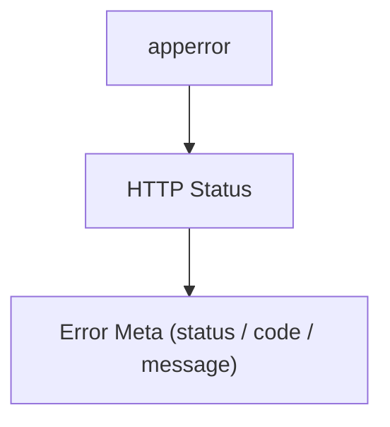
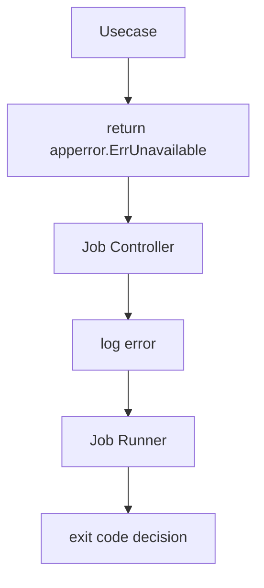
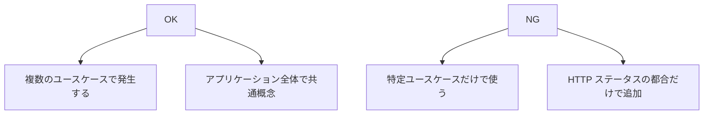

# app error

[English](README.md) | 日本語

`apperror` パッケージは、層に依存しない「アプリケーション共通のエラー分類」を定義します。

このパッケージは **Domain / Usecase / Controller / Infrastructure のすべての層から参照可能**であり、
アプリケーション内で発生するエラーを **プロトコル非依存の形で分類するための基底エラー**を提供します。

HTTP ステータスコードや API レスポンス形式はここでは扱いません。
それらは **Controller 層で変換されます。**

## 基本方針

- Domain / Usecase / Controller / Infra のいずれからも参照可能
- 定義するのは **アプリケーション共通の基底エラーカテゴリのみ**
- HTTP ステータスやレスポンス形式は持たない
- `xerrors.Is` / `xerrors.As` による判定を前提に設計

例

- `ErrInvalidArgument`
- `ErrNotFound`
- `ErrConflict`

## 利用ルール

エラーを返す際は **必ず apperror の基底カテゴリをラップすること**を推奨します。

理由

- `xerrors.Is` によるエラー分類が可能になる
- Controller 層で HTTP ステータスへ変換できる
- 元エラーをログ / トレースで保持できる

## エラーラップの推奨パターン

エラーは **必ず基底エラーをラップして返す**ことを推奨します。

```go
// Wrap domain error with app error category
if err != nil {
    return xerrors.Wrap(apperror.ErrConflict, "failed to create user")
}
```

Controller 層では `xerrors.Is` を使って判定します。

```go
// Map app error to HTTP status
if xerrors.Is(err, apperror.ErrNotFound) {
    return lookupErrorMetaByHTTPStatus(http.StatusNotFound)
}
```

## Infra エラーの変換

Infrastructure 層では **外部依存のエラーを apperror に変換する**ことを推奨します。

理由

- DB / 外部 API のエラーをアプリケーション語彙へ変換するため
- 上位層が DB 依存のエラーを知る必要をなくすため

例

```go
// Translate database error to application error
if xerrors.Is(err, pgx.ErrNoRows) {
    return xerrors.Join(apperror.ErrNotFound, err)
}

var pgErr *pgconn.PgError
if xerrors.As(err, &pgErr) {
    switch pgErr.Code {
    case "23505": // ユニーク制約違反
        return xerrors.Join(apperror.ErrConflict, err)
    }
}

return xerrors.Join(apperror.ErrInternal, err)
```

通常この変換は

- Repository
- Infra Adapter

で行います。

## HTTP エラー変換（Controller 層）

`apperror` パッケージは **HTTP を知りません。**

HTTP ステータスコードへの変換は **Controller 層の責務**です。

このプロジェクトでは Controller の `errorhandler` ミドルウェアで
次の2段階変換を行います。



例

```go
case xerrors.Is(err, apperror.ErrNotFound):
    return lookupErrorMetaByHTTPStatus(http.StatusNotFound)
```

`lookupErrorMetaByHTTPStatus` は

- HTTP Status
- Error Code
- Message

を持つ **HTTP エラーメタ情報**を返します。

これにより

- Domain / Usecase は HTTP 非依存
- エラーメッセージを Controller で一元管理
- API 仕様変更時に Domain を変更しなくてよい

という利点があります。

## エラーメタ情報（`Meta`）

`Meta` / `WithMeta` / `WithDetails` / `MetaFrom` により、エラー発生箇所がセンチネル分類の上に**動的でプロトコル中立なレスポンス向けメタ情報**を付与できます。

```go
// 不正フィールドの識別子を付与する（domain 層）
return apperror.WithDetails(xerrors.Join(errs...), "firstName", "email")

// code を付与する（任意の層）/ 利用者向け文言を上書きする（controller のみ）
return apperror.WithMeta(err, apperror.NewMeta("CUSTOM_CODE", "firstName"))
return apperror.WithMeta(err, apperror.NewMeta("CUSTOM_CODE").WithMessage("..."))

// transport の境界で抽出する（controller 層）
if meta, ok := apperror.MetaFrom(err); ok { ... meta.Code() / meta.Message() / meta.Details() ... }
```

ルール:

- **`Meta` は HTTP ステータスを運びません。** ステータスはセンチネル分類のみで解決されます。ステータスを変えたい場合はセンチネルを変えてください。これにより [ADR-0046 (apperror-protocol-agnostic-errors)](../../docs/adr/0046-apperror-protocol-agnostic-errors.md) の決定は不変のまま保たれます（[ADR-0047 (error-metadata-code-message-details)](../../docs/adr/0047-error-metadata-code-message-details.md) 参照）。
- フィールドは非公開で、`Meta` の構築は `NewMeta(code, details...)` 経由のみです（`details` は防御的コピーされます）。全項目任意で、空の値は解決されたステータスに対する controller の既定 `code` / `message` にフォールバックします。
- 利用者向け文言は明示的で grep 可能な `WithMessage` を通してのみ設定できます。文言の正は controller のカタログにあるため、**呼び出しは controller 層に限ります**。Domain / Usecase は `code` / `details` のみを設定してください。
- `Details` の値は API レスポンスにそのまま公開されます。**公開して安全な識別子のみ**（例: 不正フィールド名）を入れ、理由文や入力値そのものを入れてはいけません。理由文はラップしたエラーメッセージ側に残し、ログ専用とします。
- **`details` の露出はエンドポイントごとの opt-in かつ fail-closed。** ここで `details` を付与するのは必要条件だが十分条件ではありません。クライアントが受け取るのは、その operation が OpenAPI で `ErrorResponseWithDetails` スキーマを宣言している場合のみ。opt-in していない operation では controller の `errorhandler` が wire から `details` を落とします（ログには残る）。[ADR-0048 (error-details-opt-in-gate)](../../docs/adr/0048-error-details-opt-in-gate.md) を参照。
- チェーン内で `WithMeta` が多重に付与された場合、**最も外側が勝ちます**（`MetaFrom` は `xerrors.As` を使用）。上位層が上書きしたい場合は意図的に再ラップしてください。
- `WithMeta` は装飾であり分類ではありません。`xerrors.Is` / `IsAppError` はラップされたセンチネル（`xerrors.Join` の全枝を含む）をそのまま検知します。

### 仕組み: センチネルへの埋め込みではなくラッパー

`WithMeta` はセンチネルに何かを入れるのでは**ありません** — センチネルは共有のパッケージ変数
なので、リクエスト固有のデータを持たせると別リクエストへ漏れます。代わりに、元のエラーを
内側に抱える `MetaError` でチェーン全体を包みます:

```go
type MetaError struct {
    meta Meta  // リクエスト固有の荷物
    err  error // 元のチェーン丸ごと（センチネルを含む）
}

func (e *MetaError) Unwrap() error { return e.err }
```

メソッド名は **`Unwrap() error` でなければなりません** — これはスタイルの選択ではなく標準
ライブラリのチェーン契約です: `errors.Is` / `errors.As`（したがって `xerrors.Is` / `As`）は
まさにこのシグネチャ（Join の場合は `Unwrap() []error`）を探してチェーンを辿ります。改名
するとラッパーが不透明になり、422 分類が壊れます。

役割分担に注意してください: `Unwrap` は**1枚だけ**剥がします — 返すのは内側のチェーン
そのままで、センチネルではありません。センチネルへの到達は `errors.Is` の仕事で、チェーンを
降りながら `Unwrap` を再帰的に呼びます。各ラッパー型は「自分の包装を外す」だけを実装し、
走査ロジックは標準ライブラリに一箇所だけ存在します。

## Job / CLI でのエラー扱い

`apperror` は HTTP だけでなく **Job / CLI Controller** でも利用できます。

Job 実行では通常

- エラーをログ出力
- Exit code を Runner が決定

という形になります。



## 新しいエラーカテゴリを追加する場合

新しいエラーカテゴリは **安易に追加しない**ことを推奨します。

判断基準



追加する場合は README に次を記載してください。

- 背景
- 利用シーン
- HTTP ステータス対応

## 対応表

| app error 定義 | 意味 / 使い所 | HTTP Status |
| -------------- | ----------- | ----------- |
| `ErrInvalidArgument` | 不正な引数（構文的には正しいが意味が不正） | 400 Bad Request |
| `ErrUnauthenticated` | 認証失敗（未ログインなど） | 401 Unauthorized |
| `ErrPermissionDenied` | 権限不足 | 403 Forbidden |
| `ErrNotFound` | 対象が存在しない | 404 Not Found |
| `ErrConflict` | 競合（ユニーク制約違反・同時更新衝突など） | 409 Conflict |
| `ErrValidation` | ドメイン/ユースケースの検証失敗 | 422 Unprocessable Entity |
| `ErrUnsupportedMediaType` | サポートされていない Content-Type / メディア形式 | 415 Unsupported Media Type |
| `ErrPayloadTooLarge` | リクエストペイロードが許容サイズを超過 | 413 Payload Too Large |
| `ErrTooManyRequests` | リクエスト過多（流量制限・外部 API のスロットリング応答の伝播など） | 429 Too Many Requests |
| `ErrCanceled` | クライアントがリクエストをキャンセル/切断 | 499 Client Closed Request |
| `ErrInternal` | 想定外の内部エラー | 500 Internal Server Error |
| `ErrUnimplemented` | 未実装 / 非サポート機能 | 501 Not Implemented |
| `ErrUnavailable` | 一時的な利用不可（外部依存障害など） | 503 Service Unavailable |

## 分類ヘルパー（`IsAppError`）

`IsAppError(err error) bool` は、`err` が上記の対応表に載る HTTP taxonomy センチネルのいずれかに該当するかを返します。

- 判定には `xerrors.Is` を使うため、ラップされたエラー（`xerrors.Wrap(apperror.ErrConflict, ...)`）も検出されます。
- worker 分類センチネル（`ErrRetryable` / `ErrPermanent` / `ErrFatal`、後述）は意図的に `IsAppError` の対象外です。
- `nil` は `false` を返します。

```go
// true: センチネルそのもの、またはそれをラップしたエラー
apperror.IsAppError(apperror.ErrNotFound)                        // true
apperror.IsAppError(xerrors.Wrap(apperror.ErrConflict, "dup"))   // true

// false: app error でない / nil / worker センチネル
apperror.IsAppError(xerrors.New("generic"))                      // false
apperror.IsAppError(nil)                                         // false
apperror.IsAppError(apperror.ErrRetryable)                       // false
```

## worker 分類センチネル

上記の HTTP taxonomy とは別に、メッセージ処理 worker の `engine` が `Handler` の返すエラーを分類して挙動を変えるために使用する3つのセンチネルを定義しています。

| センチネル | 意味 | engine の挙動 |
| ---------- | ---- | ------------- |
| `ErrRetryable` | 一時障害 | Nack で再配送 |
| `ErrPermanent` | 永久失敗 | `FailureHandler` へ退避してから Ack |
| `ErrFatal` | プロセス継続不能 | drain して engine を停止 |

これらは HTTP エラー taxonomy には **含まれません**。HTTP ステータス対応を持たず、`IsAppError` の対象外です。

## テスト戦略

本パッケージはセンチネルとそれに付随するメタデータを定義するのみで、I/O を行わず HTTP を知らない。テストはモックを使わない純粋な単体テストで、対象はセンチネル集合・`Meta`・ラップ用ヘルパである。

- **ラップを跨いでセンチネルの同一性が保たれること** — `WithMeta` / `WithDetails` を通し、さらに外側で `%w` ラップした後に `errors.Is` で検証する。エラー文字列の比較ではセンチネルが失われても通ってしまい、それこそが本層の防ごうとしている失敗である。
- **マッピングの網羅性** — 全センチネルがマッピング表に登録されていることを目視でなく機械的に検証する（`TestAppErrorsCompleteness`）。表に無いセンチネルを追加したらビルドが落ちること。taxonomy が増えるたびに拡張が要る唯一のテストがこれ。
- **`Meta` の派生が非破壊であること** — `Meta.WithMessage` は派生した `Meta` を返し、レシーバを変更しない。派生後の値だけでなく元の値も検証する。（`WithDetails` は形が異なり、新規に構築した `Meta` を **エラー** へ付与する関数である。保たれるべきはラップ元のセンチネル分類であり、それは 1 つ目の箇条書きが担当する。）
- **Unwrap 連鎖とフォーマット** — `MetaError` は `Unwrap` でラップ元を公開し、`%v` / `%+v` で文書化された形へ整形する。連鎖は `errors.Is` / `errors.As` で検証し、整形自体が契約である箇所に限りフォーマットを検証する。
- **分類の境界** — `IsAppError` は HTTP taxonomy を受理し、意図的に対象外としたもの（worker センチネル `ErrRetryable` / `ErrPermanent` / `ErrFatal`）を拒否する。両側を検証すること。この拒否が worker の失敗を HTTP ステータスへ写してしまうのを防いでいる。

HTTP ステータスへのマッピングはここでは **検証しない** —— controller 層のエラーハンドラの担当である。
