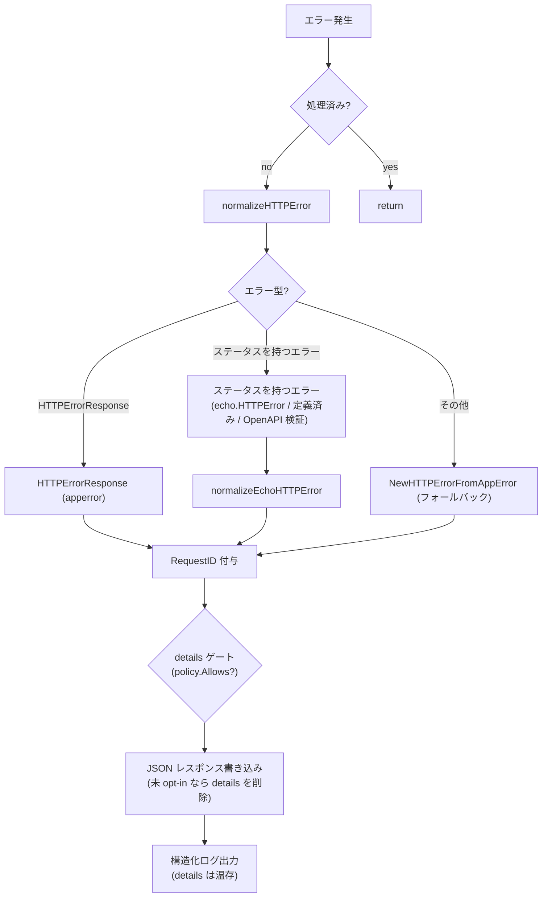

# errorhandler

[English](README.md) | 日本語

Echo / OpenAPI バリデーション / アプリケーションレベルのエラーを統一的な JSON レスポンスに正規化し、構造化ログとともに処理する統一 HTTP エラーハンドラです。

## アーキテクチャ



## エラー正規化

ハンドラは以下の優先順位でエラーを処理します。

### 1. `response.HTTPErrorResponse`（アプリケーションエラー）

ハンドラ内で `response.NewHTTPErrorFromAppError()` によりラップ済みのエラー。

- HTTP ステータスが有効（400-599）: そのまま使用し、RequestID を付与
- HTTP ステータスが無効: `NewHTTPErrorFromAppError(internal)` で再正規化

### 2. HTTP ステータスを持つエラー（Echo / OpenAPI エラー）

ステータスは `echo.StatusCode` で解決するため、`echo.HTTPError` に加えて Echo の定義済み
エラー（`echo.ErrNotFound` など。型は非公開）も対象になります。OpenAPI バリデーションの
失敗もこの経路に入ります —— バリデーションミドルウェアが決めたステータス（不正なリクエスト
は 400、経路解決不能は 404 / 405、資格情報の拒否は 401。`oapi/auth` の README 参照）を持つ
`echo.HTTPError` として届きます。

400〜599 の範囲外のステータスはエラーステータスとみなさず、フォールバックへ落ちます。

### 3. フォールバック

認識できないエラーは `response.NewHTTPErrorFromAppError()` に渡され、`apperror` の型に基づいて HTTP ステータスコードにマッピングされます。

## レスポンス形式

すべてのエラーは `response.HTTPErrorResponse` を使って JSON で返されます：

```json
{
  "code": "BAD_REQUEST",
  "message": "...",
  "details": ["..."],
  "requestId": "..."
}
```

- `requestId` は常に付与（`requestid.GetRequestIDFromResponse` で取得）
- `Details` と `Internal` エラーは利用可能な場合に含まれる
- エラーが `apperror.Meta` を運んでいる場合、`NewHTTPErrorFromAppError` 内で `code` / `message` / `details` がステータス既定値を上書きする（HTTP ステータスは変わらない）— [`controller/error/response/README.ja.md`](../../error/response/README.ja.md) の「`apperror.Meta` による上書き」節を参照
- `Internal` エラーとスタックトレースはログに出力されるが、**クライアントには返されない**

### details の opt-in ゲート（fail-closed）

`details` は**エンドポイントごとの opt-in**。`DetailPolicy`（起動時に OpenAPI spec から構築、
`detail_exposure.go`）が「どの operation が `ErrorResponseWithDetails` スキーマを宣言しているか」を
前計算する。エラー経路で、レスポンスが `details` を持つ場合、`handleHTTPError` はリクエストの
operation を解決し、opt-in していない限り**クライアント wire からのみ** `details` を落とす
（`writeErrorResponse` が body をコピー。`resp` 本体とログには完全な `details` が残る）。ルート
不一致・未 opt-in はいずれも **fail-closed**（details なし）。policy 用 router は servers を除去した
spec 複製から作るため Host 非依存で、proxy / test の Host でもパス + メソッドで解決できる。
理由: [ADR-0041](../../../../docs/adr/0041-error-details-opt-in-gate.md)。

## ログ出力

エラーログは `ObservabilityConfig.TargetStatusCodeSet()` で制御されます：

- 設定されたステータスコードのみログ対象
- **5xx**: `Error` レベル（`errorhandler.server_error`）
- **4xx**: `Warn` レベル（`errorhandler.client_error`）

ログフィールド：

- HTTP ステータス、エラーコード、エラーメッセージ、RequestID
- リクエスト詳細（メソッド、パス、URI、リモート IP、ホスト、ユーザーエージェント等）
- クエリパラメータ、パスパラメータ
- Trace ID / Span ID（Observability 有効時）
- 内部エラーメッセージとスタックトレース（デバッグ用）

## 再入ガード

初回呼び出し時にハンドラは `ctxhelper.SetErrorHandledToEcho(c, true)` を呼び、以降の呼び出しは `ctxhelper.GetErrorHandledFromEcho(c)` の判定で早期 return します。これによりエラーレスポンス書き込み中に再度エラーが起きても無限再帰しません。フラグは Echo の内部ストアではなく `scripts/genctxkey` が生成する typed sentinel として request の context 側に保持されます。

## リカバリミドルウェアとの連携

上流の `recovery` ミドルウェアが既にパニックをログ済みの場合、同じコンテキストには `ctxhelper.SetRecoveredToEcho(c, true)` で `Recovered` sentinel が立っています。本ハンドラは `logHTTPError` を呼ぶ前に `ctxhelper.GetRecoveredFromEcho(c)` をチェックし、ログ二重出力を抑止します（500 レスポンス自体は返します）。

## ファイル構成

|ファイル|責務|
|---|---|
|`http_error_handler.go`|メインハンドラ、正規化ディスパッチ、ログ出力|
|`echo_http_error_handler.go`|HTTP ステータスを持つエラー → `HTTPErrorResponse` の正規化|
|`detail_exposure.go`|`DetailPolicy` — OpenAPI spec から解決するエンドポイントごとの `details` opt-in|

## テスト戦略

本パッケージはミドルウェアではなく `e.HTTPErrorHandler` を差し替える。`next` が存在しないため、[`httpstack/README.ja.md`](../README.ja.md) の素通し／`Before`・`After` の観点はいずれも適用されない（*実体を使う対象とモックにする対象* の表は適用される）。ここでの検証対象は 2 つあり、壊れ方が異なる — 起動時に OpenAPI spec から前計算しリクエスト単位で判定するポリシー（`DetailPolicy`）と、正規化 → 書き出し → ログの合流点（`handleHTTPError`）である。

クライアントが実際に受け取る内容を検証するときは `New(e, …)` の後に `e.ServeHTTP` 経由で駆動する（レスポンスが commit されるのは実 Echo 経路のみ）。レスポンスに差が出ない分岐（再入・commit 状態・ログ抑止）を検証するときは `httptest` で組んだ `*echo.Context` を渡して `handleHTTPError` を直接呼ぶ。ポリシーが検証対象のときは実 spec（`oapi/validator.GetValidator()`）を、ハンドラが検証対象のときは固定値を返すパッケージ内 stub を使う。

### ポリシーは fail-closed に倒れる

opt-in を解決 *できない* 経路はすべて「details なし」に着地しなければならない。実 spec と実 router で到達できるのは 2 つで、それぞれにケースが要る — どのルートにも一致しないリクエストと、operation は解決したが opt-in していないリクエストである。default-allow へ緩んだゲートも全リクエストに正常応答を返すため、この異常系ケースだけが検知できる。根拠: [ADR-0041](../../../../docs/adr/0041-error-details-opt-in-gate.md)。

`DetailPolicy.Allows` の doc コメントが挙げる残りの拒否理由は独立したケースにはならない。`OperationID` が空の場合は未 opt-in と同じ map 参照で落ちる（`buildDetailExposureMap` が空 ID を登録しないため）。そもそも `redocly.yaml` が `operationId` 欠落を spec lint で落とすので、実 spec からは生じない。error が nil のまま route が nil、あるいは `Operation` が nil になる経路は gorillamux の router が作り得ない防御的ガードである（マッチのたびに `Operation` を設定し、メソッド集合を path item の operation から構築するため）。到達させるには `routers.Router` を自作してコンストラクタを迂回して注入するしかないので、作為的に作らず `docs/testing-conventions.md` §9 に従って未カバーのまま残す。

落とすのが **wire だけ**であることも固定する。クライアントへ渡す body から `details` が消え、`resp` とログフィールドには残ること。これはハンドラ側で検証する — `Allows` は bool を返すだけでこれらを一切観測できないため、ポリシーのテストではなく `handleHTTPError` のテストに属する。レスポンス body だけを検証すると、ハンドラが `resp` 上の `details` を破壊的に消すようになっても緑のままになる。それは運用者からも details を奪う、ゲートの目的と正反対の壊れ方である。

**Host 非依存性**はテストが明示しない限り不可視になる。router は spec から `servers` を除去した複製で構築するため、ポリシーのテストが投げるリクエストは `servers` のどれとも一致しない Host を持たせ（`httptest.NewRequest` 既定の `example.com` は `localhost:8080` にも `api.example.com` にも一致しない）、ケース名で Host に依存しないことを述べる。Host マッチが復活する退行は proxy 配下で全エンドポイントを fail-closed に倒すが、応答自体は正当でテストも緑のままになる。

さらに `buildDetailExposureMap` には spec 自身との契約テストを置く。受理する operation 集合を、spec から独立に導出した `ErrorResponseWithDetails` を参照する operation 集合と突き合わせる。production 側に対応関数を持たないのは設計どおりで、spec の成長に伴い「スキーマは宣言したが map に届かないエンドポイント」を捕まえるのがこのテストの役目である。

### ハンドラ

- **正規化の優先順位** — `normalizeHTTPError` の各分岐はエラーの形で選ばれるため、それぞれにケースを置く。すでに `HTTPErrorResponse` で包まれたもの、ステータスを持つエラー（`echo.HTTPError`・型が非公開な Echo の定義済みエラー・OpenAPI バリデーション失敗）、それ以外。400〜599 の外にあるステータスを `Internal` から導出し直しつつ `Details` を温存する矯正は独立したケースにする — 呼び出し側が決めたステータスを上書きする唯一の経路であるため。
- **再入** — 同一コンテキストで 2 回呼んでもレスポンスの書き出しはちょうど 1 回であること。この回数が契約のすべてで、2 回目の書き込みが成功しても外形からは区別できない。ガードの存在理由は、エラーレスポンスの *書き出し中* に発生したエラーで再帰させないことにある。
- **リカバリとの協調** — `Recovered` sentinel が立っていれば 500 は返しつつエラーログは出さず、立っていなければ両方行う。500 の欠落もパニックログの二重出力も実害のある壊れ方で、片側だけのテストはもう片側を隠すため、両方向を検証する。
- **commit 状態** — すでに commit 済みのレスポンスでは書き込み自体を行わず、書き込み失敗はログに出したうえで二重に commit しない。失敗は `Write` が常にエラーを返す `ResponseWriter` で再現する。その失敗の内側にあるフォールバックの `WriteHeader(500)` は別件で、ここから到達できない理由は下記の *カバレッジ例外* を参照。
- **ログのゲート** — そもそもログを出すかは `ObservabilityConfig.TargetStatusCodeSet()` が決め、`Error` か `Warn` かは 500 の境界が決める。集合の内側と外側、境界の両側を網羅し、observed エントリのメッセージ（`errorhandler.server_error` / `errorhandler.client_error`）で検証する — アラートが引くのはレベルだけでなくこの文字列である。

## カバレッジ例外

`docs/testing-conventions.md` §9 に基づき、以下の infallible な防御分岐は未カバーのまま残す(作為的テストは書かない):

- `http_error_handler.go` `handleHTTPError` — `writeErrorResponse` が失敗しつつレスポンス未 commit のときだけ通る入れ子 `WriteHeader(500)`。body は常に JSON 化可能な固定 struct(`gen.ErrorResponseWithDetails`)なので `c.JSON` は書き込み中(= `WriteHeader` で commit 済みの後)にしか失敗できず、未 commit での失敗は到達不能。到達可能な書き込み失敗経路(ログ出力・二重 commit なし)はカバー済み。

## 注意点

- エラーレスポンスの書き込みに失敗した場合、フォールバックとして `500` ステータスを返し、書き込みエラーをログに出力
- エラーレスポンスは `controller/error/response/` の `response.HTTPErrorResponse` を使用 — エラーコードとメッセージのマッピングはそちらを参照
- このハンドラは Echo のデフォルトエラーハンドラを完全に置き換える
