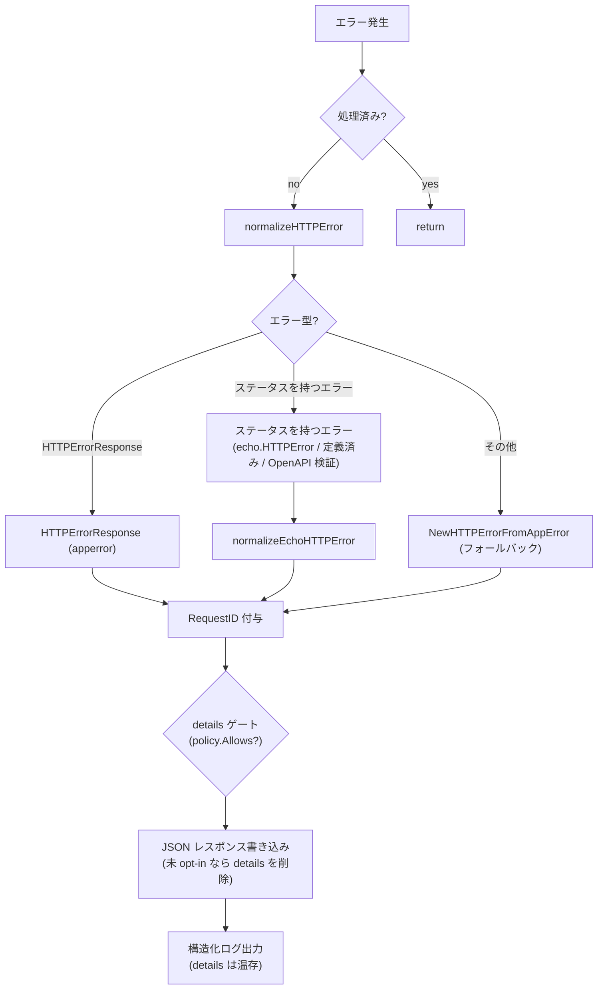

# errorhandler

[English](README.md) | 日本語

Echo / OpenAPI バリデーション / アプリケーションレベルのエラーを統一的な JSON レスポンスに正規化し、構造化ログとともに処理する統一 HTTP エラーハンドラです。

## アーキテクチャ



## エラー正規化

ハンドラは以下の優先順位でエラーを処理します。

### 1. `response.HTTPErrorResponse`（アプリケーションエラー）

ハンドラ内で `response.NewHTTPErrorFromAppError()` によりラップ済みのエラー。

- HTTP ステータスが有効（400-599）: そのまま使用し、RequestID を付与
- HTTP ステータスが無効: `NewHTTPErrorFromAppError(internal)` で再正規化

### 2. HTTP ステータスを持つエラー（Echo / OpenAPI エラー）

ステータスは `echo.StatusCode` で解決するため、`echo.HTTPError` に加えて Echo の定義済み
エラー（`echo.ErrNotFound` など。型は非公開）も対象になります。OpenAPI バリデーションの
失敗もこの経路に入ります —— バリデーションミドルウェアが決めたステータス（不正なリクエスト
は 400、経路解決不能は 404 / 405、資格情報の拒否は 401。`oapi/auth` の README 参照）を持つ
`echo.HTTPError` として届きます。

400〜599 の範囲外のステータスはエラーステータスとみなさず、フォールバックへ落ちます。

### 3. フォールバック

認識できないエラーは `response.NewHTTPErrorFromAppError()` に渡され、`apperror` の型に基づいて HTTP ステータスコードにマッピングされます。

## レスポンス形式

すべてのエラーは `response.HTTPErrorResponse` を使って JSON で返されます：

```json
{
  "code": "BAD_REQUEST",
  "message": "...",
  "details": ["..."],
  "requestId": "..."
}
```

- `requestId` は常に付与（`requestid.GetRequestIDFromResponse` で取得）
- `Details` と `Internal` エラーは利用可能な場合に含まれる
- エラーが `apperror.Meta` を運んでいる場合、`NewHTTPErrorFromAppError` 内で `code` / `message` / `details` がステータス既定値を上書きする（HTTP ステータスは変わらない）— [`controller/error/response/README.ja.md`](../../error/response/README.ja.md) の「`apperror.Meta` による上書き」節を参照
- `Internal` エラーとスタックトレースはログに出力されるが、**クライアントには返されない**

### details の opt-in ゲート（fail-closed）

`details` は**エンドポイントごとの opt-in**。`DetailPolicy`（起動時に OpenAPI spec から構築、
`detail_exposure.go`）が「どの operation が `ErrorResponseWithDetails` スキーマを宣言しているか」を
前計算する。エラー経路で、レスポンスが `details` を持つ場合、`handleHTTPError` はリクエストの
operation を解決し、opt-in していない限り**クライアント wire からのみ** `details` を落とす
（`writeErrorResponse` が body をコピー。`resp` 本体とログには完全な `details` が残る）。ルート
不一致・未 opt-in はいずれも **fail-closed**（details なし）。policy 用 router は servers を除去した
spec 複製から作るため Host 非依存で、proxy / test の Host でもパス + メソッドで解決できる。
理由: [ADR-0041](../../../../docs/adr/0041-error-details-opt-in-gate.md)。

### 405 の `Allow` ヘッダー

RFC 9110 §15.5.6 は、405 レスポンスに対象リソースが許可するメソッド一覧を `Allow` ヘッダーとして
返すことを要求する。Echo 自身の `methodNotAllowedHandler` はこれをセットするが、405 を短絡させる
ミドルウェアの下流にあるため到達しない経路がある — OpenAPI バリデーションミドルウェアは自前の
router が `ErrMethodNotAllowed` を返した時点で 405 を返す。そのため、ハンドラが書き出すすべての 405
に対して body 書き込み前に `Allow` を自身でセットする。

405 を判断し得る router は 2 つあるため、値の情報源も 2 つあり、この順で解決する：

1. **Echo の router** — `echo.ContextKeyHeaderAllow`。`Use` ミドルウェアの実行前に解決済みなので、
   どの層が 405 を送出したかによらず読める。Echo 自身が 405 と判断した場合にのみ設定されるため、
   値がある場合はそれが正しい（OpenAPI バリデーションを丸ごとスキップする運用系パスは常にこちら）。
2. **OpenAPI spec**（`AllowPolicy` / `allow_methods.go`）— 起動時に組み立てたパステンプレート →
   `Allow` 値のマップ。Echo が答えを持てないケースを埋める：静的パスと可変パスが重なる位置
   （`/v1/users/me` と `/v1/users/{userId}`）では、静的パス側に無いメソッドが可変パス側のルートへ
   マッチし得るため、Echo は 405 branch に入らず、405 と判断するのは OpenAPI の router だけになる。
   405 のリクエストは定義上どのルートにも解決しないので、他メソッドで探索してパステンプレートを
   特定し、事前計算した値を引く。

`OPTIONS` は常に先頭に置く（Echo が spec の定義有無によらず自動応答するため）。

spec はこのヘッダーを `required: true` と宣言しており、2つの情報源はこれを満たす: Echo のルータ由来の
405 は `ContextKeyHeaderAllow` を必ず伴い、OpenAPI のルータ由来の 405 はそのパスが spec に載っている
ことが前提なので probe が必ず解決する。この主張は、実 spec の全パスを走査して `Allow` が非空である
ことを確かめる契約テストで固定している。破れるのは「spec に無いルートを Echo に登録した」場合だけで、
それは解決の問題ではなく spec 迂回の問題。

spec がヘッダーを宣言しているため、oapi-codegen は `Headers.Allow` を持つ
`MethodNotAllowed405JSONResponse` を生成し、生成された `Visit…Response` はこのフィールドを無条件で
書き出す。405 は全てここで書くのでこの型を構築するハンドラは存在しないが、strict handler から
`Headers` をゼロ値のまま返すと空の `Allow` が出て、上記 2 つの情報源を迂回することになる。

## ログ出力

エラーログは `ObservabilityConfig.TargetStatusCodeSet()` で制御されます：

- 設定されたステータスコードのみログ対象
- **5xx**: `Error` レベル（`errorhandler.server_error`）
- **4xx**: `Warn` レベル（`errorhandler.client_error`）

ログフィールド：

- HTTP ステータス、エラーコード、エラーメッセージ、RequestID
- リクエスト詳細（メソッド、パス、URI、リモート IP、ホスト、ユーザーエージェント等）
- クエリパラメータ、パスパラメータ
- Trace ID / Span ID（Observability 有効時）
- 内部エラーメッセージとスタックトレース（デバッグ用）

## 再入ガード

初回呼び出し時にハンドラは `ctxhelper.SetErrorHandledToEcho(c, true)` を呼び、以降の呼び出しは `ctxhelper.GetErrorHandledFromEcho(c)` の判定で早期 return します。これによりエラーレスポンス書き込み中に再度エラーが起きても無限再帰しません。フラグは Echo の内部ストアではなく `scripts/genctxkey` が生成する typed sentinel として request の context 側に保持されます。

## リカバリミドルウェアとの連携

上流の `recovery` ミドルウェアが既にパニックをログ済みの場合、同じコンテキストには `ctxhelper.SetRecoveredToEcho(c, true)` で `Recovered` sentinel が立っています。本ハンドラは `logHTTPError` を呼ぶ前に `ctxhelper.GetRecoveredFromEcho(c)` をチェックし、ログ二重出力を抑止します（500 レスポンス自体は返します）。

## ファイル構成

|ファイル|責務|
|---|---|
|`http_error_handler.go`|メインハンドラ、正規化ディスパッチ、ログ出力|
|`echo_http_error_handler.go`|HTTP ステータスを持つエラー → `HTTPErrorResponse` の正規化|
|`detail_exposure.go`|`DetailPolicy` — OpenAPI spec から解決するエンドポイントごとの `details` opt-in、および両ポリシーが共有する Host 非依存 router のコンストラクタ|
|`allow_methods.go`|`AllowPolicy` — OpenAPI spec から解決するパスごとの `Allow` ヘッダー値|

spec 由来のポリシーは `Policies` 一つにまとめてハンドラへ渡すため、ポリシーを追加しても `New` の
シグネチャは再び広がらない。

## カバレッジ例外

`docs/testing-conventions.md` §9 に基づき、以下の infallible な防御分岐は未カバーのまま残す(作為的テストは書かない):

- `http_error_handler.go` `handleHTTPError` — `writeErrorResponse` が失敗しつつレスポンス未 commit のときだけ通る入れ子 `WriteHeader(500)`。body は常に JSON 化可能な固定 struct(`gen.ErrorResponseWithDetails`)なので `c.JSON` は書き込み中(= `WriteHeader` で commit 済みの後)にしか失敗できず、未 commit での失敗は到達不能。到達可能な書き込み失敗経路(ログ出力・二重 commit なし)はカバー済み。

## 注意点

- エラーレスポンスの書き込みに失敗した場合、フォールバックとして `500` ステータスを返し、書き込みエラーをログに出力
- エラーレスポンスは `controller/error/response/` の `response.HTTPErrorResponse` を使用 — エラーコードとメッセージのマッピングはそちらを参照
- このハンドラは Echo のデフォルトエラーハンドラを完全に置き換える
