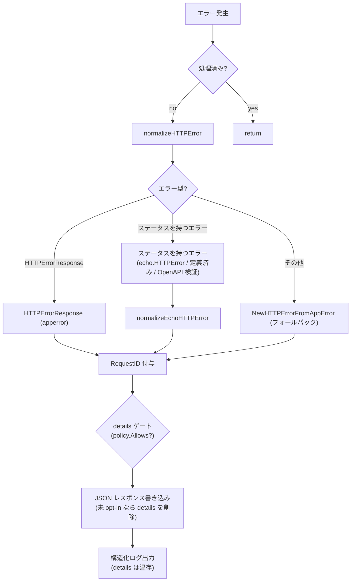

# errorhandler

[English](README.md) | 日本語

Echo / OpenAPI バリデーション / アプリケーションレベルのエラーを統一的な JSON レスポンスに正規化し、構造化ログとともに処理する統一 HTTP エラーハンドラです。

## アーキテクチャ



## エラー正規化

ハンドラは以下の優先順位でエラーを処理します。

### 1. `response.HTTPErrorResponse`（アプリケーションエラー）

ハンドラ内で `response.NewHTTPErrorFromAppError()` によりラップ済みのエラー。

- HTTP ステータスが有効（400-599）: そのまま使用し、RequestID を付与
- HTTP ステータスが無効: `NewHTTPErrorFromAppError(internal)` で再正規化

### 2. HTTP ステータスを持つエラー（Echo / OpenAPI エラー）

ステータスは `echo.StatusCode` で解決するため、`echo.HTTPError` に加えて Echo の定義済み
エラー（`echo.ErrNotFound` など。型は非公開）も対象になります。OpenAPI バリデーションの
失敗もこの経路に入ります —— バリデーションミドルウェアが決めたステータス（不正なリクエスト
は 400、経路解決不能は 404 / 405、資格情報の拒否は 401。`oapi/auth` の README 参照）を持つ
`echo.HTTPError` として届きます。

400〜599 の範囲外のステータスはエラーステータスとみなさず、フォールバックへ落ちます。

### 3. フォールバック

認識できないエラーは `response.NewHTTPErrorFromAppError()` に渡され、`apperror` の型に基づいて HTTP ステータスコードにマッピングされます。

## レスポンス形式

すべてのエラーは `response.HTTPErrorResponse` を使って JSON で返されます：

```json
{
  "code": "BAD_REQUEST",
  "message": "...",
  "details": ["..."],
  "requestId": "..."
}
```

- `requestId` は常に付与（`requestid.GetRequestIDFromResponse` で取得）
- `Details` と `Internal` エラーは利用可能な場合に含まれる
- エラーが `apperror.Meta` を運んでいる場合、`NewHTTPErrorFromAppError` 内で `code` / `message` / `details` がステータス既定値を上書きする（HTTP ステータスは変わらない）— [`controller/error/response/README.ja.md`](../../error/response/README.ja.md) の「`apperror.Meta` による上書き」節を参照
- `Internal` エラーとスタックトレースはログに出力されるが、**クライアントには返されない**

### details の opt-in ゲート（fail-closed）

`details` は**エンドポイントごとの opt-in**。`DetailPolicy`（起動時に OpenAPI spec から構築、
`detail_exposure.go`）が「どの operation が `ErrorResponseWithDetails` スキーマを宣言しているか」を
前計算する。エラー経路で、レスポンスが `details` を持つ場合、`handleHTTPError` はリクエストの
operation を解決し、opt-in していない限り**クライアント wire からのみ** `details` を落とす
（`writeErrorResponse` が body をコピー。`resp` 本体とログには完全な `details` が残る）。ルート
不一致・未 opt-in はいずれも **fail-closed**（details なし）。policy 用 router は servers を除去した
spec 複製から作るため Host 非依存で、proxy / test の Host でもパス + メソッドで解決できる。
理由: [ADR-0041](../../../../docs/adr/0041-error-details-opt-in-gate.md)。

### 405 の `Allow` ヘッダー

RFC 9110 §15.5.6 は、405 レスポンスに対象リソースが許可するメソッド一覧を `Allow` ヘッダーとして
返すことを要求する。Echo 自身の `methodNotAllowedHandler` はこれをセットするが、405 を短絡させる
ミドルウェアの下流にあるため到達しない経路がある — OpenAPI バリデーションミドルウェアは自前の
router が `ErrMethodNotAllowed` を返した時点で 405 を返す。そのため、ハンドラが書き出すすべての 405
に対して body 書き込み前に `Allow` を自身でセットする。

405 を判断し得る router は 2 つあるため、値の情報源も 2 つあり、この順で解決する：

1. **Echo の router** — `echo.ContextKeyHeaderAllow`。`Use` ミドルウェアの実行前に解決済みなので、
   どの層が 405 を送出したかによらず読める。Echo 自身が 405 と判断した場合にのみ設定されるため、
   値がある場合はそれが正しい（OpenAPI バリデーションを丸ごとスキップする運用系パスは常にこちら）。
2. **OpenAPI spec**（`AllowPolicy` / `allow_methods.go`）— 起動時に組み立てたパステンプレート →
   `Allow` 値のマップ。Echo が答えを持てないケースを埋める：静的パスと可変パスが重なる位置
   （`/v1/users/me` と `/v1/users/{userId}`）では、静的パス側に無いメソッドが可変パス側のルートへ
   マッチし得るため、Echo は 405 branch に入らず、405 と判断するのは OpenAPI の router だけになる。
   405 のリクエストは定義上どのルートにも解決しないので、他メソッドで探索してパステンプレートを
   特定し、事前計算した値を引く。

`OPTIONS` は常に先頭に置く（Echo が spec の定義有無によらず自動応答するため）。

RFC 9110 はこのヘッダーを MUST としており、2つの情報源はこれを満たす: Echo のルータ由来の 405 は
`ContextKeyHeaderAllow` を必ず伴い、OpenAPI のルータ由来の 405 はそのパスが spec に載っていることが
前提なので probe が必ず解決する。この主張は、実 spec の全パスを走査して `Allow` が非空であることを
確かめる契約テストで固定している。破れるのは「spec に無いルートを Echo に登録した」場合だけで、
それは解決の問題ではなく spec 迂回の問題。

OpenAPI spec 側ではこのヘッダーを宣言しない。宣言すると oapi-codegen が 405 レスポンス型に `Headers`
構造体を生成し、`Visit…Response` がそれを無条件で書き出すため、strict handler がゼロ値のまま返すと
空の `Allow` が出る（ここで付与されないより悪い）。加えて `owasp:api8:2023-define-cors-origin` に
抵触する。このルールは `headers` を宣言したレスポンスだけを検査するため、宣言した途端にこの 1 件だけ
`Access-Control-Allow-Origin` を要求されるが、CORS は `cors` ミドルウェアがスタック全体へ横断的に
適用するものであってレスポンス個別の契約ではない。

## ログ出力

エラーログは `ObservabilityConfig.TargetStatusCodeSet()` で制御されます：

- 設定されたステータスコードのみログ対象
- **5xx**: `Error` レベル（`errorhandler.server_error`）
- **4xx**: `Warn` レベル（`errorhandler.client_error`）

ログフィールド：

- HTTP ステータス、エラーコード、エラーメッセージ、RequestID
- リクエスト詳細（メソッド、パス、URI、リモート IP、ホスト、ユーザーエージェント等）
- クエリパラメータ、パスパラメータ
- Trace ID / Span ID（Observability 有効時）
- 内部エラーメッセージとスタックトレース（デバッグ用）

## 再入ガード

初回呼び出し時にハンドラは `ctxhelper.SetErrorHandledToEcho(c, true)` を呼び、以降の呼び出しは `ctxhelper.GetErrorHandledFromEcho(c)` の判定で早期 return します。これによりエラーレスポンス書き込み中に再度エラーが起きても無限再帰しません。フラグは Echo の内部ストアではなく `scripts/genctxkey` が生成する typed sentinel として request の context 側に保持されます。

## リカバリミドルウェアとの連携

上流の `recovery` ミドルウェアが既にパニックをログ済みの場合、同じコンテキストには `ctxhelper.SetRecoveredToEcho(c, true)` で `Recovered` sentinel が立っています。本ハンドラは `logHTTPError` を呼ぶ前に `ctxhelper.GetRecoveredFromEcho(c)` をチェックし、ログ二重出力を抑止します（500 レスポンス自体は返します）。

## ファイル構成

|ファイル|責務|
|---|---|
|`http_error_handler.go`|メインハンドラ、正規化ディスパッチ、ログ出力|
|`echo_http_error_handler.go`|HTTP ステータスを持つエラー → `HTTPErrorResponse` の正規化|
|`detail_exposure.go`|`DetailPolicy` — OpenAPI spec から解決するエンドポイントごとの `details` opt-in、および両ポリシーが共有する Host 非依存 router のコンストラクタ|
|`allow_methods.go`|`AllowPolicy` — OpenAPI spec から解決するパスごとの `Allow` ヘッダー値|

spec 由来のポリシーは `Policies` 一つにまとめてハンドラへ渡すため、ポリシーを追加しても `New` の
シグネチャは再び広がらない。

## テスト戦略

本パッケージはミドルウェアではなく `e.HTTPErrorHandler` を差し替える。`next` が存在しないため、[`httpstack/README.ja.md`](../README.ja.md) の素通し／`Before`・`After` の観点はいずれも適用されない（*実体を使う対象とモックにする対象* の表は適用される）。ここでの検証対象は 2 つあり、壊れ方が異なる — 起動時に OpenAPI spec から前計算しリクエスト単位で判定するポリシー（`DetailPolicy`）と、正規化 → 書き出し → ログの合流点（`handleHTTPError`）である。

実 serving 経路でクライアントが実際に受け取る内容を固定するのはここではなく `internal/integration` である。`UseAppErrorHandler` が本パッケージの `New(e, …)` を spec から構築したポリシーごと配線し、実 HTTP（`httptest.NewServer`）で駆動することで、`apperror` → ステータスの写像、エラーボディの形、`requestId` のヘッダーとボディの一致、`details` の wire ゲート、2 つの情報源から解決する `Allow` ヘッダーを担保している。ここで実ルートを再度駆動するのはその重複であり、合成後のスタックについては [`httpstack/README.ja.md`](../README.ja.md) がそれを禁じている。したがって本パッケージのテストは `httptest` で組んだ `*echo.Context` を渡して `handleHTTPError`（あるいは対象の関数）を直接呼ぶ — レスポンスに差が出ない分岐（再入・commit 状態・ログ抑止）に到達できるのはそもそもこの駆動だけでもある。ポリシーが検証対象のときは実 spec（`oapi/validator.GetValidator()`）を、ハンドラが検証対象のときは固定値を返すパッケージ内 stub を使う。

### ポリシーは fail-closed に倒れる

opt-in を解決 *できない* 経路はすべて「details なし」に着地しなければならない。実 spec と実 router で到達できるのは 2 つで、それぞれにケースが要る — どのルートにも一致しないリクエストと、operation は解決したが opt-in していないリクエストである。default-allow へ緩んだゲートも全リクエストに正常応答を返すため、この異常系ケースだけが検知できる。根拠: [ADR-0041](../../../../docs/adr/0041-error-details-opt-in-gate.md)。

`DetailPolicy.Allows` の doc コメントが挙げる残りの拒否理由は独立したケースにはならない。`OperationID` が空の場合は未 opt-in と同じ map 参照で落ちる（`buildDetailExposureMap` が空 ID を登録しないため）。そもそも `redocly.yaml` が `operationId` 欠落を spec lint で落とすので、実 spec からは生じない。error が nil のまま route が nil、あるいは `Operation` が nil になる経路は gorillamux の router が作り得ない防御的ガードである（マッチのたびに `Operation` を設定し、メソッド集合を path item の operation から構築するため）。到達させるには `routers.Router` を自作してコンストラクタを迂回して注入するしかないので、作為的に作らず `docs/testing-conventions.md` §9 に従って未カバーのまま残す。

落とすのが **wire だけ**であることも固定する。クライアントへ渡す body から `details` が消え、`resp` とログフィールドには残ること。これはハンドラ側で検証する — `Allows` は bool を返すだけでこれらを一切観測できないため、ポリシーのテストではなく `handleHTTPError` のテストに属する。レスポンス body だけを検証すると、ハンドラが `resp` 上の `details` を破壊的に消すようになっても緑のままになる。それは運用者からも details を奪う、ゲートの目的と正反対の壊れ方である。

**Host 非依存性**はテストが明示しない限り不可視になる。router は spec から `servers` を除去した複製で構築するため、ポリシーのテストが投げるリクエストは `servers` のどれとも一致しない Host を持たせ（`httptest.NewRequest` 既定の `example.com` は `localhost:8080` にも `api.example.com` にも一致しない）、ケース名で Host に依存しないことを述べる。Host マッチが復活する退行は proxy 配下で全エンドポイントを fail-closed に倒すが、応答自体は正当でテストも緑のままになる。

さらに `buildDetailExposureMap` には spec 自身との契約テストを置く。受理する operation 集合を、spec から独立に導出した `ErrorResponseWithDetails` を参照する operation 集合と突き合わせる。production 側に対応関数を持たないのは設計どおりで、spec の成長に伴い「スキーマは宣言したが map に届かないエンドポイント」を捕まえるのがこのテストの役目である。

### ハンドラ

- **正規化の優先順位** — `normalizeHTTPError` の各分岐はエラーの形で選ばれるため、それぞれにケースを置く。すでに `HTTPErrorResponse` で包まれたもの、ステータスを持つエラー（`echo.HTTPError`・型が非公開な Echo の定義済みエラー・OpenAPI バリデーション失敗）、それ以外。バリデーション失敗は `echo.HTTPError` を手で組まず、実 spec に対して実 `oapi.Middleware` を走らせて返ってきたエラーをそのまま入力にする — このケースの主旨は上流ミドルウェアが包み方を変えてもステータスを取り出せることであり、手組みのエラーはそれを観測せず現在の包み方を書き写すだけになる。400〜599 の外にあるステータスを `Internal` から導出し直す矯正は独立したケースにする — 呼び出し側が決めたステータスを上書きする唯一の経路であるため。その `Details` の扱いは両方向が要る。呼び出し側が明示した `Details` は優先され、nil のときは導出し直した `Internal` 由来の `Details` が残る。ガードの脱落を検知できるのは後者だけで、脱落するとバリデーションエラーが指す対象フィールドが黙って消える。
- **再入** — 同一コンテキストで 2 回呼んでもレスポンスの書き出しはちょうど 1 回であること。この回数が契約のすべてで、2 回目の書き込みが成功しても外形からは区別できない。ガードの存在理由は、エラーレスポンスの *書き出し中* に発生したエラーで再帰させないことにある。
- **リカバリとの協調** — `Recovered` sentinel が立っていれば 500 は返しつつエラーログは出さず、立っていなければ両方行う。500 の欠落もパニックログの二重出力も実害のある壊れ方で、片側だけのテストはもう片側を隠すため、両方向を検証する。
- **commit 状態** — すでに commit 済みのレスポンスでは書き込み自体を行わないが、*ログは出す*。ボディを書けなくなったエラーではログ行だけが唯一の痕跡になるためで、ログを主語にした独立のケースが要る — ヘッダーとボディが書かれないことを主語にしたケースは、ログ出力が書き込み分岐の内側へ移っても緑のままになる。書き込み失敗はログに出したうえで二重に commit しない。失敗は `Write` が常にエラーを返す `ResponseWriter` で再現する。その失敗の内側にあるフォールバックの `WriteHeader(500)` にはさらに、レスポンスが unwrap できない状態であることが要る — 同じ writer を `c.SetResponse` でも差し込むと、失敗をまたいで `responseCommitted` が false のままになりフォールバックが動く。JSON の書き込みには 500 以外のステータス（バリデーションエラーでよい）を与える — writer は失敗前に JSON 経路が送ったステータスも記録するため、ステータスが異なることだけが末尾の 500 をフォールバックの結果だと示せる。この縮退状態は本番の serving path からは到達しない（テスト以外に `c.SetResponse` を呼ぶ箇所は無い）ため、フォールバックを支えているのはこのパッケージレベルのテストだけである — [`httpstack/README.md`](../README.md) の `server.ResponseOf` の縮退の観点と同じ立場を、ミドルウェアではなく終端ハンドラに当てはめたものになる。固定できるのはフォールバックが 500 を書くことまでで、その外側の `!responseCommitted` ガード自体は観測できない — `echo.Response.WriteHeader` が commit 済みの二度目の書き込みをすでに拒むためである。
- **ログのゲート** — そもそもログを出すかは `ObservabilityConfig.TargetStatusCodeSet()` が決め、`Error` か `Warn` かは 500 の境界が決める。集合の内側と外側に加えて境界の両側を網羅するが、両側とも集合が実際に含むステータスから採る — ゲートが先に走るため、集合外のステータスはレベルの分岐まで到達しない。境界に隣接する組（499 / 500）はあえて固定しない。499 はどの設定済み集合にも含まれず、到達させるにはこのテストのためだけに `config` の setter を増やすことになる一方、境界が許すミューテーションは 500 のケースで既に検知できる。検証は observed エントリのメッセージ（`errorhandler.server_error` / `errorhandler.client_error`）で行う — アラートが引くのはレベルだけでなくこの文字列である。

## 注意点

- エラーレスポンスの書き込みに失敗した場合、フォールバックとして `500` ステータスを返し、書き込みエラーをログに出力
- エラーレスポンスは `controller/error/response/` の `response.HTTPErrorResponse` を使用 — エラーコードとメッセージのマッピングはそちらを参照
- このハンドラは Echo のデフォルトエラーハンドラを完全に置き換える
