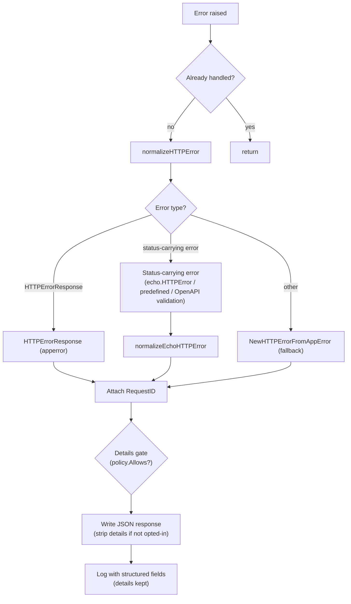

# errorhandler

English | [日本語](README.ja.md)

Unified HTTP error handler that normalizes errors from Echo, OpenAPI validation, and application-level errors into consistent JSON responses with structured logging.

## Architecture



## Error Normalization

The handler processes errors in the following priority:

### 1. `response.HTTPErrorResponse` (Application Error)

Errors already wrapped by `response.NewHTTPErrorFromAppError()` in handlers.

- If HTTP status is valid (400-599): use as-is, attach RequestID
- If HTTP status is invalid: re-normalize via `NewHTTPErrorFromAppError(internal)`

### 2. Errors carrying an HTTP status (Echo / OpenAPI Error)

Resolved with `echo.StatusCode`, so both `echo.HTTPError` and Echo's predefined errors
(`echo.ErrNotFound` and friends, whose type is unexported) are covered. OpenAPI validation
failures arrive through this path too: the validation middleware turns them into an
`echo.HTTPError` carrying the status it decided (400 for a malformed request, 404 / 405 for
an unroutable one, 401 for a rejected credential -- see the `oapi/auth` README).

A status outside 400-599 is not treated as an error status and falls through to the fallback.

### 3. Fallback

Any unrecognized error is passed to `response.NewHTTPErrorFromAppError()` which maps `apperror` types to HTTP status codes.

## Response Format

All errors are returned as JSON using `response.HTTPErrorResponse`:

```json
{
  "code": "BAD_REQUEST",
  "message": "...",
  "details": ["..."],
  "requestId": "..."
}
```

- `requestId` is always attached (extracted via `requestid.GetRequestIDFromResponse`)
- `Details` and `Internal` error are included when available
- When the error carries an `apperror.Meta`, its `code` / `message` / `details` override the status defaults inside `NewHTTPErrorFromAppError` (the HTTP status never changes) — see the `apperror.Meta` Overrides section of [`controller/error/response/README.md`](../../error/response/README.md)
- `Internal` error and stack trace are logged but **not returned to the client**

### Details opt-in gate (fail-closed)

`details` are **opt-in per endpoint**. A `DetailPolicy` (built once at startup from the OpenAPI
spec, `detail_exposure.go`) precomputes which operations declare the `ErrorResponseWithDetails`
schema. On the error path, if the response carries `details`, `handleHTTPError` resolves the
request's operation and — unless it opted in — strips `details` from the **client wire** only
(`writeErrorResponse` copies the body; the `resp` object and the logs keep the full `details`).
An unmatched route or a non-opted-in operation both fail **closed** (no `details`). The policy
router is host-agnostic (built from a servers-stripped spec copy), so proxied / test hosts still
resolve by path + method. Rationale: [ADR-0041](../../../../docs/adr/0041-error-details-opt-in-gate.md).

### `Allow` header on 405

RFC 9110 §15.5.6 requires a 405 response to carry an `Allow` header listing the methods the target
resource supports. Echo's own `methodNotAllowedHandler` sets it, but it is downstream of middleware
that can short-circuit a 405 before reaching it — the OpenAPI validation middleware returns 405 the
moment its own router reports `ErrMethodNotAllowed`. The handler therefore sets `Allow` itself, before
the body is written, for every 405 it writes.

Two routers can decide a 405, so the value has two sources, tried in order:

1. **Echo's router** — `echo.ContextKeyHeaderAllow`, resolved before any `Use` middleware runs, so it
   is readable no matter which layer emitted the 405. Echo only populates it when Echo itself decided
   405, which makes it authoritative when present (the ops paths always take this source, since they
   skip OpenAPI validation entirely).
2. **The OpenAPI spec** (`AllowPolicy`, `allow_methods.go`) — a startup-built map from path template
   to `Allow` value. This covers the case Echo cannot answer: where a static path and a parameterized
   path overlap (`/v1/users/me` vs `/v1/users/{userId}`), a method missing from the static path may
   still match the parameterized route, so Echo never takes its 405 branch and only the OpenAPI router
   reports 405. Because a 405 request resolves to no route by definition, the policy probes the router
   with the other methods to recover the path template, then looks up the precomputed value.

`OPTIONS` is always listed first, matching Echo (which answers `OPTIONS` itself regardless of the
spec).

RFC 9110 makes the header a MUST, and the two sources together satisfy that: a 405 from Echo's router
always carries `ContextKeyHeaderAllow`, and a 405 from the OpenAPI router implies the path is in the
spec, so the probe resolves it. That claim is pinned by a contract test which sweeps every path in the
real spec and asserts a non-empty `Allow` — a route registered on Echo but absent from the spec is the
one way to break it, which is a spec-bypass problem rather than a resolution one.

The OpenAPI spec does not declare this header. Declaring it would make oapi-codegen generate a
`Headers` struct on the 405 response type whose `Visit…Response` writes the field unconditionally, so
a strict handler returning the zero value would emit an empty `Allow` — worse than the header being
supplied here. Declaring it also trips `owasp:api8:2023-define-cors-origin`, which only inspects
responses that declare a `headers` block and would then demand `Access-Control-Allow-Origin` on this
one response alone (CORS is applied across the stack by the `cors` middleware, not per response).

## Logging

Error logging is controlled by `ObservabilityConfig.TargetStatusCodeSet()`:

- Only status codes in the configured set are logged
- **5xx**: Logged at `Error` level (`errorhandler.server_error`)
- **4xx**: Logged at `Warn` level (`errorhandler.client_error`)

Log fields include:

- HTTP status, error code, error message, RequestID
- Request details (method, path, URI, remote IP, host, user agent, etc.)
- Query and path parameters
- Trace ID / Span ID (if observability is enabled)
- Internal error message and stack trace (for debugging)

## Re-entrance Guard

On first invocation the handler calls `ctxhelper.SetErrorHandledToEcho(c, true)`; subsequent invocations short-circuit via `ctxhelper.GetErrorHandledFromEcho(c)` so a second error raised during error-response writing cannot trigger infinite recursion. The flag is a typed sentinel generated by `scripts/genctxkey` and stored on the request context, not on the Echo store.

## Recovery Coordination

When the upstream `recovery` middleware has already logged the panic, the same context carries the `Recovered` sentinel set via `ctxhelper.SetRecoveredToEcho(c, true)`. The handler checks `ctxhelper.GetRecoveredFromEcho(c)` before calling `logHTTPError` to skip the duplicate log line (the 500 response itself is still written).

## File Structure

|File|Responsibility|
|---|---|
|`http_error_handler.go`|Main handler, normalization dispatcher, logging|
|`echo_http_error_handler.go`|Normalize errors carrying an HTTP status to `HTTPErrorResponse`|
|`detail_exposure.go`|`DetailPolicy` — per-endpoint `details` opt-in resolved from the OpenAPI spec, plus the shared host-agnostic router constructor both policies build on|
|`allow_methods.go`|`AllowPolicy` — per-path `Allow` header value resolved from the OpenAPI spec|

Both spec-derived policies reach the handler as a single `Policies` value, so adding another one does
not widen `New`'s signature again.

## Coverage exceptions

Per `docs/testing-conventions.md` §9, the following infallible defensive branch is left uncovered (no contrived tests):

- `http_error_handler.go` `handleHTTPError` — the nested `WriteHeader(500)` taken only when `writeErrorResponse` fails while the response is not yet committed. The body is the fixed, always-JSON-encodable `gen.ErrorResponseWithDetails` struct, so `c.JSON` can only fail during the write (after `WriteHeader` has already committed the response); the not-yet-committed failure is unreachable. The reachable write-failure path (log + no double commit) is covered.

## Notes

- If writing the error response fails, a fallback `500` status is returned with the write error logged
- Error responses use `response.HTTPErrorResponse` from `controller/error/response/` — see that package for the error code and message mapping
- This handler replaces Echo's default error handler entirely
