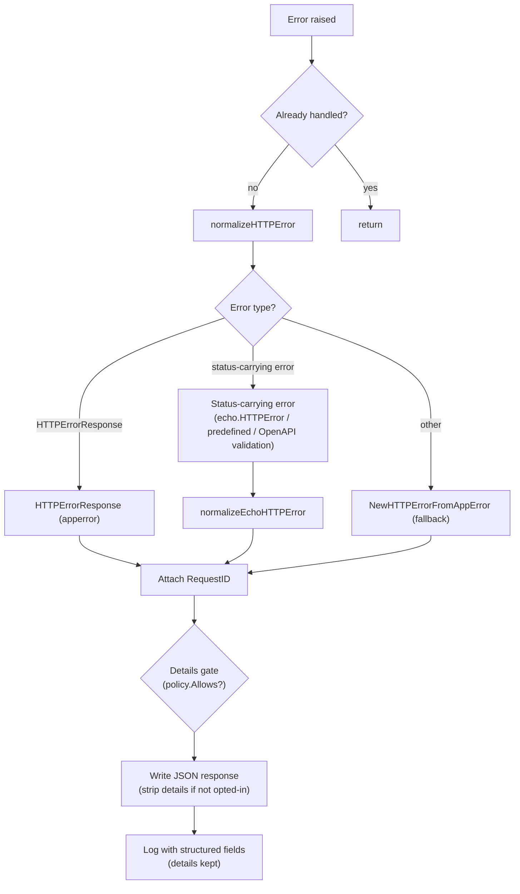

# errorhandler

English | [日本語](README.ja.md)

Unified HTTP error handler that normalizes errors from Echo, OpenAPI validation, and application-level errors into consistent JSON responses with structured logging.

## Architecture



## Error Normalization

The handler processes errors in the following priority:

### 1. `response.HTTPErrorResponse` (Application Error)

Errors already wrapped by `response.NewHTTPErrorFromAppError()` in handlers.

- If HTTP status is valid (400-599): use as-is, attach RequestID
- If HTTP status is invalid: re-normalize via `NewHTTPErrorFromAppError(internal)`

### 2. Errors carrying an HTTP status (Echo / OpenAPI Error)

Resolved with `echo.StatusCode`, so both `echo.HTTPError` and Echo's predefined errors
(`echo.ErrNotFound` and friends, whose type is unexported) are covered. OpenAPI validation
failures arrive through this path too: the validation middleware turns them into an
`echo.HTTPError` carrying the status it decided (400 for a malformed request, 404 / 405 for
an unroutable one, 401 for a rejected credential -- see the `oapi/auth` README).

A status outside 400-599 is not treated as an error status and falls through to the fallback.

### 3. Fallback

Any unrecognized error is passed to `response.NewHTTPErrorFromAppError()` which maps `apperror` types to HTTP status codes.

## Response Format

All errors are returned as JSON using `response.HTTPErrorResponse`:

```json
{
  "code": "BAD_REQUEST",
  "message": "...",
  "details": ["..."],
  "requestId": "..."
}
```

- `requestId` is always attached (extracted via `requestid.GetRequestIDFromResponse`)
- `Details` and `Internal` error are included when available
- When the error carries an `apperror.Meta`, its `code` / `message` / `details` override the status defaults inside `NewHTTPErrorFromAppError` (the HTTP status never changes) — see the `apperror.Meta` Overrides section of [`controller/error/response/README.md`](../../error/response/README.md)
- `Internal` error and stack trace are logged but **not returned to the client**

### Details opt-in gate (fail-closed)

`details` are **opt-in per endpoint**. A `DetailPolicy` (built once at startup from the OpenAPI
spec, `detail_exposure.go`) precomputes which operations declare the `ErrorResponseWithDetails`
schema. On the error path, if the response carries `details`, `handleHTTPError` resolves the
request's operation and — unless it opted in — strips `details` from the **client wire** only
(`writeErrorResponse` copies the body; the `resp` object and the logs keep the full `details`).
An unmatched route or a non-opted-in operation both fail **closed** (no `details`). The policy
router is host-agnostic (built from a servers-stripped spec copy), so proxied / test hosts still
resolve by path + method. Rationale: [ADR-0041](../../../../docs/adr/0041-error-details-opt-in-gate.md).

### `Allow` header on 405

RFC 9110 §15.5.6 requires a 405 response to carry an `Allow` header listing the methods the target
resource supports. Echo's own `methodNotAllowedHandler` sets it, but it is downstream of middleware
that can short-circuit a 405 before reaching it — the OpenAPI validation middleware returns 405 the
moment its own router reports `ErrMethodNotAllowed`. The handler therefore sets `Allow` itself, before
the body is written, for every 405 it writes.

Two routers can decide a 405, so the value has two sources, tried in order:

1. **Echo's router** — `echo.ContextKeyHeaderAllow`, resolved before any `Use` middleware runs, so it
   is readable no matter which layer emitted the 405. Echo only populates it when Echo itself decided
   405, which makes it authoritative when present (the ops paths always take this source, since they
   skip OpenAPI validation entirely).
2. **The OpenAPI spec** (`AllowPolicy`, `allow_methods.go`) — a startup-built map from path template
   to `Allow` value. This covers the case Echo cannot answer: where a static path and a parameterized
   path overlap (`/v1/users/me` vs `/v1/users/{userId}`), a method missing from the static path may
   still match the parameterized route, so Echo never takes its 405 branch and only the OpenAPI router
   reports 405. Because a 405 request resolves to no route by definition, the policy probes the router
   with the other methods to recover the path template, then looks up the precomputed value.

`OPTIONS` is always listed first, matching Echo (which answers `OPTIONS` itself regardless of the
spec).

RFC 9110 makes the header a MUST, and the two sources together satisfy that: a 405 from Echo's router
always carries `ContextKeyHeaderAllow`, and a 405 from the OpenAPI router implies the path is in the
spec, so the probe resolves it. That claim is pinned by a contract test which sweeps every path in the
real spec and asserts a non-empty `Allow` — a route registered on Echo but absent from the spec is the
one way to break it, which is a spec-bypass problem rather than a resolution one.

The OpenAPI spec does not declare this header. Declaring it would make oapi-codegen generate a
`Headers` struct on the 405 response type whose `Visit…Response` writes the field unconditionally, so
a strict handler returning the zero value would emit an empty `Allow` — worse than the header being
supplied here. Declaring it also trips `owasp:api8:2023-define-cors-origin`, which only inspects
responses that declare a `headers` block and would then demand `Access-Control-Allow-Origin` on this
one response alone (CORS is applied across the stack by the `cors` middleware, not per response).

## Logging

Error logging is controlled by `ObservabilityConfig.TargetStatusCodeSet()`:

- Only status codes in the configured set are logged
- **5xx**: Logged at `Error` level (`errorhandler.server_error`)
- **4xx**: Logged at `Warn` level (`errorhandler.client_error`)

Log fields include:

- HTTP status, error code, error message, RequestID
- Request details (method, path, URI, remote IP, host, user agent, etc.)
- Query and path parameters
- Trace ID / Span ID (if observability is enabled)
- Internal error message and stack trace (for debugging)

## Re-entrance Guard

On first invocation the handler calls `ctxhelper.SetErrorHandledToEcho(c, true)`; subsequent invocations short-circuit via `ctxhelper.GetErrorHandledFromEcho(c)` so a second error raised during error-response writing cannot trigger infinite recursion. The flag is a typed sentinel generated by `scripts/genctxkey` and stored on the request context, not on the Echo store.

## Recovery Coordination

When the upstream `recovery` middleware has already logged the panic, the same context carries the `Recovered` sentinel set via `ctxhelper.SetRecoveredToEcho(c, true)`. The handler checks `ctxhelper.GetRecoveredFromEcho(c)` before calling `logHTTPError` to skip the duplicate log line (the 500 response itself is still written).

## File Structure

|File|Responsibility|
|---|---|
|`http_error_handler.go`|Main handler, normalization dispatcher, logging|
|`echo_http_error_handler.go`|Normalize errors carrying an HTTP status to `HTTPErrorResponse`|
|`detail_exposure.go`|`DetailPolicy` — per-endpoint `details` opt-in resolved from the OpenAPI spec, plus the shared host-agnostic router constructor both policies build on|
|`allow_methods.go`|`AllowPolicy` — per-path `Allow` header value resolved from the OpenAPI spec|

Both spec-derived policies reach the handler as a single `Policies` value, so adding another one does
not widen `New`'s signature again.

## Test Strategy

This package is not a middleware: it replaces `e.HTTPErrorHandler`, so there is no `next` and none of the pass-through / `Before` / `After` viewpoints in [`httpstack/README.md`](../README.md) apply. Its *Real vs mocked* table still does. Two subjects live here and they fail in different directions — a policy precomputed once at startup from the OpenAPI spec and consulted per request (`DetailPolicy`), and the terminal confluence of normalize → write → log (`handleHTTPError`).

Drive the handler through `e.ServeHTTP` (after `New(e, …)`) when the assertion is about what the client actually receives — the response is only committed on the real Echo path — and call `handleHTTPError` directly with an `httptest`-built `*echo.Context` when the assertion is about a branch that produces no distinguishable response (re-entrance, commit state, log suppression). Use the real spec (`oapi/validator.GetValidator()`) when the policy is the subject, and a package-local stub returning a fixed verdict when the handler is.

### The policy fails closed

Every way of *not* resolving an opt-in must land on "no details". Two of them are reachable through the real spec and router and each needs its own case: a request matching no route, and a request whose operation resolves but has not opted in. A gate loosened to default-allow still answers every request successfully, so only these negative cases can detect it. Rationale: [ADR-0041](../../../../docs/adr/0041-error-details-opt-in-gate.md).

The other rejection reasons listed on `DetailPolicy.Allows` are not separate cases. An empty `OperationID` is rejected by the same map lookup as a non-opted-in one, because `buildDetailExposureMap` never records an empty ID — and `redocly.yaml` fails the spec lint on a missing `operationId`, so the real spec cannot produce one anyway. A nil route or a nil `Operation` alongside a nil error is a defensive guard the gorillamux router cannot produce: it sets `Operation` on every match, and builds its method set from the path item's operations. Reaching either would take a hand-written `routers.Router` injected past the constructor; leave them uncovered per `docs/testing-conventions.md` §9 rather than contriving one.

Pin the strip as **wire-only**: `details` disappear from the body handed to the client while `resp` and the log fields keep them. This one is asserted on the handler side — `Allows` returns a bool and can observe none of it — so it belongs with `handleHTTPError`, not with the policy tests. Asserting only the response body would stay green if the handler started clearing `details` on `resp` in place, which takes them away from the operator too, the opposite of what the gate is for.

**Host independence** is invisible unless a test says so. The router is built from a servers-stripped copy of the spec, so a policy test's request must carry a host matching no `servers` entry (`httptest.NewRequest`'s default `example.com` matches neither `localhost:8080` nor `api.example.com`) and the case name must state that the host is irrelevant. A regression that restores host matching makes every endpoint fail closed behind a proxy — still a valid response, still a green suite.

`buildDetailExposureMap` additionally carries a contract test against the spec itself: the set of operations it accepts is compared with the set referencing the `ErrorResponseWithDetails` schema, derived independently from the spec. It has no production counterpart by design — it is what catches an endpoint that declares the schema but never reaches the map as the spec grows.

### The handler

- **Normalization priority** — the arms of `normalizeHTTPError` are selected by error shape, so each gets its own case: an already-wrapped `HTTPErrorResponse`, an error carrying a status (`echo.HTTPError`, Echo's predefined errors whose type is unexported, an OpenAPI validation failure), and everything else. The out-of-range correction — a `HTTPErrorResponse` whose status falls outside 400-599 is re-derived from `Internal` while its `Details` survive — is its own case, being the only path that overrides a status the caller chose.
- **Re-entrance** — invoking the handler twice on one context must write the response exactly once. That count is the whole contract: a second successful write is indistinguishable from the outside, and the guard is what keeps an error raised *while writing the error response* from recursing.
- **Recovery coordination** — with the `Recovered` sentinel set the 500 is still written but no error line is logged; without it both happen. Assert both directions, since a dropped 500 and a duplicated panic log are each real defects and a one-sided test hides one of them.
- **Commit state** — an already-committed response skips the write entirely, and a failing write is logged without committing a second time. Reproduce the failure with a `ResponseWriter` whose `Write` always errors. The fallback `WriteHeader(500)` nested inside that failure additionally needs the response to be unwrappable-into-nothing: install that same writer through `c.SetResponse` as well, so `responseCommitted` stays false across the failure and the fallback runs. Give the JSON write a status other than 500 — a validation error works — because the writer records the status the JSON path sends before it fails, and only a differing status proves the trailing 500 came from the fallback. That degraded state is unreachable through the production serving path (nothing outside tests calls `c.SetResponse`), so this package-level test is the only thing holding the fallback — the same standing the `server.ResponseOf` degradation viewpoint has in [`httpstack/README.md`](../README.md), applied here to a terminal handler rather than a middleware. What it pins is that the fallback still writes the 500; the `!responseCommitted` guard around it is not observable, because `echo.Response.WriteHeader` already refuses a second write once committed.
- **Log gating** — `ObservabilityConfig.TargetStatusCodeSet()` decides whether anything is logged at all, and the 500 boundary decides `Error` vs `Warn`. Exercise a status inside and outside the set plus both sides of the boundary, asserting on the observed entry's message (`errorhandler.server_error` / `errorhandler.client_error`) — that string is what alerting keys on, not the level alone.

## Notes

- If writing the error response fails, a fallback `500` status is returned with the write error logged
- Error responses use `response.HTTPErrorResponse` from `controller/error/response/` — see that package for the error code and message mapping
- This handler replaces Echo's default error handler entirely
