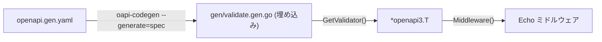

# oapi/validator

[English](README.md) | 日本語

埋め込まれた OpenAPI 仕様を読み込み、リクエストバリデーションミドルウェアを提供します。

## 仕組み



1. `oapi-codegen` が `gen/validate.gen.go` を生成（base64 エンコード + gzip 圧縮された OpenAPI 仕様を含む）
2. `GetValidator()` が `gen.GetSwagger()` を呼び出し、デコードしたスキーマを返す
3. `Middleware()` が oapi-codegen のリクエストバリデータをラップ

## バリデーション対象

ミドルウェアは以下をバリデーションします：

- **パスパラメータ** — 型、フォーマット、必須
- **クエリパラメータ** — 型、フォーマット、enum、必須
- **リクエストボディ** — スキーマ、必須フィールド、Content-Type
- **Content-Type ヘッダー** — OpenAPI 仕様と一致するか

バリデーションエラーは `openapi3filter.RequestError` として返され、`errorhandler` で捕捉されます。

## コード生成

```bash
make gen-api
```

`openapi/openapi.gen.yaml` から `gen/validate.gen.go` を再生成します。

**`gen/validate.gen.go` を手動で編集しないでください。**

## 注意点

- 仕様はコンパイル時に埋め込まれる — 実行時のファイル I/O なし
- スキーマ変更時は `make gen-api` で再生成が必要
- ハンドラ / 型の生成（`--generate=echo-server,types`）は `controller/handler/*/gen/` に配置される別の生成物
