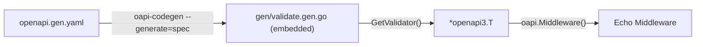

# oapi/validator

English | [日本語](README.ja.md)

Loads the embedded OpenAPI specification and provides the parsed schema that `oapi.Middleware()` consumes for request validation.

## How It Works



1. `oapi-codegen` generates `gen/validate.gen.go` containing a base64-encoded, gzipped OpenAPI spec
2. `GetValidator()` calls `gen.GetSpec()` to decode the schema, then strips `servers` so route resolution stays host-agnostic (keeping them makes the router match on Host, so any listener other than the documented `localhost:8080` answers every request with 404)
3. `oapi.Middleware()` (parent package) wraps the oapi-codegen request validator with this schema

## Validation Coverage

The middleware validates:

- **Path parameters** — type, format, required
- **Query parameters** — type, format, enum, required
- **Request body** — schema, required fields, content-type
- **Content-Type header** — must match the OpenAPI spec

Validation errors are returned as `openapi3filter.RequestError` and caught by the `errorhandler`.

## Code Generation

```bash
make gen-api
```

This regenerates `gen/validate.gen.go` from `openapi/openapi.gen.yaml`.

**Do not edit `gen/validate.gen.go` manually.**

## Notes

- The spec is embedded at compile time — no file I/O at runtime
- Schema changes require regeneration via `make gen-api`
- This is separate from the handler/type generation (`--generate=echo-server,types`) which lives in `controller/handler/*/gen/`
