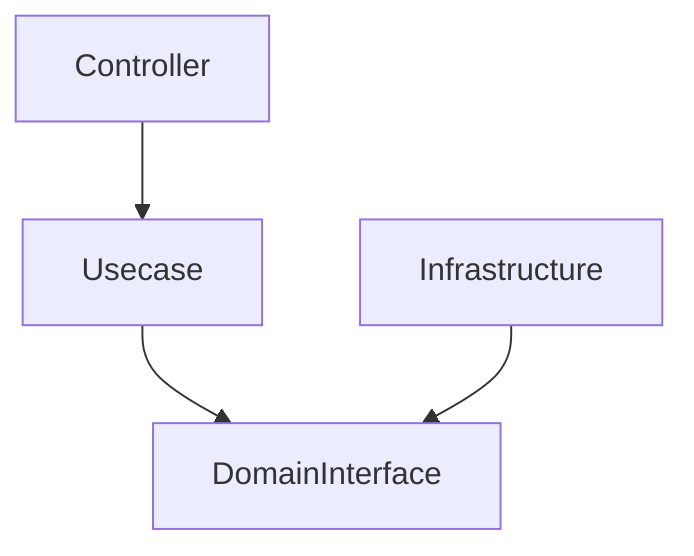
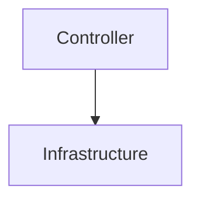
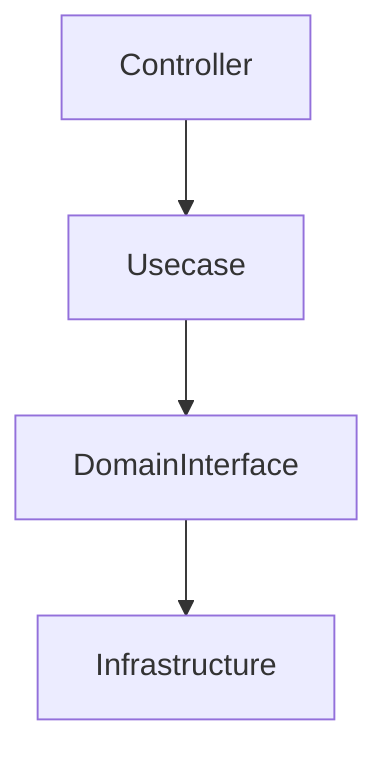
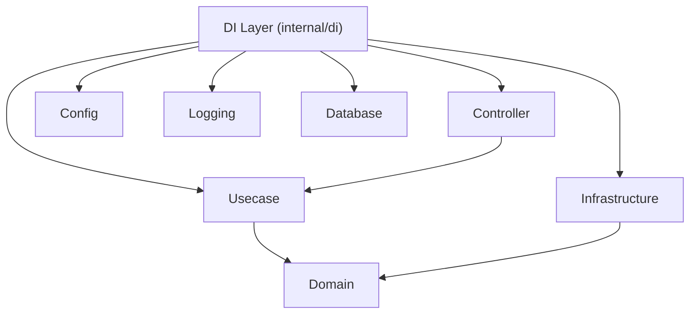
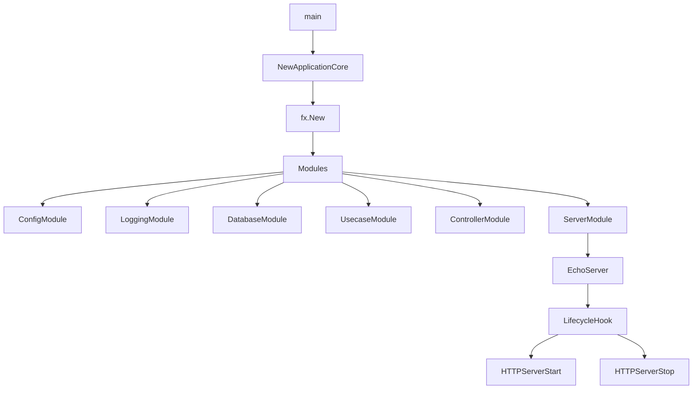
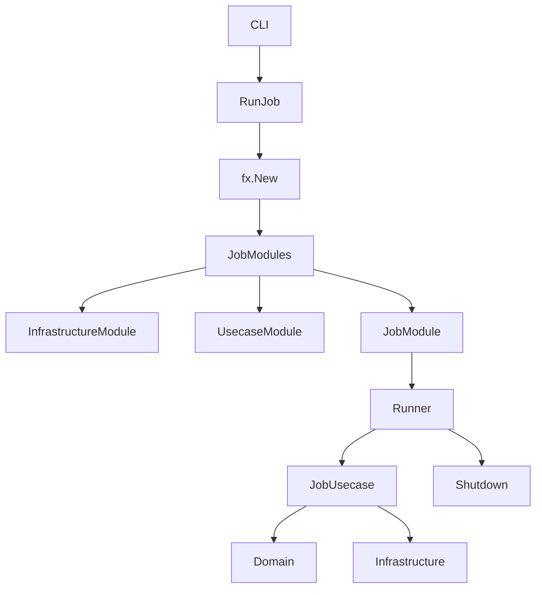
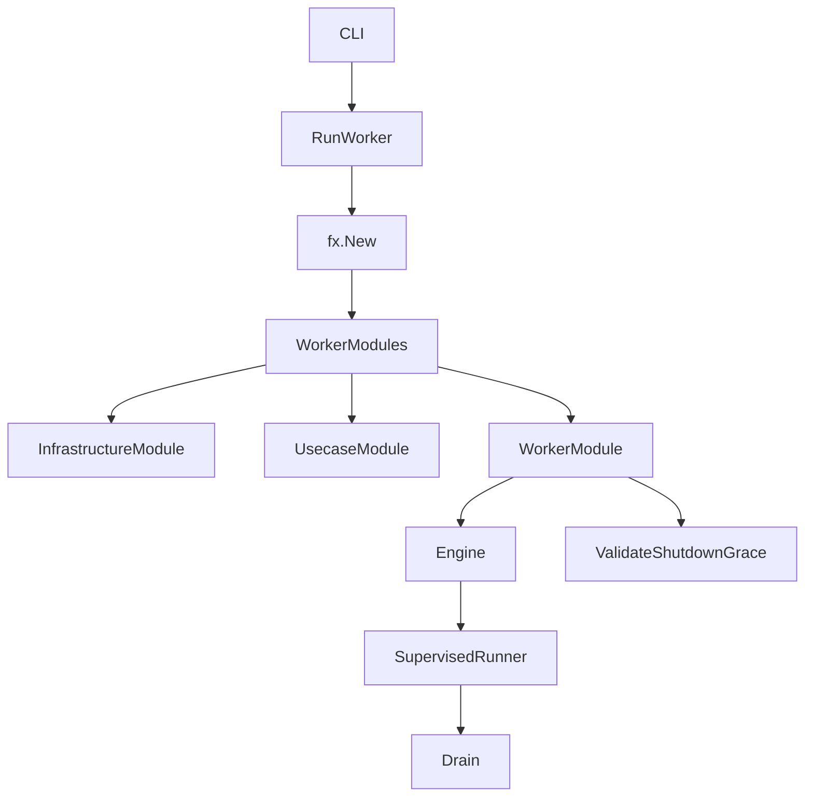
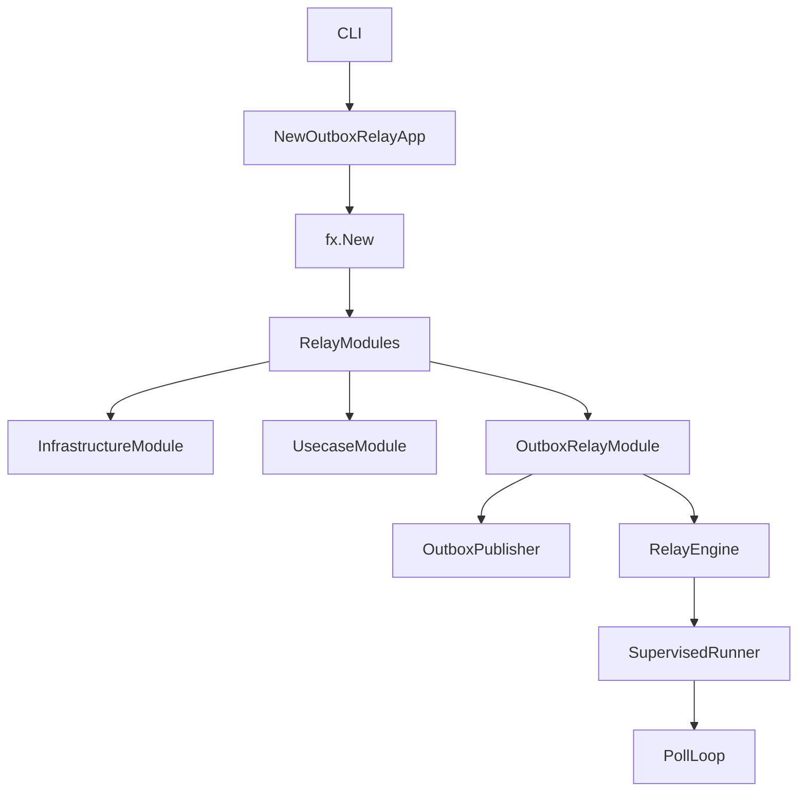
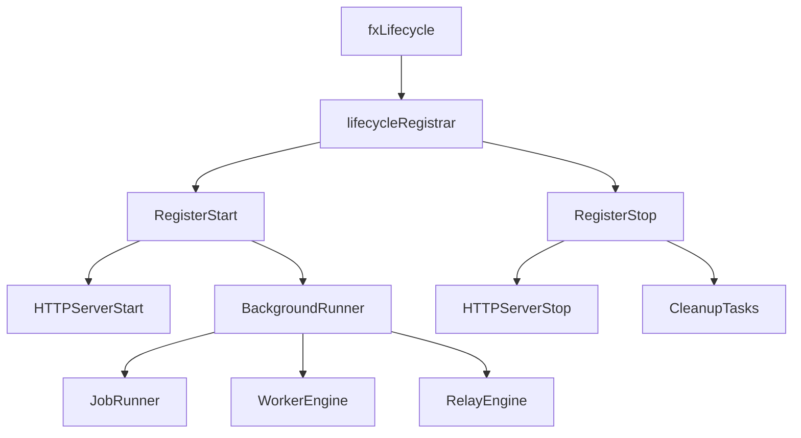
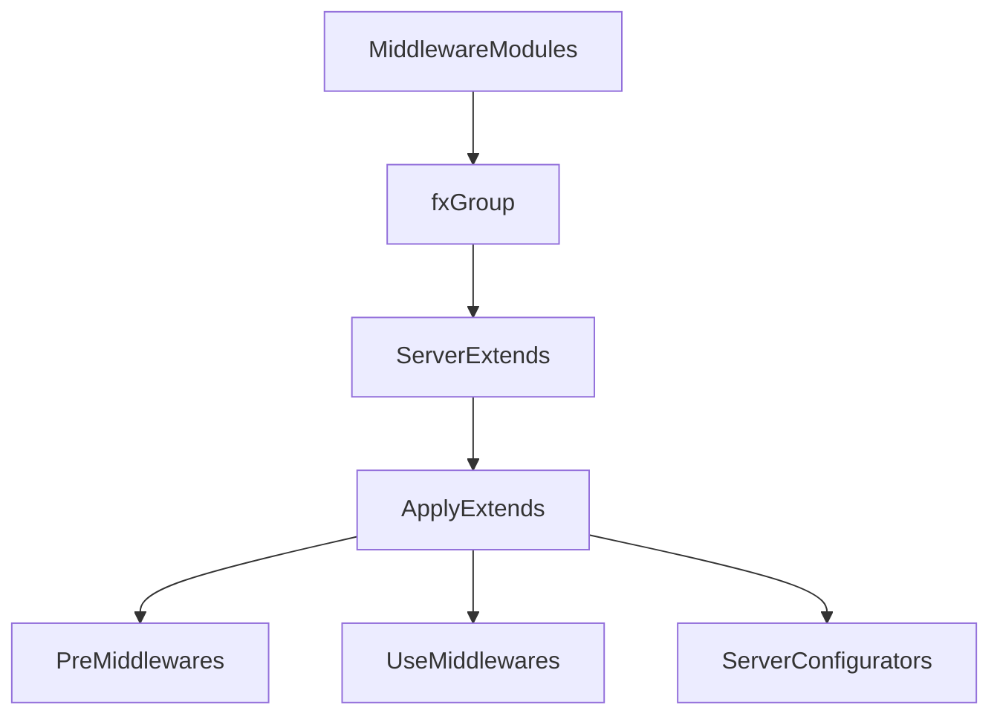

# DI Layer (`internal/di`)

[English](README.md) | 日本語

`internal/di` は、このアプリケーションにおける **依存性注入 (Dependency Injection: DI)** の中枢レイヤです。

この層は **Uber Fx** をベースとした DI コンテナを構築し、  
アプリケーションの **初期化 / 実行 / シャットダウン / ライフサイクル管理** を統括します。

このレイヤは **ビジネスロジックを持ちません**。  
代わりに以下の責務を担います。

- 各レイヤの **依存関係の構築**
- アプリケーション **実行プロファイルの切り替え**（server / job / worker / outbox-relay）
- ライフサイクル管理
- ミドルウェア / 拡張機能の構成
- Infrastructure / Usecase / Controller の接続

## Dependency Injection とは

Dependency Injection (DI) は、

> **依存関係の生成をアプリケーションコードから分離する設計パターン**

です。

通常のコードでは次のような依存関係が発生します。

```go
service := NewService(NewRepository(NewDB()))
```

このようなコードは

- 依存関係が固定される
- テストが困難になる
- 実行環境ごとの切り替えが難しい

という問題を引き起こします。

DI を利用すると、依存関係の生成は **コンテナが担当**します。

```go
fx.Provide(
    NewDB,
    NewRepository,
    NewService,
)
```

コンテナは依存関係を解析し、自動的にオブジェクトグラフを構築します。

## このアーキテクチャにおける DI の役割

このプロジェクトは **Onion Architecture / DDD** をベースに構成されています。

各レイヤの依存関係は次のようになります。



DI レイヤはこの **依存関係の接合点 (Composition Root)** を提供します。

つまり

- Domain
- Usecase
- Infrastructure
- Controller

を **最終的に組み合わせる唯一の場所**です。

## このプロジェクトでの DI の役割

このプロジェクトでは DI は次の用途で使用されています。

## 1. アプリケーション実行

DI は **アプリケーションの起動処理を管理します**

```go
fx.New(
    module.ConfigModule(),
    module.LoggingModule(),
    module.DatabaseModule(),
)
```

ここで

- 設定
- ログ
- DB
- ミドルウェア
- Controller
- Usecase

などがすべて接続されます。

## 2. 実行プロファイルの切り替え

このプロジェクトは **4種類の実行プロファイル**で動作します。各プロファイルは独立した
トップレベル entrypoint（それぞれ別の `cmd/*` サブコマンド）であり、共有された
`module.*` の部品群から自前の `fx` オブジェクトグラフを組み立てます。

|プロファイル|コマンド|Entrypoint|中心関数|用途|
|---|---|---|---|---|
|Server|`serve`|`internal/di/server.go`|`NewApplicationCore()` + `NewApplicationServer(app)`|HTTP / Web API（常駐）|
|Job|`job`|`internal/di/job.go`|`NewJobCore()` / `RunJob(grace)`|CLI / バッチ（ワンショット）|
|Worker|`worker`|`internal/di/worker.go`|`NewWorkerCore()` / `RunWorker(grace)`|キュー consumer engine（常駐）|
|Outbox Relay|`outbox-relay`|`internal/di/outboxrelay.go`|`NewOutboxRelayApp(grace)` + `NewApplicationServer(app)`／ワンショット replay は `RunOutboxReplay()`|transactional outbox の relay（常駐）＋ dead 行の replay|

4つはすべて **同じアーキテクチャ**・同じ内側レイヤ（domain / usecase /
infrastructure）を共有し、異なるのは DI グラフがどの外側モジュールを結線するかと、
プロセスの駆動方式（常駐かワンショットか）だけです。

### 各プロファイルが結線するもの

- **Server**（`NewApplicationCore`）— HTTP スタック全体:
  `lifecycle` → `config` → コア HTTP モジュール（`validator` / `security_cookie` /
  `authn` / `basicauth` / `skipper`）→ `logging` / `observability` / `db` /
  `system` → `infrastructure` / `usecase` / `controller` → server
  （`MiddlewareModule` / `Module` / `HookModule`）。`fx.WithLogger` により
  fx イベントを構造化ロガー（`NewFxEventLogger`）へ流します。
- **Job**（`NewJobCore`）— `shutdowner` + `lifecycle` + 共通基盤
  （`config` / `logging` / `observability` / `db` / `system`）+
  `infrastructure` + `usecase` + `JobModule`。`RunJob` は `job.State` を populate し、
  アプリを起動して（hook 経由で選択されたジョブを実行し）停止します。
- **Worker**（`NewWorkerCore`）— 同じ共通基盤 + `infrastructure` +
  `usecase` + `WorkerModule`。`RunWorker` は `worker.State` を populate し、
  worker engine を detached background runner として実行します。
- **Outbox Relay**（`NewOutboxRelayCore`）— 共通基盤 +
  `infrastructure` + `usecase` + `OutboxRelayModule`（これが追加で
  outbox `publisher` と relay engine を結線します）。`RunOutboxReplay` は
  同じ共通基盤を再利用し、「dead 行を pending へ戻す」ワンショット実行を行います。

server 以外の3プロファイルは `APP_SHUTDOWN_TIMEOUT` を `fx.StopTimeout(grace)` に
設定して停止軸を一本化し、fx 既定の 15s teardown が graceful shutdown / drain を
先に打ち切らないようにします。

## 3. 環境ごとの依存関係切り替え

DI によって **環境ごとの実装切り替え**が可能になります。

例：

```go
switch appCfg.Env() {
case config.EnvLocal:
    return local.New()
}
```

これにより

- Local
- CI
- Test
- Production

などの環境差分を吸収できます。

## DI レイヤの構造

```txt
internal/di
├── server.go            # Server プロファイルの entrypoint（NewApplicationCore）
├── job.go               # Job プロファイルの entrypoint（NewJobCore / RunJob）
├── worker.go            # Worker プロファイルの entrypoint（NewWorkerCore / RunWorker）
├── outboxrelay.go       # Outbox-relay の entrypoint（NewOutboxRelayApp / RunOutboxReplay）
├── fx_event_logger.go   # fxevent.Logger → 構造化ロガー の橋渡し（NewFxEventLogger）
│
├── module/              # レイヤ別の fx.Module 部品群（module/README.md 参照）
│   └── core/            # HTTP スタック共通コンポーネント（authn / basicauth / validator / …）
├── server/              # Echo サーバーモジュール（Module / MiddlewareModule / HookModule）
│   ├── extension/       # ミドルウェア & configurator の DI（inbound / outbound / security /
│   │                    #   instrumentation / testkit）
│   └── hook/            # サーバーのライフサイクルフック（HTTP 起動/停止・DB close・o11y shutdown）
├── lifecycle/           # Registrar（fx.Lifecycle の抽象化）+ SupervisedRunner
├── shutdowner/          # fx.Shutdowner のラッパー（ワンショット系の自己停止）
├── job/                 # Job Runner provider + job/hook（ライフサイクル結線）
├── worker/              # Worker Engine provider + ValidateShutdownGrace + worker/hook
└── outboxrelay/
    └── hook/            # Relay engine のライフサイクルフック
```

## Core / Optional / Adapter モジュール

`module.*` の部品群は、グラフへの入り方によって次の3層に分類されます。

### Core — 常に結線される（共有基盤）

すべての（またはほぼすべての）プロファイルに含まれます。全プロファイルが依存する
内側レイヤの基盤です。

|モジュール|役割|
|---|---|
|`lifecycle.Module()`|Start/Stop の registrar（全プロファイル）|
|`module.ConfigModule()`|Config providers + `*time.Location`（全プロファイル）|
|`module.LoggingModule()`|Logger + log-field builder（全プロファイル）|
|`module.ObservabilityModule()`|Tracer / meter / logger providers + shutdown hook（全プロファイル）|
|`module.DatabaseModule()`|`*pgxpool.Pool`・tracer・tx manager・pool metrics + DB-close hook（全プロファイル）|
|`module.SystemModule()`|ビルド情報（全プロファイル）|
|`module.InfrastructureModule()`|`persistence` / `clock` / `httpclient` / `webapi` / `auth`（JWKS profile）/ `security` / `authz` を集約（全プロファイル）|
|`module.UsecaseModule()`|`idempotency` / `outbox` を含む usecase 実装（全プロファイル）|
|`module.ControllerModule()` + `core.*` + `server.*`|HTTP スタック全体 — **Server プロファイルのみ**|

### Optional — プロファイルごとに seam へ差し込む

必要とするプロファイルにのみ結線されます。各プロファイルを特徴づける外側モジュールで、
いくつかはコンストラクタ追加用の明示的な seam を公開します。

|モジュール|結線先|補足|
|---|---|---|
|`module.JobModule()`|Job|`group:"jobs"` 登録 + Runner + State + hook|
|`module.WorkerModule()`|Worker|Engine + State + queue-stats collector。**既定では worker を1つも登録しない**（`provideWorkers` / `provideQueueStatsTargets` が seam）。`ValidateShutdownGrace` は `WORKER_DRAIN_TIMEOUT >= APP_SHUTDOWN_TIMEOUT` なら起動を失敗させる|
|`module.OutboxRelayModule()`|Outbox Relay|Relay usecase + engine + hook。`outboxPublisherModule()` も取り込む|
|`shutdowner.Module()`|Job, Worker|ワンショット / シグナル駆動の自己停止用（Server / Relay では不要）|

`outboxPublisherModule()` はあえて共有の `InfrastructureModule()` に **含めません**。
非標準の httpclient profile（例: `MaxAttempts=1`）を `httpclient_profiles` value group
へ寄与するため、他プロファイルへ漏れないよう `OutboxRelayModule()` に閉じ込めています。

### Adapter — 明示的に結線したときだけ（既定グラフには強制しない）

既定グラフが **結線しない** 具象の外部連携です。上記 Optional の seam を通じて
オプトインします。

- **キュー broker adapter**（`internal/infrastructure/queue/sqs`）— SQS
  consumer + `QueueStatsProvider`。実際の worker コンストラクタを `provideWorkers`
  で登録したときにのみ結線され、depth/DLQ メトリクスは `queuemetrics.Target` を
  `provideQueueStatsTargets` で登録したときのみ出力されます。既定の worker グラフは
  adapter なしで動作します。
- **環境ゲート付きのスタブ** — `authzModule` と `core.AuthnModule` は環境ごとに実装を
  選択し、自身の `switch` が名前を挙げていない環境に対しては **fail closed**（エラーを
  返す）ことで、未設定の環境が寛容なデフォルトのまま起動するのを防ぎます。どの環境を
  名前で挙げるかは両者で異なり、サンプル API の有無で境界が動きます。サンプルがある
  状態では `provideAuthorizer` は CI / test に allow-all を、local から production には
  `user_roles` authorizer を結線します。`make setup-remove-sample-api` 後は `user_roles`
  の case が除かれ、local / CI / test が allow-all、本番相当の環境は実際の RBAC /
  ポリシー adapter を結線するまで fail-closed になります。`core.provideAuthenticator`
  はこれとは独立にゲートされ、CI / test はスタブ、local / development は JWKS
  authenticator、staging / production は fail-closed です。共通の境界を前提とせず
  `switch` を読んでください。

## Do / Don't

## Do（やってよいこと）

### 依存関係の組み立て

DI レイヤでは **コンポーネントの接続**を行います。

```go
fx.Provide(
    NewRepository,
    NewUsecase,
    NewController,
)
```

### 環境ごとの実装切り替え

DI は **実行環境ごとの実装差し替えポイント**です。

```go
switch cfg.Env() {
case config.EnvLocal:
    return local.New()
case config.EnvProd:
    return production.New()
}
```

### ライフサイクル管理

DI レイヤでは **起動・停止フック**を登録できます。

```go
reg.RegisterStart(startFunc)
reg.RegisterStop(stopFunc)
```

例

- HTTP Server 起動 / graceful shutdown
- Job Runner（ワンショット）
- Worker engine の drain
- Outbox relay の poll ループ

### 外部フレームワークの隔離

以下の依存は **DI層に閉じ込めます**

- Echo
- Uber Fx
- DB driver
- OpenTelemetry SDK

これにより

- Domain
- Usecase

は **フレームワーク非依存になります。**

## Don't（やってはいけないこと）

### ビジネスロジックを書くこと

DI 層に書いてはいけないもの

特に、**ビジネスロジック**を書いてはいけません。

- ドメインロジック
- DBクエリ
- ビジネスルール

### レイヤを飛び越えた依存を作る

NG



正しい依存



### DI を使わず new する

NG

```go
svc := NewService()
```

正しい方法

```go
fx.Provide(NewService)
```

### Framework を Domain / Usecase に持ち込む

NG

```go
type Usecase struct {
    echo *echo.Echo
}
```

## DI 依存構造



## Server 起動フロー



## Job 実行フロー



## Worker 実行フロー



## Outbox Relay 実行フロー



`worker` / `outbox-relay` の hook（および `job` の hook）はすべて
`lifecycle.SupervisedRunner` を土台にしています。これは `OnStart` で
バックグラウンドループを goroutine として起動し、`OnStop` で（grace の範囲内で）
キャンセル・完了待ちを行う共有プリミティブです。

## Lifecycle 管理



## Server Extension Architecture



## テスト戦略

ここに書くのはレイヤ全体の基準であり、より詳細が必要なサブディレクトリは自身の README に記す（グラフ検証は `module/`、ライフサイクルフックは `server/hook/`）。

DI レイヤは配線を行うのみで、計算はしない。したがってテストは **グラフが解決すること** と **このレイヤが所有する処理本体の挙動** を検証し、ビジネス的な振る舞いは検証しない。

- **グラフの妥当性** — モジュール単位の `fx.ValidateApp`。コンストラクタもライフサイクルフックも実行せずにグラフを解決するため、配線の充足だけを証明し、それ以上は証明しない。起動に実インフラを必要としないモジュールは、加えて最小アプリを起動し、提供コンポーネントを assert してよい — グラフ検証が定義上到達できない箇所である。[`module/README.ja.md`](module/README.ja.md) を参照。
- **独自ロジックを持つ provider / `fx.Invoke` の本体** — まさにグラフ検証が到達しない箇所。単体テストで関数を直接呼ぶこと。グラフ上にしか登場しない本体は未テストである。
- **ライフサイクルフック** — `lifecycle.Registrar` のモックで登録された start / stop クロージャを捕捉して駆動する。[`server/hook/README.ja.md`](server/hook/README.ja.md) を参照。`job` / `worker` / `outboxrelay` の各フックは `lifecycle.SupervisedRunner` の上で同じ形を取り、drain 経路（cancel → grace 上限つきの wait）が固定すべき分岐となる。
- **環境ゲート付きの配線** — 環境ごとに実装を選び、担ってはならない環境では拒否（エラーを返す）する provider（`provideAuthorizer`、`core.provideAuthenticator`）は、拒否を含むゲートの **全ケース** を検証する。安全側に倒すこと自体が防御であり、解決に成功する環境しか通らないテストは要点を何も担保しない。現在の境界は推測せずゲート自身の `switch` を読むこと — どの環境がどの case に落ちるかは sample-api マーカーによって変わる。

実 Echo と実 DB を使ったプロセス全体の起動はここでは対象外 —— それは [`internal/integration`](../integration/README.ja.md) の担当。

## 設計原則

この DI レイヤは次の原則に基づいています。

### Composition Root

依存関係の接続は **DI 層のみ**

### Framework Isolation

フレームワーク依存は **DI に閉じ込める**

### Environment Switch

環境差分は **DI で切り替える**

### Plugin Architecture

拡張機能は **Module / Extension として追加**
