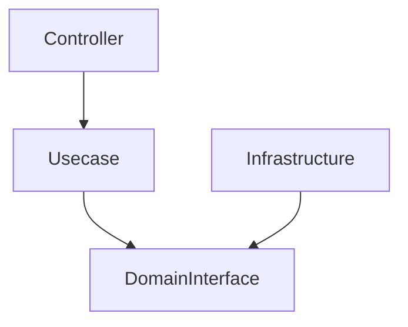
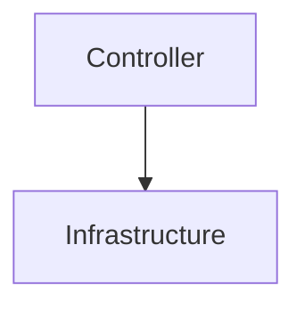
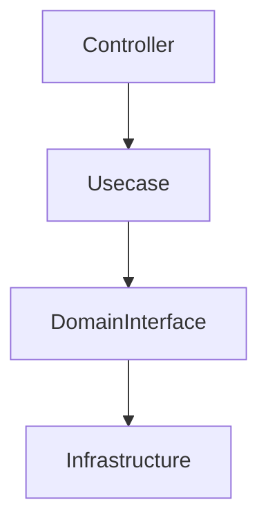
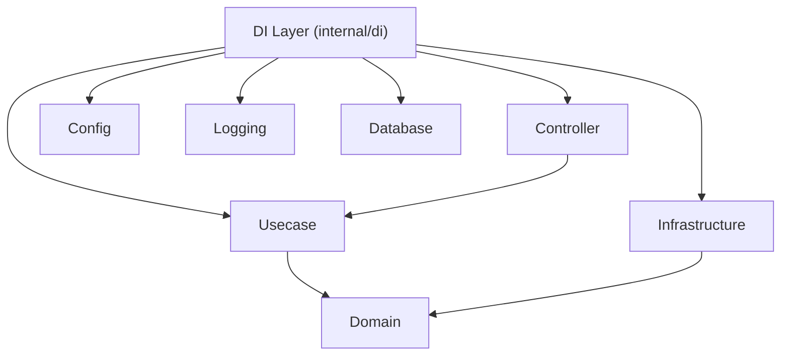
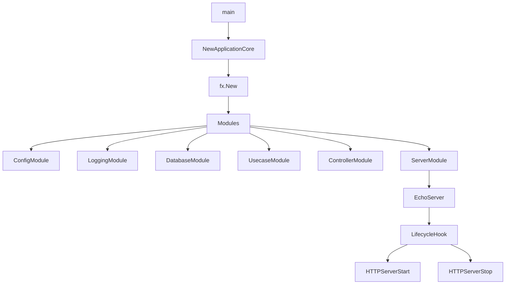
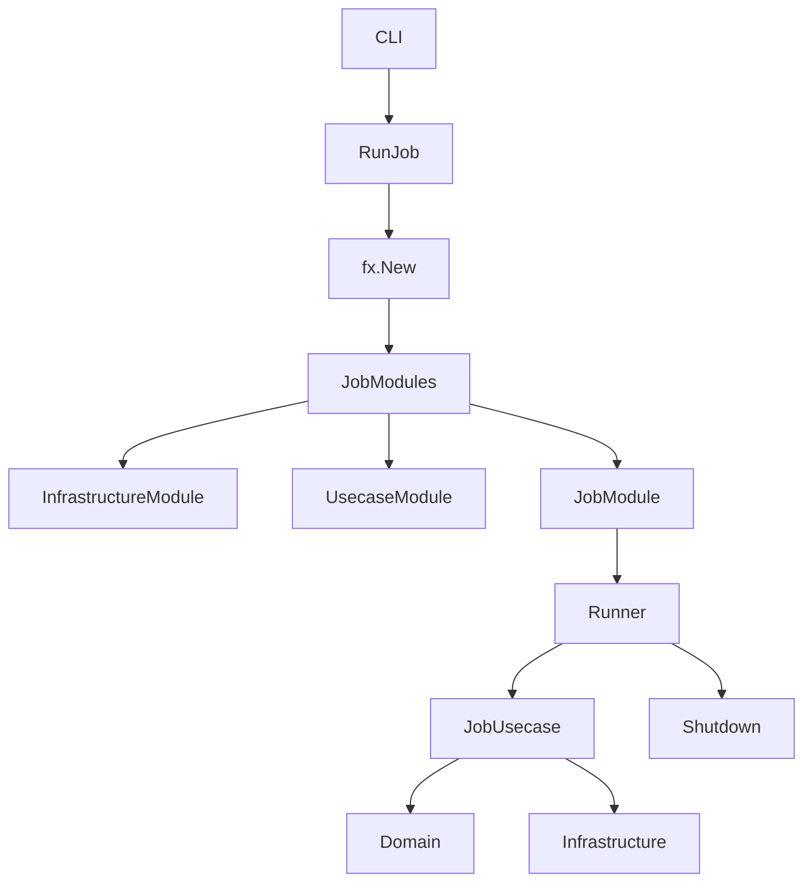
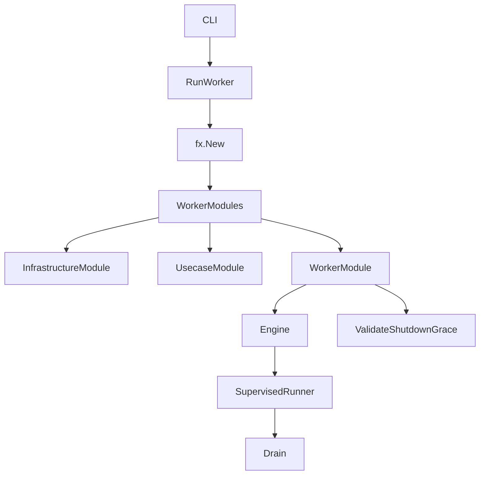
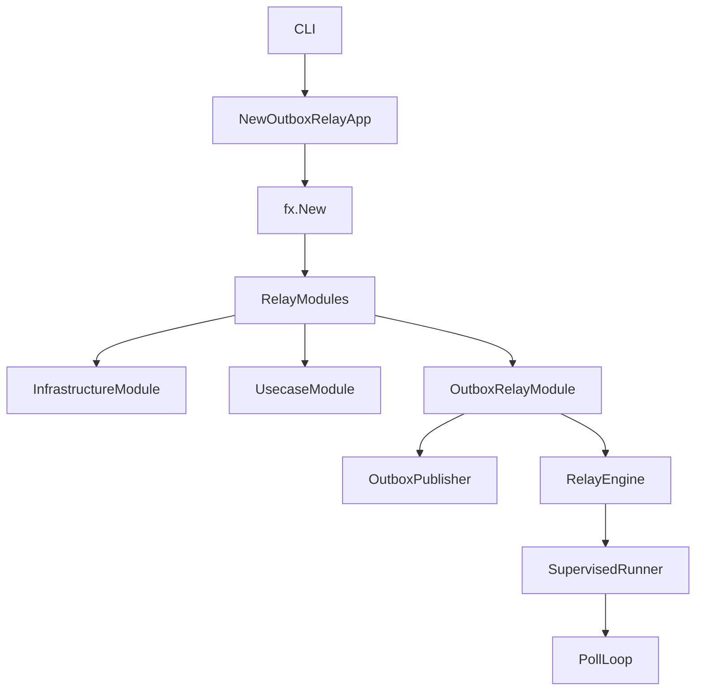
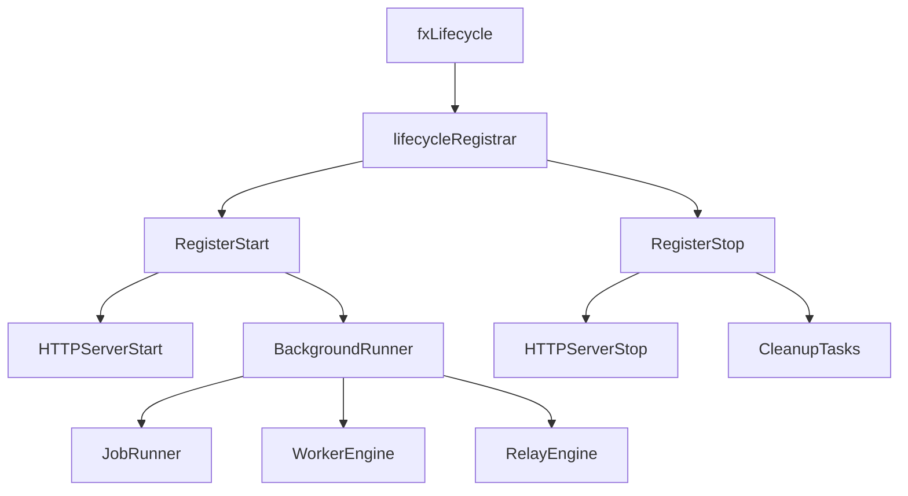
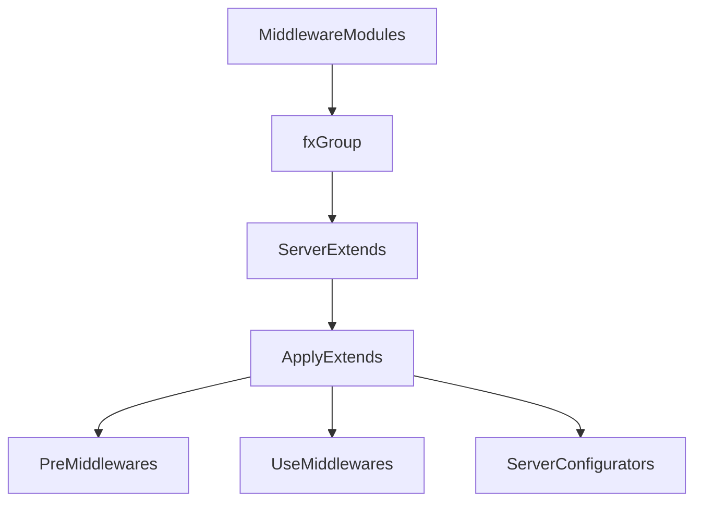

# DI Layer (`internal/di`)

English | [日本語](README.ja.md)

`internal/di` is the **central layer for Dependency Injection (DI)** in this application.

This layer builds a DI container based on **Uber Fx**,  
and orchestrates **initialization / execution / shutdown / lifecycle management** of the application.

This layer **does not contain business logic**.  
Instead, it has the following responsibilities:

- Constructing **dependencies between layers**
- Switching **application execution profiles** (server / job / worker / outbox-relay)
- Lifecycle management
- Middleware / extension configuration
- Connecting Infrastructure / Usecase / Controller

## What is Dependency Injection

Dependency Injection (DI) is:

> **A design pattern that separates dependency creation from application code**

In normal code, dependencies are created as follows:

```go
service := NewService(NewRepository(NewDB()))
```

Such code causes the following problems:

- Dependencies become fixed
- Testing becomes difficult
- Switching per execution environment becomes difficult

When using DI, dependency creation is handled by the **container**.

```go
fx.Provide(
    NewDB,
    NewRepository,
    NewService,
)
```

The container analyzes dependencies and automatically constructs the object graph.

## Role of DI in This Architecture

This project is structured based on **Onion Architecture / DDD**.

The dependencies between layers are as follows:



The DI layer provides the **composition root (junction point of dependencies)**.

In other words, it is:

- Domain
- Usecase
- Infrastructure
- Controller

the **only place where they are ultimately assembled**.

## Role of DI in This Project

In this project, DI is used for the following purposes.

## 1. Application Execution

DI **manages the application startup process**

```go
fx.New(
    module.ConfigModule(),
    module.LoggingModule(),
    module.DatabaseModule(),
)
```

Here:

- configuration
- logging
- DB
- middleware
- Controller
- Usecase

are all connected.

## 2. Execution Profile Switching

This project runs on **four execution profiles**. Each profile is a distinct
top-level entrypoint (a separate `cmd/*` subcommand) that assembles its own
`fx` object graph from a shared set of `module.*` building blocks.

|Profile|Command|Entrypoint|Core function(s)|Purpose|
|---|---|---|---|---|
|Server|`serve`|`internal/di/server.go`|`NewApplicationCore()` + `NewApplicationServer(app)`|HTTP / Web API (long-running)|
|Job|`job`|`internal/di/job.go`|`NewJobCore()` / `RunJob(grace)`|CLI / batch (one-shot)|
|Worker|`worker`|`internal/di/worker.go`|`NewWorkerCore()` / `RunWorker(grace)`|Queue consumer engine (long-running)|
|Outbox Relay|`outbox-relay`|`internal/di/outboxrelay.go`|`NewOutboxRelayApp(grace)` + `NewApplicationServer(app)`; `RunOutboxReplay()` for one-shot replay|Transactional-outbox relay (long-running) + dead-row replay|

All four share the **same architecture** and the same inner layers (domain /
usecase / infrastructure); they differ only in which outer modules the DI graph
wires and how the process is driven (long-running vs one-shot).

### What each profile wires

- **Server** (`NewApplicationCore`) — the full HTTP stack:
  `lifecycle` → `config` → core HTTP modules (`validator` / `security_cookie` /
  `authn` / `basicauth` / `skipper`) → `logging` / `observability` / `db` /
  `system` → `infrastructure` / `usecase` / `controller` → server
  (`MiddlewareModule` / `Module` / `HookModule`). `fx.WithLogger` routes fx
  events through the structured logger (`NewFxEventLogger`).
- **Job** (`NewJobCore`) — `shutdowner` + `lifecycle` + the common substrate
  (`config` / `logging` / `observability` / `db` / `system`) +
  `infrastructure` + `usecase` + `JobModule`. `RunJob` populates `job.State`,
  starts the app (which runs the selected job via its hook), and shuts down.
- **Worker** (`NewWorkerCore`) — same common substrate + `infrastructure` +
  `usecase` + `WorkerModule`. `RunWorker` populates `worker.State` and runs the
  worker engine as a detached background runner.
- **Outbox Relay** (`NewOutboxRelayCore`) — the common substrate +
  `infrastructure` + `usecase` + `OutboxRelayModule` (which additionally wires
  the outbox `publisher` and relay engine). `RunOutboxReplay` reuses the same
  common substrate for a one-shot "reset dead rows to pending" run.

The three non-server profiles set `fx.StopTimeout(grace)` from
`APP_SHUTDOWN_TIMEOUT`, unifying the stop axis so fx's default 15s teardown
never cuts off graceful shutdown / drain.

## 3. Environment-Based Dependency Switching

DI enables **implementation switching per environment**.

Example:

```go
switch appCfg.Env() {
case config.EnvLocal:
    return local.New()
}
```

This allows handling differences between:

- Local
- CI
- Test
- Production

## Structure of the DI Layer

```txt
internal/di
├── server.go            # Server profile entrypoint (NewApplicationCore)
├── job.go               # Job profile entrypoint (NewJobCore / RunJob)
├── worker.go            # Worker profile entrypoint (NewWorkerCore / RunWorker)
├── outboxrelay.go       # Outbox-relay entrypoint (NewOutboxRelayApp / RunOutboxReplay)
├── fx_event_logger.go   # fxevent.Logger → structured logger bridge (NewFxEventLogger)
│
├── module/              # Per-layer fx.Module building blocks (see module/README.md)
│   └── core/            # HTTP-stack common components (authn / basicauth / validator / …)
├── server/              # Echo server module (Module / MiddlewareModule / HookModule)
│   ├── extension/       # Middleware & configurator DI (inbound / outbound / security /
│   │                    #   instrumentation / testkit)
│   └── hook/            # Server lifecycle hooks (HTTP start/stop, DB close, o11y shutdown)
├── lifecycle/           # Registrar (fx.Lifecycle abstraction) + SupervisedRunner
├── shutdowner/          # fx.Shutdowner wrapper (self-stop for one-shot profiles)
├── job/                 # Job Runner provider + job/hook (lifecycle wiring)
├── worker/              # Worker Engine provider + ValidateShutdownGrace + worker/hook
└── outboxrelay/
    └── hook/            # Relay engine lifecycle hooks
```

## Core / Optional / Adapter Modules

The `module.*` building blocks fall into three tiers by how they enter the graph.

### Core — always wired (shared substrate)

Present in every (or nearly every) profile. These form the inner-layer
substrate that all profiles depend on.

|Module|Role|
|---|---|
|`lifecycle.Module()`|Start/Stop registrar (all profiles)|
|`module.ConfigModule()`|Config providers + `*time.Location` (all profiles)|
|`module.LoggingModule()`|Logger + log-field builder (all profiles)|
|`module.ObservabilityModule()`|Tracer / meter / logger providers + shutdown hook (all profiles)|
|`module.DatabaseModule()`|`*pgxpool.Pool`, tracer, tx manager, pool metrics + DB-close hook (all profiles)|
|`module.SystemModule()`|Build info (all profiles)|
|`module.InfrastructureModule()`|Aggregates `persistence` / `clock` / `httpclient` / `webapi` / `auth` (JWKS profile) / `security` / `authz` (all profiles)|
|`module.UsecaseModule()`|Usecase implementations incl. `idempotency` / `outbox` (all profiles)|
|`module.ControllerModule()` + `core.*` + `server.*`|Full HTTP stack — **Server profile only**|

### Optional — seam-injected per profile

Wired only for the profile that needs them; each is the profile's distinguishing
outer module and several expose explicit seams for adding constructors.

|Module|Wired in|Notes|
|---|---|---|
|`module.JobModule()`|Job|`group:"jobs"` registration + Runner + State + hook|
|`module.WorkerModule()`|Worker|Engine + State + queue-stats collector; registers **zero workers by default** (`provideWorkers` / `provideQueueStatsTargets` are the seams); `ValidateShutdownGrace` fails startup if `WORKER_DRAIN_TIMEOUT >= APP_SHUTDOWN_TIMEOUT`|
|`module.OutboxRelayModule()`|Outbox Relay|Relay usecase + engine + hook; also pulls in `outboxPublisherModule()`|
|`shutdowner.Module()`|Job, Worker|Self-stop for one-shot / signalled drives (not needed by Server / Relay)|

`outboxPublisherModule()` is deliberately **not** part of the shared
`InfrastructureModule()`: it contributes a non-standard httpclient profile
(e.g. `MaxAttempts=1`) to the `httpclient_profiles` value group, so it is
confined to `OutboxRelayModule()` to avoid leaking into other profiles.

### Adapter — explicit wiring only (never forced into the default graph)

Concrete external integrations that the default graph does **not** wire. They
are opt-in through the Optional seams above.

- **Queue broker adapter** (`internal/infrastructure/queue/sqs`) — the SQS
  consumer + `QueueStatsProvider`. Wired only when a real worker constructor is
  registered via `provideWorkers`, and its depth/DLQ metrics only when a
  `queuemetrics.Target` is registered via `provideQueueStatsTargets`. The
  default worker graph runs with no adapter.
- **Environment-gated stubs** — `authzModule` and `core.AuthnModule` select an
  implementation per environment and **fail closed** (return an error) for any
  environment their `switch` does not name, so an unconfigured environment
  cannot start with a permissive default. Which environments are named differs
  between the two, and the sample API moves the boundary: with the sample
  present, `provideAuthorizer` wires the allow-all authorizer for CI / test and
  the `user_roles` authorizer for local through production; after
  `make setup-remove-sample-api` the `user_roles` case is removed, leaving
  local / CI / test on allow-all and every production-like environment
  fail-closed until a real RBAC / policy adapter is wired.
  `core.provideAuthenticator` is gated independently: CI / test get the stub,
  local / development get the JWKS authenticator, and staging / production are
  fail-closed. Read the `switch` rather than assuming a shared boundary.

## Do / Don't

## Do（Allowed）

### Assemble dependencies

In the DI layer, **components are connected**.

```go
fx.Provide(
    NewRepository,
    NewUsecase,
    NewController,
)
```

### Switch implementations per environment

DI is the **switch point for implementation differences per execution environment**.

```go
switch cfg.Env() {
case config.EnvLocal:
    return local.New()
case config.EnvProd:
    return production.New()
}
```

### Lifecycle management

In the DI layer, **startup / shutdown hooks** can be registered.

```go
reg.RegisterStart(startFunc)
reg.RegisterStop(stopFunc)
```

Examples:

- HTTP Server startup / graceful shutdown
- Job Runner (one-shot)
- Worker engine drain
- Outbox relay poll loop

### Isolate external frameworks

The following dependencies are **contained within the DI layer**:

- Echo
- Uber Fx
- DB driver
- OpenTelemetry SDK

This ensures:

- Domain
- Usecase

are **framework-independent**.

## Don't（Prohibited）

### Writing business logic

The following must not be written in the DI layer:

In particular, do not write **business logic**.

- Domain logic
- DB queries
- Business rules

### Create dependencies that bypass layers

NG



Correct dependency



### Instantiate with `new` without DI

NG

```go
svc := NewService()
```

Correct approach

```go
fx.Provide(NewService)
```

### Bring frameworks into Domain / Usecase

NG

```go
type Usecase struct {
    echo *echo.Echo
}
```

## DI Dependency Structure



## Server Startup Flow



## Job Execution Flow



## Worker Execution Flow



## Outbox Relay Execution Flow



The `worker` / `outbox-relay` hooks (and the `job` hook) all build on
`lifecycle.SupervisedRunner`, the shared primitive that starts the background
loop in a goroutine on `OnStart` and cancels + waits for it (bounded by grace)
on `OnStop`.

## Lifecycle Management



## Server Extension Architecture



## Test Strategy

This is the layer-wide baseline; a sub-directory that needs more detail states it in its own README
(`module/` for graph validation, `server/hook/` for lifecycle hooks).

The DI layer wires — it does not compute. Tests therefore verify **that the graph resolves** and
**that the bodies this layer owns behave**, never business behavior:

- **Graph validity** — `fx.ValidateApp` per module. It resolves the graph without executing constructors or lifecycle hooks, so it proves wiring completeness and nothing else. See [`module/README.md`](module/README.md).
- **Provider / `fx.Invoke` bodies with their own logic** — precisely what graph validation does *not* reach. Call the function directly in a unit test; a body that only appears in the graph is untested.
- **Lifecycle hooks** — capture the registered start / stop closures through a `lifecycle.Registrar` mock and drive them. See [`server/hook/README.md`](server/hook/README.md); the `job` / `worker` / `outboxrelay` hooks share that shape on top of `lifecycle.SupervisedRunner`, where the drain path (cancel → wait, bounded by grace) is the branch to pin.
- **Environment-gated wiring** — a provider that selects an implementation per environment and refuses (returns an error) for the environments it must not serve (`provideAuthorizer`, `core.provideAuthenticator`) is exercised on **every** case of the gate, refusal included. The refusal is the safeguard, so a test that only covers the environments that resolve covers nothing that matters. Read the gate's own `switch` for its current boundary rather than assuming it — the sample-api markers move which environments land in which case.

Whole-process startup against a real Echo and a real database is out of scope here — that is
[`internal/integration`](../integration/README.md).

## Design Principles

This DI layer is based on the following principles.

### Composition Root

Dependency wiring is done **only in the DI layer**

### Framework Isolation

Framework dependencies are **contained within DI**

### Environment Switch

Environment differences are **handled in DI**

### Plugin Architecture

Extensions are added as **Modules / Extensions**
