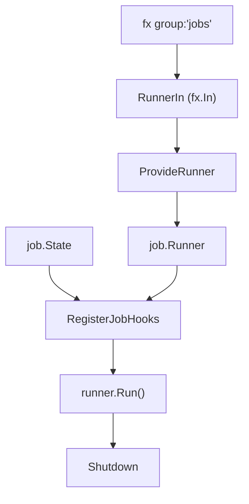

# job DI モジュール

[English](README.md) | 日本語

`internal/di/job` は、ジョブ実行に関わる **DI（依存性注入）コンポーネント**を提供するパッケージです。

## 役割

このディレクトリはアプリケーションのジョブフレームワークと `fx` の DI 結合点です。`group:"jobs"` タグで登録されたすべての `job.Job` プロバイダを集約して `Runner` に組み立て、CLI が指定する「どのジョブを、どの引数で実行し、完了通知をどこに送るか」を保持する `State` を提供し、起動時に該当ジョブを実行する lifecycle hook を配線します。上位コード（`internal/controller/job`、`cmd/`、個別ジョブ実装）はここでの抽象に依存し、fx 固有のグルーコードはすべて本パッケージに閉じ込めることで、それ以外のコードを framework-agnostic に保ちます。

## 構成

```text
internal/di/job/
├── runner.go   # Runner の DI プロバイダー
└── hook/       # ライフサイクルフック（起動時ジョブ実行）
```

## アーキテクチャ



## DI 登録例

```go
fx.Provide(
    job.ProvideRunner,
    jobcontroller.NewState,
)
fx.Invoke(hook.RegisterJobHooks)
```

## ジョブ実行フロー

1. CLI が `state.Set(name, args, done)` でジョブ情報をセット
2. アプリケーション起動
3. Start フックが `state.Snapshot()` を参照
4. `done` が存在すれば `runner.Run()` でジョブを非同期実行
5. 結果を `done` チャネルに送信後、アプリケーションをシャットダウン

## 注意点

- `state.Set` はアプリケーション起動前に行う必要がある
- フックのライフサイクル詳細（`done == nil` での即時シャットダウン・ゴルーチン実行・停止時キャンセル）は [`hook/README.ja.md`](hook/README.ja.md) を参照
- ジョブの追加は `internal/di/module/job.go` の `provideJobs(...)` に追加する
