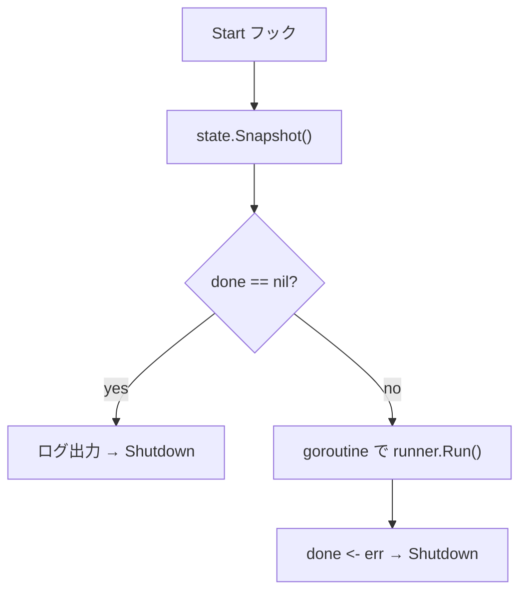

# job hook

[English](README.md) | 日本語

`internal/di/job/hook` は、アプリケーション起動時に CLI で指定されたジョブを自動実行するための **ライフサイクルフック**を登録するパッケージです。

## 役割

`RegisterJobHooks` が `lifecycle.Registrar` に Start フックを登録し、起動時に以下の処理を行います。



- `done` が `nil` の場合：ジョブなしと判断し、即座にシャットダウン
- `done` が存在する場合：別ゴルーチンでジョブを実行し、結果を `done` チャネルに送信後シャットダウン

## 公開 API

```go
func RegisterJobHooks(
    reg lifecycle.Registrar,
    sd shutdowner.Shutdowner,
    runner job.Runner,
    logger logging.Logger,
    osCfg *config.OperatingSystemConfig,
    state job.State,
)
```

DI での登録：

```go
fx.Invoke(hook.RegisterJobHooks)
```

## 使用フロー

CLI 側で起動前に `State` をセットしておきます。

```go
done := make(chan error, 1)
state.Set("user-count", []string{"--active-only"}, done)
// アプリケーション起動 → Start フックでジョブが実行される
err := <-done
```

## 注意点

- `state.Set(name, args, done)` をアプリケーション起動前に行う必要がある
- ジョブ実行は別ゴルーチンで非同期に開始される
- `done` チャネルはフック側で `close` する（呼び出し側でクローズしないこと）
- `shutdowner.Shutdown()` によりジョブ完了後にアプリケーション停止がトリガーされる
