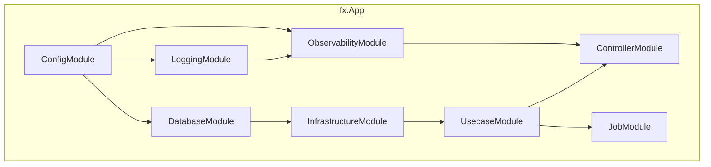

# DI モジュール (`internal/di/module`)

アプリケーションの各レイヤを `fx` ベースで束ねる **DI モジュール群**を配置するディレクトリです。

各ファイルは `fx.Option` を返す関数を公開し、アプリ起動時に必要なコンポーネントを DI コンテナに登録します。

## モジュール一覧

|関数|ファイル|提供するコンポーネント|
|---|---|---|
|`ConfigModule()`|`config.go`|設定（`*Config` + 全 SubConfig プロバイダー + `*time.Location`）|
|`ControllerModule()`|`controller.go`|HTTP ハンドラの登録（`fx.Invoke` で `BindHandler` を実行）|
|`DatabaseModule()`|`db.go`|DB 接続（`*pgxpool.Pool`）+ ドライバ / トランザクションマネージャ / メトリクス|
|`InfrastructureModule()`|`infrastructure.go`|concern ごとのサブモジュールの集約: persistence（repository / query service / command service / system query）+ clock + httpclient + webapi gateway + object storage + auth（JWKS profile）+ authz|
|`JobModule()`|`job.go`|ジョブ登録（`group:"jobs"`）+ Runner + State + Hook|
|`LoggingModule()`|`logging.go`|Logger + LogFieldBuilder|
|`ObservabilityModule()`|`observability.go`|TracerProvider + TracerFactory|
|`OutboxRelayModule()`|`outboxrelay.go`|outbox relay engine + `provideRelaySettings` + `NewRelay` usecase + `OutboxMetrics` + Hook（`RegisterRelayHooks`）。チャネルが必要とする publisher モジュール — `http` なら `outboxPublisherModule()`、`realtime` なら `realtimePublisherModule()`（`realtimepublisher.go`: EventLog append → wakeup publish）— を内包し、それ以外のチャネルでは構築に失敗する。relay 専用プロセス（`cmd outbox-relay`）のみで使用|
|`RealtimeAdapterModule()`|`realtimeadapter.go`|feature の realtime adapter が要る最小の Realtime seam。DynamoDB クライアント・stream ticket の store・ticket 生値の生成・`TicketIssuer` ユースケース——ticket を発行するまでの経路だけを持ち、受信側は持たない。feature adapter はあるが Realtime runtime が要らない graph 向けに **serve プロファイル**へ結線する。`realtimeModule()` がこれを合成するため、両者を 1 つの graph へ結線してはならない（fx は module を重複排除しないので共有する型が二重提供になる。`realtimeadapter_test.go` が固定している）。分けてあるのは設計正本 （`docs/design/realtime-delivery.md`）の "Zero adapters, zero runtime" を規約ではなく構造で表すため。採番境界はここには無い——PostgreSQL 実装であり `persistenceModule()` が既に提供している|
|`RealtimeCleanupModule()`|`realtimecleanup.go`|orphan cleanup ジョブ。`group:"jobs"` への登録を `JobModule()` ではなくこの module が行う。Realtime の依存は graph に載せず、実行時に組み立てるファクトリをジョブへ渡す。job プロファイル専用（`cmd job`）|
|`SystemModule()`|`system.go`|BuildInfo（バージョン / リビジョン / ビルド日時）|
|`UsecaseModule()`|`usecase.go`|ユースケース実装の登録|
|`WorkerModule()`|`worker.go`|worker 登録（`group:"workers"`）+ Engine（`ProvideEngine`）+ State + `WorkerMetrics` + queue stats 収集器（`provideQueueStatsCollector`）+ 停止猶予検証（`ValidateShutdownGrace`）+ Hook（`RegisterWorkerHooks`）。既定では worker を 1 つも登録しない|

### サブディレクトリ

|ディレクトリ|説明|詳細|
|---|---|---|
|`core/`|HTTP スタック共通コンポーネント（認証等）の DI モジュール群|[README](core/README.ja.md)|

## アーキテクチャ

## 設計方針

- 各モジュールはレイヤの境界に対応（config / logging / db / infra / usecase / controller / job / worker / outbox-relay）
- モジュール間の依存は fx が自動解決する
- モジュールの追加は新しいファイルを作成し、アプリのルートモジュールに追加するだけ
- `InfrastructureModule()` は純粋な**集約ポイント**であり、concern ごとのサブモジュールを束ねるだけ。これにより fx の依存グラフをコンポーネント単位で読みやすく保つ。各 concern はそれぞれ独立したファイルに置く — `persistence.go`（`persistenceModule()`）/ `clock.go`（`clockModule()`）/ `httpclient.go`（`httpClientModule()`）/ `webapi.go`（`webapiModule()`）/ `objectstorage.go`（`objectStorageModule()`）/ `auth.go`（`authModule()`）/ `authz.go`（`authzModule()`） — `infrastructure.go` はこれらを `infrastructure` モジュール配下に束ねるだけ。`realtime.go`（`realtimeModule()`: Realtime Delivery の store、`AccessRevoker` / `LeaseKeeper` を含む機構側 usecase、`oapi.security.schemes` group へ出す `StreamTicket` security scheme の認証器、fan-out — `RevocationNotifier`、環境で選ばれた `AttributesBuilder`（local / ci / test / dast は emulator 用の集合、`dev` 以降は queue policy を含む完全な集合、それ以外は fail-closed）を持つ instance の `InstanceSubscription`、consumer エンジンと lease heartbeat、connection registry — 1 つの `stream.Registry` を 4 つの名前で供給する: SSE handler が呼ぶ `Streamer`、consumer エンジンが通知を渡す `Waker` と `Revoker`、そして HTTP shutdown の前に接続を閉じる `serve.drainers` の participant — および `server/hook` の `serve.*` group へ出す serve lifecycle の participant）は並んで存在し、feature の realtime adapter が必要としたときに **serve profile だけ**へ結線する（設計 §3.1）。relay / job / worker profile が共有する `InfrastructureModule()` には決して入れない: SSE handler を登録するため `*echo.Echo` を必要とし、さらに `provideRealtimeClient` / `provideEventLogStore` / `provideRealtimeFanout` を `realtimePublisherModule()` と共有しているので、この 2 つが 1 つの graph で出会ってはならない。graph は単体で検証する。`provideRealtimeProvisioner` は lease と instance queue を 1 つの participant に合成し、その順序（起動時は lease → queue、停止時は queue → lease）が仕様の無い fx の group 順序に依存しないようにする。`realtimecleanup.go`（`RealtimeCleanupModule()`）は job プロファイル側の対応物で、Realtime の依存を graph に**一切載せない**。lease store・`OrphanReclaimer`・`OrphanSweeper` はジョブが実際に走るときに組み立てるファクトリとして提供し、ジョブ自体は共有の `provideJobs` ヘルパーで `group:"jobs"` へ登録する。遅延は最適化ではなく要件で、fx は `Runner` を組むために登録済みジョブの constructor をすべて実行するため、eager に載せた fan-out（`REALTIME_TOPIC` が空なら fail-closed）は、topic を空にしている環境で `outbox-gc` を含む無関係なジョブまで起動不能にする。`JobModule()` ではなくここから登録することが、共有のジョブモジュールを Realtime から自由に保ち、template 利用者が `internal/di/job.go` の 1 行を消すだけで Realtime を落とせる形にしている。各 concern ファイルには対の `*_test.go` があり個別の `Test<Concern>Module_GraphIsValid` を持つ。`infrastructure_test.go` は集約後の全体を検証する。
  - RDB 系プロバイダ（`repository` / `query_service` / `command_service` / `system_cqrs`）は `persistence` サブモジュール配下に入れ子化し、`DatabaseModule()` の `db`（接続レイヤ）と区別している。clock サブモジュールは `SystemModule()` の `system` ラベルとの衝突を避けるため `system` ではなく `clock` と命名している。`webapi` / `outbox_publisher` は `httpclient` substrate に依存する。`authz` サブモジュール（`provideAuthorizer`）は環境ゲート付きで、全許可スタブを local / CI / test のみに配線し、それ以外では fail-closed（エラーを返す）。スタブ配線時には起動時 WARN を出す（`core` の `authn` プロバイダと対をなす）。

## テスト戦略

各モジュールには対の `*_test.go` があり、`fx.ValidateApp` を呼ぶ `Test<Module>_GraphIsValid` を持つ（`graph_helper_test.go` の `validateGraph` / `commonDeps` 参照）。これは依存グラフが型欠落なく結線されることを検証する — `fx.ValidateApp` はコンストラクタやライフサイクルフックを実行しないため、実インフラ（DB / ネットワーク）を立てずに済む。

実インフラを避けることがこの形の理由なので、実インフラに依存しないモジュールは追加で最小アプリを起動し、提供コンポーネントを assert してよい。[`core/`](core/README.ja.md) 配下が全てこれに当たり、本ベースラインの上に 2 段目を重ねている。基準はディレクトリではなくモジュールのクロージャにある。

同じ性質ゆえ、独自ロジックを持つ provider / `fx.Invoke` 本体（例: `provideQueueStatsCollector`）はグラフ検証テストでは**実行されない** — 分岐網羅には直接の単体テスト（関数を実際に呼ぶ）が要る。

グラフ検証が見るのはモジュールが*列挙している*ものだけなので、`ControllerModule()` の `fx.Invoke` から漏れた `BindHandler` はこのテストからは見えない。列挙が*網羅的である*こと — `BindHandler` を宣言するハンドラパッケージ 1 つにつき 1 エントリ — は `internal/architest` の `TestBindHandlerDIParity` が別途機械検証する。

## 注意点

- 各モジュールは `fx.App` の Start / Stop ライフサイクルに依存する
- モジュールを無効化すると、そのコンポーネントが注入されずアプリが起動しなくなる
