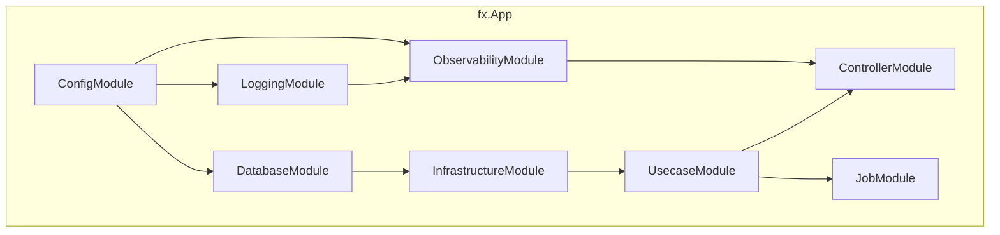

# DI Module (`internal/di/module`)

English | [日本語](README.ja.md)

A directory containing **DI module groups** that wire up each application layer using `fx`.

Each file exposes a function returning `fx.Option` to register the necessary components in the DI container at application startup.

## Module List

|Function|File|Provided Components|
|---|---|---|
|`ConfigModule()`|`config.go`|Config (`*Config` + all SubConfig providers + `*time.Location`)|
|`ControllerModule()`|`controller.go`|HTTP handler registration (`fx.Invoke` to run `BindHandler`)|
|`DatabaseModule()`|`db.go`|DB connection (`*pgxpool.Pool`) + driver / transaction manager / metrics|
|`InfrastructureModule()`|`infrastructure.go`|Aggregation of per-concern submodules: persistence (repository / query service / command service / system query) + clock + httpclient + webapi gateway + outbox publisher + authz|
|`JobModule()`|`job.go`|Job registration (`group:"jobs"`) + Runner + State + Hook|
|`LoggingModule()`|`logging.go`|Logger + LogFieldBuilder|
|`ObservabilityModule()`|`observability.go`|TracerProvider + TracerFactory|
|`OutboxRelayModule()`|`outboxrelay.go`|Outbox relay engine + `provideRelaySettings` + `NewRelay` usecase + `OutboxMetrics` + Hook (`RegisterRelayHooks`); bundles `outboxPublisherModule()`. Relay-dedicated process only (`cmd outbox-relay`)|
|`SystemModule()`|`system.go`|BuildInfo (version / revision / build date)|
|`UsecaseModule()`|`usecase.go`|Usecase implementation registration|
|`WorkerModule()`|`worker.go`|Worker registration (`group:"workers"`) + Engine (`ProvideEngine`) + State + `WorkerMetrics` + queue-stats collector (`provideQueueStatsCollector`) + shutdown-grace validation (`ValidateShutdownGrace`) + Hook (`RegisterWorkerHooks`). No worker is registered by default|

### Subdirectories

|Directory|Description|Details|
|---|---|---|
|`core/`|DI modules for HTTP stack common components (auth, etc.)|[README](core/README.md)|

## Architecture

## Design Policy

- Each module corresponds to a layer boundary (config / logging / db / infra / usecase / controller / job / worker / outbox-relay)
- Inter-module dependencies are automatically resolved by fx
- Adding a module is as simple as creating a new file and adding it to the app's root module
- `InfrastructureModule()` is purely an **aggregation point**: it only composes per-concern submodules so the fx dependency graph stays readable per component group. Each concern lives in its own file — `persistence.go` (`persistenceModule()`), `clock.go` (`clockModule()`), `httpclient.go` (`httpClientModule()`), `webapi.go` (`webapiModule()`), `outboxpublisher.go` (`outboxPublisherModule()`), `authz.go` (`authzModule()`) — and `infrastructure.go` simply binds them under the `infrastructure` module. Each concern file has a sibling `*_test.go` with its own `Test<Concern>Module_GraphIsValid`, while `infrastructure_test.go` validates the aggregated whole.
  - The RDB-backed providers (`repository` / `query_service` / `command_service` / `system_cqrs`) are nested under the `persistence` submodule, distinguishing them from `DatabaseModule()`'s `db` connection layer. The `clock` submodule is named `clock` (not `system`) to avoid colliding with `SystemModule()`'s `system` label. `webapi` / `outbox_publisher` depend on the `httpclient` substrate. The `authz` submodule (`provideAuthorizer`) is environment-gated: it wires the allow-all stub only for local / CI / test and fails closed (returns an error) elsewhere, emitting a startup WARN when the stub is wired (mirroring the `core` `authn` provider).

## Test Strategy

Each module has a sibling `*_test.go` with a `Test<Module>_GraphIsValid` that calls `fx.ValidateApp` (see `graph_helper_test.go`'s `validateGraph` / `commonDeps`). This validates the dependency graph is wired with no missing types — **without** standing up real infrastructure (DB / network), because `fx.ValidateApp` does not execute constructors or lifecycle hooks.

That same property means a provider / `fx.Invoke` body carrying its own logic (e.g. `provideQueueStatsCollector`) is **not** exercised by the graph-validation test — it needs a direct unit test (call the function) for branch coverage.

Graph validation also only covers what the module *does* enumerate, so a `BindHandler` missing from `ControllerModule()`'s `fx.Invoke` stays invisible to it. That the enumeration is *complete* — one entry per handler package declaring a `BindHandler` — is machine-verified separately by `TestBindHandlerDIParity` in `internal/architest`.

## Notes

- Each module depends on the `fx.App` Start / Stop lifecycle
- Disabling a module will prevent its components from being injected, causing the app to fail to start
