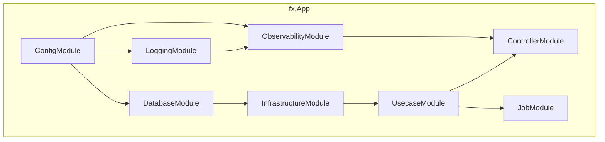

# DI Module (`internal/di/module`)

A directory containing **DI module groups** that wire up each application layer using `fx`.

Each file exposes a function returning `fx.Option` to register the necessary components in the DI container at application startup.

## Module List

|Function|File|Provided Components|
|---|---|---|
|`ConfigModule()`|`config.go`|Config (`*Config` + all SubConfig providers + `*time.Location`)|
|`ControllerModule()`|`controller.go`|HTTP handler registration (`fx.Invoke` to run `BindHandler`)|
|`DatabaseModule()`|`db.go`|DB connection (`*pgxpool.Pool`) + driver / transaction manager / metrics|
|`InfrastructureModule()`|`infrastructure.go`|Aggregation of per-concern submodules: persistence (repository / query service / command service / system query) + clock + httpclient + webapi gateway + object storage + auth (JWKS profile) + authz|
|`JobModule()`|`job.go`|Job registration (`group:"jobs"`) + Runner + State + Hook|
|`LoggingModule()`|`logging.go`|Logger + LogFieldBuilder|
|`ObservabilityModule()`|`observability.go`|TracerProvider + TracerFactory|
|`OutboxRelayModule()`|`outboxrelay.go`|Outbox relay engine + `provideRelaySettings` + `NewRelay` usecase + `OutboxMetrics` + Hook (`RegisterRelayHooks`); bundles the publisher module the channel needs — `outboxPublisherModule()` for `http`, `realtimePublisherModule()` (`realtimepublisher.go`: EventLog append → wakeup publish) for `realtime` — and fails to build for any other channel. Relay-dedicated process only (`cmd outbox-relay`)|
|`RealtimeAdapterModule()`|`realtimeadapter.go`|The minimum Realtime seam a feature's realtime adapter needs: the DynamoDB client, the stream-ticket store, the ticket-secret generator and the `TicketIssuer` usecase — the path up to issuing a ticket, and nothing of the receiving side. Wired into the **serve profile** for a graph that has a feature adapter but no Realtime runtime; `realtimeModule()` composes it, so the two must never be wired into one graph (fx does not de-duplicate modules, so the shared types would be provided twice — `realtimeadapter_test.go` pins that). Splitting it out is how the design's "Zero adapters, zero runtime" (`docs/design/realtime-delivery.md`) is expressed structurally rather than by convention. The sequence allocator is NOT here: it is a PostgreSQL implementation that `persistenceModule()` already provides|
|`RealtimeCleanupModule()`|`realtimecleanup.go`|The orphan-cleanup job, registered into `group:"jobs"` by this module rather than by `JobModule()`. The Realtime dependencies stay off the graph: the job receives a factory that builds them when it runs. Job profile only (`cmd job`)|
|`SystemModule()`|`system.go`|BuildInfo (version / revision / build date)|
|`UsecaseModule()`|`usecase.go`|Usecase implementation registration|
|`WorkerModule()`|`worker.go`|Worker registration (`group:"workers"`) + Engine (`ProvideEngine`) + State + `WorkerMetrics` + queue-stats collector (`provideQueueStatsCollector`) + shutdown-grace validation (`ValidateShutdownGrace`) + Hook (`RegisterWorkerHooks`). No worker is registered by default|

### Subdirectories

|Directory|Description|Details|
|---|---|---|
|`core/`|DI modules for HTTP stack common components (auth, etc.)|[README](core/README.md)|

## Architecture

## Design Policy

- Each module corresponds to a layer boundary (config / logging / db / infra / usecase / controller / job / worker / outbox-relay)
- Inter-module dependencies are automatically resolved by fx
- Adding a module is as simple as creating a new file and adding it to the app's root module
- `InfrastructureModule()` is purely an **aggregation point**: it only composes per-concern submodules so the fx dependency graph stays readable per component group. Each concern lives in its own file — `persistence.go` (`persistenceModule()`), `clock.go` (`clockModule()`), `httpclient.go` (`httpClientModule()`), `webapi.go` (`webapiModule()`), `objectstorage.go` (`objectStorageModule()`), `auth.go` (`authModule()`), `authz.go` (`authzModule()`) — and `infrastructure.go` simply binds them under the `infrastructure` module. `realtime.go` (`realtimeModule()`: the Realtime Delivery stores, mechanism usecases incl. `AccessRevoker` / `LeaseKeeper`, the `StreamTicket` security-scheme authenticator it exports to the `oapi.security.schemes` group, the fan-out — `RevocationNotifier`, the instance's `InstanceSubscription` with an environment-selected `AttributesBuilder` (the emulator set for local / ci / test / dast, the full set with queue policy from `dev` on, fail-closed otherwise), the consumer engine and the lease heartbeat, the connection registry — one `stream.Registry` provided under four names: the `Streamer` the SSE handler calls, the `Waker` and `Revoker` the consumer engine hands notifications to, and the `serve.drainers` participant that closes the connections before HTTP shutdown — and the serve-lifecycle participants it exports to the `serve.*` groups of `server/hook`) exists beside them and is wired into the **serve profile only**, once a feature's realtime adapter needs the receiving side too (design §3.1); it composes `RealtimeAdapterModule()` rather than providing that seam itself, so a graph that only issues tickets wires the adapter module alone and the two are never wired together — never into `InfrastructureModule()`, which the relay / job / worker profiles share: it registers the SSE handler (so it needs `*echo.Echo`), and it shares `provideRealtimeClient` / `provideEventLogStore` / `provideRealtimeFanout` with `realtimePublisherModule()`, so the two must never meet in one graph; its graph is validated on its own. `provideRealtimeProvisioner` composes the lease and the instance queue into one participant so their order (lease → queue on start, queue → lease on stop) does not depend on fx group ordering, which is unspecified. `realtimecleanup.go` (`RealtimeCleanupModule()`) is the job-profile counterpart, and it puts **none** of the Realtime dependencies on the graph: it provides a factory that builds the lease store, the `OrphanReclaimer` and the `OrphanSweeper` when the job actually runs, and registers the job into `group:"jobs"` with the shared `provideJobs` helper. The laziness is the point rather than an optimisation — fx executes every registered job's constructor to assemble the `Runner`, so an eagerly provided fan-out (which fails closed on an empty `REALTIME_TOPIC`) would stop `outbox-gc` and every other unrelated job from starting in the environments that leave the topic empty. Registering from here rather than from `JobModule()` keeps the shared job module free of Realtime, and lets a template consumer drop Realtime by deleting one line of `internal/di/job.go`. Each concern file has a sibling `*_test.go` with its own `Test<Concern>Module_GraphIsValid`, while `infrastructure_test.go` validates the aggregated whole.
  - The RDB-backed providers (`repository` / `query_service` / `command_service` / `system_cqrs`) are nested under the `persistence` submodule, distinguishing them from `DatabaseModule()`'s `db` connection layer. The `clock` submodule is named `clock` (not `system`) to avoid colliding with `SystemModule()`'s `system` label. `webapi` / `outbox_publisher` depend on the `httpclient` substrate. The `authz` submodule (`provideAuthorizer`) is environment-gated: it wires the allow-all stub only for local / CI / test and fails closed (returns an error) elsewhere, emitting a startup WARN when the stub is wired (mirroring the `core` `authn` provider).

## Test Strategy

Each module has a sibling `*_test.go` with a `Test<Module>_GraphIsValid` that calls `fx.ValidateApp` (see `graph_helper_test.go`'s `validateGraph` / `commonDeps`). This validates the dependency graph is wired with no missing types — **without** standing up real infrastructure (DB / network), because `fx.ValidateApp` does not execute constructors or lifecycle hooks.

Avoiding real infrastructure is the reason for that shape, so a module that does not depend on any may additionally start a minimal app and assert the component it provides. That is the case throughout [`core/`](core/README.md), which layers the second tier on top of this baseline; the criterion is the module's closure, not its directory.

That same property means a provider / `fx.Invoke` body carrying its own logic (e.g. `provideQueueStatsCollector`) is **not** exercised by the graph-validation test — it needs a direct unit test (call the function) for branch coverage.

Graph validation also only covers what the module *does* enumerate, so a `BindHandler` missing from `ControllerModule()`'s `fx.Invoke` stays invisible to it. That the enumeration is *complete* — one entry per handler package declaring a `BindHandler` — is machine-verified separately by `TestBindHandlerDIParity` in `internal/architest`.

## Notes

- Each module depends on the `fx.App` Start / Stop lifecycle
- Disabling a module will prevent its components from being injected, causing the app to fail to start
