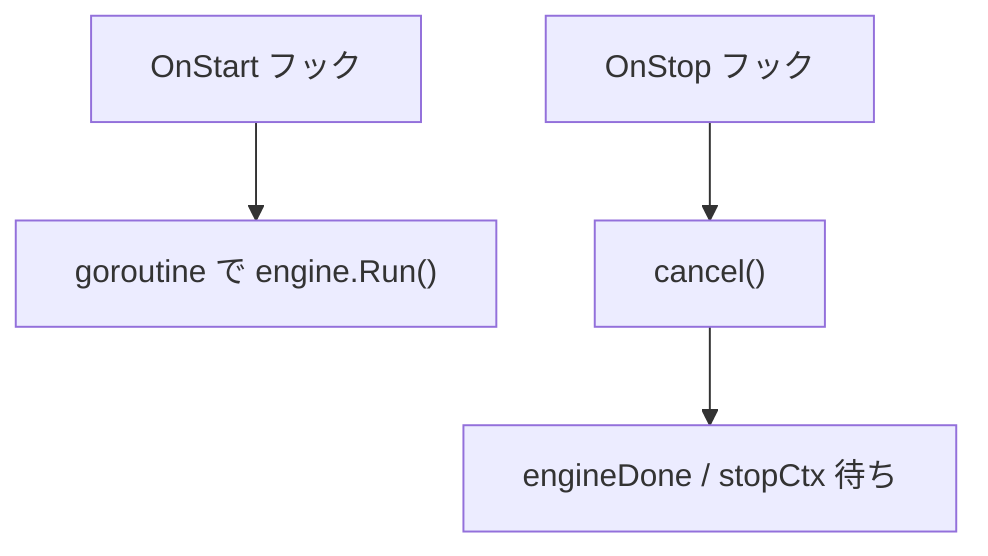

# outbox relay hook

[English](README.md) | 日本語

`internal/di/outboxrelay/hook` は、outbox relay engine の poll ループをアプリケーションの起動／停止にまたがって駆動するための **ライフサイクルフック**を登録するパッケージです。relay 専用プロセス（`cmd outbox-relay`）でのみ使用します。

## 役割

`RegisterRelayHooks` が `lifecycle.Registrar` に Start フックと Stop フックを登録し、以下の処理を行います。

- `OnStart`：poll ループ（`engine.Run(engineCtx)`）を detached goroutine で起動し、即座に返す（Start はブロックしない）
- `OnStop`：`engineCtx` をキャンセルし、`stopCtx` の範囲でループの終了を待つ

## 使用フロー

1. relay 専用プロセス（`cmd outbox-relay`）が `OutboxRelayModule` で起動する
2. Start フックが poll ループを detached goroutine で起動する
3. 停止時に Stop フックが engine の context をキャンセルし、`stopCtx` の範囲でループ終了を待つ

## 注意点

- Start/Stop 配線（detached goroutine・停止時キャンセル・grace 内 drain）は `lifecycle.SupervisedRunner` に委譲する
- 実行 context は `OnStop` でのみキャンセルされるため、Start 完了後の `startCtx` キャンセルには巻き込まれない
- `engine.Run` の戻り値は意図的に無視される（リトライ／バックオフはループ自身が管理する）
- relay 専用プロセス（`cmd outbox-relay`）でのみ使用し、メインサーバーでは使用しない
- `OnStop` でのループ終了待ちは `stopCtx` で制限される
- このフックは `internal/di/module/outboxrelay.go` の `OutboxRelayModule` から配線される
