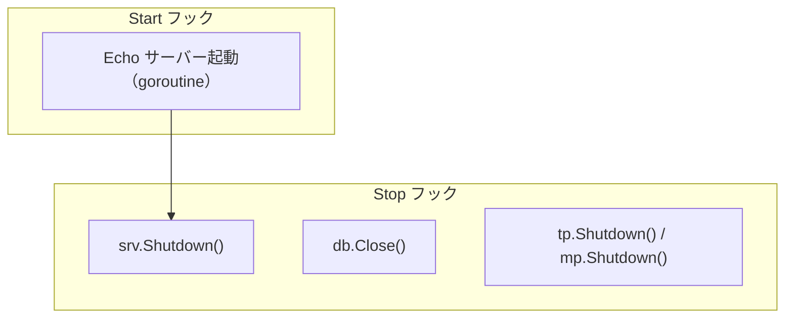

# server hook

[English](README.md) | 日本語

`internal/di/server/hook` は、アプリケーションサーバーのライフサイクルに結び付く **各種フックを登録する**パッケージです。

## フック一覧

|関数|Start|Stop|説明|
|---|---|---|---|
|`RegisterHTTPServerHooks`|Echo サーバー起動|Graceful Shutdown|HTTP サーバーのライフサイクル管理|
|`RegisterDBCloseHooks`|—|DB 接続クローズ|シャットダウン時に DB コネクションを安全に閉じる|
|`RegisterObservabilityShutdownHooks`|—|TracerProvider / MeterProvider のシャットダウン|シャットダウン時に OpenTelemetry プロバイダを flush して解放する|

## フロー



## RegisterHTTPServerHooks

HTTP サーバーの起動・停止を `lifecycle.Registrar` に登録します。

- **Start**: リスナを開き（bind 失敗は起動を中断）、goroutine で待ち受けを開始し、起動ログにポート / allowed_origins / CIDR / モードを出力
- **Stop**: `srv.Shutdown(ctx)` で Graceful Shutdown
- `extension.AppliedServerExtends` を受け取ることで、サーバー拡張が適用された後に登録されることを保証

## RegisterDBCloseHooks

シャットダウン時にデータベース接続を閉じるフックを登録します。

- **Stop**: `db.Close()` を呼び出し、エラーがあればログに出力

## RegisterObservabilityShutdownHooks

OpenTelemetry の `TracerProvider` / `MeterProvider` のシャットダウンフックを登録します。

- **Stop**: `observability.ProviderShutdowner.Shutdown()` を呼び出し、バッファされた span / metric を flush して `TracerProvider` / `MeterProvider` を解放
- 構築（`observability.NewTracerProvider` / `NewMeterProvider`）はライフサイクル非依存で行われ、シャットダウン登録はこの hook が担う。これにより `observability` パッケージは `di/lifecycle` への依存を持たない
- 両プロバイダの `Shutdown` を束ねた otel 非依存ハンドル `observability.ProviderShutdowner` を受け取ることで、otel SDK 型を di 層へ漏らさない

## DI 登録例

```go
fx.Invoke(
    hook.RegisterHTTPServerHooks,
    hook.RegisterDBCloseHooks,
    hook.RegisterObservabilityShutdownHooks,
)
```

## テスト戦略

フックは fx を起動せず、**登録されたクロージャを捕捉して呼び出す**形でテストする。`lifecycle.Registrar` のモックが `RegisterStart` / `RegisterStop` の引数を記録し（`gomock.AssignableToTypeOf`）、テストはその関数を直接駆動する。これにより「登録」と「挙動」が別々の契約として保たれ、配線からフックが黙って落ちた場合は、本体が動いていても登録側のテストで落ちる。

ロガーは生成された `logging.Logger` のモックを使い、`Named(...)` / `CallerSkip(...)` の連鎖を期待値として置く。ログの同定情報（名前・メッセージ）は付随的な出力ではなく検証対象の契約とする。

`RegisterHTTPServerHooks` には 3 つの経路があり、失敗の向きが異なるためそれぞれ独立したケースが要る。

1. **bind 失敗による起動中断** — start 関数が `listen` のエラーを返すこと。自前のリスナで先にポートを占有して再現する。fx へ伝播するサーバーエラーはこれだけであり、中途半端に起動したプロセスが healthy として扱われるのを止めているのがこの経路。
2. **graceful shutdown** — 処理中の接続が無ければ stop 関数が nil を返すこと、`Shutdown` が context の期限内に drain しきれない場合はエラーを返し **かつ** エラーログを出すこと。後者はハンドラを処理中に保持したまま期限の迫った context を渡して再現する。
3. **`Serve` の異常終了はログのみ** — `serveHTTP` は goroutine で走るため、その失敗は start のエラーとしては表出しない。正常停止（`http.ErrServerClosed`）ではログを出さず、それ以外の終了ではエラーログを出すことを検証する。後者は閉じたリスナを渡して再現する。

ポートは固定値ではなく OS 割り当て（`:0`）を使い、パッケージが `t.Parallel()` 可能な状態を保つ。bind 前にポート番号が必要な場合はリスナから取得して閉じる。「実際に配信できること」を検証する場合は実リスナを立てて実リクエストを投げる —— `Listen` の成功だけではハンドラ連鎖に到達できることの証明にならない。

## 注意点

- `RegisterHTTPServerHooks` は `AppliedServerExtends` トークンに依存するため、extension 適用後に実行される
- HTTP サーバーは goroutine で起動するため、起動失敗はログに出力されるが Start フック自体はエラーを返さない
