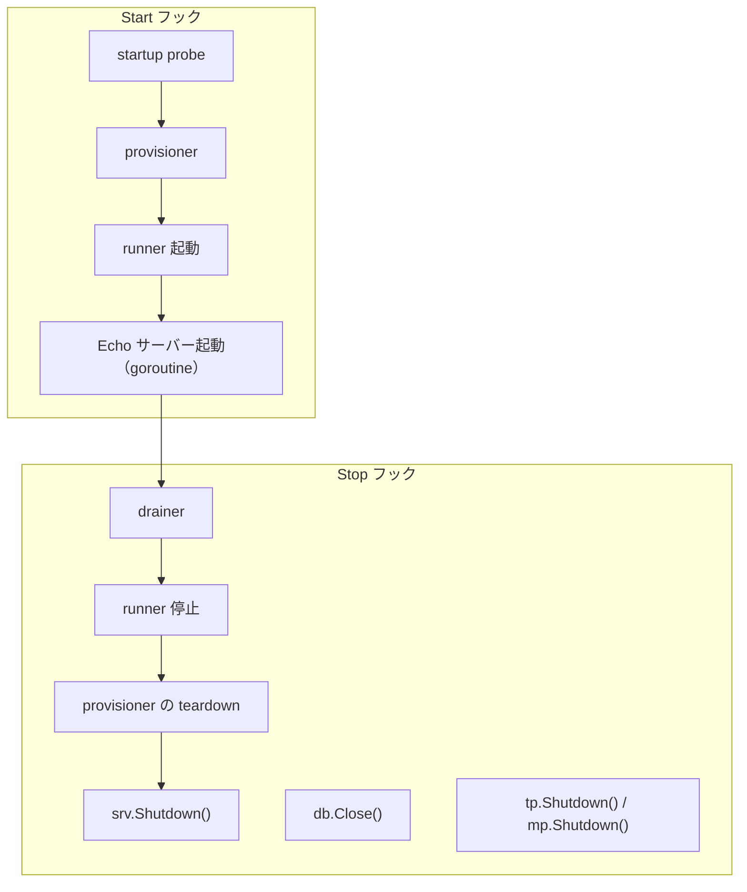

# server hook

`internal/di/server/hook` は、アプリケーションサーバーのライフサイクルに結び付く **各種フックを登録する**パッケージです。

## フック一覧

|関数|Start|Stop|説明|
|---|---|---|---|
|`RegisterHTTPServerHooks`|startup probe → provisioner → runner → Echo サーバーの listen|drainer → runner 停止 → provisioner の teardown → Graceful Shutdown|serve インスタンスのライフサイクル。HTTP と登録された全 participant を 1 つの固定順で扱う|
|`RegisterDBCloseHooks`|—|DB 接続クローズ|シャットダウン時に DB コネクションを安全に閉じる|
|`RegisterObservabilityShutdownHooks`|—|TracerProvider / MeterProvider のシャットダウン|シャットダウン時に OpenTelemetry プロバイダを flush して解放する|

## フロー



## RegisterHTTPServerHooks

serve インスタンスの起動・停止を `lifecycle.Registrar` に登録します。start 関数 1 つと stop 関数 1 つなので、
participant がいくつ結線されようと、fx がそれらをどの順で集めようと、以下の順序が保たれます（fx は `OnStop`
フックを登録の逆順で走らせますが、それは shutdown 前の drain という要件が乗れる契約ではありません）。

- **Start**: すべての `StartupProbe`（失敗は起動を中断 — ランタイムが欠かせない依存は fail fast する。
  `docs/design/realtime-delivery.ja.md` §2.6）→ すべての `Provisioner.Provision` → すべての `Runner` の起動 →
  リスナを開き（bind 失敗は起動を中断）、goroutine で待ち受けを開始し、起動ログにポート / allowed_origins /
  CIDR / モードを出力。途中で失敗した場合は、エラーを返す前に、そこまでに起動した runner を止め provisioner を
  逆順で teardown する。
- **Stop**: すべての `Drainer.Drain`（長命なレスポンスを閉じ、新規を拒否する）→ runner の停止（逆順）→
  `Provisioner.Teardown`（逆順）→ `srv.Shutdown(ctx)` で Graceful Shutdown。participant の失敗はログに出して
  シーケンスを続行し（途中で止めるとリソースが残る）、失敗は返り値のエラーに束ねる。
- `extension.AppliedServerExtends` を受け取ることで、サーバー拡張が適用された後に登録されることを保証

### participant（`participant.go`）

participant は通常の fx value group の値（`,soft` ではない — これらの型は他に誰も消費しないので、soft group では空のままになる）なので、1 つも存在しない graph は HTTP のみのサーバーとまったく同じ挙動に
なります。Realtime の DI モジュールは、結線されたときにこれらを提供します。

|group|型|走るタイミング|
|---|---|---|
|`serve.startup`|`StartupProbe{Name, Probe}`|何かが作られる前|
|`serve.provisioners`|`Provisioner{Name, Provision, Teardown}`|probe の後。停止時と起動失敗時には逆順で teardown|
|`serve.runners`|`Runner{Name, Runner lifecycle.SupervisedRunner}`|provisioning と listen の間。`SupervisedRunner.Bind` で一度だけ束ね、順序はオーケストレータが持つ|
|`serve.drainers`|`Drainer{Name, Drain}`|停止時の最初。runner の cancel より前、`Shutdown` より前|

## RegisterDBCloseHooks

シャットダウン時にデータベース接続を閉じるフックを登録します。

- **Stop**: `db.Close()` を呼び出し、エラーがあればログに出力

## RegisterObservabilityShutdownHooks

OpenTelemetry の `TracerProvider` / `MeterProvider` のシャットダウンフックを登録します。

- **Stop**: `observability.ProviderShutdowner.Shutdown()` を呼び出し、バッファされた span / metric を flush して `TracerProvider` / `MeterProvider` を解放
- 構築（`observability.NewTracerProvider` / `NewMeterProvider`）はライフサイクル非依存で行われ、シャットダウン登録はこの hook が担う。これにより `observability` パッケージは `di/lifecycle` への依存を持たない
- 両プロバイダの `Shutdown` を束ねた otel 非依存ハンドル `observability.ProviderShutdowner` を受け取ることで、otel SDK 型を di 層へ漏らさない

## DI 登録例

```go
fx.Invoke(
    hook.RegisterHTTPServerHooks,
    hook.RegisterDBCloseHooks,
    hook.RegisterObservabilityShutdownHooks,
)
```

## テスト戦略

フックは fx を起動せず、**登録されたクロージャを捕捉して呼び出す**形でテストする。`lifecycle.Registrar` のモックが `RegisterStart` / `RegisterStop` の引数を記録し（`gomock.AssignableToTypeOf`）、テストはその関数を直接駆動する。これにより「登録」と「挙動」が別々の契約として保たれ、配線からフックが黙って落ちた場合は、本体が動いていても登録側のテストで落ちる。

ロガーは生成された `logging.Logger` のモックを使い、`Named(...)` / `CallerSkip(...)` の連鎖を期待値として置く。ログの同定情報（名前・メッセージ）は付随的な出力ではなく検証対象の契約とする。

`serveLifecycle`（`RegisterHTTPServerHooks` の背後にいるオーケストレータ）は、記録用の participant と HTTP の start / stop の fake 関数でテストする。両側の正常経路の順序、participant がゼロの場合（HTTP のみ）、そして失敗の向きごと —— probe の失敗では何も作られない、provisioner の失敗では作られた分が teardown される、listen の失敗では runner が止まり teardown される、停止時は participant の失敗をログに出して束ね `Shutdown` を飛ばさない。最も重要な検証は、`Shutdown` が呼ばれる前に `Drain` が完了していることである。

HTTP 側（`newStartServerFunc` / `newStopServerFunc`）には 3 つの経路があり、失敗の向きが異なるためそれぞれ独立したケースが要る。

1. **bind 失敗による起動中断** — start 関数が `listen` のエラーを返すこと。自前のリスナで先にポートを占有して再現する。fx へ伝播するサーバーエラーはこれだけであり、中途半端に起動したプロセスが healthy として扱われるのを止めているのがこの経路。
2. **graceful shutdown** — 処理中の接続が無ければ stop 関数が nil を返すこと、`Shutdown` が context の期限内に drain しきれない場合はエラーを返し **かつ** エラーログを出すこと。後者はハンドラを処理中に保持したまま期限の迫った context を渡して再現する。
3. **`Serve` の異常終了はログのみ** — `serveHTTP` は goroutine で走るため、その失敗は start のエラーとしては表出しない。正常停止（`http.ErrServerClosed`）ではログを出さず、それ以外の終了ではエラーログを出すことを検証する。後者は閉じたリスナを渡して再現する。

ポートは固定値ではなく OS 割り当て（`:0`）を使い、パッケージが `t.Parallel()` 可能な状態を保つ。bind 前にポート番号が必要な場合はリスナから取得して閉じる。「実際に配信できること」を検証する場合は実リスナを立てて実リクエストを投げる —— `Listen` の成功だけではハンドラ連鎖に到達できることの証明にならない。

## 注意点

- `RegisterHTTPServerHooks` は `AppliedServerExtends` トークンに依存するため、extension 適用後に実行される
- リスナのオープンは同期的に行うため、bind 失敗は Start フックからエラーとして返り起動を中断する。goroutine で走るのはその後の `Serve` だけであり、エラーの返し先が無いためこちらの失敗はログに出力される
