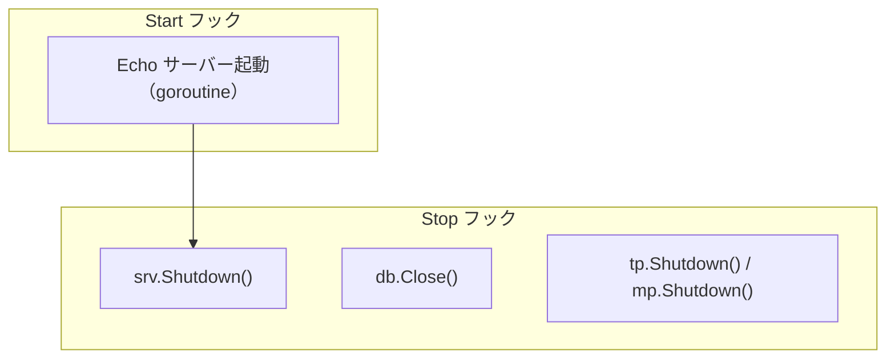

# server hook

[English](README.md) | 日本語

`internal/di/server/hook` は、アプリケーションサーバーのライフサイクルに結び付く **各種フックを登録する**パッケージです。

## フック一覧

|関数|Start|Stop|説明|
|---|---|---|---|
|`RegisterHTTPServerHooks`|Echo サーバー起動|Graceful Shutdown|HTTP サーバーのライフサイクル管理|
|`RegisterDBCloseHooks`|—|DB 接続クローズ|シャットダウン時に DB コネクションを安全に閉じる|
|`RegisterObservabilityShutdownHooks`|—|TracerProvider / MeterProvider のシャットダウン|シャットダウン時に OpenTelemetry プロバイダを flush して解放する|

## フロー



## RegisterHTTPServerHooks

HTTP サーバーの起動・停止を `lifecycle.Registrar` に登録します。

- **Start**: リスナを開き（bind 失敗は起動を中断）、goroutine で待ち受けを開始し、起動ログにポート / allowed_origins / CIDR / モードを出力
- **Stop**: `srv.Shutdown(ctx)` で Graceful Shutdown
- `extension.AppliedServerExtends` を受け取ることで、サーバー拡張が適用された後に登録されることを保証

## RegisterDBCloseHooks

シャットダウン時にデータベース接続を閉じるフックを登録します。

- **Stop**: `db.Close()` を呼び出し、エラーがあればログに出力

## RegisterObservabilityShutdownHooks

OpenTelemetry の `TracerProvider` / `MeterProvider` のシャットダウンフックを登録します。

- **Stop**: `observability.ProviderShutdowner.Shutdown()` を呼び出し、バッファされた span / metric を flush して `TracerProvider` / `MeterProvider` を解放
- 構築（`observability.NewTracerProvider` / `NewMeterProvider`）はライフサイクル非依存で行われ、シャットダウン登録はこの hook が担う。これにより `observability` パッケージは `di/lifecycle` への依存を持たない
- 両プロバイダの `Shutdown` を束ねた otel 非依存ハンドル `observability.ProviderShutdowner` を受け取ることで、otel SDK 型を di 層へ漏らさない

## DI 登録例

```go
fx.Invoke(
    hook.RegisterHTTPServerHooks,
    hook.RegisterDBCloseHooks,
    hook.RegisterObservabilityShutdownHooks,
)
```

## 注意点

- `RegisterHTTPServerHooks` は `AppliedServerExtends` トークンに依存するため、extension 適用後に実行される
- HTTP サーバーは goroutine で起動するため、起動失敗はログに出力されるが Start フック自体はエラーを返さない
