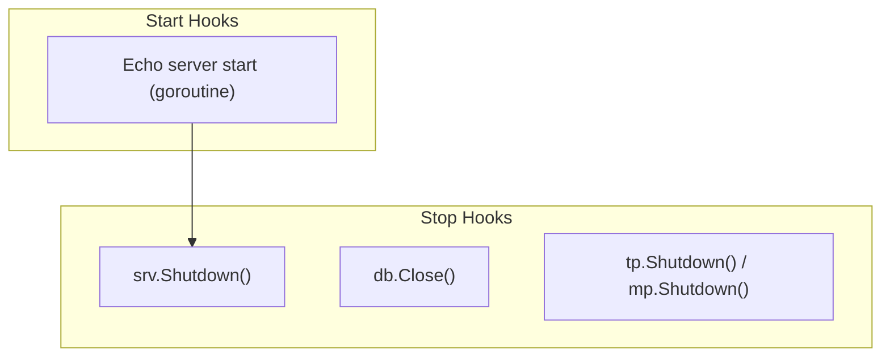

# server hook

English | [日本語](README.ja.md)

`internal/di/server/hook` is a package that **registers lifecycle hooks** tied to the application server.

## Hook List

|Function|Start|Stop|Description|
|---|---|---|---|
|`RegisterHTTPServerHooks`|Start Echo server|Graceful Shutdown|HTTP server lifecycle management|
|`RegisterDBCloseHooks`|—|Close DB connection|Safely close DB connection on shutdown|
|`RegisterObservabilityShutdownHooks`|—|Shut down TracerProvider / MeterProvider|Flush and release OpenTelemetry providers on shutdown|

## Flow



## RegisterHTTPServerHooks

Registers HTTP server start/stop hooks with `lifecycle.Registrar`.

- **Start**: Opens the listener (a bind failure aborts startup), serves in a goroutine, logs port / allowed_origins / CIDR / mode
- **Stop**: Graceful Shutdown via `srv.Shutdown(ctx)`
- Receives `extension.AppliedServerExtends` to ensure registration occurs after server extensions are applied

## RegisterDBCloseHooks

Registers a hook to close the database connection on shutdown.

- **Stop**: Calls `db.Close()` and logs any errors

## RegisterObservabilityShutdownHooks

Registers shutdown hooks for the OpenTelemetry `TracerProvider` / `MeterProvider`.

- **Stop**: Calls `observability.ProviderShutdowner.Shutdown()`, which flushes buffered spans / metrics and releases the `TracerProvider` / `MeterProvider`
- Construction (`observability.NewTracerProvider` / `NewMeterProvider`) is lifecycle-agnostic; this hook owns the shutdown registration, keeping the `observability` package free of any `di/lifecycle` dependency
- Receives `observability.ProviderShutdowner` — an otel-agnostic handle that bundles both providers' `Shutdown` — so that otel SDK types do not leak into the DI layer

## DI Registration Example

```go
fx.Invoke(
    hook.RegisterHTTPServerHooks,
    hook.RegisterDBCloseHooks,
    hook.RegisterObservabilityShutdownHooks,
)
```

## Test Strategy

Hooks are tested by **capturing the registered closures and calling them**, never by booting fx: a `lifecycle.Registrar` mock records the `RegisterStart` / `RegisterStop` arguments (`gomock.AssignableToTypeOf`), and the test then drives those functions directly. This keeps registration and behavior as two separate contracts — a hook silently dropped from the wiring fails the registration test even when its body still works.

The logger is the generated `logging.Logger` mock with the expected `Named(...)` / `CallerSkip(...)` chain, so log identity (name, message) is part of the asserted contract, not incidental output.

`RegisterHTTPServerHooks` has three paths, and each needs its own case because they fail in different directions:

1. **Bind failure aborts startup** — the start function returns the `listen` error. Reproduce it by occupying the port with a listener of your own first. This is the only server error that propagates to fx, so it is what stops a half-started process from being reported healthy.
2. **Graceful shutdown** — the stop function returns nil once no connection is in flight, and returns the error *plus* an error log when `Shutdown` cannot drain within the context deadline. Reproduce the latter by holding a handler open and passing an already-tight context.
3. **Abnormal `Serve` exit is log-only** — `serveHTTP` runs in a goroutine, so its failure cannot surface as a start error. Assert that a normal stop (`http.ErrServerClosed`) logs nothing and that any other exit logs an error; a closed listener reproduces the latter.

Bind an OS-assigned port (`:0`) rather than a fixed one so the package stays `t.Parallel()`-safe; when the port number is needed before binding, take it from a listener and close it. Start a real listener and issue a real request when the assertion is "the server actually serves" — a successful `Listen` alone does not prove the handler chain is reachable.

## Notes

- `RegisterHTTPServerHooks` depends on the `AppliedServerExtends` token, so it executes after extension application
- The HTTP server starts in a goroutine; startup failures are logged but the Start hook itself does not return an error
