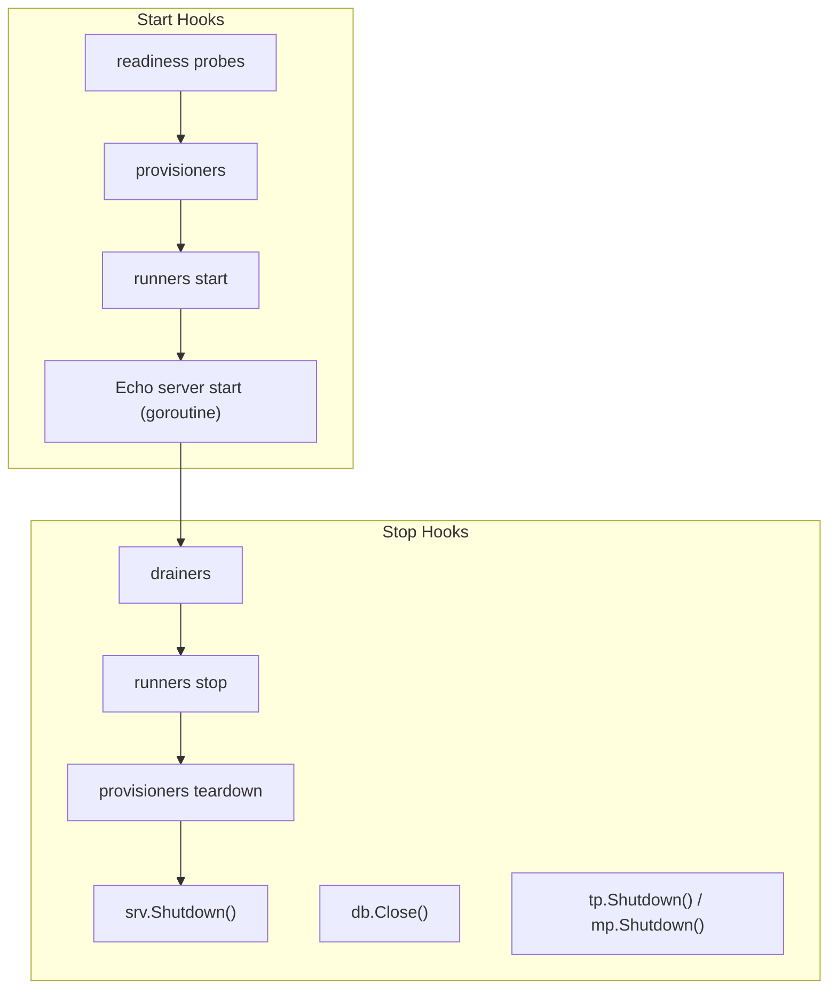

# server hook

`internal/di/server/hook` is a package that **registers lifecycle hooks** tied to the application server.

## Hook List

|Function|Start|Stop|Description|
|---|---|---|---|
|`RegisterHTTPServerHooks`|Readiness probes → provisioners → runners → Echo server listen|Drainers → runners stop → provisioners teardown → graceful Shutdown|The serve instance's lifecycle: HTTP plus every registered participant, in one fixed order|
|`RegisterDBCloseHooks`|—|Close DB connection|Safely close DB connection on shutdown|
|`RegisterObservabilityShutdownHooks`|—|Shut down TracerProvider / MeterProvider|Flush and release OpenTelemetry providers on shutdown|

## Flow



## RegisterHTTPServerHooks

Registers the serve instance's start / stop with `lifecycle.Registrar` — one start function and one stop
function, so the order below holds no matter how many participants are wired and in which order fx
happened to collect them (fx runs `OnStop` hooks in reverse registration order, which is not a contract
a drain-before-shutdown requirement can rest on).

- **Start**: every `ReadinessProbe` (a failure aborts startup — a dependency the runtime cannot do
  without fails fast, `docs/design/realtime-delivery.md` §2.6) → every `Provisioner.Provision` → every
  `Runner` start → open the listener (a bind failure aborts startup), serve in a goroutine, log port /
  allowed_origins / CIDR / mode. A failure part-way stops the runners and tears down the provisioners
  already started, in reverse, before the error is returned.
- **Stop**: every `Drainer.Drain` (closes the long-lived responses and refuses new ones) → runners stop
  (reverse) → `Provisioner.Teardown` (reverse) → graceful Shutdown via `srv.Shutdown(ctx)`. A participant's
  failure is logged and the sequence continues — stopping half-way would leave resources behind — and
  the failures are joined into the returned error.
- Receives `extension.AppliedServerExtends` to ensure registration occurs after server extensions are applied

### Participants (`participant.go`)

Participants are values in soft fx groups, so a graph without any of them behaves exactly as an
HTTP-only server; the Realtime DI module contributes them when it is wired.

|Group|Type|Runs|
|---|---|---|
|`serve.readiness`|`ReadinessProbe{Name, Probe}`|before anything is created|
|`serve.provisioners`|`Provisioner{Name, Provision, Teardown}`|after the probes; torn down in reverse on stop and on a failed start|
|`serve.runners`|`Runner{Name, Runner lifecycle.SupervisedRunner}`|between provisioning and listen; bound once through `SupervisedRunner.Bind` so the orchestrator owns the order|
|`serve.drainers`|`Drainer{Name, Drain}`|first thing on stop, before any runner is cancelled and before `Shutdown`|

## RegisterDBCloseHooks

Registers a hook to close the database connection on shutdown.

- **Stop**: Calls `db.Close()` and logs any errors

## RegisterObservabilityShutdownHooks

Registers shutdown hooks for the OpenTelemetry `TracerProvider` / `MeterProvider`.

- **Stop**: Calls `observability.ProviderShutdowner.Shutdown()`, which flushes buffered spans / metrics and releases the `TracerProvider` / `MeterProvider`
- Construction (`observability.NewTracerProvider` / `NewMeterProvider`) is lifecycle-agnostic; this hook owns the shutdown registration, keeping the `observability` package free of any `di/lifecycle` dependency
- Receives `observability.ProviderShutdowner` — an otel-agnostic handle that bundles both providers' `Shutdown` — so that otel SDK types do not leak into the DI layer

## DI Registration Example

```go
fx.Invoke(
    hook.RegisterHTTPServerHooks,
    hook.RegisterDBCloseHooks,
    hook.RegisterObservabilityShutdownHooks,
)
```

## Test Strategy

Hooks are tested by **capturing the registered closures and calling them**, never by booting fx: a `lifecycle.Registrar` mock records the `RegisterStart` / `RegisterStop` arguments (`gomock.AssignableToTypeOf`), and the test then drives those functions directly. This keeps registration and behavior as two separate contracts — a hook silently dropped from the wiring fails the registration test even when its body still works.

The logger is the generated `logging.Logger` mock with the expected `Named(...)` / `CallerSkip(...)` chain, so log identity (name, message) is part of the asserted contract, not incidental output.

`serveLifecycle` (the orchestrator behind `RegisterHTTPServerHooks`) is tested with recording participants and fake HTTP start / stop functions: the happy-path order on both sides, the zero-participant case (HTTP only), and each failure direction — a probe failure creates nothing, a provisioner failure tears down what was created, a listen failure stops the runners and tears down, and on stop a participant failure is logged, joined and never skips `Shutdown`. The assertion that matters most is that `Drain` has completed before `Shutdown` is called.

The HTTP half (`newStartServerFunc` / `newStopServerFunc`) has three paths, and each needs its own case because they fail in different directions:

1. **Bind failure aborts startup** — the start function returns the `listen` error. Reproduce it by occupying the port with a listener of your own first. This is the only server error that propagates to fx, so it is what stops a half-started process from being reported healthy.
2. **Graceful shutdown** — the stop function returns nil once no connection is in flight, and returns the error *plus* an error log when `Shutdown` cannot drain within the context deadline. Reproduce the latter by holding a handler open and passing an already-tight context.
3. **Abnormal `Serve` exit is log-only** — `serveHTTP` runs in a goroutine, so its failure cannot surface as a start error. Assert that a normal stop (`http.ErrServerClosed`) logs nothing and that any other exit logs an error; a closed listener reproduces the latter.

Bind an OS-assigned port (`:0`) rather than a fixed one so the package stays `t.Parallel()`-safe; when the port number is needed before binding, take it from a listener and close it. Start a real listener and issue a real request when the assertion is "the server actually serves" — a successful `Listen` alone does not prove the handler chain is reachable.

## Notes

- `RegisterHTTPServerHooks` depends on the `AppliedServerExtends` token, so it executes after extension application
- Opening the listener happens synchronously, so a bind failure is returned from the Start hook and aborts startup; only `Serve`, which runs in a goroutine after that, can fail with nothing to return the error to — those failures are logged
