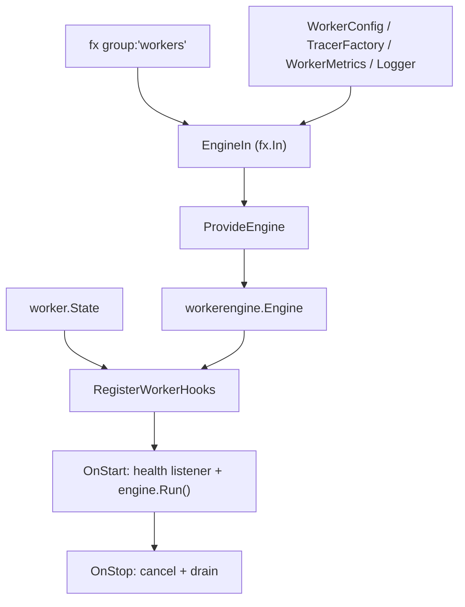

# worker DI モジュール

[English](README.md) | 日本語

`internal/di/worker` は、worker 実行に関わる **DI（依存性注入）コンポーネント**を提供するパッケージです。

## 役割

このディレクトリはアプリケーションの worker フレームワークと `fx` の DI 結合点です。`group:"workers"` タグで登録されたすべての `worker.Worker` プロバイダを集約し、`WorkerConfig` から engine の設定を組み立て、`workerengine.Engine` に組み立て、選択された worker（とその health listener）をアプリケーションの起動／停止にまたがって実行する lifecycle hook を配線します。上位コード（`internal/controller/worker`、`cmd/`、個別 worker 実装）はここでの抽象に依存し、fx 固有のグルーコードはすべて本パッケージに閉じ込めることで、それ以外のコードを framework-agnostic に保ちます。長時間稼働するコンシューマ（worker）プロセス向けに、`internal/di/job/` と対をなします。

## 構成

```text
internal/di/worker/
├── runner.go   # Engine DI provider
└── hook/       # Lifecycle hook (worker execution / health listener)
```

## アーキテクチャ



## DI 登録例

```go
fx.Provide(
    observability.NewWorkerMetrics,
    worker.ProvideEngine,
    workercontroller.NewState,
)
fx.Invoke(hook.RegisterWorkerHooks)
```

## worker 実行フロー

1. CLI が `state.Set(name, args, done)` で worker 情報をセット
2. アプリケーション起動
3. Start フックが health listener を起動し、`state.Snapshot()` を参照
4. `done` が存在すれば、worker を detached goroutine で `engine.Run()` 実行
5. 停止時に engine の context をキャンセルし、`stopCtx` の範囲で drain を待機

## 注意点

- `state.Set` はアプリケーション起動前に行う必要がある
- `done` が `nil` の場合、worker はスキップされる（engine は起動しない）
- engine は detached goroutine で動作し、その context は `OnStop` でのみキャンセルされる
- drain タイムアウトを超えた未完了処理は Ack されず再配送される
- worker の追加は `internal/di/module/worker.go` の `provideWorkers(...)` にコンストラクタを追加する（各 worker は `usecase/boundary/worker.Worker` を実装する必要がある）
