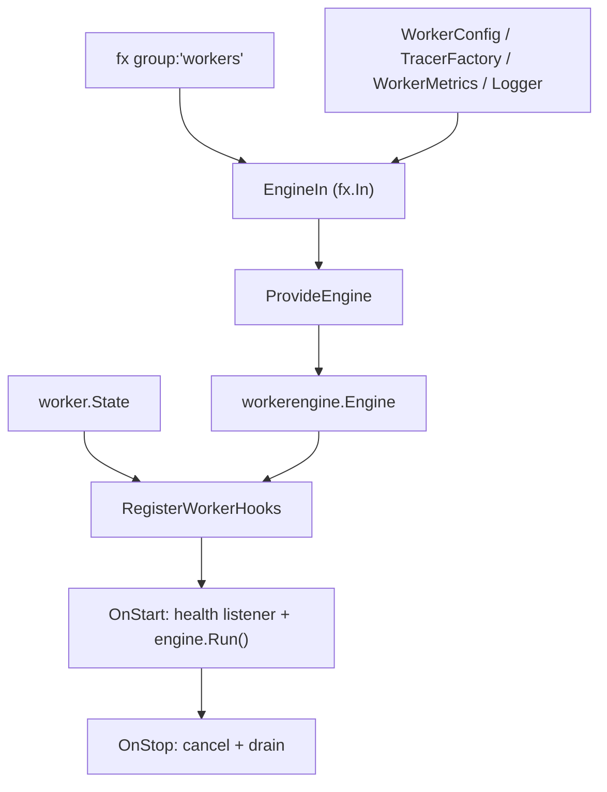

# worker DI Module

English | [日本語](README.ja.md)

## Role

This directory is the DI seam between the application's worker framework and `fx`. It collects all `worker.Worker` providers registered with the `group:"workers"` tag, builds the engine settings from `WorkerConfig`, assembles them into a `workerengine.Engine`, and wires the lifecycle hook that runs the selected worker (and its health listener) across application start/stop. Upper-layer code (`internal/controller/worker`, `cmd/`, individual worker implementations) depends on the abstractions here; this package contains all of the fx-specific glue so that the rest of the code stays framework-agnostic. It parallels `internal/di/job/` for the long-running consumer (worker) process.

## Structure

```text
internal/di/worker/
├── runner.go   # Engine DI provider
└── hook/       # Lifecycle hook (worker execution / health listener)
```

## Architecture



## DI Registration Example

```go
fx.Provide(
    observability.NewWorkerMetrics,
    worker.ProvideEngine,
    workercontroller.NewState,
    provideQueueStatsCollector,           // queue depth / DLQ metrics collector
)
fx.Invoke(worker.ValidateShutdownGrace)   // startup guard: DrainTimeout < shutdown grace
fx.Invoke(hook.RegisterWorkerHooks)
fx.Invoke(queuemetrics.RegisterStatsCollector)
```

`WorkerModule()` in `internal/di/module/worker.go` also registers optional queue-stats targets via `provideQueueStatsTargets(...)` (the `group:"worker.queue_stats_targets"` group).

## Worker Execution Flow

1. CLI sets worker info via `state.Set(name, args, done)`
2. Application starts
3. Start hook starts the health listener and references `state.Snapshot()`
4. If `done` exists, `engine.Run()` executes the worker in a detached goroutine
5. On stop, the engine context is cancelled and drain is awaited within `stopCtx`

## Notes

- `state.Set` must be called before application startup
- Hook lifecycle details (skip on `done == nil`, detached run, drain and redelivery) are in [`hook/README.md`](hook/README.md)
- `ValidateShutdownGrace` fails app startup when `WORKER_DRAIN_TIMEOUT >= APP_SHUTDOWN_TIMEOUT` (drain must finish before the stop grace expires)
- The queue-stats collector reports queue depth / DLQ metrics; with no target registered it emits nothing
- To add workers, add their constructors to `provideWorkers(...)` in `internal/di/module/worker.go` (each must implement `usecase/boundary/worker.Worker`)
