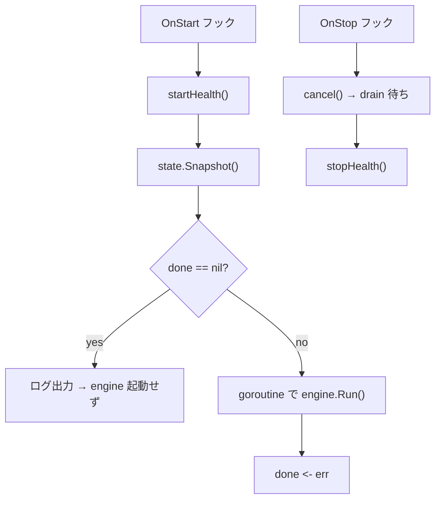

# worker hook

[English](README.md) | 日本語

`internal/di/worker/hook` は、CLI で選択された worker engine（とその health listener）をアプリケーションの起動／停止にまたがって実行するための **ライフサイクルフック**を登録するパッケージです。

## 役割

`RegisterWorkerHooks` が `lifecycle.Registrar` に Start フックと Stop フックを登録し、以下の処理を行います。



- `done` が `nil` の場合：実行する worker なしと判断し、engine を起動しない
- `done` が存在する場合：detached goroutine で worker を実行し、結果を `done` チャネルに送信
- `OnStop`：`engineCtx` をキャンセルし、`stopCtx` の範囲で drain 完了を待ってから health listener を停止

## 使用フロー

CLI 側で起動前に `State` をセットしておきます。

```go
done := make(chan error, 1)
state.Set("user-events", nil, done)
// アプリケーション起動 → Start フックで worker が停止まで実行される
err := <-done
```

## 注意点

- `state.Set(name, args, done)` をアプリケーション起動前に行う必要がある
- engine は detached goroutine で動作し、`engineCtx` は `OnStop` でのみキャンセルされる（Start 完了後の `startCtx` キャンセルには巻き込まれない）
- `OnStop` の drain は `stopCtx` で制限され、猶予切れの未完了処理は Ack されず再配送される
- health listener は `OnStart` で起動し、`OnStop` で停止する
