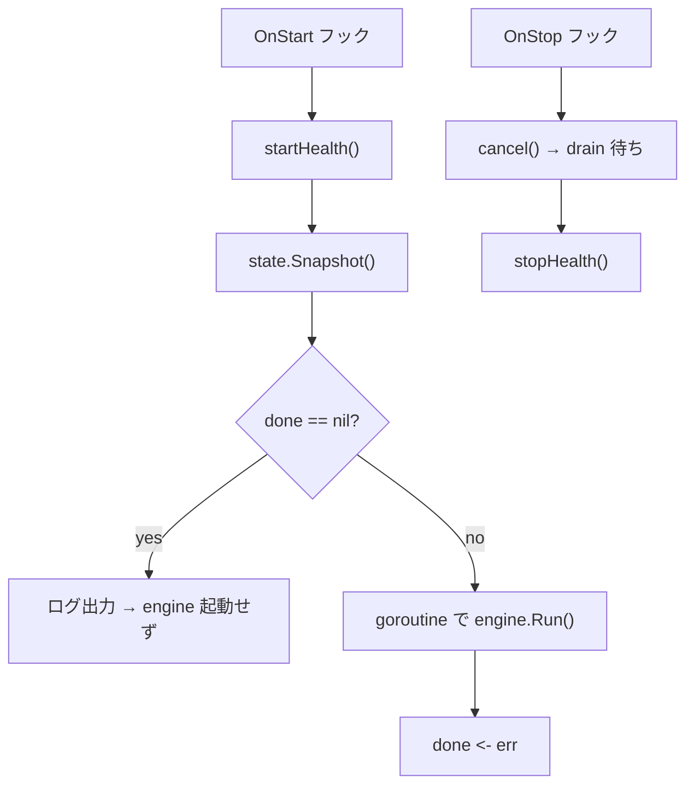

# worker hook

[English](README.md) | 日本語

`internal/di/worker/hook` は、CLI で選択された worker engine（とその health listener）をアプリケーションの起動／停止にまたがって実行するための **ライフサイクルフック**を登録するパッケージです。

## 役割

`RegisterWorkerHooks` が `lifecycle.Registrar` に Start フックと Stop フックを登録し、以下の処理を行います。



1. Start 時: health listener を起動し、`state.Snapshot()` で worker 名と done チャネルを取得する
2. `done == nil` の場合: 「実行する worker なし」をログに出し、engine を起動せず戻る
3. それ以外: detached goroutine で `engine.Run(engineCtx, name)` を実行し、結果を `done` へ送る
4. Stop 時: `engineCtx` をキャンセルし、`stopCtx` の範囲で engine の drain を待ってから health listener を停止する

## 使用フロー

CLI 側で起動前に `State` をセットしておきます。

```go
done := make(chan error, 1)
state.Set("user-events", nil, done)
// アプリケーション起動 → Start フックで worker が停止まで実行される
err := <-done
```

## 注意点

- Start/Stop 配線（detached goroutine・停止時キャンセル・grace 内 drain）は `lifecycle.SupervisedRunner` に委譲し、health listener をその `OnStartAux` / `OnStopAux` として渡す
- `state.Set(name, args, done)` をアプリケーション起動前に行う必要がある
- drain 期限を超えた未完了処理は Ack されず再配送される
