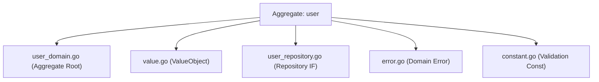
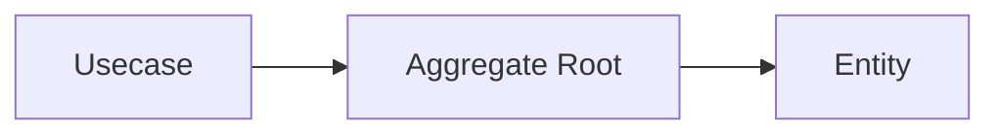
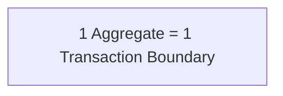
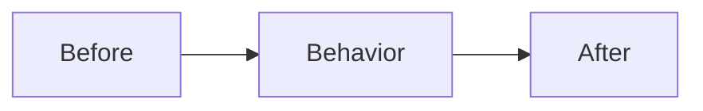

# ドメイン層（`internal/domain`）ガイド

## オニオンアーキテクチャでの役割

- **ビジネスの中心（核）**。エンティティ、値オブジェクト、ドメインサービス、ドメインイベントなどの **本質的なルール** を表現する。
- 外界（HTTP / DB / UI）への関心は一切持たず、**純粋なモデルと言語** で振る舞いを定義する。
- 変更に最も強い層。**ここが壊れない限りプロダクトは保守できる** という前提で守る。

## このプロジェクトでの役割

- `internal/domain/<aggregate>/` 配下に **Entity / ValueObject / Repository(IF)** を配置する。
  **Domain Service** は置かない。どのエンティティ・値オブジェクトの自然な責務でもないからこそ存在する
  ものであり、それを所有する集約パッケージが無いためである
  （[Domain Service をどこに置くか](#domain-service-をどこに置くか)を参照）。

例）`internal/domain/user/`



- **副作用を持たない関数（純関数）** でルールを記述するのが原則。  
  I/O・時刻取得・乱数生成などは **引数で注入された値** に依存させる。

- 状態変更は **エンティティのメソッド** で行い、外部リソースへのアクセスはしない。

- 型は **effectively immutable** を基本とする。

  - private field + getter
  - defensive copy（`ptr.Copy`）
  - setterは禁止
  - 状態変更は **振る舞いメソッド**

- 依存関係は **コンストラクタで注入** する。

- 外部ライブラリは直接持ち込まず **pkg wrapper経由** で使用する。

例：

- UUID → `pkg/uuid`
- Decimal → `pkg/decimal`
- Error → `pkg/xerrors`

- domain パッケージは他の集約を import してはならない（depguard が `internal/domain/` を拒否する）。
  複数の集約から使われる業務意味論を持つ値オブジェクトのうち、`pkg/` が業務ロジックを禁じているために
  そちらへ置けないものは、**ドメイン語彙** [`internal/domain/lexicon`](lexicon/README.ja.md) に置く。
  ここは全ての domain パッケージが import してよい。配置は `pkg/` を先に判定し、入場基準は意図的に
  狭い。名前が入場時の問いを表している——これは業務の語か。その README を参照。
  根拠: [ADR-0034](../../docs/adr/0034-domain-lexicon.md)。

  集約を import してよいもう一つの場所は `internal/domain/service/**` であり、すべての Domain Service が
  そこに住む。専用の depguard ルールを持ち、domain 層の他の deny はすべて再掲されている。この規則は
  余分な辺を許可するだけで要求はしないため、単一の集約だけを語るサービスも同じくそこに置く。
  [Domain Service をどこに置くか](#domain-service-をどこに置くか)を参照。

## ドメインの境界

Domain 層は **ビジネスルールと状態遷移を表現する層**である。

Domain の責務：

- 不変条件（Invariant）
- 状態遷移
- 値の整合性
- ビジネスルール

Domain の責務ではないもの：

- 検索仕様
- DB最適化
- SQL構造
- 外部API呼び出し
- 集計処理

これらは次の層で扱う。

- Usecase
- QueryService
- ReadModel

Repository は **永続化の抽象のみ提供する**。

単純な Query は実務上許容する。

許容例：

- `FindByXXX`
- `FindByActive`
- `CountByXXX`

## Entity か Value Object か

ドメイン型をどう実装するかを決める前に、**それが何であるか**を決める。両者を分けるのは 1 つの問いで、
それは「不変条件を持つに値するか」ではない。ドメイン型はどれも不変条件を持つに値する。

**Entity は属性より長生きする同一性を持つ。** ユーザーの全フィールドを変えても同じユーザーのままであり、
その連続性のために同一性がある。2 つの Entity は、属性が何と言おうと同一性が一致するときに同じものである。

**Value Object は同一性を持たない。** それは保持している値そのものなので、2 つが同じであるのは中身が
等しいとき、ちょうどそのときである。変更を跨いで持続するものが何も無い。変更は「同じものの新しい状態」
ではなく別の値を生むからである。丸ごと置き換えること。その場で書き換えてはいけない。

新しい型を決める手順:

1. そのものが時間を越えて*同じ一つのもの*として追跡される必要があるかを問う（更新を跨いで、永続化を
   跨いで、受け渡しを跨いで）。必要なら Entity であり、決して変わらない同一性のフィールドを持つ。
2. 必要でなければ Value Object。等価は中身で決まり、不変にする。
3. 文脈次第で答えが変わる場合——住所は配送業者にとって Entity だが顧客レコードにとって Value Object
   ——採るのは*このモデルにおいて*成り立つほうであって、一般論ではない。

### このリポジトリで Value Object をどこまで使うか

Evans は、属性がそれ自体の意味を持つならその属性を Value Object としてモデル化する。**このリポジトリは
そこまでしない。** 属性を包むのは強制するに値する不変条件を持つときだけで（非負の価格、長さ制約のある
文字列）、それ以外は基本型のまま置く。

これは意図的な逸脱である。全属性を包めば同型フィールドの取り違えに対する型レベルの防御が手に入るが、
型の数と境界ごとの変換ノイズが増える一方で、適切に命名され検証付きコンストラクタを持つフィールドに対して
上乗せされる防御は小さい。この規模では費用が便益を上回る。取り違えのリスクが実在する箇所——同型の隣接
引数——に対しては、属性構造体への束ねを対処として用いる（後述の該当節を参照）。

**値が業務上の意味を持つとき、ドメインへ渡すべきは問いであって型ではない。** 呼び出し側が欲しいのは値では
なく、対象がある状態にあるかどうかである——公開中か、在庫が僅少か、まだ在籍しているか、次のステータスへ
移れるか。その述語を値の所有者に置き、表現は内側に留める。呼び出し側はモデルの語彙で読むことになり、
値の表現は、それについて問う側に触れずに変えられる。

この 2 つは別の試験で、値はどちらか一方だけ通ることも、両方通ることも、どちらも通らないこともある。包むかを
決めるのは「生成時に強制すべき不変条件を持つか」、述語を置くかを決めるのは「何かがそれを見て判断するか」。
ステータスは両方を通る——知らないコードを拒み、他者が投げる問いを所有している——ので型になる。不透明な
識別子はどちらも通らないので、何も付けずに基本型のまま置く。よくある誤りは「この値は意味を持つ」を包む
理由として読むことで、意味を担うのは問いのほうである。不変条件も呼び出し元も無い包みは、名前と変換でしかない。

**`pkg/` はこの意味での Value Object を含まない。** あちらの型はベンダーライブラリや基本型を包むが業務上の
意味を担わず、それがまさにこの層から外れる理由である。[`pkg/README.md`](../../pkg/README.md) を参照。

## ドメインイベント

外界へ伝える必要のある遷移は、**起きた事実を返します**。

```go
func (e *Entity) Cancel(now time.Time) (Event, error)
```

その変化が起きたことを知っているのは、変化を起こした集約だけです。だから宣言するのも集約です。
遷移メソッドが事実を返す形にすると、両者をコンパイラが結び付けます。呼び出し側は遷移が成功しない限り
イベントを手に入れられず、遷移に成功すればイベントを受け取らざるを得ません。「状態は変わったが
イベントが出ていない」「イベントは出たが何も変わっていない」が書けなくなります。

イベントは**事実**なので、過去形で、不変で、起きた時刻を伴います。時刻は遷移が記録したものと同一で、
時計を二度読むことはしません。

**名前はドメインの語彙ですが、ワイヤ表現は違います。** その事象を何と呼ぶか（`canceled` / `shipped`）は
この層のものです。版付きの種別文字列・JSON のフィールド名・payload の形は、公開する層が所有する転送契約で
あり、この層は serialization を持ちません。ドメインの事象を公開形へ写す対応表はその層に置き、事実は同じ
まま payload の形が変わったときに版が上がるのもそちらです。

保存後に drain するためイベントを集約へ溜める形（pending events）は**採用しません**。遷移から返せば同じ
保証が得られ、集約に管理すべき可変状態を増やさずに済みます。

## 実装上の注意点

### 命名/構造

- 構造体名は **ドメイン名**
- スライス型は必要に応じて定義

```go
type Users []*User
```

- Repository インターフェース名は `Repository`
- パッケージ名はドメイン名
- コンストラクタは `New`

> **Evans からの逸脱。** Evans にとって Module はモデルの一部である。分割線と名前はドメインへの洞察を
> 担うことを意図され、構造はモデルと共に進化することが期待される。上記の規則はそれに比べれば機械的で、
> 何と呼ぶかは言うが、その分割が何を明かすべきかは言わない。この差は見落としではなく構造的なものである。
> テンプレートには洞察を持つべき実ドメインが無いため、ここで引かれている線はアーキテクチャが含意する
> ものであり、モデルを表現する線は fork する者に属する。

### 位置引数を取り違えうる場合は属性を構造体へ束ねる

判断基準（同型引数の取り違えが実際にリスクとなるのはどんな場合か、ならないのはどんな場合か、対処を
VO 化と構造体化のどちらにするか）は層非依存であり `docs/rules.md`（"Function Signature Rules"）に置く。
この節では domain 層での適用のみを扱う。

ルールのトリガーを満たす属性を持つエンティティは、それらを値構造体へ束ね、全入口で共有する。これに
より生成・再構築・更新の各入口が乖離しない。

```go
// コンストラクタと振る舞いメソッドが共有する属性一式。
type Attributes struct {
    Name        string
    Description *string
    // ...
    ImagePath   *string
}

func New(id uuid.UUID, attrs Attributes) (*Entity, error)
func Reconstruct(id uuid.UUID, attrs Attributes, version int) (*Entity, error)
func (e *Entity) Update(attrs Attributes) error
```

識別子（`id`）と楽観ロックのバージョンは位置引数のままとする。型が相異なるうえ、更新の入口が置き換える
属性集合には含まれないためである。置き換え可能なのが属性の一部だけの場合は、その部分集合を独立した
構造体として命名し埋め込む（`user.Attributes` に `user.Profile` を埋め込む形）。重複するフィールドを
持つ構造体を 2 つ宣言しないこと。

この層で最も晒されるのは DB 行からの再構築であるため、ルールが要求する写像テストはコンストラクタ側に
加えて Repository の行→エンティティ変換にも置く。

### コンストラクタ経由以外でセットしない

- 不変条件は `New(...)` で保証
- setterは禁止
- 状態変更は **振る舞いメソッド**

`Reconstruct(...)` は `New(...)` と同じ不変条件を課す。既に永続化されているデータのための緩い経路は
用意しない。

**集約は子ごと丸ごと構築する。** 1 回の呼び出しがルートと配下の部品を生成し、不変条件はそこで判定する
——兄弟間の一意性や、明細の合計と一致すべき合計額のように、部品 1 つでは判定できないものを含めて。
子のコンストラクタは部品を組み立てるだけで、関門ではない。関門にすると 1 つの規則が 2 箇所へ分かれ、
子をまたぐ側は置き場所を失う。`Reconstruct(...)` も同じ縛りを受ける。子は永続化から組み立て済みで
上がってくるため、その集合を棄却できる地点はルートだけになる。

> **Evans からの逸脱。** Evans は、永続化から再構築することは生成とは別の問題だと注意する。データは
> 既に存在しているので、不変条件違反に対しては一律の拒否ではなく修復戦略が要り得る、と。このモデルは
> 常に hard-fail する——不変条件を破る行は読み込み時にエラーとして表面化する。保存された違反は
> 見つけられるべき欠陥であり、黙って修復することは、それが観測可能になったまさにその瞬間に欠陥を
> 隠すことになる。代償は受け入れる。そうした行は、修正されるまでその集約の読み取りを止める。

### コンストラクタが Factory である

`New(...)` と `Reconstruct(...)` がこのモデルの Factory であり、独立した Factory 型は持たない。
Factory とは「妥当な全体をどう組み立てるか」の知識を呼び出し側から取り上げ、それを所有する場所へ
渡すためのもので、集約自身のパッケージにあるコンストラクタが既にそれを果たしている。呼び出し側は値を
渡し、コンストラクタが何を妥当とするかを決め、半端に組み上がったインスタンスは決して観測されない。
再構築側の Factory は Repository が務める——行を読んで `Reconstruct(...)` へ渡す。外側の層が集約を
フィールド単位で組み立てないのはこのためである。

**Factory 型が現れるのは、生成が設定を持ったとき。** 生成をまたいで固定されるもの——コード体系、
テナントごとに切り替わる規則など——がそれにあたる。型がその設定を保持し、メソッドが 1 回ごとのデータを
受け取る。呼び出しごとに変わるデータは引数であってフィールドではなく、保持するものが何も残らなければ
その型に存在する理由は無い。`New(...)` がそのままパターンの全体である。

**生成が受け取るのは値であって、注入された協力者ではない。** 生成のために生成器やポリシーの interface を
domain へ渡してはならない。生成器は domain に効果を実行させるので、同じ入力から同じ集約が出なくなる。
ポリシーの interface はさらに悪く、コンストラクタが述べるべき規則そのものを domain の外へ戻し、名前だけを
残す——基準が見えない場所で著作される（クエリ経路で同じ壊れ方をした例は § Query and Aggregate）。
効果——識別子・時刻——を実行するのは外側の層で、その結果を渡す。振る舞いメソッドが既に `now` を受け取って
いるのと同じ形である。選択を設定可能にする必要があるなら、選択をドメインの値として渡し、分岐は domain に
置いたままにする。

**変種は既定でデータとして表し、型で表すのは例外。** Factory に手を伸ばすもう一つの理由は「どの具象型を
生成するかを選ぶこと」で、これはモデルが複数の型を持っていることを前提にしている。業務ドメインに多様性は
実在するので、問いは「あるかないか」ではなく「どこに置くか」である。ドメインが解釈する値——ステータス
コード、期間区分——として置き、振る舞いはその値で分岐する 1 つの型に持たせる。区別を型へ移すのは、変種が
**フィールドと不変条件まで**異にするときに限る。振る舞いだけが違う段階では移さない。移すべき合図は、
単一の構造体が「半分のインスタンスにとって無意味なフィールド」を溜め込み、その一つひとつが別のフィールドの
有無を見る検査で守られている状態になったときである。

早すぎる移行はこの積み方では二重に高くつく。再構成が判別列から型を選ぶことになり、その選択と、選択が読む
スキーマが domain——ストレージについて何も知らないはずの場所——へ引きずり込まれる。加えて、値に対する switch
を守る静的な網羅チェックは実装に対する switch を守らないので、変種を足したときにコンパイラがどこを直すべきか
教えてくれなくなる。変種をデータのまま保てば、この 2 つの性質を両方とも保てる。

### 取得は getter 経由

- フィールド公開禁止

```go
ID()
FirstName()
Email()
```

- pointer型は **defensive copy**

```go
ptr.Copy(...)
```

### 構造体にタグを打たない

Domainは外界を知らない。

禁止：

```text
json
db
validate
```

これらは DTO / Infra に置く。

### DB のすべてのカラムをエンティティのフィールドにしない

エンティティは**ドメイン上の意味を持つ状態**のみを表現する。永続化や検索インフラのためだけに存在するカラムは、テーブルに存在してもエンティティには意図的に含めない：

- 監査列（`created_at` / `updated_at`）— 必要なら DB を直接参照すればよく、エンティティのフィールドや不変条件にする必要はない。
- DB 生成列・計算列（例: `GENERATED ALWAYS AS ... STORED` の検索用テキスト列）— インフラの検索最適化であり、ドメインの状態ではない。

したがって entity ↔ カラムの 1 対 1 対応は**必須ではない**。こうしたカラムがエンティティに無いのは意図的な設計判断であり、ドリフトではない。

### 時刻・ID の扱い

- `time.Now()` は Domain で使わない
- UUID 生成も Domain で行わない

生成は：

- Controller
- Usecase

Domainは **型付き値のみ受け取る**

```go
uuid.UUID
time.Time
```

### バリデーション

#### 形式チェック

原則 **値オブジェクト**

例：

```go
NewEmail(...)
```

軽量ドメインでは基本型も許容。

#### 境界値チェック

境界値は `constant.go`

```go
minLength
maxEmailLength
```

#### oapi 側で検証しているのに、なぜここでも検証するのか

OpenAPI のリクエスト検証ミドルウェアとこのレイヤは **冗長ではありません**。オーナーもスコープも異なります。

- **オーナーが違う。** OpenAPI の制約は *ワイヤー契約*（HTTP API が受け入れる形）、domain の定数は *業務ルール*（業務が valid と認める値）。両者は正当に食い違える — [入力境界値のオーナーシップ](../../openapi/boundary-ownership.ja.md) を参照。
- **唯一の共通チョークポイント — 入力側と永続化側の両方。** すべてのエンティティは `New(...)` を通って構築される。非HTTPの書き込み経路（seed・CLI・バッチ・テスト・将来の入口）がリクエストミドルウェアを完全に迂回するだけでなく、**DB からの再構築も同じ検証付きコンストラクタを通る**（`rowToUser` が全行を `user.New(...)` で組み立てる）。したがって `New(...)` は **infra 側から来る不正データ**も弾く：破損・手動 INSERT・レガシーなど、ドメイン不変条件に違反する行は、valid に見えるエンティティとして上がってくるのではなく再構築時にエラーになる。この読み取り経路はミドルウェアでは一切守れず、domain だけが守れる。
- **framework-agnostic な自己防衛。** domain は呼び出し元に依存せず常に正しくある必要がある。検証をトランスポート層に委ねると domain の正しさが Echo／ミドルウェアに結合し、レイヤの framework-agnostic 規約に反する。

要するに：ミドルウェアは HTTP 境界を守り、domain は *業務ルールそのもの* を全呼び出し元に対して守る。

#### エラー

エラーは **具体エラー**

```go
ErrInvalidEmail
ErrInvalidPostalCode
```

抽象エラーは直接返さない。

```go
if ok, msg := stringkit.ValidateInRange(email, minLength, maxEmailLength); !ok {
    return nil, xerrors.Wrap(ErrInvalidEmail, msg)
}
```

**ユーザーが修正できる入力フィールド**については、最初の失敗で止めない: 全フィールドを
検証し、フィールドごとのエラーを結合した上で、不正フィールドの識別子を
`apperror.WithDetails` で付与する。これにより API は不正フィールドを一度にすべて報告できる
（[`internal/apperror/README.ja.md`](../apperror/README.ja.md) のエラーメタ情報節を参照）:

```go
errs = append(errs, xerrors.Wrap(ErrInvalidEmail, msg))
fields = append(fields, FieldEmail) // API プロパティ名と一致する定数
...
return apperror.WithDetails(xerrors.Join(errs...), fields...)
```

フィールド識別子は API リクエストのプロパティ名と一致するドメイン定数
（`FieldEmail = "email"`）で、理由文はラップしたエラーメッセージ側に残す（ログ専用）。
サーバ内部の不変条件（id・タイムスタンプ）は first-error return の
まま — ユーザーが修正できる入力ではないため。

### 不変条件（Domain Invariant）

エンティティは **Invariantを常に満たす**。

例：

- `updatedAt >= createdAt`
- `deletedAt >= createdAt`
- `deletedAt >= updatedAt`

Invariant保証箇所：

- `New(...)`
- 状態変更メソッド

Usecase / Repository は  
**Invariant保証責務を持たない**。

## Aggregate Design

このプロジェクトでは **Aggregate を設計単位**とする。

```text
internal/domain/<aggregate>/
```

### Aggregate Root

Aggregate には **1つの Root** が存在する。

責務：

- 整合性保証
- 外部操作入口
- 永続化対象

```go
type User struct {
    id uuid.UUID
}
```

Repository は **Root に対して定義**

```go
type Repository interface {
    Create(ctx context.Context, user *User) error
}
```

### Aggregate の整合性

変更は **Root経由のみ**



### Aggregate Boundary

Aggregate は **小さく保つ**

基本原則（絶対ではなく既定。下の 2 つの逸脱を参照）：



避ける：

- 巨大Aggregate
- DB構造直写
- 強結合モデル

**この原則から逸脱する状況は 2 つ**あり、その 2 つだけです。どちらも複数の集約に属する行を
単一のトランザクションに入れるため、用いる前にそれぞれの基準に照らした正当化が必要です。
その基準と、両者に先立つ既定とは、
[ADR-0029](../../docs/ja/adr/0029-commandservice-atomicity-criterion.ja.md) § 判定手順の
3 つの分岐です。

- **陳腐化してはならないガード**（分岐 2）。操作が、それが許されるかを判断するために他の集約を
  読み、判定と commit の間に並行する書き込みがその条件を無効化し得る場合です。ガード行は条件を
  評価する前にロックし、commit まで保持します
  （[ADR-0031](../../docs/ja/adr/0031-ordered-pessimistic-row-locks.ja.md)）。他の集約は観測する
  だけで変更せず、操作は通常の usecase のままです。
- **原子的でなければならない複数集約書き込み**（分岐 3）。中間状態が観測されてはならないと要件が
  述べる場合で、書き込みは CommandService を通して 1 トランザクションで走ります
  （[ADR-0027](../../docs/ja/adr/0027-lightweight-cqrs.ja.md)）。

それ以外はすべて分解します。単一集約への書き込みと、結果整合のカスケードです。この原則が例外なく
記述しているのは、その分岐です。

> **Evans からの逸脱。** Evans は集約を *即時* 整合の境界とする — 1 トランザクションは 1 集約を
> 変更し、その外側は後から調停される。このモデルは上記 2 つの状況でその境界を広げており、その
> 拡張は実在する。購入の作成は 3 つの集約の行を 1 トランザクションで保持する — 購入者（在籍を
> ガードするためにロック）、商品（在庫を引き当てるためにロック）、そして書き込まれる購入である。
> これを受け入れるのは、Evans の議論が *変更* についてのものであり、3 者の役割が同じではないから
> である。書き込まれるのは購入と商品だけで、その書き込みは原子的でなければ売り越しが観測可能に
> なる。ユーザーは読まれ保持されるだけで変更されず、そのルートは自身の状態に対する唯一の権威で
> あり続ける。原則が守ろうとしているもの — 読み込んだ 1 つのグラフ越しに複数の集約を変更し続けた
> 結果どの不変条件がどのルートのものか誰にも言えなくなること、を起こさない — は成立したままで
> ある。原則が既定として許してしまい、このモデルが拒むのは、何にも保持されていない読み取りから
> 集約横断の判断を下すことである。

### Aggregate 間参照

参照は **IDのみ**

```go
type Order struct {
    userID uuid.UUID
}
```

禁止：

```text
Order {
    user *User
}
```

**この規則が支配するのは、ある集約と別の集約との継ぎ目だけです。** ある型がその継ぎ目のどちら側に
属するかを決めるのは、独立した到達経路を持つかどうかです。親を経由しなければ到達できない型はその
集約のサブエンティティであり、単独で照会・一覧・保守される型は、パッケージがどう入れ子になっていようと
別の集約です。

サブエンティティは親と一体不可分なので、この規則は及びません。自身の属性をそのまま保持します。
自身の identity を公開するかどうかは設計判断であって、この規則の帰結ではありません。公開するのが
通常は妥当です。呼び出し側が identity を必要とする場面があり、公開しない選択は親への逆参照を招き、
逆参照はサブエンティティ本来のフィールドと見分けがつかなくなるからです。
**サブエンティティに親への逆参照を持たせてはいけません。**

**例外 — 参照マスタ。** 参照マスタは、identity だけでなく、それを提示するために必要な属性を伴って
保持してよいものとします。それらの属性は提示のために持つ非正規化された複製です。その値は他集約の
振る舞いを一切公開せず、判断に用いられることもありません。可変集約は identity のみを保持します。

> **Evans からの逸脱。** Evans は、集約が他の集約ルートへの直接参照を持つことを許し、そのルートが
> 自身の不変条件を守ることを信頼する。このモデルはそうしない。可変集約へは identity 経由でしか
> 到達できない。直接参照があると、グラフを読み込んでそれ越しに変更するのが容易になりすぎ、2 つの
> トランザクション境界が事故的に 1 つへ潰れる。拒否する代償は 1 回の引き直しで、得られるのは
> コンパイラから見える境界である。上記の参照マスタ例外が、identity 以外の値が越える唯一の場所であり、
> そこには変更を通す振る舞いが無い。

### 参照マスタ集約

参照マスタは、可変集約より軽いアーキタイプです。状態遷移メソッド・楽観ロックのバージョン・監査時刻・
論理削除を持たず、Repository は参照系のみを公開し書き込み操作を持ちません。他の集約に似せるために
これらを足してはいけません — **無いこと自体が、このデータをアプリケーションが書かないという契約です。**

参照マスタが存在する理由は 2 種類あり、混同しないでください。

- **アプリケーションの外に存在する区分の複製** — 標準・法令など。値集合は業務が決めるものでは
  ないため、業務上の意思決定で増減しません。
- **業務が定義する語彙** — 分類や状態など。業務そのものが値集合を決めるため、その変更は業務上の
  意思決定そのものです。参照元の集約に従属する次元として置かれることが多くあります。

**参照専用の Repository を持つことは、それだけでは参照マスタの根拠になりません。** 判定基準は、
そのデータが参照元集約の意味的なまとまりの一部かどうか（独立したトランザクションライフサイクルを
持たず、必須で一意に定まる外部キーで到達できるか）です。固定的な参照データであっても、それ自体の
条件で問い合わせ・一覧されるものは**独立した集約**であり、identity のみで保持し、その属性は
usecase 層のバッチ取得で解決します。`internal/domain/prefecture` が対比すべき事例です — 外部から
与えられアプリケーションが書き込むことはありませんが、参照マスタではなく独立した集約です。
同じ区別が読み取り経路に及ぼす帰結は [`docs/rules.md`](../../docs/rules.md) の
Repository / QueryService Rules を参照してください。

### どのエンティティにも属さないルール

どのエンティティ・値オブジェクトの自然な責務でもないルールは **Domain Service** に属する。Usecase ではない。

```text
退会       ← 進行中の購入
まとめ発送 ← 発送待ちの購入
```

#### Domain Service か Usecase か

境目は**導出**である。

- **Domain Service** は導出する。複数のエンティティから業務的に意味のある値を算出する。在庫と予約から
  実際に引き当てられる数量を出す、といったもの。ステートレスであり、その操作がどのエンティティにも
  値オブジェクトにも自然な責務として収まらないからこそ存在する。どれかに収まるならそちらに置く。
- **Usecase** は調整し写像する。呼び出しの順序を決め、トランザクションを所有し、ドメインモデルを
  DTO へ変換する。

**複数のエンティティを読むことは導出ではない。** 2 つのエンティティを読んで DTO に並べるのは写像であり、
Usecase に留まる。これを Domain Service 経由にすると、2 エンティティを読むだけの処理が軒並みドメイン層へ
引きずり込まれ、得るものが無い。

値を導出してから外へ送り出す場合、両者は分かれる。導出は Domain Service のもので、DTO への詰め替えは
Usecase のものである。

判断がつかないときの試金石: **その計算が変わるとき、理由は業務上の判断か、表示上の判断か。** 業務上の
判断ならそれはドメインのルールであり、Domain Service に属する。

#### 1 つについての問いか、集合についての問いか

**1 つについての問いはエンティティのもの、集合についての問いは Domain Service のものである。**

`Purchase.IsShippable` が答えるのは*この購入は発送可能か*であり、1 件の購入自身の状態だけで決まる。
だから `Purchase` のメソッドである。`dispatch.GroupForDispatch` が答えるのは*これらのうちどれとどれを
1 便にまとめてよいか*であり、ある 1 件についての答えが集合に他のどれが含まれるかに依存する。だから
どの `Purchase` 1 件にも置けない。どちらも購入集約だけを語っており、両者を分けているのは、問いが
いくつのものについてのものかであって、いくつの集約に届くかではない。

だから下の入場基準は責務を問い、集約の数を問わない。集約に跨ることを要求する基準は、
`GroupForDispatch` を書きようのない `Purchase` のメソッドへ差し戻すか、
[`../usecase/README.md`](../usecase/README.ja.md) がそれを禁じている Usecase へ押し込むかのどちらかになり、
明らかに業務ルールである操作をこの層のどこにも置けなくしてしまう。

#### Domain Service をどこに置くか

`internal/domain/service/<name>/` 配下、つまりどの集約パッケージの外にも属さない場所に置く。
**単一の集約を語るか複数に跨るかを問わず、すべての Domain Service がここに住む。** 置き場が 1 つなら
答えるべき問いも 1 つである。集約の数で置き場を分ければ、この規則が取り除いたはずの判断が戻ってくる。

**この配置が意味を持つのは、そのパスが専用の depguard ルールを持つからである。** 集約パッケージは他の
集約を import できないが、`internal/domain/service/**` 配下のパッケージはできる。それ以外に domain 層が
禁じているもの——フレームワーク、infrastructure、usecase / controller、ファイルシステム・プロセス・
環境変数へのアクセス——はそのルールへ一字一句そのまま再掲されており、例外が広げるのはこの一辺だけである。
これが無ければ、実際に 2 つの集約へ届くルールはどこにも書けない。

**例外は使えるだけであって、義務ではない。** 1 つの集約に閉じたサービスはその集約だけを import して
そこで止まる。このパスが何かを広げさせるわけではなく、ルールは余分な一辺を許可するのであって
要求するのではない。

名前は業務の語彙にする。何についてのルールかを表す名であり、`common` / `shared` / `util` のように
何も名指さず、したがって何も拒めない名は用いない。

**入場基準は狭く、depguard の例外は招待状ではない。** 次の 2 つがともに成り立つときにだけここへ置く。

1. どのエンティティ・値オブジェクトの自然な責務でもない。どれかに収まるならそちらへ置く。
2. ステートレスで、かつ導出である（上の *Domain Service か Usecase か* を参照）。2 つの集約を読んで
   並べるだけなら写像であり、写像は Usecase に留まる。

ここのサービスは I/O を持たない。Repository も `context.Context` も受け取らず、Usecase が読み込み済みの
状態を受け取って、導出した値またはドメインのエラーを返す。その状態の取得・呼び出し順序・
トランザクションの所有は Usecase の責務のままである。

**[`service/membership`](service/membership) は 2 つの集約に跨る。** 一つの不変条件を両側から
表している——ユーザーと進行中の購入を切り離してはならない。`EnsurePurchasable` は在籍していない
ユーザーの購入を拒み、`EnsureWithdrawable` は進行中の購入が残っている間の退会を拒む。どちらの集約にも
置けない。ユーザー集約は購入を知らず、購入集約は在籍を知らないからである。

**[`service/dispatch`](service/dispatch) は 1 つの集約に閉じている。** `GroupForDispatch` は発送待ちの
購入を、購入者ごとに、まとめて発送してよい組へ分ける。import するのは `domain/purchase` だけであり、
ここに置く理由は上のとおりである。答えが集合についてのものなので、購入集約にはその置き場が無い。

### Query と Aggregate

Aggregate は **Write Model**。集計・レポート・複雑検索・`GROUP BY` の*実行*は QueryService /
ReadModel に属し、それらが返す射影も同様である。

**外へ出すのは実装であって、基準ではない。** 「どの商品を在庫僅少とみなすか」「どのユーザーを
非アクティブとみなすか」——所属を決めるその規則はドメインの語彙であり、ドメイン定数とドメインの
述語としてドメイン層に留まる。その規則が `WHERE` 句にしか存在しなくなったとき、ドメインは
業務ルールをインフラへ手放しており、この層の何を読んでも規則が何なのか分からなくなる。

この区別が最も効くのは選択（selection）である。基準を素朴に Repository へ渡すと全件取得して
メモリ上で絞る形になり、それは現実的でない。だから基準は SQL やインデックス、あるいは検索
エンジンへ翻訳され、射影はドメインが見ることのない DTO として返る。その翻訳は想定どおりであり
正しい。一緒に持ち出してはならないのは、基準の作者性のほうである。

**「WHERE がすでに保証しているのだから、ドメイン側の述語は冗長だ」は論拠にならない。** 絞り込みが
返す行がその絞り込みを満たすのは確かであり、そしてそれは循環している。行が満たしているのはクエリ
がたまたま書いた条件であって、その条件が業務規則と一致しているかは検査されないまま残る。冗長性は
*実行*の水準では実在し、*作者性*の水準では存在しない。この論法は前者を根拠に後者を明け渡している。
代償は具体的である。その語の意味をこの層を読んで答えられなくなり、2 人目の呼び出し元は条件を書き
直すしかなく両者を繋ぐものが無く、規則はデータベース越しにしか動かせないため意味の変更がどの
単体テストも壊さない。

**すべての条件が基準なのではない。** 条件が基準であるのは、業務を知る者がそれを業務についての言明
だと認めるとき——それが決める語に、その人が使う名前があるときである。ID 一致・ページネーション・
並び順・外部キー結合は業務について何も決めておらず、この規則は及ばない。署名がすでに条件を丸ごと
言っている Repository メソッドも同様で、`FindDeletedBefore(ctx, cutoff, …)` は自身の基準を述べて
いるが `FindAllLowStock` は述べていない。確認は 1 つの問いで足りる——その語の意味を、ドメイン
パッケージだけを読んで答えられるか。答えられないなら作者性が出ていっている。

同じ規律は書き込み側に既に課されている。CommandService が強制してよいのはドメインの不変条件から
導出された条件だけである（[ADR-0027](../../docs/ja/adr/0027-lightweight-cqrs.ja.md)）。読み取り側
だけが例外である理由は無い。

読み取り経路は集約を丸ごと迂回してよい。検索インデックスは正本の写像であり、ヒットした全件を
`FindByID` で再構築して導出し直すのは現実的な設計ではない。読み取り経路に対してドメインが
主張するのは、問いの語彙であって答えの形ではない。

> **Evans からの逸脱。** Evans は基準にそれ自身のオブジェクトを与える——`isSatisfiedBy` と結合子
> （`AND` / `OR` / `NOT`）を持つ仕様で、基準を値として持ち回れるようにする。**本モデルは基準を
> 具象化しない。** 基準は値の所有者に張り付いた名前付きの述語であり、他所へ渡されるのではなく
> その場で評価される。
>
> Evans は仕様に 3 つの用途を与えるが、この選択がそれらを分ける。validation と selection に必要なのは
> 基準が名前と単一の定義を持つことだけで、述語がそれを与える。合成と building to order はどちらも
> 基準を他へ渡すことを前提にしている——翻訳する Repository か、満たすファクトリか——ので、具象化なしには
> 到達できない。2 つが揃って欠けているのは根が同じだからであって、別々の理由からではない。
>
> 手放すものは具体的である。複合的な基準は一度組み立てられるのではなくクエリごとに書き直される
> ——「公開中」は 4 本のクエリが別々に述べている——上の著作規則は、その書き直しがドメインから
> 答えられる状態を保つためにある。生成の要求は、必要を記述するのではなく値を名指しする。
>
> 保つものも具体的である。基準をその場で評価する限り、Go の `&&` と `||` が述語を合成し、費用は
> かからない。合成が欠けているのは、それが移動しなければならなかった場所だけである。変更を守る述語は
> bool ではなく型付きのエラーを返し、そのエラーの identity から応答ステータスが導かれる
> （[ADR-0042](../../docs/ja/adr/0042-apperror-protocol-agnostic-errors.ja.md)）。合成された
> `isSatisfiedBy` はそれを「満たさない」へ潰してしまい、どこが落ちたかを取り戻そうとすれば
> エラー返却を作り直すことになる。クエリは静的な SQL のままで、実スキーマに対して型検査された
> 生成物であり続ける——基準から SQL への変換器はそれを終わらせる。
>
> 具象化が値打ちを持つのは基準が動かなければならないときである。API の面が列挙していない絞り込みを
> 呼び出し側が組み立てるとき、規則がテナントや契約で変わりデータとして運ばれる必要があるとき、
> あるいは呼び出し側が必要は述べられても何を作るかは述べられないとき——基準が値より少ない情報を運び、
> 残りを別の誰かが供給する場合である。いずれもまだ成立しておらず、引き金が無いまま片方の用途だけを
> 採れば、理由の無い間接だけを買うことになる。

## インフラ層の依存性逆転

Repository は **永続化抽象**

```go
type Repository interface {
    FindByActive(ctx context.Context, active *bool, limit, offset int32) (Users, error)
    FindByID(ctx context.Context, id uuid.UUID) (*User, error)
    Create(ctx context.Context, user *User) error
    Update(ctx context.Context, user *User) error
    CountByActive(ctx context.Context, active *bool) (int64, error)
}
```

実装：

```text
internal/infrastructure/rdb/repository/<aggregate>/
```

`sqlc` でドメインへマッピング。

### Repository に許容するメソッド

- `FindByActive`
- `FindByXXX`
- `CountByXXX`
- `Create` / `Update`（集約の永続化＝write。論理削除は `deletedAt` を更新する `Update`）

想定：

```text
SELECT / WHERE / JOIN
```

### Repository に持たせないもの

- GROUP BY
- SUM / AVG
- WITH句
- 境界越JOIN

配置先：

- Usecase
- QueryService
- ReadModel

### doc コメントはドメイン語彙で書く

上記の SQL の形は **インフラ層の実装に許される範囲**を定めたものであり、ここに書く doc コメントの語彙では
ありません。Repository インターフェースは永続化への継ぎ目であり、だからこそその doc コメントは**保証**を
ドメイン語彙で契約し、**機構**は実装側に委ねます。`LockByID` は悲観ロックを取ることと、そのロックが何を
直列化するかを述べますが、そのロックが `SELECT … FOR UPDATE` であることは述べません。フィード系メソッドは
「注文日時の降順（同時刻は ID 降順）」と述べ、`(ordered_at DESC, id DESC)` とは述べません。テーブル名・
カラム名・SQL 断片は、既にそれを述べているインフラ層の doc コメントに属します
（[`internal/infrastructure/README.md`](../infrastructure/README.md) § Doc comments may name technical
detail、および本ルールの元になった
[`internal/usecase/README.md`](../usecase/README.md) § Doc comments: interface vs implementation を参照）。

ドメイン層に固有の帰結が 3 点あります。

- **数値の境界がストレージ幅に由来する場合は、SQL の型名ではなく Go の整数幅で表現します** — `1〜32767` は
  符号付き 16bit 整数の正数範囲として記述します。これにより定数がマジックナンバーに見えることを避けつつ、
  技術非依存を保てます。その理由は定数の側に置き、公開コンストラクタの doc は純粋な契約に保ちます。
- **参照マスタはドメイン名で呼びます。** テーブル名では呼びません。
  <!-- 撤去後にこの箇所へ自分の例を置くための指針。
       目的: ドメイン名とテーブル名の対比が無いと、何を避けよという規則なのか分からない。
       意義: 避けるのはテーブル名の持ち込みであって、名前の長さや語形ではない。
       書き方: 同じマスタをドメイン名とテーブル名の両方で書き、対比させる。 -->
  <!-- sample-api:begin -->
  例: 商品ステータスのマスタは「商品ステータス」と呼び、`product_statuses` とは呼びません。
  <!-- sample-api:end -->
- **単一取得系メソッドは not-found 時の挙動を明記します** — `FindByID` は、対象が存在しない場合に
  NotFound を返すことを doc に書きます。呼び出し側はそれで分岐するため、実装詳細ではなく保証の一部です。

## 呼び出せる層

呼び出し元：

- Usecase

Domainは **他層を呼ばない**

どのエンティティにも属さないルール：

- Domain Service

例外：

```text
参照専用Aggregate
```

## テスト戦略

Domain テストは **純粋単体テスト**

依存禁止：

- DB
- HTTP
- 環境変数
- time.Now()

### コンストラクタ検証

`New(...)` が **Invariantを保証**

例：

- IDゼロ値
- 境界値
- 時刻整合性

```go
require.ErrorIs(t, err, ErrInvalidEmail)
```

### Getter 契約テスト

対象：

```go
func (u *User) ID() uuid.UUID
func (u *User) FirstName() string
func (u *User) Email() string
func (u *User) CreatedAt() time.Time
func (u *User) UpdatedAt() time.Time
```

### Immutable 保証テスト

対象：

pointer型：

```go
func (u *User) Building() *string
func (u *User) DeletedAt() *time.Time
```

検証：

1. constructorポインタ変更
2. getter返り値変更

Entity内部は変化しない。

### ドメイン振る舞いテスト

例：

```go
func (u *User) FullName() string {
    return u.firstName + " " + u.lastName
}
```

### エラー分類テスト

```go
require.ErrorIs(t, err, ErrInvalidEmail)
```

### テスト設計ポリシー

#### Deterministic

```go
baseTime := time.Date(2025,1,1,0,0,0,0,time.UTC)
```

#### 並列実行

```go
t.Parallel()
```

例外: 不変性保証テストは、エンティティが値をコピーしたことを検証するために
共有のコンストラクタ入力ポインタ（例: `building` / `deletedAt`）を直接 mutate する。
このブロックを並列実行すると `go test -race` で共有ポインタ上の競合になるため、
mutate するブロックは直列にする（`t.Parallel()` を付けない）。

#### Fail Fast

```go
require.NoError(t, err)
```

### Test Fixture

Fixtureを推奨。

理由：

- 重複削減
- Invariant保証
- テスト簡潔化

```go
func newTestUser(t *testing.T)*User {
    baseTime := time.Date(2025,1,1,0,0,0,0,time.UTC)

    id := uuid.NewTestFromSalt(t,"user")
    prefectureID := uuid.NewTestFromSalt(t,"prefecture")

    user, err := New(
        id,
        "John",
        "Doe",
        "john@example.com",
        "1234567890",
        prefectureID,
        "Shibuya",
        "1-2-3",
        nil,
        "1500001",
        baseTime,
        baseTime.Add(time.Hour),
        nil,
    )

    require.NoError(t, err)
    return user
}
```

### 不変条件保持テスト

状態遷移テスト：



例：

```go
func TestUser_UpdateEmail(t *testing.T) {
    user := newTestUser(t)

    updatedAt := user.UpdatedAt().Add(time.Hour)

    err := user.UpdateEmail("new@example.com", updatedAt)

    require.NoError(t, err)
    require.Equal(t, "new@example.com", user.Email())
}
```

不正ケース：

```go
require.ErrorIs(t, err, ErrInvalidUpdatedAt)
```

## やっていいこと / いけないこと

### Do

- constructorで完全性保証
- 振る舞いメソッドで状態遷移
- VOで整合性担保
- Repository抽象化
- `t.Run` を並べたケース記述（テーブル駆動の `for` ループは使わない — [`docs/testing-conventions.md`](../../docs/testing-conventions.md) を参照）

### Don’t

禁止：

- http.*
- echo.*
- sqlc型
- jsonタグ
- setter
- DB主導設計
- Domainでtime.Now()

```go
// constant.go
package user

const (
    minLength           = 1
    maxFirstNameLength  = 100
    maxLastNameLength   = 100
    maxEmailLength      = 100
    maxPhoneLength      = 20
    maxCityLength       = 100
    maxStreetLength     = 255
    maxBuildingLength   = 255
    maxPostalCodeLength = 8
)
```

```go
// error.go
package user

import (
    "go-boilerplate/internal/apperror"
    "go-boilerplate/pkg/xerrors"
)

var (
    // フィールド検証エラー（errInvalid を基底に分類）
    errInvalid             = xerrors.Wrap(apperror.ErrValidation, "invalid user")
    ErrInvalidID           = xerrors.Wrap(errInvalid, "id failed")
    ErrInvalidFirstName    = xerrors.Wrap(errInvalid, "first name failed")
    ErrInvalidLastName     = xerrors.Wrap(errInvalid, "last name failed")
    ErrInvalidEmail        = xerrors.Wrap(errInvalid, "email failed")
    ErrInvalidPhone        = xerrors.Wrap(errInvalid, "phone failed")
    ErrInvalidPrefectureID = xerrors.Wrap(errInvalid, "prefecture id failed")
    ErrInvalidCity         = xerrors.Wrap(errInvalid, "city failed")
    ErrInvalidStreet       = xerrors.Wrap(errInvalid, "street failed")
    ErrInvalidBuilding     = xerrors.Wrap(errInvalid, "building failed")
    ErrInvalidPostalCode   = xerrors.Wrap(errInvalid, "postal code failed")
    ErrInvalidUpdatedAt    = xerrors.Wrap(errInvalid, "updated at failed")
    ErrInvalidDeletedAt    = xerrors.Wrap(errInvalid, "deleted at failed")

    // ビジネスルール違反
    ErrAlreadyDeleted = xerrors.Wrap(apperror.ErrConflict, "user is already deleted")
)
```

```go
// user_domain.go
package user

import (
    "time"

    "go-boilerplate/pkg/ptr"
    "go-boilerplate/pkg/stringkit"
    "go-boilerplate/pkg/uuid"
    "go-boilerplate/pkg/xerrors"
)

type Users []*User

// エンティティ（集約ルート）
type User struct {
    id           uuid.UUID
    firstName    string
    lastName     string
    email        string
    phone        string
    prefectureID uuid.UUID
    city         string
    street       string
    building     *string
    postalCode   string
    createdAt    time.Time
    updatedAt    time.Time
    deletedAt    *time.Time
}

// 置き換え可能な属性の部分集合（New / UpdateProfile で共有）。
// firstName / lastName / phone / city / street は同型のため、フィールド名指定を要求する。
type Profile struct {
    FirstName    string
    LastName     string
    Email        string
    Phone        string
    PrefectureID uuid.UUID
    City         string
    Street       string
    Building     *string
    PostalCode   string
}

// 生成に必要な属性一式。createdAt / updatedAt も同型のため同じ扱いとする。
type Attributes struct {
    Profile

    CreatedAt time.Time
    UpdatedAt time.Time
    DeletedAt *time.Time
}

// ファクトリ: 不変条件を満たすときだけ実体を生成
func New(id uuid.UUID, attrs Attributes) (*User, error) {
    if id.IsNil() {
        return nil, xerrors.Wrap(ErrInvalidID, "id is required")
    }
    // フィールド検証（New / UpdateProfile で共有）
    if err := validateProfileFields(attrs.Profile); err != nil {
        return nil, err
    }
    if attrs.UpdatedAt.Before(attrs.CreatedAt) {
        return nil, xerrors.Wrap(ErrInvalidUpdatedAt, "updatedAt must be after or equal to createdAt")
    }
    if attrs.DeletedAt != nil {
        if err := validateDeletedAt(*attrs.DeletedAt, attrs.CreatedAt, attrs.UpdatedAt); err != nil {
            return nil, err
        }
    }

    // building / deletedAt は防御コピー（不変性）。他フィールドはそのまま設定。
    return &User{
        id:        id,
        building:  ptr.Copy(attrs.Building),
        deletedAt: ptr.Copy(attrs.DeletedAt),
        // ↑以外の全フィールド（firstName / lastName / 連絡先 / 住所 / 監査時刻）も attrs から設定（例示のため省略）
    }, nil
}

// アクセサ（building / deletedAt は防御コピーを返す）
func (u *User) ID() uuid.UUID     { return u.id }
func (u *User) Email() string     { return u.email }
func (u *User) Building() *string { return ptr.Copy(u.building) }
func (u *User) FullName() string  { return u.firstName + " " + u.lastName }
// 氏名 / 連絡先 / 住所 / 監査時刻（createdAt, updatedAt, deletedAt）のアクセサも同様

// ビジネスロジック（振る舞い）: プロフィール一括更新
func (u *User) UpdateProfile(profile Profile, updatedAt time.Time) error {
    if err := u.ensureNotDeleted(); err != nil {
        return err
    }
    if err := validateProfileFields(profile); err != nil {
        return err
    }
    if err := u.ensureUpdatedAt(updatedAt); err != nil {
        return err
    }

    // 検証通過後に各フィールドと updatedAt を置換（building は防御コピー）
    u.updatedAt = updatedAt
    return nil
}

// 振る舞いの兄弟（UpdateProfile と同じ ensure → 検証 → 置換 の idiom）。シグネチャのみ示す。
func (u *User) MarkAsDeleted(deletedAt time.Time) error // 論理削除（既に削除済みなら ErrAlreadyDeleted）

// 不変条件ガード（例示）: updatedAt は createdAt 以降かつ単調非減少
func (u *User) ensureUpdatedAt(updatedAt time.Time) error {
    if updatedAt.Before(u.createdAt) {
        return xerrors.Wrap(ErrInvalidUpdatedAt, "updatedAt must be after or equal to createdAt")
    }
    if updatedAt.Before(u.updatedAt) {
        return xerrors.Wrap(ErrInvalidUpdatedAt, "updatedAt must be after or equal to current updatedAt")
    }
    return nil
}
func (u *User) ensureNotDeleted() error // 削除済みなら ErrAlreadyDeleted（変更を拒否）

// バリデーション（例示・New / UpdateProfile で共有）: 各フィールドを stringkit.ValidateInRange で検証
func validateProfileFields(profile Profile) error {
    if ok, msg := stringkit.ValidateInRange(profile.FirstName, minLength, maxFirstNameLength); !ok {
        return xerrors.Wrap(ErrInvalidFirstName, msg)
    }
    // lastName / email / phone / city / street / postalCode も同様に検証し、対応する ErrInvalidXxx を返す
    if profile.PrefectureID.IsNil() {
        return xerrors.Wrap(ErrInvalidPrefectureID, "prefectureID is required")
    }
    if building != nil { // building は任意
        if ok, msg := stringkit.ValidateInRange(*building, minLength, maxBuildingLength); !ok {
            return xerrors.Wrap(ErrInvalidBuilding, msg)
        }
    }
    return nil
}
func validateDeletedAt(deletedAt, createdAt, updatedAt time.Time) error // createdAt / updatedAt 以降
```

```go
// user_repository.go
//go:generate mockgen -source=$GOFILE -destination=mock/mock_$GOFILE.gen.go -package=mock_$GOPACKAGE
package user

import (
    "context"

    "go-boilerplate/pkg/uuid"
)

// Repository: 単一集約の永続化と単純な読み取り（fetch by ID / 自集約属性での filter・list・count）。
// keyword 検索など集約跨ぎ・複雑クエリは QueryService（CQRS read side）が担う。
type Repository interface {
    FindByActive(ctx context.Context, active *bool, limit, offset int32) (Users, error)
    FindByID(ctx context.Context, id uuid.UUID) (*User, error)
    Create(ctx context.Context, user *User) error
    Update(ctx context.Context, user *User) error
    CountByActive(ctx context.Context, active *bool) (int64, error)
}
```
