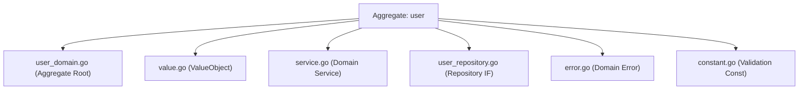
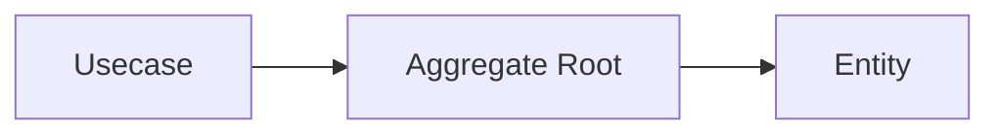
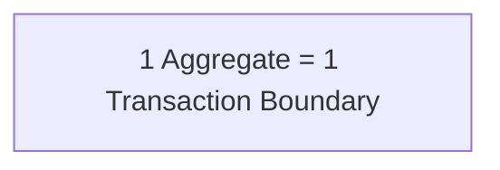
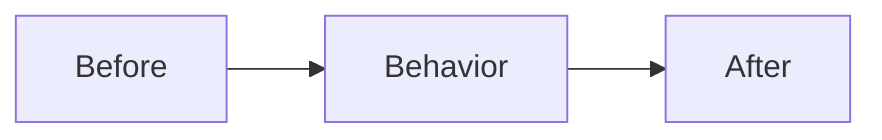

# ドメイン層（`internal/domain`）ガイド

## オニオンアーキテクチャでの役割

- **ビジネスの中心（核）**。エンティティ、値オブジェクト、ドメインサービス、ドメインイベントなどの **本質的なルール** を表現する。
- 外界（HTTP / DB / UI）への関心は一切持たず、**純粋なモデルと言語** で振る舞いを定義する。
- 変更に最も強い層。**ここが壊れない限りプロダクトは保守できる** という前提で守る。

## このプロジェクトでの役割

- `internal/domain/<bounded-context>/<aggregate>/` 配下に **Entity / ValueObject / DomainService / Repository(IF)** を配置する。

例）`internal/domain/user/`



- **副作用を持たない関数（純関数）** でルールを記述するのが原則。  
  I/O・時刻取得・乱数生成などは **引数で注入された値** に依存させる。

- 状態変更は **エンティティのメソッド** で行い、外部リソースへのアクセスはしない。

- 型は **effectively immutable** を基本とする。

  - private field + getter
  - defensive copy（`ptr.Copy`）
  - setterは禁止
  - 状態変更は **振る舞いメソッド**

- 依存関係は **コンストラクタで注入** する。

- 外部ライブラリは直接持ち込まず **pkg wrapper経由** で使用する。

例：

- UUID → `pkg/uuid`
- Decimal → `pkg/decimal`
- Error → `pkg/xerrors`

## ドメインの境界

Domain 層は **ビジネスルールと状態遷移を表現する層**である。

Domain の責務：

- 不変条件（Invariant）
- 状態遷移
- 値の整合性
- ビジネスルール

Domain の責務ではないもの：

- 検索仕様
- DB最適化
- SQL構造
- 外部API呼び出し
- 集計処理

これらは次の層で扱う。

- Usecase
- QueryService
- ReadModel

Repository は **永続化の抽象のみ提供する**。

単純な Query は実務上許容する。

許容例：

- `FindByXXX`
- `FindByActive`
- `CountByXXX`

## 実装上の注意点

### 命名/構造

- 構造体名は **ドメイン名**
- スライス型は必要に応じて定義

```go
type Users []*User
```

- Repository インターフェース名は `Repository`
- パッケージ名はドメイン名
- コンストラクタは `New`

### コンストラクタ経由以外でセットしない

- 不変条件は `New(...)` で保証
- setterは禁止
- 状態変更は **振る舞いメソッド**

### 取得は getter 経由

- フィールド公開禁止

```go
ID()
FirstName()
Email()
```

- pointer型は **defensive copy**

```go
ptr.Copy(...)
```

### 構造体にタグを打たない

Domainは外界を知らない。

禁止：

```text
json
db
validate
```

これらは DTO / Infra に置く。

### 時刻・ID の扱い

- `time.Now()` は Domain で使わない
- UUID 生成も Domain で行わない

生成は：

- Controller
- Usecase

Domainは **型付き値のみ受け取る**

```go
uuid.UUID
time.Time
```

### バリデーション

#### 形式チェック

原則 **値オブジェクト**

例：

```go
NewEmail(...)
```

軽量ドメインでは基本型も許容。

#### 境界値チェック

境界値は `constant.go`

```go
minLength
maxEmailLength
```

#### エラー

エラーは **具体エラー**

```go
ErrInvalidEmail
ErrInvalidPostalCode
```

抽象エラーは直接返さない。

```go
if ok, msg := stringkit.ValidateInRange(email, minLength, maxEmailLength); !ok {
    return nil, xerrors.Wrap(ErrInvalidEmail, msg)
}
```

### 不変条件（Domain Invariant）

エンティティは **Invariantを常に満たす**。

例：

- `updatedAt >= createdAt`
- `deletedAt >= createdAt`
- `deletedAt >= updatedAt`

Invariant保証箇所：

- `New(...)`
- 状態変更メソッド

Usecase / Repository は  
**Invariant保証責務を持たない**。

## Aggregate Design

このプロジェクトでは **Aggregate を設計単位**とする。

```text
internal/domain/<bounded-context>/<aggregate>/
```

### Aggregate Root

Aggregate には **1つの Root** が存在する。

責務：

- 整合性保証
- 外部操作入口
- 永続化対象

```go
type User struct {
    id uuid.UUID
}
```

Repository は **Root に対して定義**

```go
type Repository interface {
    Create(ctx context.Context, user *User) error
}
```

### Aggregate の整合性

変更は **Root経由のみ**



### Aggregate Boundary

Aggregate は **小さく保つ**

基本原則：



避ける：

- 巨大Aggregate
- DB構造直写
- 強結合モデル

### Aggregate 間参照

参照は **IDのみ**

```go
type Order struct {
    userID uuid.UUID
}
```

禁止：

```text
Order {
    user *User
}
```

### 複数Aggregateルール

複数Aggregateに跨るルールは

- Domain Service
- Usecase

例：

```text
User退会 → Subscription停止
```

### Query と Aggregate

Aggregate は **Write Model**

以下は扱わない：

- 集計
- レポート
- 複雑検索
- GROUP BY

これらは

- QueryService
- ReadModel

へ配置。

## インフラ層の依存性逆転

Repository は **永続化抽象**

```go
type Repository interface {
    FindByActive(ctx context.Context, active *bool, limit, offset int32) (Users, error)
    FindByID(ctx context.Context, id uuid.UUID) (*User, error)
    Create(ctx context.Context, user *User) error
    Update(ctx context.Context, user *User) error
    CountByActive(ctx context.Context, active *bool) (int64, error)
}
```

実装：

```text
internal/infrastructure/persistence/postgres/
```

`sqlc` でドメインへマッピング。

### Repository に許容するメソッド

- `FindByActive`
- `FindByXXX`
- `CountByXXX`

想定：

```text
SELECT / WHERE / JOIN
```

### Repository に持たせないもの

- GROUP BY
- SUM / AVG
- WITH句
- 境界越JOIN

配置先：

- Usecase
- QueryService
- ReadModel

## 呼び出せる層

呼び出し元：

- Usecase

Domainは **他層を呼ばない**

他Aggregateルール：

- Domain Service

例外：

```text
参照専用Aggregate
```

## テスト戦略

Domain テストは **純粋単体テスト**

依存禁止：

- DB
- HTTP
- 環境変数
- time.Now()

### コンストラクタ検証

`New(...)` が **Invariantを保証**

例：

- IDゼロ値
- 境界値
- 時刻整合性

```go
require.ErrorIs(t, err, ErrInvalidEmail)
```

### Getter 契約テスト

対象：

```go
func (u *User) ID() uuid.UUID
func (u *User) FirstName() string
func (u *User) Email() string
func (u *User) CreatedAt() time.Time
func (u *User) UpdatedAt() time.Time
```

### Immutable 保証テスト

対象：

pointer型：

```go
func (u *User) Building() *string
func (u *User) DeletedAt() *time.Time
```

検証：

1. constructorポインタ変更
2. getter返り値変更

Entity内部は変化しない。

### ドメイン振る舞いテスト

例：

```go
func (u *User) FullName() string {
    return u.firstName + " " + u.lastName
}
```

### エラー分類テスト

```go
require.ErrorIs(t, err, ErrInvalidEmail)
```

### テスト設計ポリシー

#### Deterministic

```go
baseTime := time.Date(2025,1,1,0,0,0,0,time.UTC)
```

#### 並列実行

```go
t.Parallel()
```

例外: 不変性保証テストは、エンティティが値をコピーしたことを検証するために
共有のコンストラクタ入力ポインタ（例: `building` / `deletedAt`）を直接 mutate する。
このブロックを並列実行すると `go test -race` で共有ポインタ上の競合になるため、
mutate するブロックは直列にする（`t.Parallel()` を付けない）。

#### Fail Fast

```go
require.NoError(t, err)
```

### Test Fixture

Fixtureを推奨。

理由：

- 重複削減
- Invariant保証
- テスト簡潔化

```go
func newTestUser(t *testing.T)*User {
    baseTime := time.Date(2025,1,1,0,0,0,0,time.UTC)

    id := uuid.NewTestFromSalt(t,"user")
    prefectureID := uuid.NewTestFromSalt(t,"prefecture")

    user, err := New(
        id,
        "John",
        "Doe",
        "hashed_password",
        "john@example.com",
        "1234567890",
        prefectureID,
        "Shibuya",
        "1-2-3",
        nil,
        "1500001",
        baseTime,
        baseTime.Add(time.Hour),
        nil,
    )

    require.NoError(t, err)
    return user
}
```

### 不変条件保持テスト

状態遷移テスト：



例：

```go
func TestUser_UpdateEmail(t *testing.T) {
    user := newTestUser(t)

    updatedAt := user.UpdatedAt().Add(time.Hour)

    err := user.UpdateEmail("new@example.com", updatedAt)

    require.NoError(t, err)
    require.Equal(t, "new@example.com", user.Email())
}
```

不正ケース：

```go
require.ErrorIs(t, err, ErrInvalidUpdatedAt)
```

## やっていいこと / いけないこと

### Do

- constructorで完全性保証
- 振る舞いメソッドで状態遷移
- VOで整合性担保
- Repository抽象化
- テーブル駆動テスト

### Don’t

禁止：

- http.*
- echo.*
- sqlc型
- jsonタグ
- setter
- DB主導設計
- Domainでtime.Now()

```go
// constant.go
package user

const (
    minLength             = 1
    maxFirstNameLength    = 100
    maxLastNameLength     = 100
    maxPasswordHashLength = 255
    maxEmailLength        = 100
    maxPhoneLength        = 20
    maxCityLength         = 100
    maxStreetLength       = 255
    maxBuildingLength     = 255
    maxPostalCodeLength   = 8

    // 値オブジェクト RawPassword の文字数境界
    MaxRawPasswordLength = 64
    MinRawPasswordLength = 8
)
```

```go
// error.go
package user

import (
    "go-boilerplate/internal/apperror"
    "go-boilerplate/pkg/xerrors"
)

var (
    // フィールド検証エラー（errInvalid を基底に分類）
    errInvalid             = xerrors.Wrap(apperror.ErrValidation, "invalid user")
    ErrInvalidID           = xerrors.Wrap(errInvalid, "id failed")
    ErrInvalidFirstName    = xerrors.Wrap(errInvalid, "first name failed")
    ErrInvalidLastName     = xerrors.Wrap(errInvalid, "last name failed")
    ErrInvalidPasswordHash = xerrors.Wrap(errInvalid, "password hash failed")
    ErrInvalidEmail        = xerrors.Wrap(errInvalid, "email failed")
    ErrInvalidPhone        = xerrors.Wrap(errInvalid, "phone failed")
    ErrInvalidPrefectureID = xerrors.Wrap(errInvalid, "prefecture id failed")
    ErrInvalidCity         = xerrors.Wrap(errInvalid, "city failed")
    ErrInvalidStreet       = xerrors.Wrap(errInvalid, "street failed")
    ErrInvalidBuilding     = xerrors.Wrap(errInvalid, "building failed")
    ErrInvalidPostalCode   = xerrors.Wrap(errInvalid, "postal code failed")
    ErrInvalidUpdatedAt    = xerrors.Wrap(errInvalid, "updated at failed")
    ErrInvalidDeletedAt    = xerrors.Wrap(errInvalid, "deleted at failed")

    // 値オブジェクト RawPassword 固有の検証エラー（errInvalid を経由しない）
    ErrInvalidRawPassword = xerrors.Wrap(apperror.ErrValidation, "invalid raw password")

    // ビジネスルール違反
    ErrAlreadyDeleted          = xerrors.Wrap(apperror.ErrConflict, "user is already deleted")
    ErrCurrentPasswordMismatch = xerrors.Wrap(apperror.ErrValidation, "current password does not match")
)
```

```go
// user_domain.go
package user

import (
    "time"

    "go-boilerplate/pkg/ptr"
    "go-boilerplate/pkg/stringkit"
    "go-boilerplate/pkg/uuid"
    "go-boilerplate/pkg/xerrors"
)

type Users []*User

// エンティティ（集約ルート）
type User struct {
    id           uuid.UUID
    firstName    string
    lastName     string
    passwordHash string
    email        string
    phone        string
    prefectureID uuid.UUID
    city         string
    street       string
    building     *string
    postalCode   string
    createdAt    time.Time
    updatedAt    time.Time
    deletedAt    *time.Time
}

// ファクトリ: 不変条件を満たすときだけ実体を生成
func New(
    id uuid.UUID,
    firstName string,
    lastName string,
    passwordHash string,
    email string,
    phone string,
    prefectureID uuid.UUID,
    city string,
    street string,
    building *string,
    postalCode string,
    createdAt time.Time,
    updatedAt time.Time,
    deletedAt *time.Time,
) (*User, error) {
    if id.IsNil() {
        return nil, xerrors.Wrap(ErrInvalidID, "id is required")
    }
    // フィールド検証（New / UpdateProfile で共有）
    if err := validateProfileFields(firstName, lastName, email, phone, prefectureID, city, street, building, postalCode); err != nil {
        return nil, err
    }
    if err := validatePasswordHash(passwordHash); err != nil {
        return nil, err
    }
    if updatedAt.Before(createdAt) {
        return nil, xerrors.Wrap(ErrInvalidUpdatedAt, "updatedAt must be after or equal to createdAt")
    }
    if deletedAt != nil {
        if err := validateDeletedAt(*deletedAt, createdAt, updatedAt); err != nil {
            return nil, err
        }
    }

    // building / deletedAt は防御コピー（不変性）。他フィールドはそのまま設定。
    return &User{
        id:        id,
        building:  ptr.Copy(building),
        deletedAt: ptr.Copy(deletedAt),
        // firstName / lastName / 連絡先 / 住所 / 監査時刻 …
    }, nil
}

// アクセサ（building / deletedAt は防御コピーを返す）
func (u *User) ID() uuid.UUID     { return u.id }
func (u *User) Email() string     { return u.email }
func (u *User) Building() *string { return ptr.Copy(u.building) }
func (u *User) FullName() string  { return u.firstName + " " + u.lastName }
// 氏名 / 連絡先 / 住所 / 監査時刻（createdAt, updatedAt, deletedAt）のアクセサも同様

// ビジネスロジック（振る舞い）: プロフィール一括更新（パスワードは対象外）
func (u *User) UpdateProfile(
    firstName, lastName, email, phone string,
    prefectureID uuid.UUID,
    city, street string,
    building *string,
    postalCode string,
    updatedAt time.Time,
) error {
    if err := u.ensureNotDeleted(); err != nil {
        return err
    }
    if err := validateProfileFields(firstName, lastName, email, phone, prefectureID, city, street, building, postalCode); err != nil {
        return err
    }
    if err := u.ensureUpdatedAt(updatedAt); err != nil {
        return err
    }

    // 検証通過後に各フィールドと updatedAt を置換（building は防御コピー）
    u.updatedAt = updatedAt
    return nil
}

// 振る舞いの兄弟（UpdateProfile と同じ ensure → 検証 → 置換 の idiom）。シグネチャのみ示す。
func (u *User) ChangePassword(passwordHash string, updatedAt time.Time) error // パスワードハッシュ更新
func (u *User) MarkAsDeleted(deletedAt time.Time) error                       // 論理削除（既に削除済みなら ErrAlreadyDeleted）

// 不変条件ガード（例示）: updatedAt は createdAt 以降かつ単調非減少
func (u *User) ensureUpdatedAt(updatedAt time.Time) error {
    if updatedAt.Before(u.createdAt) {
        return xerrors.Wrap(ErrInvalidUpdatedAt, "updatedAt must be after or equal to createdAt")
    }
    if updatedAt.Before(u.updatedAt) {
        return xerrors.Wrap(ErrInvalidUpdatedAt, "updatedAt must be after or equal to current updatedAt")
    }
    return nil
}
func (u *User) ensureNotDeleted() error // 削除済みなら ErrAlreadyDeleted（変更を拒否）

// バリデーション（例示・New / UpdateProfile で共有）: 各フィールドを stringkit.ValidateInRange で検証
func validateProfileFields(
    firstName, lastName, email, phone string,
    prefectureID uuid.UUID,
    city, street string,
    building *string,
    postalCode string,
) error {
    if ok, msg := stringkit.ValidateInRange(firstName, minLength, maxFirstNameLength); !ok {
        return xerrors.Wrap(ErrInvalidFirstName, msg)
    }
    // lastName / email / phone / city / street / postalCode も同様に検証し、対応する ErrInvalidXxx を返す
    if prefectureID.IsNil() {
        return xerrors.Wrap(ErrInvalidPrefectureID, "prefectureID is required")
    }
    if building != nil { // building は任意
        if ok, msg := stringkit.ValidateInRange(*building, minLength, maxBuildingLength); !ok {
            return xerrors.Wrap(ErrInvalidBuilding, msg)
        }
    }
    return nil
}
func validatePasswordHash(passwordHash string) error                   // maxPasswordHashLength で検証
func validateDeletedAt(deletedAt, createdAt, updatedAt time.Time) error // createdAt / updatedAt 以降
```

```go
// user_repository.go
//go:generate mockgen -source=$GOFILE -destination=mock/mock_$GOFILE -package=mock_$GOPACKAGE
package user

import (
    "context"

    "go-boilerplate/pkg/uuid"
)

// Repository: 単一集約の永続化と単純な読み取り（fetch by ID / 自集約属性での filter・list・count）。
// keyword 検索など集約跨ぎ・複雑クエリは QueryService（CQRS read side）が担う。
type Repository interface {
    FindByActive(ctx context.Context, active *bool, limit, offset int32) (Users, error)
    FindByID(ctx context.Context, id uuid.UUID) (*User, error)
    Create(ctx context.Context, user *User) error
    Update(ctx context.Context, user *User) error
    CountByActive(ctx context.Context, active *bool) (int64, error)
}
```
