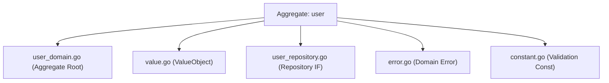
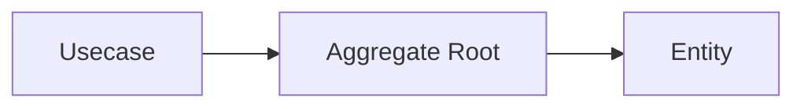
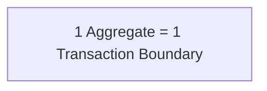
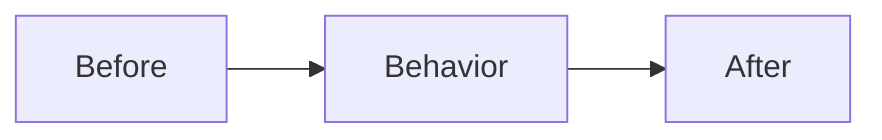

# Domain Layer (`internal/domain`) Guide

## Role in Onion Architecture

- The **core of the business**. It represents **essential rules** such as entities, value objects, domain services, and domain events.
- It has no concern for external systems (HTTP / DB / UI) and defines behavior using **pure models and language**.
- The most resilient layer to change. It is protected under the assumption that **as long as this layer does not break, the product remains maintainable**.

## Role in this project

- Place **Entity / ValueObject / Repository (IF)** under `internal/domain/<aggregate>/`. A
  **Domain Service** does *not* belong here: it spans aggregates, so it cannot live inside one of
  them — see
  [Where a cross-aggregate Domain Service lives](#where-a-cross-aggregate-domain-service-lives).

Example: `internal/domain/user/`



- As a principle, describe rules using **functions without side effects (pure functions)**.  
  I/O, time retrieval, and random generation should depend on **values injected via arguments**.

- State changes must be performed through **entity methods**, and must not access external resources.

- Types should follow an **effectively immutable** approach.

  - private field + getter
  - defensive copy (`ptr.Copy`)
  - setters are prohibited
  - state changes occur through **behavior methods**

- Dependencies should be **injected via constructors**.

- External libraries must not be imported directly; they should be used **through pkg wrappers**.

Examples:

- UUID → `pkg/uuid`
- Decimal → `pkg/decimal`
- Error → `pkg/xerrors`

- A domain package must **not** import another aggregate (enforced by depguard: `internal/domain/`
  is denied). Business-semantic value objects used by more than one aggregate, which cannot live in
  `pkg/` because `pkg/` forbids business logic, live in the **domain lexicon**
  [`internal/domain/lexicon`](lexicon/README.md), which every domain package may import. Placement is
  resolved `pkg/` first, and admission is deliberately narrow — the name states the question asked at
  the door: is this a word of the business? See its README.
  Rationale: [ADR-0034](../../docs/adr/0034-domain-lexicon.md).

  The other path that may import an aggregate is `internal/domain/service/**`, where a rule spanning
  aggregates lives; it has its own depguard rule that repeats every other domain deny. See
  [Where a cross-aggregate Domain Service lives](#where-a-cross-aggregate-domain-service-lives).

## Domain boundaries

The Domain layer is a layer that **expresses business rules and state transitions**.

Domain responsibilities:

- Invariants
- State transitions
- Value consistency
- Business rules

What Domain is not responsible for:

- Search specifications
- DB optimization
- SQL structure
- External API calls
- Aggregation processing

These are handled in the following layers:

- Usecase
- QueryService
- ReadModel

Repository provides **only persistence abstraction**.

Simple queries are acceptable in practice.

Allowed examples:

- `FindByXXX`
- `FindByActive`
- `CountByXXX`

## Entity or Value Object

Before deciding how to implement a domain type, decide **what it is**. The two kinds are separated by
one question, and it is not "does it deserve invariants" — every domain type deserves those.

**An Entity has an identity that outlives its attributes.** Change every field of a user and it is
still the same user; that continuity is what an identity is for. Two entities are the same when their
identities match, whatever their attributes say.

**A Value Object has no identity.** It is the value it holds, so two of them are the same exactly when
their contents are equal. Nothing about it persists across a change, because changing it produces a
different value rather than the same thing in a new state. Replace it whole; never mutate it in place.

Deciding for a new type:

1. Ask whether the thing needs to be traceable as *the same one* over time — through updates,
   through persistence, through being handed around. If yes, it is an Entity and it needs an identity
   field that never changes.
2. If it does not, it is a Value Object. Give it equality by content and make it immutable.
3. If the answer depends on the context — an address is an Entity to a delivery service and a Value
   Object to a customer record — the answer is the one that holds *in this model*, not in general.

### How far Value Objects go here

Evans models an attribute as a Value Object wherever the attribute carries meaning of its own. **This
repository does not go that far**: an attribute is wrapped only when it has an invariant worth
enforcing (a non-negative price, a bounded string), and stays a primitive otherwise.

This is a deliberate departure. Wrapping every attribute buys type-level protection against
mixing up two same-typed fields, but it multiplies the type count and the conversion noise at every
boundary, and the protection it adds over a well-named field with a validated constructor is small.
The cost outruns the benefit at this size. Where the swap risk is real — same-typed adjacent
parameters — the remedy this repository uses is bundling into an attribute struct instead; see the
struct-bundling section below.

**`pkg/` does not contain Value Objects in this sense.** Types there wrap a vendor library or a
primitive without carrying business meaning, which is exactly what disqualifies them from this layer;
see [`pkg/README.md`](../../pkg/README.md).

## Domain events

A transition that the outside world needs to hear about **returns the fact it produced**:

```go
func (e *Entity) Cancel(now time.Time) (Event, error)
```

The aggregate that underwent the change is the only thing that knows it happened, so the aggregate
is what declares it. Returning the event from the transition means the compiler ties the two
together: a caller cannot obtain the event without the transition having succeeded, and cannot
succeed at the transition without being handed the event. "State changed but no event was emitted"
and "an event was emitted but nothing changed" stop being writable.

An event is a **fact**, so it is past-tense, immutable, and carries the time it occurred — the same
instant the transition recorded, not a second reading of the clock.

**The name is domain vocabulary; the wire format is not.** What the event is called (`canceled`,
`shipped`) belongs here. The versioned type string, the JSON field names, and the payload shape are
a transport contract owned by the layer that publishes it — this layer holds no serialization. A
mapping in that layer turns a domain event into its published form, which is also where a version
rises when the payload changes shape while the fact stays the same.

Collecting events on the aggregate to be drained after save (pending events) is **not** used here.
Returning them from the transition gets the same guarantee without giving the aggregate mutable
state to manage.

## Implementation notes

### Naming / structure

- Struct names should be **domain names**
- Slice types may be defined when necessary

```go
type Users []*User
```

- Repository interface name should be `Repository`
- Package name should be the domain name
- Constructor name should be `New`

> **Departure from Evans.** For Evans a Module is part of the model: the dividing lines and the names
> are meant to carry an insight about the domain, and the structure is expected to evolve as the model
> does. The rules above are mechanical beside that — they say what to call things, not what a division
> should reveal. The gap is structural rather than an oversight. A template has no real domain to have
> an insight about, so the lines drawn here are the ones the architecture implies; the ones that would
> express a model belong to whoever forks it.

### Bundle attributes into a struct when positional arguments can be swapped

The criteria — when a same-typed-parameter swap is a real risk, when it is not, and whether to remedy it
with distinct VO types or with a struct — are layer-independent and live in `docs/rules.md`
("Function Signature Rules"). This section covers only how the domain layer applies them.

An entity whose attributes trigger the rule bundles them into a value struct shared by every entry point,
so creation, reconstruction, and update cannot drift apart:

```go
// The attribute set shared by the constructor and the behavior methods.
type Attributes struct {
    Name        string
    Description *string
    // ...
    ImagePath   *string
}

func New(id uuid.UUID, attrs Attributes) (*Entity, error)
func Reconstruct(id uuid.UUID, attrs Attributes, version int) (*Entity, error)
func (e *Entity) Update(attrs Attributes) error
```

The identity (`id`) and the optimistic-lock version stay positional — they are distinctly typed and are
not part of the attribute set the update entry point replaces. When only a subset of the attributes is
replaceable, name that subset as its own struct and embed it (`user.Profile` inside `user.Attributes`)
rather than declaring two overlapping structs.

Reconstruction from a DB row is the most exposed caller in this layer, so the mapping test the rule
requires belongs on the Repository's row-to-entity conversion as well as on the constructor.

### Do not set outside constructor

- Invariants are guaranteed in `New(...)`
- setters are prohibited
- state changes occur through **behavior methods**

`Reconstruct(...)` runs the same invariants as `New(...)`. There is no relaxed path for data that is
already stored.

**An aggregate is constructed whole, children included.** One call produces the root and the parts it
owns, and that call is where the invariants are checked — including the ones no part can judge alone,
such as uniqueness across siblings or a total that has to agree with the lines it sums. A child's own
constructor assembles a part; it is not the gate. Giving it one would split a single rule across two
places and leave the cross-child half with nowhere to live. `Reconstruct(...)` is bound by this too:
the children arrive already assembled from storage, so the root is the only point at which the set
can still be rejected.

> **Departure from Evans.** Evans warns that reconstituting an object from storage is not the same
> problem as creating one: the data already exists, so a violated invariant may call for a repair
> strategy rather than a flat refusal. This model always fails hard — a row that breaks an invariant
> surfaces as an error at load time. A stored violation is a defect to be found, and repairing it
> silently would hide that defect at the exact moment it becomes observable. The cost is accepted:
> such a row blocks reads of that aggregate until it is corrected.

### The constructor is the Factory

`New(...)` and `Reconstruct(...)` are this model's Factory, and there is no separate Factory type.
A Factory exists to take the knowledge of how to assemble a valid whole away from the client and give
it to something that owns it; a constructor in the aggregate's own package does that already. The
client supplies values, the constructor decides what counts as valid, and a half-built instance is
never observable. Reconstitution's Factory is the Repository — it reads the row and hands it to
`Reconstruct(...)`, which is why no outer layer assembles an aggregate field by field.

**A Factory type appears when construction acquires configuration** — something fixed across
creations, such as a numbering scheme or a rule that varies by tenant. The type holds that
configuration and its method takes the per-creation data. Data that changes every call is an argument,
not a field; when nothing is left to hold, the type has no reason to exist and `New(...)` is already
the whole pattern.

**Construction takes values, never injected collaborators.** Do not give the domain a generator or a
policy interface to build with. A generator makes the domain perform an effect, so the same inputs
stop producing the same aggregate. A policy interface is worse: it moves the very rule the constructor
exists to state back outside the domain and leaves only its name behind — the criterion is then
authored where it cannot be seen (see § Query and Aggregate for the same failure in a query path).
Outer layers run the effects — identifiers, clocks — and pass in the results, exactly as behavior
methods already take `now`. If a choice must be configurable, pass the choice as a domain value and
keep the branching in the domain.

### Access via getter

- Fields must not be exported

```go
ID()
FirstName()
Email()
```

- pointer types must use **defensive copy**

```go
ptr.Copy(...)
```

### Do not add tags to struct

Domain must not know the outside world.

Forbidden:

```text
json
db
validate
```

These belong to DTO / Infrastructure.

### Not every DB column is an entity field

An entity models only state that carries **domain meaning**. Columns that exist purely for persistence or search infrastructure are intentionally left off the entity, even when present in the table:

- Audit columns (`created_at` / `updated_at`) — read them directly from the DB when needed; they need not become entity fields or invariants.
- DB-generated / computed columns (e.g. `GENERATED ALWAYS AS ... STORED` search-text columns) — infrastructure search optimization, not domain state.

So a 1:1 entity ↔ column correspondence is **not** required; absence of such columns from an entity is a deliberate design choice, not drift.

### Handling time and ID

- Do not use `time.Now()` in Domain
- Do not generate UUID in Domain

Generation must be done in:

- Controller
- Usecase

Domain receives only **typed values**

```go
uuid.UUID
time.Time
```

### Validation

#### Format check

Principle: **Value Objects**

Example:

```go
NewEmail(...)
```

Primitive types may be allowed in lightweight domains.

#### Boundary value check

Boundary values are defined in `constant.go`

```go
minLength
maxEmailLength
```

#### Why validate here when OpenAPI already validates the request?

The OpenAPI request-validation middleware and this layer are **not redundant** — they have different owners and different scopes:

- **Different owner.** OpenAPI constraints are the *wire contract* (what the HTTP API accepts); the domain constants are the *business rule* (what the business considers valid). They may legitimately differ — see [Input Boundary Value Ownership](../../openapi/boundary-ownership.md).
- **The only universal chokepoint — both inbound and from persistence.** Every entity is built through `New(...)`. Not only do non-HTTP write paths (seed, CLI, batch jobs, tests, any future entrypoint) bypass the request middleware entirely — reconstruction from the database also goes through the same validating constructor (`rowToUser` rebuilds every row via `user.New(...)`). So `New(...)` also guards against invalid data coming *from* infra: a corrupt, manually-inserted, or legacy row that violates a domain invariant fails at reconstruction instead of surfacing as a valid-looking entity. The middleware cannot protect this read path at all; only the domain can.
- **Framework-agnostic self-protection.** The domain must be correct independent of its caller. Delegating validation to the transport layer would couple the domain's correctness to Echo / the middleware, violating the layer's framework-agnostic rule.

In short: the middleware protects the HTTP boundary; the domain protects the *business rule itself*, for all callers.

#### Errors

Errors must be **specific errors**

```go
ErrInvalidEmail
ErrInvalidPostalCode
```

Do not return abstract errors directly.

```go
if ok, msg := stringkit.ValidateInRange(email, minLength, maxEmailLength); !ok {
    return nil, xerrors.Wrap(ErrInvalidEmail, msg)
}
```

For **user-correctable input fields**, do not stop at the first failure: validate all
fields, join the per-field errors, and attach the invalid field identifiers via
`apperror.WithDetails` so the API can report every invalid field at once
(see the Error Metadata section of [`internal/apperror/README.md`](../apperror/README.md)):

```go
errs = append(errs, xerrors.Wrap(ErrInvalidEmail, msg))
fields = append(fields, FieldEmail) // constant matching the API property name
...
return apperror.WithDetails(xerrors.Join(errs...), fields...)
```

The field identifiers are domain constants (`FieldEmail = "email"`) matching the API
request property names; the reason text stays in the wrapped error message (log-only).
Server-internal invariants (id, timestamps) keep first-error return —
they are not user-correctable input.

### Invariants (Domain Invariant)

Entities must **always satisfy invariants**.

Examples:

- `updatedAt >= createdAt`
- `deletedAt >= createdAt`
- `deletedAt >= updatedAt`

Invariant enforcement points:

- `New(...)`
- state transition methods

Usecase / Repository  
**do not have responsibility to enforce invariants**.

## Aggregate Design

In this project, **Aggregate is the design unit**.

```text
internal/domain/<aggregate>/
```

### Aggregate Root

Each Aggregate has **one Root**.

Responsibilities:

- consistency guarantee
- external operation entry point
- persistence target

```go
type User struct {
    id uuid.UUID
}
```

Repository is defined **for the Root**

```go
type Repository interface {
    Create(ctx context.Context, user *User) error
}
```

### Aggregate consistency

Changes must go **through the Root only**



### Aggregate Boundary

Keep Aggregate **small**

Principle (the default, not an absolute — see the two departures below):



Avoid:

- large aggregates
- direct DB structure mapping
- tightly coupled models

**Two named situations depart from the principle**, and only these two. Both put rows belonging to
more than one aggregate inside a single transaction, and each has to be justified against its own
criterion before it is used — the criterion, and the default that precedes both, are the three
branches of [ADR-0029](../../docs/adr/0029-commandservice-atomicity-criterion.md) § Decision
procedure:

- **A guard that must not go stale** (branch 2). An operation reads another aggregate to decide
  whether it is permitted, and a concurrent write could invalidate that condition between the check
  and the commit. The guard row is locked before the condition is evaluated, and held to the commit
  ([ADR-0031](../../docs/adr/0031-ordered-pessimistic-row-locks.md)). The other aggregate is
  observed, never mutated, and the operation stays a regular usecase.
- **A multi-aggregate write that must be atomic** (branch 3). The requirements say an intermediate
  state must never be observable, so the writes run in one transaction through a CommandService
  ([ADR-0027](../../docs/adr/0027-lightweight-cqrs.md)).

Everything else decomposes: a single-aggregate write plus an eventually consistent cascade, which is
the branch this principle describes without exception.

> **Departure from Evans.** Evans makes the aggregate the boundary of *immediate* consistency — one
> transaction changes one aggregate, and anything beyond it is reconciled afterwards. This model
> widens that boundary in the two situations above, and the widening is real: creating a purchase
> holds rows from three aggregates in one transaction — the purchaser (locked to guard membership),
> the products (locked to reserve stock), and the purchase being written. That is accepted because
> Evans's argument is about *change*, and the three roles are not alike. Only the purchase and the
> product are written, and their writes must be atomic or overselling becomes observable; the user is
> read and held, never mutated, so its root keeps sole authority over its own state. What the
> principle protects — no mutating several aggregates through one loaded graph until nobody can say
> which invariant belongs to which root — still holds. What it would otherwise permit by default, and
> what this model refuses, is deciding a cross-aggregate question from a read that nothing holds.

### Cross-aggregate reference

References must be **ID only**

```go
type Order struct {
    userID uuid.UUID
}
```

Forbidden:

```text
Order {
    user *User
}
```

**This rule governs the seam between one aggregate and another — nothing else.** What decides which
side of that seam a type sits on is whether it has an access path of its own: a type reachable only
through its parent is a sub-entity of that aggregate, while a type that is queried, listed, or
maintained on its own is a separate aggregate however its package is nested.

A sub-entity is inseparable from its parent, so this rule does not reach it: it holds its own
attributes directly. Whether it exposes its own identity is a design decision, not a consequence of
this rule — exposing it is usually right, because a caller sometimes needs the identity and because
the alternative invites a back-reference to the parent, which becomes indistinguishable from the
sub-entity's own fields. **Never give a sub-entity a back-reference to its parent.**

**Exception — reference master.** A reference master may be held as its identity plus whatever
attributes are needed to present it, rather than as a bare identity. Those attributes are a
denormalized copy carried for presentation: the value exposes none of the other aggregate's behavior
and is never read to reach a decision. A mutable aggregate stays identity-only.

> **Departure from Evans.** Evans permits an aggregate to hold a direct reference to another
> aggregate's root, trusting that root to guard its own invariants. This model does not: a mutable
> aggregate is reachable by identity only. A direct reference makes it too easy to load a graph and
> mutate through it, collapsing two transaction boundaries into one by accident; refusing it costs a
> lookup and buys a boundary the compiler can see. The reference-master exception above is the single
> place a non-identity value crosses, and it carries no behavior to mutate through.

### Reference master aggregates

A reference master is a lighter archetype than a mutable aggregate: no state-transition method, no
optimistic-lock version, no audit timestamps, no logical deletion, and a Repository that exposes
lookups only, with no write operation. Do not add those to make one resemble the others — **their
absence is the contract that says the application does not write this data.**

Reference masters exist for two distinct reasons; do not conflate them.

- **A copy of a distinction that exists outside the application** — a standard, a statute. Its value
  set is not decided by the business, so it does not grow or shrink with a business decision.
- **A vocabulary the business defines** — a classification, a status. The business itself decides the
  value set, so a change to it *is* a business decision. These are often placed as a dimension
  subordinate to the aggregate that references them.

**A lookups-only Repository does not by itself make a reference master.** The test is whether the
data is part of the owning aggregate's semantic set — no independent transactional lifecycle, and
reached through a mandatory, uniquely-determined foreign key. A table that is standing lookup data
but is queried and listed on its own terms is an *independent aggregate*: it stays identity-only, and
its attributes are resolved by a usecase-layer batch fetch rather than carried across the seam.
`internal/domain/prefecture` is the case to compare against — externally given and never written by
the application, yet an independent aggregate, not a reference master. See
[`docs/rules.md`](../../docs/rules.md) § Repository / QueryService Rules for the read-path
consequences of the same distinction.

### Multi-aggregate rules

A rule that spans aggregates belongs to a **Domain Service** — not to Usecase.

```text
Withdrawal ← in-progress purchase
```

#### Domain Service or Usecase

The line is **derivation**.

- **Domain Service** derives something: it computes a business-meaningful value from more than one
  entity. What quantity can actually be allocated, given stock and reservations. It is stateless, and
  it exists only because the operation is not the natural responsibility of any one entity or value
  object — if it fits on one of them, put it there instead.
- **Usecase** coordinates and maps. It orders the calls, owns the transaction, and turns domain
  models into DTOs.

**Reading more than one entity is not derivation.** Loading two entities and placing them side by
side in a DTO is mapping, and it stays in Usecase. Routing that through a Domain Service would drag
every two-entity read into the domain layer for nothing.

When a value is derived and then shipped outward, the two split: the derivation is the Domain
Service's, the copying into the DTO is the Usecase's.

The test, when it is unclear: **if that calculation changed, would the reason be a business decision
or a presentation decision?** A business decision means it is a domain rule and belongs to a Domain
Service.

#### Where a cross-aggregate Domain Service lives

Under `internal/domain/service/<name>/` — outside any aggregate package, because a service that spans
aggregates cannot live inside one of them (a domain package must not import another aggregate).

**That placement only means something because the path has its own depguard rule.** An aggregate
package may not import another aggregate; a package under `internal/domain/service/**` may. Everything
else the domain layer forbids is repeated verbatim in that rule — no framework, no infrastructure, no
usecase or controller, no file system, process, or environment access — so the exception widens
exactly one edge and nothing else. Without it, moving a rule out of an aggregate would not let it
reach the second aggregate, and the placement rule above would be unfollowable.

The name is business vocabulary — what the rule is about, never `common` / `shared` / `util`, which
name nothing and therefore refuse nothing.

**Admission is narrow, and the depguard exception is not an invitation.** A package belongs here only
when all three hold:

1. The rule spans aggregates — it cannot be decided from one aggregate's state alone.
2. It is the natural responsibility of neither aggregate. If it fits on one of them, it goes there.
3. It is stateless, and it derives (see *Domain Service or Usecase* above). Reading two aggregates to
   place them side by side is mapping, and mapping stays in Usecase.

A service here holds no I/O: no Repository, no `context.Context`. It receives state the Usecase has
already loaded and returns a domain error. Acquiring that state, ordering the calls, and owning the
transaction remain the Usecase's job.

**The occupant today is [`service/membership`](service/membership).** It carries one invariant seen
from both sides — a user and their in-progress purchases must not be separated. `EnsurePurchasable`
refuses a purchase by a user who is no longer active; `EnsureWithdrawable` refuses a withdrawal while
any of that user's purchases is still in progress. Neither aggregate can host it: the user aggregate
knows nothing about purchases, and the purchase aggregate knows nothing about membership.

### Query and Aggregate

Aggregate is a **Write Model**. The *execution* of aggregation, reporting, complex search, and
`GROUP BY` belongs to QueryService / ReadModel, and so does the projection those return.

**What moves out is the implementation, never the criterion.** "Which products count as low on
stock", "which users count as inactive" — the rule that decides membership is domain vocabulary and
stays in the domain layer, expressed as domain constants and domain predicates. When that rule lives
only in a `WHERE` clause, the domain has lost a business rule to infrastructure, and nothing in this
layer can tell you what the rule is any more.

The distinction matters most where selection is concerned. Naively handing a criterion to a
Repository means fetching everything and filtering in memory, which is not viable; so the criterion
is translated into SQL, an index, or a search engine, and the projection comes back as a DTO the
domain never sees. That translation is expected and correct. What must not travel with it is the
authorship of the criterion.

**"The `WHERE` already guarantees it, so a domain predicate would be redundant" is not an argument.**
Every row a filter returns does satisfy that filter — and that is circular. What the row satisfies is
the condition the query happens to state; whether that condition *is* the business rule is the very
thing left unchecked. The redundancy is real at the level of *execution* and imaginary at the level
of *authorship*, and the argument trades one for the other. The costs are concrete: the meaning of
the term can no longer be answered by reading this layer, a second caller has to restate the
condition with nothing linking the two, and the rule can only be exercised through the database, so
a change in meaning breaks no unit test.

**Not every condition is a criterion.** A condition is one when someone who knows the business would
recognise it as a statement about the business — when the term it decides has a name they use.
Identity lookup, pagination, ordering, and foreign-key joins decide nothing about the business and
this rule does not reach them. Nor does a Repository method whose signature already says the whole
condition: `FindDeletedBefore(ctx, cutoff, …)` states its own criterion, while `FindAllLowStock` does
not. The check is one question — can the meaning of the term be answered by reading the domain
package alone? If not, its authorship has left.

The same discipline is already imposed on the write side, where a CommandService may only enforce
conditions derived from domain invariants ([ADR-0027](../../docs/adr/0027-lightweight-cqrs.md)).
There is no reason for the read side to be the exception.

Read paths are free to skip the aggregate entirely — a search index is a projection of the system of
record, and reconstructing every hit through `FindByID` to re-derive it is not a realistic design.
The domain's claim on a read path is the vocabulary of the question, not the shape of the answer.

## Dependency inversion for Infrastructure layer

Repository is a **persistence abstraction**

```go
type Repository interface {
    FindByActive(ctx context.Context, active *bool, limit, offset int32) (Users, error)
    FindByID(ctx context.Context, id uuid.UUID) (*User, error)
    Create(ctx context.Context, user *User) error
    Update(ctx context.Context, user *User) error
    CountByActive(ctx context.Context, active *bool) (int64, error)
}
```

Implementation:

```text
internal/infrastructure/rdb/repository/<aggregate>/
```

Mapping to Domain is done by `sqlc`.

### Methods allowed in Repository

- `FindByActive`
- `FindByXXX`
- `CountByXXX`
- `Create` / `Update` (aggregate persistence — writes; logical delete is an `Update` of `deletedAt`)

Assumed operations:

```text
SELECT / WHERE / JOIN
```

### What must not be in Repository

- GROUP BY
- SUM / AVG
- WITH clause
- cross-boundary JOIN

Place them in:

- Usecase
- QueryService
- ReadModel

### Doc comments stay in domain vocabulary

The SQL shapes above bound **what the Infrastructure implementation may do**; they are not the
vocabulary of the doc comments written here. A Repository interface is the seam to persistence, which
is exactly why its doc comment must contract the **guarantee** in domain vocabulary and leave the
**mechanism** to the implementation: `LockByID` states that it takes a pessimistic lock and what that
lock serializes, not that the lock is a `SELECT … FOR UPDATE`; a feed method states "ordered by
ordered-at descending, tie-broken by ID", not `(ordered_at DESC, id DESC)`. Table names, column
names, and SQL fragments belong to the Infrastructure doc comment that already states them — see
[`internal/infrastructure/README.md`](../infrastructure/README.md) § Doc comments may name technical
detail, and [`internal/usecase/README.md`](../usecase/README.md) § Doc comments: interface vs
implementation for the rule this mirrors.

Three consequences are specific to Domain:

- **A numeric bound whose reason is the storage width is expressed as a Go integer width**, not as a
  SQL type name — `1..32767` is documented as the positive range of a signed 16-bit integer. That
  keeps the constant from reading as a magic number while staying technology-neutral. Put the reason
  on the constant so the exported constructor's doc stays a pure contract.
- **A reference master is named by its domain name** (the product-status master), never by its table
  (`product_statuses`).
- **A single-fetch method states its not-found behavior** — `FindByID` documents that it returns
  NotFound when the target is absent. The caller branches on that, so it is part of the guarantee,
  not an implementation detail.

## Callable layers

Called from:

- Usecase

Domain **must not call other layers**

Cross-aggregate rules:

- Domain Service

Exception:

```text
read-only aggregate reference
```

## Testing strategy

Domain tests are **pure unit tests**

Forbidden dependencies:

- DB
- HTTP
- environment variables
- time.Now()

### Constructor validation

`New(...)` guarantees **invariants**

Examples:

- zero ID
- boundary values
- time consistency

```go
require.ErrorIs(t, err, ErrInvalidEmail)
```

### Getter contract test

One `TestXxx` **per getter** (`TestUser_ID`, `TestUser_Email`, …). Do **not** bundle getters into a single `*_Accessors` / `*_Getters` test (1:1 rule — see [`docs/testing-conventions.md`](../../docs/testing-conventions.md) §1, enforced by `internal/architest`).

Target (one dedicated test each):

```go
func (u *User) ID() uuid.UUID
func (u *User) FirstName() string
func (u *User) Email() string
func (u *User) CreatedAt() time.Time
func (u *User) UpdatedAt() time.Time
```

### Immutable guarantee test

For pointer / reference-returning getters, assert immutability **inside that getter's own `TestXxx`** (folded into e.g. `TestUser_Building`) — not as a separate bundled `TestImmutableAccessors`.

Target:

pointer types:

```go
func (u *User) Building() *string
func (u *User) DeletedAt() *time.Time
```

Verification:

1. modify constructor pointer
2. modify getter return value

Internal state must not change.

### Domain behavior test

Example:

```go
func (u *User) FullName() string {
    return u.firstName + " " + u.lastName
}
```

### Error classification test

```go
require.ErrorIs(t, err, ErrInvalidEmail)
```

### Test design policy

#### Deterministic

```go
baseTime := time.Date(2025,1,1,0,0,0,0,time.UTC)
```

#### Parallel execution

```go
t.Parallel()
```

Exception: the immutable guarantee test mutates a shared constructor-input
pointer (e.g. `building` / `deletedAt`) to prove the entity copied it. Running
those blocks in parallel races on the shared pointer under `go test -race`, so
keep the mutating blocks serial (omit `t.Parallel()` on them).

#### Fail Fast

```go
require.NoError(t, err)
```

### Test Fixture

Fixture is recommended.

Reasons:

- reduce duplication
- guarantee invariants
- simplify tests

```go
func newTestUser(t *testing.T)*User {
    baseTime := time.Date(2025,1,1,0,0,0,0,time.UTC)

    id := uuid.NewTestFromSalt(t,"user")
    prefectureID := uuid.NewTestFromSalt(t,"prefecture")

    user, err := New(
        id,
        "John",
        "Doe",
        "john@example.com",
        "1234567890",
        prefectureID,
        "Shibuya",
        "1-2-3",
        nil,
        "1500001",
        baseTime,
        baseTime.Add(time.Hour),
        nil,
    )

    require.NoError(t, err)
    return user
}
```

### Invariant preservation test

State transition test:



Example:

```go
func TestUser_UpdateEmail(t *testing.T) {
    user := newTestUser(t)

    updatedAt := user.UpdatedAt().Add(time.Hour)

    err := user.UpdateEmail("new@example.com", updatedAt)

    require.NoError(t, err)
    require.Equal(t, "new@example.com", user.Email())
}
```

Invalid case:

```go
require.ErrorIs(t, err, ErrInvalidUpdatedAt)
```

## Do / Don’t

### Do

- guarantee integrity in constructor
- state transition via behavior methods
- ensure consistency via Value Objects
- Repository abstraction
- sequential `t.Run` cases (no table-driven `for` loops — see [`docs/testing-conventions.md`](../../docs/testing-conventions.md))

### Don’t

Forbidden:

- http.*
- echo.*
- sqlc types
- json tags
- setter
- DB-driven design
- time.Now() in Domain

```go
// constant.go
package user

const (
    minLength           = 1
    maxFirstNameLength  = 100
    maxLastNameLength   = 100
    maxEmailLength      = 100
    maxPhoneLength      = 20
    maxCityLength       = 100
    maxStreetLength     = 255
    maxBuildingLength   = 255
    maxPostalCodeLength = 8
)
```

```go
// error.go
package user

import (
    "go-boilerplate/internal/apperror"
    "go-boilerplate/pkg/xerrors"
)

var (
    // フィールド検証エラー（errInvalid を基底に分類）
    errInvalid             = xerrors.Wrap(apperror.ErrValidation, "invalid user")
    ErrInvalidID           = xerrors.Wrap(errInvalid, "id failed")
    ErrInvalidFirstName    = xerrors.Wrap(errInvalid, "first name failed")
    ErrInvalidLastName     = xerrors.Wrap(errInvalid, "last name failed")
    ErrInvalidEmail        = xerrors.Wrap(errInvalid, "email failed")
    ErrInvalidPhone        = xerrors.Wrap(errInvalid, "phone failed")
    ErrInvalidPrefectureID = xerrors.Wrap(errInvalid, "prefecture id failed")
    ErrInvalidCity         = xerrors.Wrap(errInvalid, "city failed")
    ErrInvalidStreet       = xerrors.Wrap(errInvalid, "street failed")
    ErrInvalidBuilding     = xerrors.Wrap(errInvalid, "building failed")
    ErrInvalidPostalCode   = xerrors.Wrap(errInvalid, "postal code failed")
    ErrInvalidUpdatedAt    = xerrors.Wrap(errInvalid, "updated at failed")
    ErrInvalidDeletedAt    = xerrors.Wrap(errInvalid, "deleted at failed")

    // ビジネスルール違反
    ErrAlreadyDeleted = xerrors.Wrap(apperror.ErrConflict, "user is already deleted")
)
```

```go
// user_domain.go
package user

import (
    "time"

    "go-boilerplate/pkg/ptr"
    "go-boilerplate/pkg/stringkit"
    "go-boilerplate/pkg/uuid"
    "go-boilerplate/pkg/xerrors"
)

type Users []*User

// エンティティ（集約ルート）
type User struct {
    id           uuid.UUID
    firstName    string
    lastName     string
    email        string
    phone        string
    prefectureID uuid.UUID
    city         string
    street       string
    building     *string
    postalCode   string
    createdAt    time.Time
    updatedAt    time.Time
    deletedAt    *time.Time
}

// 置き換え可能な属性の部分集合（New / UpdateProfile で共有）。
// firstName / lastName / phone / city / street は同型のため、フィールド名指定を要求する。
type Profile struct {
    FirstName    string
    LastName     string
    Email        string
    Phone        string
    PrefectureID uuid.UUID
    City         string
    Street       string
    Building     *string
    PostalCode   string
}

// 生成に必要な属性一式。createdAt / updatedAt も同型のため同じ扱いとする。
type Attributes struct {
    Profile

    CreatedAt time.Time
    UpdatedAt time.Time
    DeletedAt *time.Time
}

// ファクトリ: 不変条件を満たすときだけ実体を生成
func New(id uuid.UUID, attrs Attributes) (*User, error) {
    if id.IsNil() {
        return nil, xerrors.Wrap(ErrInvalidID, "id is required")
    }
    // フィールド検証（New / UpdateProfile で共有）
    if err := validateProfileFields(attrs.Profile); err != nil {
        return nil, err
    }
    if attrs.UpdatedAt.Before(attrs.CreatedAt) {
        return nil, xerrors.Wrap(ErrInvalidUpdatedAt, "updatedAt must be after or equal to createdAt")
    }
    if attrs.DeletedAt != nil {
        if err := validateDeletedAt(*attrs.DeletedAt, attrs.CreatedAt, attrs.UpdatedAt); err != nil {
            return nil, err
        }
    }

    // building / deletedAt は防御コピー（不変性）。他フィールドはそのまま設定。
    return &User{
        id:        id,
        building:  ptr.Copy(attrs.Building),
        deletedAt: ptr.Copy(attrs.DeletedAt),
        // ↑以外の全フィールド（firstName / lastName / 連絡先 / 住所 / 監査時刻）も attrs から設定（例示のため省略）
    }, nil
}

// アクセサ（building / deletedAt は防御コピーを返す）
func (u *User) ID() uuid.UUID     { return u.id }
func (u *User) Email() string     { return u.email }
func (u *User) Building() *string { return ptr.Copy(u.building) }
func (u *User) FullName() string  { return u.firstName + " " + u.lastName }
// 氏名 / 連絡先 / 住所 / 監査時刻（createdAt, updatedAt, deletedAt）のアクセサも同様

// ビジネスロジック（振る舞い）: プロフィール一括更新
func (u *User) UpdateProfile(profile Profile, updatedAt time.Time) error {
    if err := u.ensureNotDeleted(); err != nil {
        return err
    }
    if err := validateProfileFields(profile); err != nil {
        return err
    }
    if err := u.ensureUpdatedAt(updatedAt); err != nil {
        return err
    }

    // 検証通過後に各フィールドと updatedAt を置換（building は防御コピー）
    u.updatedAt = updatedAt
    return nil
}

// 振る舞いの兄弟（UpdateProfile と同じ ensure → 検証 → 置換 の idiom）。シグネチャのみ示す。
func (u *User) MarkAsDeleted(deletedAt time.Time) error // 論理削除（既に削除済みなら ErrAlreadyDeleted）

// 不変条件ガード（例示）: updatedAt は createdAt 以降かつ単調非減少
func (u *User) ensureUpdatedAt(updatedAt time.Time) error {
    if updatedAt.Before(u.createdAt) {
        return xerrors.Wrap(ErrInvalidUpdatedAt, "updatedAt must be after or equal to createdAt")
    }
    if updatedAt.Before(u.updatedAt) {
        return xerrors.Wrap(ErrInvalidUpdatedAt, "updatedAt must be after or equal to current updatedAt")
    }
    return nil
}
func (u *User) ensureNotDeleted() error // 削除済みなら ErrAlreadyDeleted（変更を拒否）

// バリデーション（例示・New / UpdateProfile で共有）: 各フィールドを stringkit.ValidateInRange で検証
func validateProfileFields(profile Profile) error {
    if ok, msg := stringkit.ValidateInRange(profile.FirstName, minLength, maxFirstNameLength); !ok {
        return xerrors.Wrap(ErrInvalidFirstName, msg)
    }
    // lastName / email / phone / city / street / postalCode も同様に検証し、対応する ErrInvalidXxx を返す
    if profile.PrefectureID.IsNil() {
        return xerrors.Wrap(ErrInvalidPrefectureID, "prefectureID is required")
    }
    if building != nil { // building は任意
        if ok, msg := stringkit.ValidateInRange(*building, minLength, maxBuildingLength); !ok {
            return xerrors.Wrap(ErrInvalidBuilding, msg)
        }
    }
    return nil
}
func validateDeletedAt(deletedAt, createdAt, updatedAt time.Time) error // createdAt / updatedAt 以降
```

```go
// user_repository.go
//go:generate mockgen -source=$GOFILE -destination=mock/mock_$GOFILE.gen.go -package=mock_$GOPACKAGE
package user

import (
    "context"

    "go-boilerplate/pkg/uuid"
)

// Repository: 単一集約の永続化と単純な読み取り（fetch by ID / 自集約属性での filter・list・count）。
// keyword 検索など集約跨ぎ・複雑クエリは QueryService（CQRS read side）が担う。
type Repository interface {
    FindByActive(ctx context.Context, active *bool, limit, offset int32) (Users, error)
    FindByID(ctx context.Context, id uuid.UUID) (*User, error)
    Create(ctx context.Context, user *User) error
    Update(ctx context.Context, user *User) error
    CountByActive(ctx context.Context, active *bool) (int64, error)
}
```
