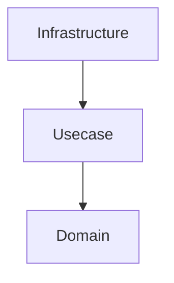
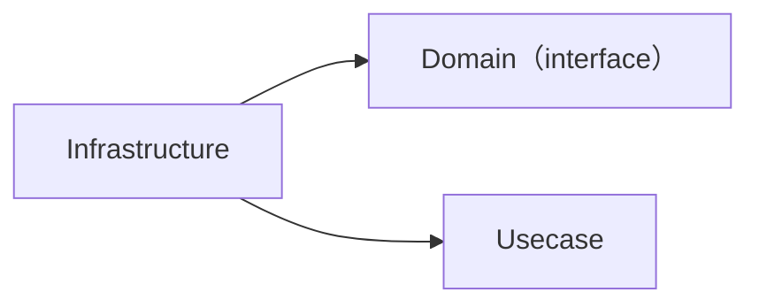
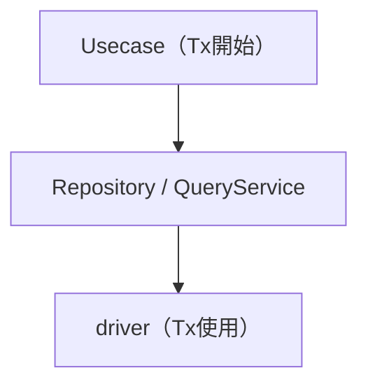
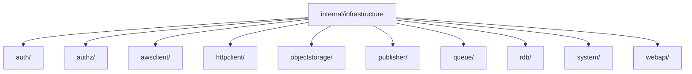
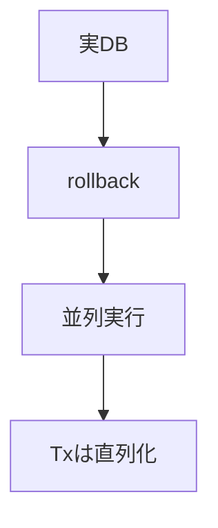

# インフラ層（`internal/infrastructure`）ガイド

[English](README.md) | 日本語

## 役割

Infrastructure 層は、**外部技術（DB・外部API・認証等）へのアクセス実装**を担う層です。

この層は以下の責務を持ちます。

- 外部I/Oの実装（RDB / API / 認証 / システム）
- Domain が定義した interface の実装
- 技術的詳細（接続・リトライ・ドライバ・ログ等）のカプセル化
- エラーの正規化
- Observability（ログ / トレース）の付与

上位層（Domain / Usecase）は、**Infrastructure の実装詳細を一切意識しません。**

## オニオンアーキテクチャでの位置



- Domain / Usecase は抽象のみ
- Infrastructure は具体実装

## 依存関係



- Infrastructure は Domain に依存する
- Domain / Usecase は Infrastructure に依存してはならない

## Usecaseとの関係

- トランザクション境界は Usecase 層が管理
- Infrastructure はトランザクションを開始しない
- トランザクションは context.Context により伝搬される



## エラーハンドリング

Infrastructure 層は外部技術のエラーをそのまま返さず、  
**アプリケーション共通エラーへ変換**します。

例：

- PostgreSQL エラー → pgerror.NormalizeError
- 外部APIエラー → apperror に変換

## Observability

Infrastructure 層では以下の可観測性を提供します。

- SQL / 外部I/Oのログ出力
- OpenTelemetry によるトレース
- 実行時間計測（slow query）

主に driver の接続層に結線した pgx クエリトレーサー（`otelpgx` の span、ログ出力はクエリ失敗とスロークエリのみ）で実現します。

driver 層のトレーサーに加え、各 I/O コンポーネント（Repository / QueryService / SystemQuery / 外部 gateway / queue / publisher）は public メソッドごとにアプリケーション層の span を発行します。具体的には `observability.LayerTracer` フィールドをコンストラクタで `tf.Infra()` から初期化し、各メソッド先頭で `ctx, endSpan := r.tracer.Start(ctx); defer endSpan()` を書きます。実 I/O を持たない純粋なメモリ内コンポーネントは対象外です。

## 禁止事項

Infrastructure 層では以下を行ってはいけません。

- ビジネスロジックの実装
- Domain ルールの分岐
- Usecase の意思決定
- HTTP / Framework 依存コードの持ち込み
- トランザクションの開始

## 実装ルール

- SQL 実行は sqlc を使用する
- Repository と QueryService の分割は「検索かどうか」ではなく、その読み取りが何を対象にするかで決める。
  集約の system-of-record（完全な集約を再構成できる）は Repository、派生した射影 / リードモデルは
  QueryService。[ADR-0029 (lightweight-cqrs)](../../docs/adr/0029-lightweight-cqrs.ja.md) を参照
- DBTX は `driver.New(ctx, db)` で取得する（ログ / トレースは driver の接続層で付与される）
- context を必ず伝搬する
- 外部エラーは必ず正規化する

### doc コメントに技術的詳細を書いてよい

技術的詳細の隠蔽（*設計原則まとめ § 1*）が意味するのは、外側の層がそれを**見ない**ことであって、この層が
それを**書き残さない**ことではない。Repository / QueryService / CommandService の doc コメントは SQL を
保守する人間が読むので、保証を担っている仕組みを名指ししてよい — 取得するロック（`FOR UPDATE OF p`）、
所有権を担保する述語、ページネーションを安定させる keyset の順序、N+1 を避ける固定クエリ数など。

境界は方向性を持つ — この詳細は**ここに留める**。Usecase や Domain の doc コメントがこれを繰り返していれば
それは層漏れである。[`internal/usecase/README.md`](../usecase/README.md) § Doc comments: interface vs
implementation を参照。

この層で警戒すべきはその裏返しである。内側のインターフェイスが保証をアプリケーション語彙で述べている以上、
その言い換えに留まる実装側 doc は**何も足していない** — 2 箇所で腐る複製でしかない。したがって実装側 doc は
**機構を名指しする**（`FindByID` は `LockByID` と異なりロックを取らずに読む、`SearchByKeyword` は `active` の
値で 3 つの固定クエリへ振り分ける、`Update` は影響行数 0 を NotFound へ正規化する、など）か、**省略する**かの
どちらかである。Repository 型は非 export なので `revive` の `exported` ルールは doc を要求しない。
インターフェイスの言い換えだけが、常に誤りである。

## ディレクトリ構成



## サブディレクトリ

|ディレクトリ|説明|interface 配置|詳細|
|---|---|---|---|
|`auth/`|認証基盤（環境別 Authenticator 実装）|Usecase boundary|[README](auth/README.ja.md)|
|`authz/`|認可基盤（Authorizer 実装。本番以外はデフォルトの `allowall`）|Usecase boundary|[README](authz/README.ja.md)|
|`awsclient/`|`objectstorage/s3` と `queue/sqs` が共用する AWS 資格情報の解決|—（substrate、domain/usecase IF なし）|[README](awsclient/README.ja.md)|
|`httpclient/`|resilient な HTTP client substrate（retry / circuit breaker / tracing）。`webapi/` と `publisher/` が共用する driver 相当の基盤|—（substrate、domain/usecase IF なし）|[README](httpclient/README.ja.md)|
|`objectstorage/`|オブジェクトストレージ adapter（`boundary.Storage` 実装。endpoint / 資格情報の差し替えで Garage / MinIO / 本番 S3 に接続）|Usecase boundary|[README](objectstorage/README.md)|
|`publisher/`|transactional outbox の publish 先（`boundary.Publisher` の HTTP 実装）|Usecase boundary|[README](publisher/README.ja.md)|
|`queue/`|メッセージキューの worker seam 実装（AWS SQS による `worker.Consumer` / `FailureHandler` 実装）|Usecase boundary（worker seam）|[README](queue/sqs/README.ja.md)|
|`rdb/`|RDB サブシステム（Repository / QueryService / driver / sqlc 等）|Domain / Usecase|[README](rdb/README.ja.md)|
|`system/`|システム依存処理（時刻取得等）|Usecase boundary|[README](system/README.ja.md)|
|`webapi/`|外部 Web API gateway（為替レート等、`boundary.Gateway` の実装）|Usecase boundary|[README](webapi/README.ja.md)|

## テスト戦略

以下の項目が統治するのは、基盤が **DB そのもの** であるサブシステムです。別の基盤の上に build されたサブシステムや、実 I/O を一切持たないサブシステムは、自身のパッケージ README で *Test Strategy* を宣言します。そうしたパッケージから本節へ walk して到達することは、そちらで閉じるべきドキュメントギャップであって、実 DB を要求してよい根拠ではありません。非 DB サブシステムは現在すべて自前の節を宣言済みであり、本節へ到達するのは本節が書かれた対象のサブシステムだけです。新しい基盤の上にサブシステムを追加する場合も、既定で本項目を継承するのではなく自前の節を宣言することが期待されます。

より下位から本節へ到達する唯一のパッケージは `auth/useridentity` で、RDB driver を通じて `user_identities` を読みます。`auth/` 自身の節がこれを名指ししているため、walk して初めて分かるのではなく、両方向から carve-out が見える状態になっています。

- 実DBを用いた Integration Test
- トランザクション rollback による状態隔離
- testkit を利用



## 設計原則まとめ

### 1. 技術詳細のカプセル化

DB / API / 認証  
→ Infrastructure に閉じ込める

### 2. 依存関係の逆転

Domain が interface を定義  
Infrastructure が実装する

### 3. 責務分離

```txt
永続化 → Repository  
検索   → QueryService
```

### 4. トランザクション管理

Usecase が管理  
Infrastructure は関与しない

### 5. エラー統一

外部エラー → アプリケーションエラー

### 6. 可観測性

logging / tracing / metrics
