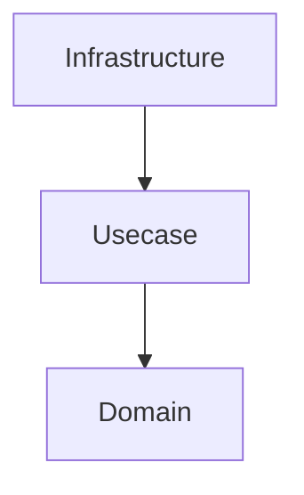
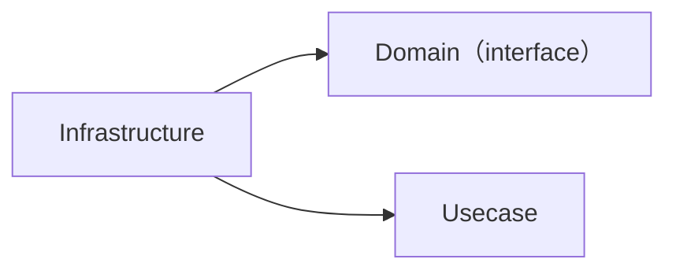
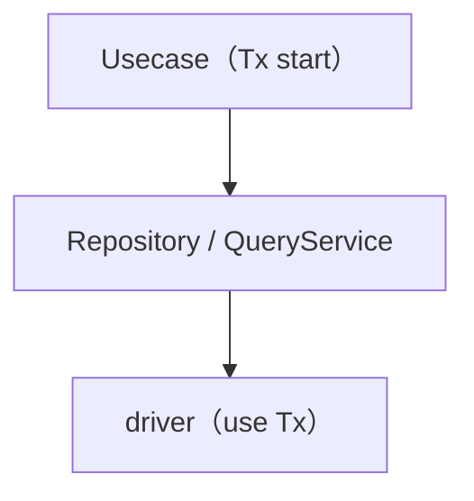
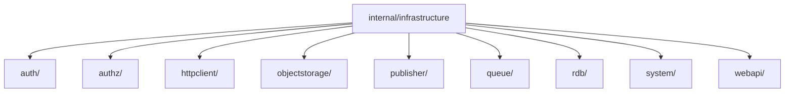
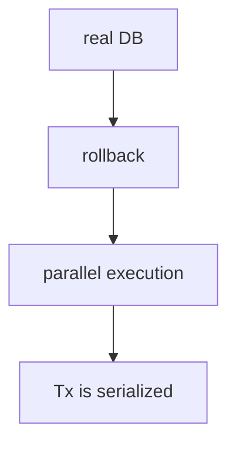

# Infrastructure Layer (`internal/infrastructure`) Guide

English | [日本語](README.ja.md)

## Role

The Infrastructure layer is responsible for **implementing access to external technologies (DB, external APIs, authentication, etc.)**.

This layer has the following responsibilities.

- Implementation of external I/O (RDB / API / authentication / system)
- Implementation of interfaces defined by the Domain
- Encapsulation of technical details (connection, retry, drivers, logging, etc.)
- Error normalization
- Provision of Observability (logging / tracing)

Upper layers (Domain / Usecase) **must not be aware of Infrastructure implementation details at all.**

## Position in Onion Architecture



- Domain / Usecase define abstractions only
- Infrastructure provides concrete implementations

## Dependencies



- Infrastructure depends on Domain
- Domain / Usecase must not depend on Infrastructure

## Relationship with Usecase

- Transaction boundaries are managed by the Usecase layer
- Infrastructure must not start transactions
- Transactions are propagated via `context.Context`



## Error Handling

The Infrastructure layer must not return external technology errors as-is,  
but must **convert them into application-wide errors**.

Examples:

- PostgreSQL errors → pgerror.NormalizeError
- External API errors → converted to apperror

## Observability

The Infrastructure layer provides the following observability.

- SQL / external I/O log output
- Tracing using OpenTelemetry
- Execution time measurement (slow query)

Mainly implemented by a pgx query tracer wired at the driver connection level (`otelpgx` spans, with log output limited to query failures and slow queries).

In addition to the driver-level tracer, every I/O component (Repository / QueryService / SystemQuery / external gateways / queue / publisher) opens an application-level span per public method: it holds an `observability.LayerTracer` field initialized from `tf.Infra()` in its constructor, and each method begins with `ctx, endSpan := r.tracer.Start(ctx); defer endSpan()`. Pure in-memory components with no real I/O are exempt.

## Prohibited Practices

The following must not be done in the Infrastructure layer.

- Implementation of business logic
- Branching based on Domain rules
- Decision making of Usecase
- Introducing HTTP / framework-dependent code
- Starting transactions

## Implementation Rules

- Use sqlc for SQL execution
- Do not write search logic in Repository (use QueryService)
- Acquire the DBTX via `driver.New(ctx, db)` (logging / tracing is applied at the driver connection level)
- Always propagate context
- Always normalize external errors

### Doc comments may name technical detail

Encapsulating technical detail (see *Design Principles Summary § 1*) means the outer layers must not
**see** it — not that this layer must not **document** it. A Repository / QueryService /
CommandService doc comment is read by whoever maintains the SQL, so it should name the mechanics that
carry a guarantee: the lock it takes (`FOR UPDATE OF p`), the predicate that enforces ownership, the
keyset ordering that makes pagination stable, the fixed query count that avoids N+1.

The boundary is directional — this detail stays **here**. A Usecase or Domain doc comment that
repeats it has leaked the layer; see
[`internal/usecase/README.md`](../usecase/README.md) § Doc comments: interface vs implementation.

The converse is the failure mode to watch for here. Because the inward interface states the guarantee
in application vocabulary, an implementation doc that only paraphrases that interface adds **nothing**
— it is a duplicate that rots in two places. So an implementation doc must either **name the
mechanism** (`FindByID` reads without taking a lock, unlike `LockByID`; `SearchByKeyword` dispatches to
one of three fixed queries on the `active` filter; `Update` normalizes zero affected rows to NotFound)
or be **omitted** — the Repository type is unexported, so `revive`'s `exported` rule does not require
one. Paraphrasing the interface is the one option that is never right.

## Directory Structure



## Subdirectories

|Directory|Description|Interface Placement|Details|
|---|---|---|---|
|`auth/`|Authentication infrastructure (environment-specific Authenticator impl)|Usecase boundary|[README](auth/README.md)|
|`authz/`|Authorization infrastructure (Authorizer impl; default `allowall` for non-production)|Usecase boundary|[README](authz/README.md)|
|`httpclient/`|Resilient HTTP client substrate (retry / circuit breaker / tracing); shared driver-level base consumed by `webapi/` and `publisher/`|— (substrate, no domain/usecase IF)|—|
|`objectstorage/`|Object storage adapter (impl of `boundary.Storage`; endpoint / credential swap connects to Garage / MinIO / production S3)|Usecase boundary|[README](objectstorage/README.md)|
|`publisher/`|Transactional outbox publish destination (HTTP impl of `boundary.Publisher`)|Usecase boundary|—|
|`queue/`|Message queue worker seam impl (AWS SQS impl of `worker.Consumer` / `FailureHandler`)|Usecase boundary (worker seam)|[README](queue/sqs/README.md)|
|`rdb/`|RDB subsystem (Repository / QueryService / driver / sqlc, etc.)|Domain / Usecase|[README](rdb/README.md)|
|`system/`|System-dependent operations (time retrieval, etc.)|Usecase boundary|[README](system/README.md)|
|`webapi/`|External web API gateways (e.g. exchange rate, impl of `boundary.Gateway`)|Usecase boundary|—|

## Test Strategy

These bullets govern the subsystems whose substrate **is** the database. A subsystem built on a different substrate (`httpclient/`, `objectstorage/`) or with no real I/O at all (`authz/`) declares its own *Test Strategy* in its package README; walking up to this section from such a package is a documentation gap to close there, not a licence to require a real database of it.

- Integration Test using real DB
- State isolation using transaction rollback
- Use testkit



## Design Principles Summary

### 1. Encapsulation of Technical Details

DB / API / authentication  
→ encapsulated in Infrastructure

### 2. Dependency Inversion

Domain defines interfaces  
Infrastructure implements them

### 3. Separation of Responsibilities

```txt
Persistence → Repository  
Query       → QueryService
```

### 4. Transaction Management

Usecase manages transactions  
Infrastructure does not participate

### 5. Unified Error Handling

External errors → application errors

### 6. Observability

logging / tracing / metrics
