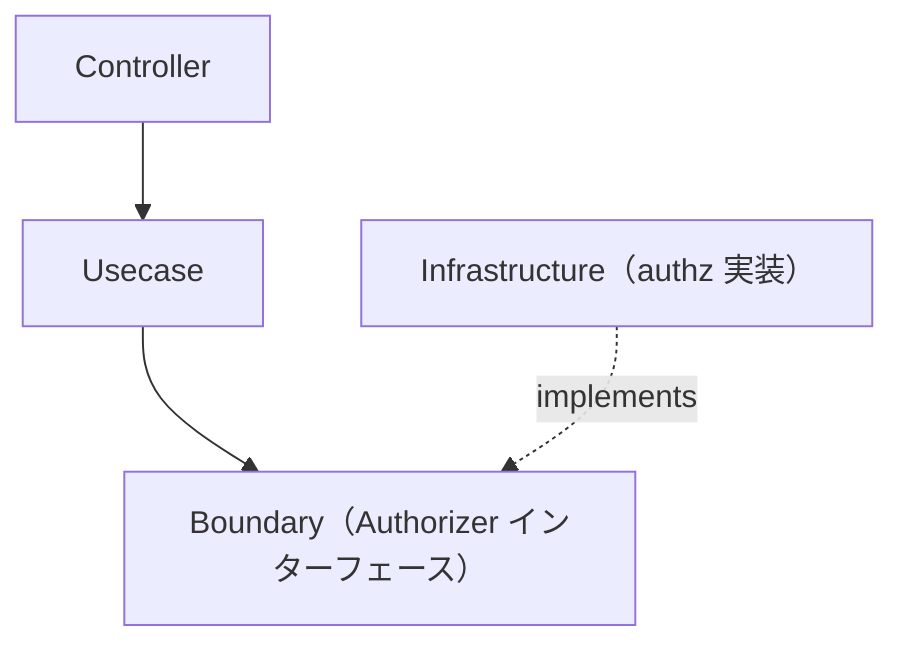

# authz ディレクトリ

`internal/infrastructure/authz` は **認可（authz）インフラストラクチャ** を提供します。`internal/infrastructure/auth`（認証）と対になる存在です。

`Authorizer` の **実装** を格納します。その抽象は Usecase 層の Boundary として定義されます。

```txt
internal/usecase/boundary/authz
```

## 役割

- `Authorizer` インターフェース（Policy Decision Point）の実装を提供する。
- 認証主体がリソースに対して操作を実行してよいかを判定する。

認証と異なり、認可は **アプリケーション状態に対するポリシー判断** です。この Boundary は **Usecase 層**（Policy Enforcement Point）から参照され、Usecase が `Authorize(...)` を呼び、拒否時に `apperror.ErrPermissionDenied`（403）を返します。

## アーキテクチャ上の位置づけ



## 現在の実装

|ディレクトリ|用途|
|---|---|
|`allowall`|local / CI / test 用の全許可スタブ（すべて許可）|

実運用では RBAC / 外部ポリシーエンジン実装へ差し替えます。

## local / staging / production の実装

`allowall` は **開発用スタブ**であり、すべてを許可するため `local` / `ci` / `test` に限定されます。この制限はスタブ自身が担保します —— `allowall.New` はこれら以外の環境では生成を拒否する（**fail-closed by construction**）ため、配線ミスで `development` / `staging` / `production` に全許可が誤って有効化されることはなく、DI プロバイダはその拒否を起動失敗として表面化させるだけです。これらの環境では実実装を追加し、環境ごとに配線する必要があります（[setup-repository.md](../../../docs/get-started/setup-repository.md) Phase 9.2 参照）。

推奨レイアウト（`internal/infrastructure/auth/` と対になる構成）:

```txt
internal/infrastructure/authz
├── allowall   # local / ci / test 用スタブ（すべて許可）
├── stg        # staging 用 Authorizer
└── prd        # production 用 Authorizer
```

実運用の `Authorizer` は通常、次のいずれかで判定します。

- 所有権（subject == `Resource.OwnerID()`）— オブジェクトレベル認可
- RBAC（`auth.Authn` の claims / scopes から導いたロール）
- 外部ポリシーエンジン（OPA / Cedar）

実実装を追加するには、`provideAuthorizer`（`internal/di/module/authz.go`）を拡張して `development` / `staging` / `production` で実実装を選ぶようにします —— 例えば `switch appCfg.Env()` でこれらの環境は実実装を返し、非本番のデフォルトとして自衛済みの `allowall.New(appCfg)` を残します。`allowall.New` が fail-closed なので、たとえその配線を誤っても本番相当の環境で全許可に到達することはありません。

## DI への登録

`Authorizer` は次の `authzModule()` で登録されます。

```txt
internal/di/module/authz.go
```

Usecase 層が依存するため `InfrastructureModule()` に含めています。全許可スタブが本番相当の環境に配線されることはありません —— これはプロバイダだけでなく **`allowall.New` 自身が担保します**（fail-closed）。

## 設計方針

### 1 Boundary を実装する

Infrastructure は `usecase/boundary/authz` で定義された `Authorizer` を実装します。

### 2 認可は Usecase が強制するポリシー

本パッケージは判断実装（PDP）のみを提供します。強制点（PEP）— `Authorize(...)` を呼び拒否を 403 に対応づける処理 — は Usecase 層に置きます。
