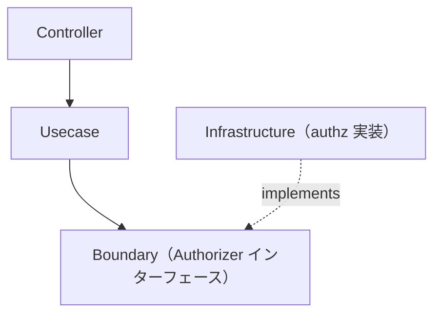

# authz ディレクトリ

[English](README.md) | 日本語

`internal/infrastructure/authz` は **認可（authz）インフラストラクチャ** を提供します。`internal/infrastructure/auth`（認証）と対になる存在です。

`Authorizer` の **実装** を格納します。その抽象は Usecase 層の Boundary として定義されます。

```txt
internal/usecase/boundary/authz
```

## 役割

- `Authorizer` インターフェース（Policy Decision Point）の実装を提供する。
- 認証済みの主体がリソースに対して操作を実行してよいかを判定する。

認証と異なり、認可は **アプリケーション状態に対するポリシー判断** です。この Boundary は **Usecase 層**（Policy Enforcement Point）から利用され、Usecase が `Authorize(...)` を呼び出し、拒否時に `apperror.ErrPermissionDenied`（403）を返します。

## アーキテクチャ上の位置づけ



## 現在の実装

|ディレクトリ|用途|
|---|---|
|`allowall`|local / CI / test 用の全許可スタブ（すべて許可）|
|`userrole`|`user_roles` ベースの RBAC Authorizer サンプル。本番相当の環境向け（admin ⇒ 許可、それ以外はリソース所有者のみ許可）。`user` サンプルの一部であり、サンプル削除とともに削除される。|

実運用ではこれらを RBAC / 外部ポリシーエンジン実装へ差し替えます。

## local / staging / production の実装

`allowall` は **開発用スタブ**であり、すべてを許可するため配線されるのは `local` / `ci` / `test` のみです。この制限はスタブ自身が担保します —— `allowall.New` はこれら以外の環境では生成を拒否する（**fail-closed by construction**）ため、配線ミスで `development` / `staging` / `production` に全許可が誤って有効化されることはありません。さらに `provideAuthorizer` も **fail-closed** であり、実装が配線されていない環境は `default` 分岐に落ちて設計上起動エラーになります。`user` サンプルが存在する間は、`user_roles` を裏付けとするサンプル実装 `userrole` が `local` / `development` / `staging` / `production` を担います —— `allowall` を受け取るのは `ci` / `test` だけなので、ローカル実行でも実際の判定経路が働きます。サンプルを削除すると `local` は `allowall` の case に畳み込まれ、本番相当の環境は自前の実装を配線するまで fail-closed エラーに戻ります（[setup-repository.md](../../../docs/get-started/setup-repository.md) Phase 11 の認可を参照）。

推奨レイアウト（`internal/infrastructure/auth/` と対になる構成）:

実運用の `Authorizer` は通常、次のいずれかで判定します。

- 所有権（subject == `Resource.OwnerID()`）— オブジェクトレベル認可
- RBAC（`auth.Authn` の claims / scopes から導いたロール）
- 外部ポリシーエンジン（OPA / Cedar）

各環境は `provideAuthorizer`（`internal/di/module/authz.go`）に `case config.EnvDevelopment / EnvStaging / EnvProduction` を追加し、実実装を返すことで配線します。非本番の `local` / `ci` / `test` は自衛済みの `allowall.New(appCfg)` を残します。どの `case` にも該当しない環境は `default` 分岐に落ち、fail-closed エラーを返します。`allowall.New` 自体が fail-closed なので、たとえ配線を誤っても本番相当の環境で全許可に到達することはありません。（`user` サンプルが存在する間、本番相当の `case` はサンプル `userrole` が占めており、サンプルとともに削除されます。）

## DI への登録

`Authorizer` は次の `authzModule()` で登録されます。

```txt
internal/di/module/authz.go
```

Usecase 層が依存するため `InfrastructureModule()` に含めています。全許可スタブが本番相当の環境に配線されることはありません —— これはプロバイダだけでなく **`allowall.New` 自身が担保します**（fail-closed）。

## Test Strategy

ここに置かれる `Authorizer` は **実 I/O を持たない純粋な in-memory の判定点**です。DB に触れるとしても、注入されたリポジトリ越しにしか触れません。したがって infrastructure 層の実 DB 戦略はここには適用されず、実装が必要とするリポジトリを生成 mock で与えるだけの素の単体テストになります。

このディレクトリのどの実装にも当てはまる観点:

- **判定を両側から固定する。** 許可経路と拒否経路のそれぞれに独立したケースを置き、拒否は `errors.Is` で固有の sentinel（`ErrForbidden`）を assert する。メッセージ文字列では判定しない。
- **参照より前に走るべきガードが、実際にそうなっていることを検証する。** 戻り値のエラーを見るだけでなく、mock に *呼び出しが無い* ことを期待して確かめる。順序こそが防御なので、戻り値だけの assert では「参照が漏れる」退行を取り逃がす。
- **環境を拒否するコンストラクタは、明示的に拒否すること。** `allowall.New` は `local` / `ci` / `test` 以外で失敗しなければならない。拒否こそが fail-closed の担保なので、受け入れる環境より拒否する環境のほうが重要。

`user` サンプルが存在する間は、`userrole` が自身のポリシーに必要な観点を追加します。管理者は所有者でなくても許可、非管理者でも所有者なら許可、非管理者かつ非所有者は拒否。`Authn` が nil のとき・UserID が未解決のとき・UserID がゼロ値のときは、いずれもロール参照より前に拒否する。所有者を持たないリソース（リソースが nil の場合と `OwnerID()` が `nil` の場合）は admin 限定のままになる。リポジトリのエラーは拒否へ潰さずそのまま伝播する。ゼロ値の主体のケースは稼働中のアプリ経由では再現できません。本番で `WithUserID` を呼ぶ唯一の箇所（`internal/infrastructure/auth/useridentity`）が、ドメインの `IsNil` ガードを既に通過した ID を解決するためで、この分岐を固定しているのはその単体テストだけになります。

どの環境にどの実装が配線されるかは DI 層のスコープであり、そちらで検証する（[`internal/di/README.ja.md`](../../di/README.ja.md) の *環境ゲート付きの配線* を参照）。ここでは扱わない。

## 設計方針

### 1 Boundary を実装する

Infrastructure は `usecase/boundary/authz` で定義された `Authorizer` を実装します。

### 2 認可は Usecase が強制するポリシー

本パッケージは判断実装（PDP）のみを提供します。強制点（PEP）— `Authorize(...)` を呼び拒否を 403 に対応づける処理 — は Usecase 層に置きます。
