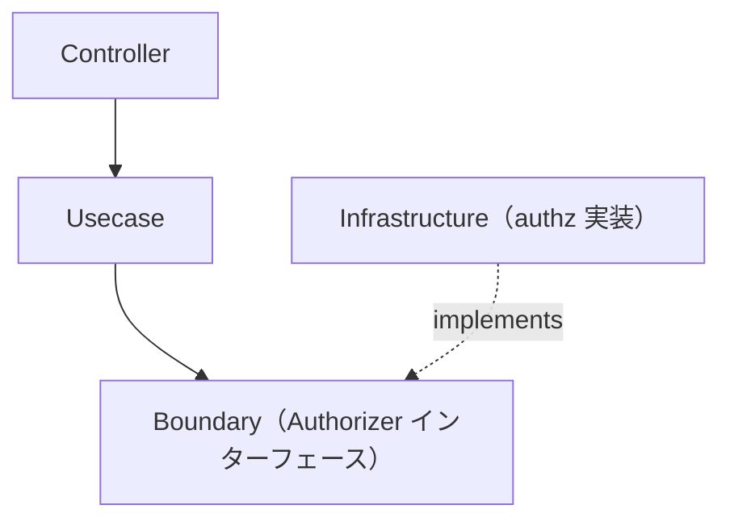

# authz ディレクトリ

`internal/infrastructure/authz` は **認可（authz）インフラストラクチャ** を提供します。`internal/infrastructure/auth`（認証）と対になる存在です。

`Authorizer` の **実装** を格納します。その抽象は Usecase 層の Boundary として定義されます。

```txt
internal/usecase/boundary/authz
```

## 役割

- `Authorizer` インターフェース（Policy Decision Point）の実装を提供する。
- 認証主体がリソースに対して操作を実行してよいかを判定する。

認証と異なり、認可は **アプリケーション状態に対するポリシー判断** です。この Boundary は **Usecase 層**（Policy Enforcement Point）から参照され、Usecase が `Authorize(...)` を呼び、拒否時に `apperror.ErrPermissionDenied`（403）を返します。

## アーキテクチャ上の位置づけ



## 現在の実装

|ディレクトリ|用途|
|---|---|
|`allowall`|local / CI / test 用の全許可スタブ（すべて許可）|

実運用では RBAC / 外部ポリシーエンジン実装へ差し替えます。

## DI への登録

`Authorizer` は次の `authzModule()` で登録されます。

```txt
internal/di/module/authz.go
```

Usecase 層が依存するため `InfrastructureModule()` に含めており、**環境ゲート付き**であるため全許可スタブが本番相当の環境に配線されることはありません。

## 設計方針

### 1 Boundary を実装する

Infrastructure は `usecase/boundary/authz` で定義された `Authorizer` を実装します。

### 2 認可は Usecase が強制するポリシー

本パッケージは判断実装（PDP）のみを提供します。強制点（PEP）— `Authorize(...)` を呼び拒否を 403 に対応づける処理 — は Usecase 層に置きます。
